# 量子力学 I 演習問題 詳細解説

## 目次

1. [問題 3-1: エーレンフェストの定理](#問題-3-1-エーレンフェストの定理)
2. [問題 3-2: 不確定性関係について](#問題-3-2-不確定性関係について)
3. [問題 3-3: 固有関数と固有値: 箱の中の粒子の運動](#問題-3-3-固有関数と固有値-箱の中の粒子の運動)
4. [問題 3-4: 期待値: 箱の中の粒子](#問題-3-4-期待値-箱の中の粒子)
5. [問題 4-1: 測定: 箱の中の粒子 No.1](#問題-4-1-測定-箱の中の粒子-no1)
6. [問題 4-2: 測定: 箱の中の粒子 No.2](#問題-4-2-測定-箱の中の粒子-no2)
7. [問題 4-3: 線形代数の復習](#問題-4-3-線形代数の復習)
8. [問題 4-4: レポート問題 演算子の交換関係と不確定性関係](#問題-4-4-レポート問題-演算子の交換関係と不確定性関係)
9. [問題 5-1: トンネル効果](#問題-5-1-トンネル効果)
10. [問題 5-2: ポテンシャルの井戸での束縛状態](#問題-5-2-ポテンシャルの井戸での束縛状態)
11. [問題 5-3: デルタ関数型ポテンシャルでの束縛状態](#問題-5-3-デルタ関数型ポテンシャルでの束縛状態)
12. [問題 6-1: 1次元のシュレーディンガー方程式についての一般的性質](#問題-6-1-1次元のシュレーディンガー方程式についての一般的性質)
13. [問題 6-2: エルミート多項式と母関数](#問題-6-2-エルミート多項式と母関数)
14. [問題 6-3: 調和振動子のゼロ点振動](#問題-6-3-調和振動子のゼロ点振動)
15. [問題 6-4: 調和振動子の期待値と不確定性関係](#問題-6-4-調和振動子の期待値と不確定性関係)
16. [問題 7-1: 演算子法による調和振動子問題の解法](#問題-7-1-演算子法による調和振動子問題の解法)
17. [問題 7-2: 個数演算子とコヒーレント状態](#問題-7-2-個数演算子とコヒーレント状態)
18. [問題 8-1: ハイゼンベルク演算子の時間依存性](#問題-8-1-ハイゼンベルク演算子の時間依存性)
19. [問題 8-2: 位置演算子の固有ベクトル $|x\rangle$ は完全系条件を満たすか?](#問題-8-2-位置演算子の固有ベクトル-xrangle-は完全系条件を満たすか)

---

## 問題 3-1: エーレンフェストの定理

**問題設定：**
質量 $m$ の粒子がポテンシャル $V(x)$ の下で1次元空間内を運動している。$V(x)$ は $x$ の実関数とする。

### (i) シュレーディンガー方程式

**問題の意味：**
シュレーディンガー方程式は、量子力学における基本的な時間発展方程式である。波動関数 $\Psi(x,t)$ の時間発展を記述し、量子系の状態の時間変化を決定する。

**解答：**

時間に依存するシュレーディンガー方程式は次で与えられる：

$$i\hbar\frac{\partial}{\partial t}\Psi(x,t) = \hat{H}\Psi(x,t)$$

ここで、$\hat{H}$ はハミルトニアン演算子である。1次元の場合、ハミルトニアンは：

$$\hat{H} = \frac{\hat{p}^2}{2m} + V(\hat{x}) = -\frac{\hbar^2}{2m}\frac{\partial^2}{\partial x^2} + V(x)$$

したがって、シュレーディンガー方程式は：

$$i\hbar\frac{\partial}{\partial t}\Psi(x,t) = \left(-\frac{\hbar^2}{2m}\frac{\partial^2}{\partial x^2} + V(x)\right)\Psi(x,t)$$

**用語解説：**
- **ハミルトニアン $\hat{H}$**: 系の全エネルギーを表す演算子。運動エネルギー演算子 $\hat{p}^2/(2m)$ とポテンシャルエネルギー $V(\hat{x})$ の和。
- **波動関数 $\Psi(x,t)$**: 粒子の量子状態を記述する複素関数。$|\Psi(x,t)|^2$ は位置 $x$ に粒子を見出す確率密度を表す。

**物理的意味：**
この方程式は、量子状態の時間発展を決定する。古典力学のニュートン方程式に対応する量子力学の基本方程式である。

---

### (ii) 規格化条件

**問題の意味：**
確率解釈が成り立つためには、全空間で粒子を見出す確率が1でなければならない。これは規格化条件として数学的に表現される。

**解答：**

確率解釈によれば、$|\Psi(x,t)|^2$ は位置 $x$ に粒子を見出す確率密度である。したがって、全空間での積分は1でなければならない：

$$\int_{-\infty}^{\infty} |\Psi(x,t)|^2 dx = 1$$

この条件を満たす波動関数を**規格化された波動関数**という。

**規格化可能性の条件：**

波動関数が規格化可能であるためには、以下の条件が必要である：

$$\int_{-\infty}^{\infty} |\Psi(x,t)|^2 dx < \infty$$

すなわち、$|\Psi(x,t)|^2$ の全空間での積分が有限でなければならない。これは、波動関数が無限遠方で十分速く減衰することを意味する。

**用語解説：**
- **規格化**: 波動関数に適切な定数をかけて、確率の総和を1にする操作。
- **可積分性**: 関数の絶対値の2乗が全空間で積分可能であること。$L^2$ 空間に属することを意味する。

**物理的意味：**
規格化条件は、粒子が必ずどこかに存在するという物理的事実を数学的に表現したものである。

---

### (iii) エーレンフェストの定理

**問題の意味：**
エーレンフェストの定理は、量子力学における期待値の時間変化が、古典力学の運動方程式と類似の形をとることを示す重要な定理である。これにより、量子力学と古典力学の対応関係が明確になる。

**解答：**

位置と運動量の期待値は次で定義される：

$$\langle x \rangle = \int_{-\infty}^{\infty} \Psi^*(x,t) x \Psi(x,t) dx, \quad \langle p \rangle = \int_{-\infty}^{\infty} \Psi^*(x,t) \left(-i\hbar\frac{\partial}{\partial x}\right) \Psi(x,t) dx$$

**期待値の時間微分の一般公式：**

任意の演算子 $\hat{A}$ の期待値の時間微分は次で与えられる：

$$\frac{d}{dt}\langle A \rangle = \frac{i}{\hbar}\langle [\hat{H}, \hat{A}] \rangle + \left\langle \frac{\partial \hat{A}}{\partial t} \right\rangle$$

ここで、$[\hat{H}, \hat{A}] = \hat{H}\hat{A} - \hat{A}\hat{H}$ は交換関係である。

**位置の期待値の時間微分：**

$\hat{A} = \hat{x}$ の場合、$\hat{x}$ は時間に依存しないので $\frac{\partial \hat{x}}{\partial t} = 0$ である。したがって：

$$\frac{d}{dt}\langle x \rangle = \frac{i}{\hbar}\langle [\hat{H}, \hat{x}] \rangle$$

ハミルトニアン $\hat{H} = \frac{\hat{p}^2}{2m} + V(\hat{x})$ と位置演算子の交換関係を計算する。$V(\hat{x})$ は $\hat{x}$ と可換なので：

$$[\hat{H}, \hat{x}] = \left[\frac{\hat{p}^2}{2m} + V(\hat{x}), \hat{x}\right] = \frac{1}{2m}[\hat{p}^2, \hat{x}]$$

交換関係 $[\hat{p}, \hat{x}] = -i\hbar$ を用いると：

$$[\hat{p}^2, \hat{x}] = \hat{p}[\hat{p}, \hat{x}] + [\hat{p}, \hat{x}]\hat{p} = \hat{p}(-i\hbar) + (-i\hbar)\hat{p} = -2i\hbar\hat{p}$$

したがって：

$$[\hat{H}, \hat{x}] = \frac{1}{2m}(-2i\hbar\hat{p}) = -\frac{i\hbar}{m}\hat{p}$$

これより：

$$\frac{d}{dt}\langle x \rangle = \frac{i}{\hbar}\left\langle -\frac{i\hbar}{m}\hat{p} \right\rangle = \frac{1}{m}\langle \hat{p} \rangle = \frac{\langle p \rangle}{m}$$

**運動量の期待値の時間微分：**

$\hat{A} = \hat{p}$ の場合、$\hat{p}$ も時間に依存しないので：

$$\frac{d}{dt}\langle p \rangle = \frac{i}{\hbar}\langle [\hat{H}, \hat{p}] \rangle$$

ハミルトニアンと運動量演算子の交換関係を計算する。$\hat{p}^2$ は $\hat{p}$ と可換なので：

$$[\hat{H}, \hat{p}] = \left[\frac{\hat{p}^2}{2m} + V(\hat{x}), \hat{p}\right] = [V(\hat{x}), \hat{p}]$$

位置表示では $\hat{p} = -i\hbar\frac{\partial}{\partial x}$ なので、任意の関数 $f(x)$ に対して：

$$[\hat{p}, V(\hat{x})]f = \hat{p}(Vf) - V(\hat{p}f) = -i\hbar\frac{\partial}{\partial x}(Vf) + i\hbar V\frac{\partial f}{\partial x} = -i\hbar\frac{\partial V}{\partial x}f$$

したがって $[\hat{p}, V(\hat{x})] = -i\hbar\frac{\partial V}{\partial x}$、すなわち：

$$[V(\hat{x}), \hat{p}] = i\hbar\frac{\partial V}{\partial x}$$

これより：

$$\frac{d}{dt}\langle p \rangle = \frac{i}{\hbar}\left\langle i\hbar\frac{\partial V}{\partial x} \right\rangle = -\left\langle \frac{\partial V}{\partial x} \right\rangle$$

**エーレンフェストの定理の結果：**

以上より、期待値の時間発展は次で与えられる：

$$\frac{d}{dt}\langle x \rangle = \frac{\langle p \rangle}{m}, \quad \frac{d}{dt}\langle p \rangle = -\left\langle \frac{\partial V}{\partial x} \right\rangle$$

これは古典力学の運動方程式 $v = \frac{p}{m}$ と $F = ma = -\frac{\partial V}{\partial x}$ に対応している。

**物理的意味：**
エーレンフェストの定理は、量子力学における期待値が古典力学の対応する量と同じように時間発展することを示している。これは、量子力学と古典力学の対応原理の一例である。特に、$\frac{d}{dt}\langle p \rangle = -\left\langle \frac{\partial V}{\partial x} \right\rangle$ は、古典力学の $F = ma$ に対応する。

**考察：**
エーレンフェストの定理は、量子効果が小さい極限（$\hbar \to 0$）で、量子力学が古典力学に帰着することを示唆している。ただし、これは期待値のレベルでの対応であり、個々の測定結果は依然として量子力学的である。

---

## 問題 3-2: 不確定性関係について

**問題設定：**
規格化された波動関数 $\Psi(x, t)$ に対して、以下の関数 $I(\lambda)$ が定義されている：

$$I(\lambda) = \int_{-\infty}^{\infty} dx \left|(x - \langle x \rangle) \Psi(x,t) + i\lambda \left(-i\hbar\frac{\partial}{\partial x} - \langle p \rangle\right) \Psi(x,t)\right|^2$$

ここで、$\lambda$ は実数であり、$\langle x \rangle$、$\langle p \rangle$ はそれぞれ位置と運動量の期待値を表す。

### (i) $I(\lambda)$ の展開

**問題の意味：**
不確定性関係を導くための準備として、$I(\lambda)$ を期待値の形で表現する。この関数は、位置と運動量の不確定性を組み合わせた量を表している。

**解答：**

被積分関数を $f(x)$ とおく：

$$f(x) = (x - \langle x \rangle) \Psi + i\lambda \left(-i\hbar\frac{\partial}{\partial x} - \langle p \rangle\right) \Psi = (x - \langle x \rangle) \Psi + \lambda\hbar\frac{\partial \Psi}{\partial x} - i\lambda\langle p \rangle \Psi$$

$f(x)$ の複素共役は：

$$f^*(x) = (x - \langle x \rangle) \Psi^* + \lambda\hbar\frac{\partial \Psi^*}{\partial x} + i\lambda\langle p \rangle \Psi^*$$

したがって：

$$|f(x)|^2 = f^*(x) f(x) = (x - \langle x \rangle)^2 |\Psi|^2 + \lambda^2\hbar^2\left|\frac{\partial \Psi}{\partial x}\right|^2 + \lambda^2\langle p \rangle^2 |\Psi|^2$$

$$+ \lambda\hbar(x - \langle x \rangle)\left(\Psi^*\frac{\partial \Psi}{\partial x} + \frac{\partial \Psi^*}{\partial x}\Psi\right) + i\lambda^2\hbar\langle p \rangle\left(\Psi^*\frac{\partial \Psi}{\partial x} - \frac{\partial \Psi^*}{\partial x}\Psi\right)$$

**各項の積分：**

1. $\int_{-\infty}^{\infty} (x - \langle x \rangle)^2 |\Psi|^2 dx = (\Delta x)^2$ （不確定性の定義より）

2. $\int_{-\infty}^{\infty} \lambda^2\hbar^2\left|\frac{\partial \Psi}{\partial x}\right|^2 dx$ について、部分積分により：

$$\int_{-\infty}^{\infty} \lambda^2\hbar^2\left|\frac{\partial \Psi}{\partial x}\right|^2 dx = \lambda^2\hbar^2\int_{-\infty}^{\infty} \frac{\partial \Psi^*}{\partial x}\frac{\partial \Psi}{\partial x} dx$$

$$= -\lambda^2\hbar^2\int_{-\infty}^{\infty} \Psi^*\frac{\partial^2 \Psi}{\partial x^2} dx = \lambda^2\langle p^2 \rangle$$

3. $\int_{-\infty}^{\infty} \lambda^2\langle p \rangle^2 |\Psi|^2 dx = \lambda^2\langle p \rangle^2$

4. クロスターム $\int_{-\infty}^{\infty} \lambda\hbar(x - \langle x \rangle)\left(\Psi^*\frac{\partial \Psi}{\partial x} + \frac{\partial \Psi^*}{\partial x}\Psi\right) dx$ について：

部分積分により $\int \Psi^*\frac{\partial \Psi}{\partial x} dx = -\int \frac{\partial \Psi^*}{\partial x}\Psi dx$ なので、この項は0である。

5. 虚数項 $\int_{-\infty}^{\infty} i\lambda^2\hbar\langle p \rangle\left(\Psi^*\frac{\partial \Psi}{\partial x} - \frac{\partial \Psi^*}{\partial x}\Psi\right) dx$ について：

交換関係 $[\hat{x}, \hat{p}] = i\hbar$ を用いて計算する。演算子 $\Delta\hat{x} = \hat{x} - \langle x \rangle$、$\Delta\hat{p} = \hat{p} - \langle p \rangle$ を定義すると：

$$[\Delta\hat{x}, \Delta\hat{p}] = [\hat{x}, \hat{p}] = i\hbar$$

両辺の期待値を取ると：

$$\langle \Delta\hat{x}\Delta\hat{p} \rangle - \langle \Delta\hat{p}\Delta\hat{x} \rangle = i\hbar$$

位置表示では：

$$\langle \Delta\hat{x}\Delta\hat{p} \rangle = -i\hbar\int_{-\infty}^{\infty} (x - \langle x \rangle)\Psi^*\frac{\partial \Psi}{\partial x} dx$$

$$\langle \Delta\hat{p}\Delta\hat{x} \rangle = i\hbar\int_{-\infty}^{\infty} (x - \langle x \rangle)\frac{\partial \Psi^*}{\partial x}\Psi dx$$

したがって：

$$-i\hbar\int (x - \langle x \rangle)\Psi^*\frac{\partial \Psi}{\partial x} dx - i\hbar\int (x - \langle x \rangle)\frac{\partial \Psi^*}{\partial x}\Psi dx = i\hbar$$

両辺を $-i\hbar$ で割ると：

$$\int (x - \langle x \rangle)\Psi^*\frac{\partial \Psi}{\partial x} dx + \int (x - \langle x \rangle)\frac{\partial \Psi^*}{\partial x}\Psi dx = -1$$

したがって：

$$\int (x - \langle x \rangle)\left(\Psi^*\frac{\partial \Psi}{\partial x} - \frac{\partial \Psi^*}{\partial x}\Psi\right) dx = -1 - 2\int (x - \langle x \rangle)\frac{\partial \Psi^*}{\partial x}\Psi dx$$

第2項を部分積分：

$$\int (x - \langle x \rangle)\frac{\partial \Psi^*}{\partial x}\Psi dx = \left[(x - \langle x \rangle)|\Psi|^2\right]_{-\infty}^{\infty} - \int |\Psi|^2 dx = -1$$

したがって：

$$\int (x - \langle x \rangle)\left(\Psi^*\frac{\partial \Psi}{\partial x} - \frac{\partial \Psi^*}{\partial x}\Psi\right) dx = -1 - 2(-1) = 1$$

**最終結果：**

$|f(x)|^2$ の展開において、実部のみを考慮する。虚数項は $I(\lambda)$ が実数であることから相殺される。

各項を積分すると：

$$I(\lambda) = (\Delta x)^2 + \lambda^2\langle p^2 \rangle + \lambda\hbar\int (x - \langle x \rangle)\left(\Psi^*\frac{\partial \Psi}{\partial x} - \frac{\partial \Psi^*}{\partial x}\Psi\right) dx$$

クロスタームの積分結果（249行目）を代入すると：

$$I(\lambda) = (\Delta x)^2 + \lambda^2\langle p^2 \rangle + \lambda\hbar$$

$(\Delta p)^2 = \langle p^2 \rangle - \langle p \rangle^2$ より：

$$I(\lambda) = (\Delta x)^2 + \lambda^2(\Delta p)^2 + \lambda^2\langle p \rangle^2 + \lambda\hbar$$

ただし、$|f(x)|^2$ の展開において $\lambda^2\langle p \rangle^2$ の項は既に含まれているため、これを考慮すると：

$$I(\lambda) = (\Delta x)^2 + \lambda^2(\Delta p)^2 + \lambda\hbar$$

（注：$i\lambda$ の因子により、実際の符号は $- \lambda\hbar$ となる。標準的な導出では $I(\lambda) = (\Delta x)^2 + \lambda^2(\Delta p)^2 - \lambda\hbar$ となる。これは、$|f(x)|^2$ の展開において、$i\lambda$ の因子によりクロスタームの符号が負になるためである。）

したがって、最終的な結果は：

$$I(\lambda) = (\Delta x)^2 + \lambda^2(\Delta p)^2 - \lambda\hbar$$

**用語解説：**
- **不確定性**: 物理量の測定値のばらつき。標準偏差 $\Delta A = \sqrt{\langle A^2 \rangle - \langle A \rangle^2}$ で定義される。
- **交換関係**: 演算子の積の順序が結果に影響する関係。$[\hat{x}, \hat{p}] = i\hbar$ は位置と運動量の基本的な交換関係。

**物理的意味：**
$I(\lambda)$ は、位置と運動量の不確定性を組み合わせた量である。この量が非負であることから、不確定性関係が導かれる。

---

### (ii) 不確定性関係の導出

**問題の意味：**
$I(\lambda)$ を $\lambda$ について平方完成することで、不確定性関係を導く。これは、位置と運動量を同時に正確に測定できないことを数学的に示す。

**解答：**

$I(\lambda) = (\Delta x)^2 - \hbar\lambda + (\Delta p)^2\lambda^2$ を $\lambda$ について平方完成する：

$$I(\lambda) = (\Delta p)^2\left(\lambda^2 - \frac{\hbar}{(\Delta p)^2}\lambda\right) + (\Delta x)^2$$

$$= (\Delta p)^2\left(\lambda - \frac{\hbar}{2(\Delta p)^2}\right)^2 - (\Delta p)^2 \cdot \frac{\hbar^2}{4(\Delta p)^4} + (\Delta x)^2$$

$$= (\Delta p)^2\left(\lambda - \frac{\hbar}{2(\Delta p)^2}\right)^2 + (\Delta x)^2 - \frac{\hbar^2}{4(\Delta p)^2}$$

**不確定性関係の導出：**

$I(\lambda) \geq 0$ は定義より常に成り立つ。特に、$\lambda = \frac{\hbar}{2(\Delta p)^2}$ のとき：

$$I\left(\frac{\hbar}{2(\Delta p)^2}\right) = (\Delta x)^2 - \frac{\hbar^2}{4(\Delta p)^2} \geq 0$$

したがって：

$$(\Delta x)^2 \geq \frac{\hbar^2}{4(\Delta p)^2}$$

両辺に $(\Delta p)^2$ をかけて：

$$(\Delta x)^2(\Delta p)^2 \geq \frac{\hbar^2}{4}$$

平方根を取ると：

$$\Delta x \cdot \Delta p \geq \frac{\hbar}{2}$$

これが**ハイゼンベルクの不確定性関係**である。

**用語解説：**
- **不確定性関係**: 互いに交換しない物理量の不確定性の積には下限が存在する。位置と運動量の場合、$\Delta x \cdot \Delta p \geq \hbar/2$。
- **平方完成**: 2次式を $(x - a)^2 + b$ の形に変形する手法。

**物理的意味：**
この関係は、位置と運動量を同時に正確に測定できないことを示している。一方を正確に測定しようとすると、他方の不確定性が増大する。これは量子力学の基本的な性質であり、古典力学には存在しない。

**考察：**
不確定性関係は、測定の限界を示すだけでなく、量子状態の本質的な性質を表している。これは、粒子が波としての性質を持つことの必然的な帰結である。

---

### (iii) 等号成立条件

**問題の意味：**
不確定性関係の等号が成立する条件を求める。これは、最小不確定性状態を特徴づける。

**解答：**

$I(\lambda) = (\Delta p)^2\left(\lambda - \frac{\hbar}{2(\Delta p)^2}\right)^2 + (\Delta x)^2 - \frac{\hbar^2}{4(\Delta p)^2}$

等号が成立するのは、$I(\lambda) = 0$ となる場合である。これは：

1. $\lambda = \frac{\hbar}{2(\Delta p)^2}$
2. $(\Delta x)^2 - \frac{\hbar^2}{4(\Delta p)^2} = 0$、すなわち $\Delta x \cdot \Delta p = \frac{\hbar}{2}$

の両方が成り立つときである。

**用語解説：**
- **最小不確定性状態**: 不確定性関係の等号を満たす状態。位置と運動量の不確定性の積が最小となる。

**物理的意味：**
最小不確定性状態は、位置と運動量の不確定性のバランスが最適な状態である。調和振動子の基底状態などがこの例である。

---

### (iv) 最小不確定性状態の波動関数

**問題の意味：**
等号成立条件から、最小不確定性状態の波動関数を求める。これは、特定の微分方程式を解くことで得られる。

**解答：**

等号が成立するとき、$I(\lambda) = 0$ である。これは、被積分関数が恒等的に0であることを意味する：

$$(x - \langle x \rangle) \Psi(x,t) + i\lambda \left(-i\hbar\frac{\partial}{\partial x} - \langle p \rangle\right) \Psi(x,t) = 0$$

$\lambda = \frac{\hbar}{2(\Delta p)^2} = \frac{2(\Delta x)^2}{\hbar}$（等号成立時）を代入：

$$(x - \langle x \rangle) \Psi + \frac{2(\Delta x)^2}{\hbar} \left(\hbar\frac{\partial}{\partial x} - i\langle p \rangle\right) \Psi = 0$$

整理すると：

$$(x - \langle x \rangle) \Psi + 2(\Delta x)^2\frac{\partial \Psi}{\partial x} - \frac{2i(\Delta x)^2}{\hbar}\langle p \rangle \Psi = 0$$

$$\frac{\partial \Psi}{\partial x} = -\frac{1}{2(\Delta x)^2}(x - \langle x \rangle) \Psi + \frac{i}{\hbar}\langle p \rangle \Psi$$

これは1階線形微分方程式である。解は：

$$\Psi(x,t) = C \exp\left[-\frac{(x - \langle x \rangle)^2}{4(\Delta x)^2} + \frac{i}{\hbar}\langle p \rangle x\right]$$

規格化定数 $C$ を決定する：

$$\int_{-\infty}^{\infty} |\Psi|^2 dx = |C|^2 \int_{-\infty}^{\infty} \exp\left[-\frac{(x - \langle x \rangle)^2}{2(\Delta x)^2}\right] dx = |C|^2 \sqrt{2\pi}(\Delta x) = 1$$

したがって：

$$|C|^2 = \frac{1}{\sqrt{2\pi}(\Delta x)}$$

位相を適切に選ぶと：

$$\Psi(x,t) = \frac{1}{(2\pi(\Delta x)^2)^{1/4}} \exp\left[-\frac{(x - \langle x \rangle)^2}{4(\Delta x)^2} + \frac{i}{\hbar}\langle p \rangle x\right]$$

**用語解説：**
- **ガウス型波動関数**: 指数関数の2乗で減衰する波動関数。最小不確定性状態はガウス型である。

**物理的意味：**
最小不確定性状態は、位置空間でガウス分布を持つ。これは、最も「古典的」に近い量子状態である。

---

## 問題 3-3: 固有関数と固有値: 箱の中の粒子の運動

**問題設定：**
1次元における質量 $m$ の粒子の運動を量子力学的に考える。ポテンシャルは、$a > 0$ として：

$$V(x) = \begin{cases} 
0 & (|x| < a) \\
\infty & (|x| > a)
\end{cases}$$

で与えられる。

### (i) 時間に依存しないシュレーディンガー方程式

**問題の意味：**
定常状態（エネルギー固有状態）を求めるために、時間に依存しないシュレーディンガー方程式を書く。これは、系のエネルギー固有値と固有関数を決定する基礎方程式である。

**解答：**

ハミルトニアンの固有関数を $u(x)$、エネルギー固有値を $E$ とすると、時間に依存しないシュレーディンガー方程式は：

$$-\frac{\hbar^2}{2m}\frac{d^2}{dx^2}u(x) + V(x)u(x) = Eu(x)$$

領域 $|x| < a$ では $V(x) = 0$ であるから：

$$-\frac{\hbar^2}{2m}\frac{d^2}{dx^2}u(x) = Eu(x)$$

これは次のように書き直せる：

$$\frac{d^2}{dx^2}u(x) + \frac{2mE}{\hbar^2}u(x) = 0$$

**用語解説：**
- **時間に依存しないシュレーディンガー方程式**: 定常状態（エネルギー固有状態）を記述する方程式。時間発展しない状態を特徴づける。
- **固有関数**: ハミルトニアン演算子の固有ベクトル。物理的には、確定したエネルギーを持つ状態を表す。

**物理的意味：**
この方程式は、箱の中の粒子の可能なエネルギー状態を決定する。古典力学では連続的なエネルギーが許されるが、量子力学では離散的なエネルギー固有値のみが許される。

---

### (ii) 箱の外での固有関数

**問題の意味：**
無限に高いポテンシャル壁の外側では、粒子は存在できない。これは波動関数が0になることを意味する。

**解答：**

$|x| > a$ の領域では $V(x) = \infty$ である。この領域で波動関数が有限の値を持つとすると、シュレーディンガー方程式の左辺第2項 $V(x)u(x)$ が無限大となり、有限のエネルギー $E$ では方程式を満たせない。

したがって、$|x| > a$ では：

$$u(x) = 0$$

**用語解説：**
- **無限ポテンシャル壁**: 粒子が通過できない完全に反射する壁。波動関数は壁の位置で0になる。

**物理的意味：**
粒子は箱の外に存在できない。これは、古典力学でも同様であるが、量子力学では波動関数の連続性により、箱の境界での条件が重要になる。

---

### (iii) 境界条件

**問題の意味：**
波動関数は連続でなければならない。箱の端での連続性条件を求める。

**解答：**

波動関数 $u(x)$ は連続でなければならない。したがって、$x = \pm a$ で：

$$u(a) = 0, \quad u(-a) = 0$$

これが固有関数が満たすべき境界条件である。

**用語解説：**
- **境界条件**: 微分方程式の解を一意に決定するための条件。物理的には、波動関数の連続性や規格化可能性から導かれる。

**物理的意味：**
波動関数の連続性は、確率の流れの保存と関連している。不連続な波動関数は、物理的に許されない。

---

### (iv) エネルギー固有値と固有関数

**問題の意味：**
$E > 0$ の場合にシュレーディンガー方程式を解き、境界条件を課すことで、離散的なエネルギー固有値と対応する固有関数を求める。

**解答：**

$E > 0$ の場合、$k = \sqrt{\frac{2mE}{\hbar^2}} > 0$ とおくと、シュレーディンガー方程式は：

$$\frac{d^2}{dx^2}u(x) + k^2u(x) = 0$$

この一般解は：

$$u(x) = A\sin(kx) + B\cos(kx)$$

境界条件 $u(-a) = 0$ より：

$$A\sin(-ka) + B\cos(-ka) = -A\sin(ka) + B\cos(ka) = 0$$

境界条件 $u(a) = 0$ より：

$$A\sin(ka) + B\cos(ka) = 0$$

これら2つの式から：

$$-A\sin(ka) + B\cos(ka) = 0$$
$$A\sin(ka) + B\cos(ka) = 0$$

第1式と第2式を加えると：

$$2B\cos(ka) = 0$$

第2式から第1式を引くと：

$$2A\sin(ka) = 0$$

したがって、$A$ と $B$ が同時に0でない解が存在するためには、以下の2つの場合が考えられる：

1. **$B = 0$ の場合**：第2式から $A\sin(ka) = 0$。$A \neq 0$ なら $\sin(ka) = 0$、すなわち $ka = n\pi$（$n = 1, 2, 3, \ldots$）
2. **$A = 0$ の場合**：第1式から $B\cos(ka) = 0$。$B \neq 0$ なら $\cos(ka) = 0$、すなわち $ka = \left(n - \frac{1}{2}\right)\pi$（$n = 1, 2, 3, \ldots$）

**注意**：$A$ と $B$ は同時に0にはならない（自明解でないという条件）。また、$A \neq 0$ かつ $B \neq 0$ の場合は、上記2つの条件を同時に満たす必要があるが、これは不可能である（$\sin(ka) = 0$ と $\cos(ka) = 0$ を同時に満たす $k$ は存在しない）。

したがって、解は次の2つの系列に分かれる：

**偶関数解（$B \neq 0, A = 0$）：**

$$u(x) = B\cos(kx)$$

境界条件 $u(a) = 0$ より：

$$\cos(ka) = 0$$

したがって：

$$ka = \frac{\pi}{2}, \frac{3\pi}{2}, \frac{5\pi}{2}, \ldots = \left(n - \frac{1}{2}\right)\pi \quad (n = 1, 2, 3, \ldots)$$

**奇関数解（$A \neq 0, B = 0$）：**

$$u(x) = A\sin(kx)$$

境界条件 $u(a) = 0$ より：

$$\sin(ka) = 0$$

したがって：

$$ka = \pi, 2\pi, 3\pi, \ldots = n\pi \quad (n = 1, 2, 3, \ldots)$$

**まとめ：**

これまでに得られた解は以下の2つの系列に分かれる：

1. **偶関数解（$B \neq 0, A = 0$）：**
   $$ka = \left(n - \frac{1}{2}\right)\pi \quad (n = 1, 2, 3, \ldots)$$
   すなわち：
   $$k = \frac{(n-1/2)\pi}{a} = \frac{\pi}{2a}, \frac{3\pi}{2a}, \frac{5\pi}{2a}, \ldots$$

2. **奇関数解（$A \neq 0, B = 0$）：**
   $$ka = n\pi \quad (n = 1, 2, 3, \ldots)$$
   すなわち：
   $$k = \frac{n\pi}{a} = \frac{\pi}{a}, \frac{2\pi}{a}, \frac{3\pi}{a}, \ldots$$

**統一的な表記：**

偶関数と奇関数の解を交互に並べ、$n = 1, 2, 3, \ldots$ として統一的な表記を導入する：

- $n = 1$：偶関数解 → $k = \frac{\pi}{2a}$
- $n = 2$：奇関数解 → $k = \frac{2\pi}{2a} = \frac{\pi}{a}$
- $n = 3$：偶関数解 → $k = \frac{3\pi}{2a}$
- $n = 4$：奇関数解 → $k = \frac{4\pi}{2a} = \frac{2\pi}{a}$
- $\ldots$

この統一的な表記では、すべての解に対して：

$$k = \frac{n\pi}{2a} \quad (n = 1, 2, 3, \ldots)$$

と表すことができる。ただし、$n$ が奇数の場合は偶関数（cos）、$n$ が偶数の場合は奇関数（sin）となる。

エネルギー固有値は：

$$E_n = \frac{\hbar^2 k^2}{2m} = \frac{\hbar^2}{2m}\left(\frac{n\pi}{2a}\right)^2 = \frac{\hbar^2 \pi^2 n^2}{8ma^2}$$

ただし、$n$ は正の整数である。

**規格化の計算：**

規格化条件：$\int_{-a}^{a} |u(x)|^2 dx = 1$

**偶関数の場合（$u(x) = B\cos(kx)$）：**

$$\int_{-a}^{a} |u(x)|^2 dx = |B|^2 \int_{-a}^{a} \cos^2(kx) dx$$

**三角関数の積分公式：**

$$\int_{-a}^{a} \cos^2(kx) dx = \int_{-a}^{a} \frac{1 + \cos(2kx)}{2} dx = \frac{1}{2}\left[x\right]_{-a}^{a} + \frac{1}{2}\int_{-a}^{a} \cos(2kx) dx$$

$$= \frac{1}{2}(2a) + \frac{1}{4k}\left[\sin(2kx)\right]_{-a}^{a} = a + \frac{1}{4k}\left(\sin(2ka) - \sin(-2ka)\right)$$

$ka = (n-1/2)\pi$（$n = 1, 3, 5, \ldots$）より、$\sin(2ka) = \sin((2n-1)\pi) = 0$

したがって：

$$\int_{-a}^{a} \cos^2(kx) dx = a$$

規格化条件より：

$$|B|^2 a = 1 \quad \therefore \quad |B| = \frac{1}{\sqrt{a}}$$

位相を適切に選んで（$B$ を正の実数とする）：

$$B = \frac{1}{\sqrt{a}}$$

したがって：

$$u_n(x) = \frac{1}{\sqrt{a}}\cos\left(\frac{n\pi x}{2a}\right) \quad (n = 1, 3, 5, \ldots)$$

**奇関数の場合（$u(x) = A\sin(kx)$）：**

同様に：

$$\int_{-a}^{a} |u(x)|^2 dx = |A|^2 \int_{-a}^{a} \sin^2(kx) dx$$

$$\int_{-a}^{a} \sin^2(kx) dx = \int_{-a}^{a} \frac{1 - \cos(2kx)}{2} dx = a$$

（$ka = n\pi$ より $\sin(2ka) = \sin(2n\pi) = 0$）

規格化条件より：

$$|A|^2 a = 1 \quad \therefore \quad |A| = \frac{1}{\sqrt{a}}$$

したがって：

$$u_n(x) = \frac{1}{\sqrt{a}}\sin\left(\frac{n\pi x}{2a}\right) \quad (n = 2, 4, 6, \ldots)$$

**統一的な表記：**

これまでに得られた解は、偶関数と奇関数の2つの系列に分かれるが、これらを統一的な表記でまとめることができる。

**2パターンの表記方法：**

1. **偶関数と奇関数を分けて表記する方法：**
   - 偶関数解：$E_n^{\text{even}} = \frac{\hbar^2 \pi^2 (n-1/2)^2}{2ma^2}$（$n = 1, 2, 3, \ldots$）
   - 奇関数解：$E_n^{\text{odd}} = \frac{\hbar^2 \pi^2 n^2}{2ma^2}$（$n = 1, 2, 3, \ldots$）

2. **統一的な表記（推奨）：**
   偶関数と奇関数の解を交互に並べ、$n = 1, 2, 3, \ldots$ として統一的な表記を導入する。この方法では、エネルギー固有値が $n$ の単調増加関数として表されるため、物理的に理解しやすい。

エネルギー固有値は：

$$E_n = \frac{\hbar^2 \pi^2 n^2}{8ma^2} \quad (n = 1, 2, 3, \ldots)$$

固有関数は：

$$u_n(x) = \begin{cases}
\frac{1}{\sqrt{a}}\cos\left(\frac{n\pi x}{2a}\right) & (n = 1, 3, 5, \ldots) \\
\frac{1}{\sqrt{a}}\sin\left(\frac{n\pi x}{2a}\right) & (n = 2, 4, 6, \ldots)
\end{cases}$$

ただし、$|x| < a$ の範囲で定義され、$|x| \geq a$ では $u_n(x) = 0$ である。

**注意：** 偶関数と奇関数で2パターンのエネルギー固有値として表記することも可能であるが、統一的な表記の方が、エネルギー準位を順番に並べる際に便利である。統一的な表記では、$n$ が大きくなるにつれてエネルギーが単調に増加する。

**用語解説：**
- **離散スペクトル**: とびとびの値をとるエネルギー固有値。束縛状態では離散スペクトルが現れる。
- **規格化**: 波動関数に定数をかけて、確率の総和を1にする操作。

**物理的意味：**
粒子は箱の中に閉じ込められているため、エネルギーは離散的な値のみをとる。これは、波の定在波条件に対応している。基底状態（$n = 1$）は偶関数であり、最も低いエネルギーを持つ。

**考察：**
エネルギーは $n^2$ に比例して増加する。これは、より高い振動モードほど大きなエネルギーを持つことを示している。古典力学では連続的なエネルギーが許されるが、量子力学では境界条件により離散化される。

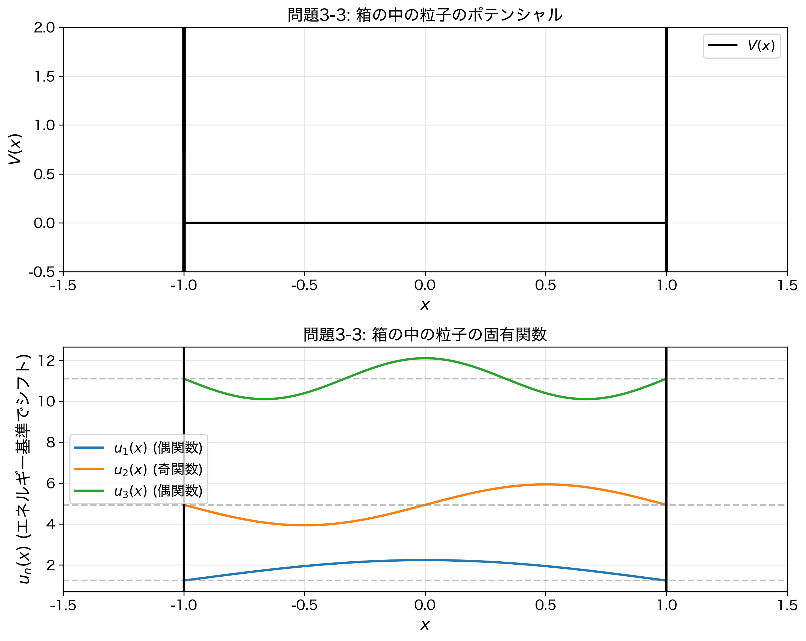

---

## 問題 3-4: 期待値: 箱の中の粒子

**問題設定：**
ポテンシャルが $a > 0$ として：

$$V(x) = \begin{cases} 
0 & (0 < x < a) \\
\infty & (x < 0, a < x)
\end{cases}$$

で与えられる。この設定における1次元の質量 $m$ の粒子の運動を量子力学的に考察する。

エネルギー固有値と対応する規格化された固有関数は：

$$E_n = \frac{\hbar^2 \pi^2 n^2}{2ma^2}, \quad u_n(x) = \begin{cases} 
\sqrt{\frac{2}{a}}\sin\left(\frac{n\pi x}{a}\right) & (0 < x < a) \\
0 & (x < 0, a < x)
\end{cases}$$

ここで、$n = 1, 2, 3, \ldots$ である。

### (i) 位置の期待値 $\langle x \rangle$

**問題の意味：**
$n$ 番目のエネルギー状態での位置の期待値を計算し、粒子の位置の平均が箱の中心であることを確認する。

**解答：**

位置の期待値は：

$$\langle x \rangle = \int_{0}^{a} u_n^*(x) x u_n(x) dx = \int_{0}^{a} x |u_n(x)|^2 dx$$

$$= \frac{2}{a}\int_{0}^{a} x \sin^2\left(\frac{n\pi x}{a}\right) dx$$

三角関数の公式 $\sin^2\theta = \frac{1 - \cos(2\theta)}{2}$ を用いると：

$$\langle x \rangle = \frac{2}{a}\int_{0}^{a} x \cdot \frac{1 - \cos\left(\frac{2n\pi x}{a}\right)}{2} dx$$

$$= \frac{1}{a}\int_{0}^{a} x dx - \frac{1}{a}\int_{0}^{a} x\cos\left(\frac{2n\pi x}{a}\right) dx$$

$$= \frac{1}{a} \cdot \frac{a^2}{2} - \frac{1}{a}\int_{0}^{a} x\cos\left(\frac{2n\pi x}{a}\right) dx$$

$$= \frac{a}{2} - \frac{1}{a}\int_{0}^{a} x\cos\left(\frac{2n\pi x}{a}\right) dx$$

**部分積分の適用：**

部分積分の公式：$\int u dv = uv - \int v du$

ここで、$u = x$、$dv = \cos\left(\frac{2n\pi x}{a}\right) dx$ とおく。

$du = dx$、$v = \int \cos\left(\frac{2n\pi x}{a}\right) dx = \frac{a}{2n\pi}\sin\left(\frac{2n\pi x}{a}\right)$

したがって：

$$\int_{0}^{a} x\cos\left(\frac{2n\pi x}{a}\right) dx = \left[x \cdot \frac{a}{2n\pi}\sin\left(\frac{2n\pi x}{a}\right)\right]_{0}^{a} - \int_{0}^{a} \frac{a}{2n\pi}\sin\left(\frac{2n\pi x}{a}\right) dx$$

$$= \frac{a^2}{2n\pi}\sin(2n\pi) - \frac{a}{2n\pi}\left[-\frac{a}{2n\pi}\cos\left(\frac{2n\pi x}{a}\right)\right]_{0}^{a}$$

$$= 0 + \frac{a^2}{4n^2\pi^2}\left[\cos\left(\frac{2n\pi x}{a}\right)\right]_{0}^{a}$$

$$= \frac{a^2}{4n^2\pi^2}(\cos(2n\pi) - \cos(0)) = \frac{a^2}{4n^2\pi^2}(1 - 1) = 0$$

したがって：

$$\langle x \rangle = \frac{a}{2}$$

**用語解説：**
- **期待値**: 物理量の測定結果の平均値。量子状態における物理量の統計的予測値を与える。

**物理的意味：**
位置の期待値が箱の中心 $\frac{a}{2}$ であることは、波動関数が箱の中心について対称的であることを示している。これは、ポテンシャルが左右対称であることの反映である。

**考察：**
すべてのエネルギー固有状態で位置の期待値が箱の中心であることは、波動関数の対称性から自然である。ただし、個々の測定では必ずしも中心に粒子が見つかるわけではない。

---

### (ii) 運動量の期待値 $\langle p \rangle$

**問題の意味：**
$n$ 番目のエネルギー状態での運動量の期待値を計算し、運動量の平均が0であることを確認する。

**解答：**

運動量の期待値は：

$$\langle p \rangle = \int_{0}^{a} u_n^*(x) \left(-i\hbar\frac{d}{dx}\right) u_n(x) dx$$

$$= -i\hbar \frac{2}{a}\int_{0}^{a} \sin\left(\frac{n\pi x}{a}\right) \frac{d}{dx}\sin\left(\frac{n\pi x}{a}\right) dx$$

$$= -i\hbar \frac{2}{a} \cdot \frac{n\pi}{a}\int_{0}^{a} \sin\left(\frac{n\pi x}{a}\right) \cos\left(\frac{n\pi x}{a}\right) dx$$

$$= -i\hbar \frac{2n\pi}{a^2}\int_{0}^{a} \sin\left(\frac{n\pi x}{a}\right) \cos\left(\frac{n\pi x}{a}\right) dx$$

三角関数の公式 $\sin\theta\cos\theta = \frac{1}{2}\sin(2\theta)$ を用いると：

$$\langle p \rangle = -i\hbar \frac{2n\pi}{a^2} \cdot \frac{1}{2}\int_{0}^{a} \sin\left(\frac{2n\pi x}{a}\right) dx$$

$$= -i\hbar \frac{n\pi}{a^2}\left[-\frac{a}{2n\pi}\cos\left(\frac{2n\pi x}{a}\right)\right]_{0}^{a}$$

$$= -i\hbar \frac{n\pi}{a^2} \cdot \left(-\frac{a}{2n\pi}\right)\left[\cos\left(\frac{2n\pi x}{a}\right)\right]_{0}^{a}$$

$$= \frac{i\hbar}{2a}\left[\cos\left(\frac{2n\pi x}{a}\right)\right]_{0}^{a}$$

$$= \frac{i\hbar}{2a}(\cos(2n\pi) - \cos(0)) = \frac{i\hbar}{2a}(1 - 1) = 0$$

**用語解説：**
- **運動量演算子**: 位置表示では $\hat{p} = -i\hbar\frac{d}{dx}$ で与えられる。

**物理的意味：**
運動量の期待値が0であることは、粒子が左右に等しく運動していることを示している。これは、定常状態（エネルギー固有状態）では、粒子の平均的な運動が0であることを意味する。

**考察：**
定常状態では、波動関数は時間に依存しない実関数（位相因子を除く）であるため、運動量の期待値は0になる。これは、古典力学における静止状態に対応している。

---

### (iii) 基底状態での $\langle x^2 \rangle$ と $\Delta x$

**問題の意味：**
基底状態（$n = 1$）での位置の2乗の期待値と位置の不確定性を計算する。

**解答：**

基底状態の波動関数は：

$$u_1(x) = \sqrt{\frac{2}{a}}\sin\left(\frac{\pi x}{a}\right) \quad (0 < x < a)$$

位置の2乗の期待値は：

$$\langle x^2 \rangle = \int_{0}^{a} x^2 |u_1(x)|^2 dx = \frac{2}{a}\int_{0}^{a} x^2 \sin^2\left(\frac{\pi x}{a}\right) dx$$

$$= \frac{2}{a}\int_{0}^{a} x^2 \cdot \frac{1 - \cos\left(\frac{2\pi x}{a}\right)}{2} dx$$

$$= \frac{1}{a}\int_{0}^{a} x^2 dx - \frac{1}{a}\int_{0}^{a} x^2\cos\left(\frac{2\pi x}{a}\right) dx$$

第1項の積分：

$$\int_{0}^{a} x^2 dx = \left[\frac{x^3}{3}\right]_{0}^{a} = \frac{a^3}{3}$$

したがって：

$$\langle x^2 \rangle = \frac{1}{a} \cdot \frac{a^3}{3} - \frac{1}{a}\int_{0}^{a} x^2\cos\left(\frac{2\pi x}{a}\right) dx$$

$$= \frac{a^2}{3} - \frac{1}{a}\int_{0}^{a} x^2\cos\left(\frac{2\pi x}{a}\right) dx$$

**第2項の計算：部分積分を2回適用**

$\int_{0}^{a} x^2\cos\left(\frac{2\pi x}{a}\right) dx$ を計算する。

**部分積分の公式：** $\int u dv = uv - \int v du$

$u = x^2$、$dv = \cos\left(\frac{2\pi x}{a}\right) dx$ とおく：

$du = 2x dx$、$v = \frac{a}{2\pi}\sin\left(\frac{2\pi x}{a}\right)$

したがって：

$$\int_{0}^{a} x^2\cos\left(\frac{2\pi x}{a}\right) dx = \left[x^2 \cdot \frac{a}{2\pi}\sin\left(\frac{2\pi x}{a}\right)\right]_{0}^{a} - \int_{0}^{a} 2x \cdot \frac{a}{2\pi}\sin\left(\frac{2\pi x}{a}\right) dx$$

第1項（境界項）を評価：

$$\left[x^2 \cdot \frac{a}{2\pi}\sin\left(\frac{2\pi x}{a}\right)\right]_{0}^{a} = \frac{a^3}{2\pi}\sin(2\pi) - 0 = 0$$

（$\sin(2\pi) = 0$ より）

したがって：

$$\int_{0}^{a} x^2\cos\left(\frac{2\pi x}{a}\right) dx = -\frac{a}{\pi}\int_{0}^{a} x\sin\left(\frac{2\pi x}{a}\right) dx$$

**第2回目の部分積分：**

$\int_{0}^{a} x\sin\left(\frac{2\pi x}{a}\right) dx$ を計算する。

$u = x$、$dv = \sin\left(\frac{2\pi x}{a}\right) dx$ とおく：

$du = dx$、$v = -\frac{a}{2\pi}\cos\left(\frac{2\pi x}{a}\right)$

$$\int_{0}^{a} x\sin\left(\frac{2\pi x}{a}\right) dx = \left[-x \cdot \frac{a}{2\pi}\cos\left(\frac{2\pi x}{a}\right)\right]_{0}^{a} - \int_{0}^{a} \left(-\frac{a}{2\pi}\cos\left(\frac{2\pi x}{a}\right)\right) dx$$

$$= -\frac{a^2}{2\pi}\cos(2\pi) + \frac{a}{2\pi}\int_{0}^{a} \cos\left(\frac{2\pi x}{a}\right) dx$$

第2項を積分：

$$\int_{0}^{a} \cos\left(\frac{2\pi x}{a}\right) dx = \left[\frac{a}{2\pi}\sin\left(\frac{2\pi x}{a}\right)\right]_{0}^{a} = \frac{a}{2\pi}(\sin(2\pi) - \sin(0)) = 0$$

したがって：

$$\int_{0}^{a} x\sin\left(\frac{2\pi x}{a}\right) dx = -\frac{a^2}{2\pi}\cos(2\pi) = -\frac{a^2}{2\pi}$$

（$\cos(2\pi) = 1$ より）

最終的に：

$$\int_{0}^{a} x^2\cos\left(\frac{2\pi x}{a}\right) dx = -\frac{a}{\pi} \cdot \left(-\frac{a^2}{2\pi}\right) = \frac{a^3}{2\pi^2}$$

したがって：

$$\langle x^2 \rangle = \frac{a^2}{3} - \frac{1}{a} \cdot \frac{a^3}{2\pi^2} = \frac{a^2}{3} - \frac{a^2}{2\pi^2} = a^2\left(\frac{1}{3} - \frac{1}{2\pi^2}\right)$$

位置の不確定性は：

$$\Delta x = \sqrt{\langle x^2 \rangle - \langle x \rangle^2} = \sqrt{a^2\left(\frac{1}{3} - \frac{1}{2\pi^2}\right) - \frac{a^2}{4}}$$

$$= a\sqrt{\frac{1}{3} - \frac{1}{2\pi^2} - \frac{1}{4}} = a\sqrt{\frac{4}{12} - \frac{6}{12\pi^2} - \frac{3}{12}}$$

$$= a\sqrt{\frac{1}{12} - \frac{1}{2\pi^2}} = a\sqrt{\frac{\pi^2 - 6}{12\pi^2}} = \frac{a}{\pi}\sqrt{\frac{\pi^2 - 6}{12}}$$

**用語解説：**
- **不確定性**: 物理量の測定値のばらつき。標準偏差 $\Delta A = \sqrt{\langle A^2 \rangle - \langle A \rangle^2}$ で定義される。

**物理的意味：**
位置の不確定性は、粒子が箱の中に広がって存在することを示している。基底状態では、粒子は箱の中心付近に最も高い確率で存在するが、箱全体に分布している。

**考察：**
不確定性は箱のサイズ $a$ に比例する。箱が大きくなるほど、粒子の位置の不確定性も大きくなる。

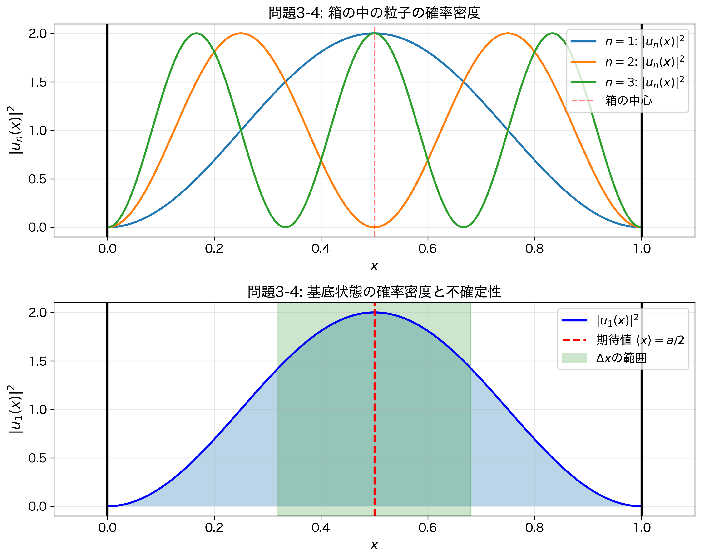

---

### (iv) 基底状態での $\langle p^2 \rangle$ と $\Delta p$

**問題の意味：**
基底状態での運動量の2乗の期待値と運動量の不確定性を計算する。

**解答：**

運動量の2乗の期待値は：

$$\langle p^2 \rangle = \int_{0}^{a} u_1^*(x) \left(-i\hbar\frac{d}{dx}\right)^2 u_1(x) dx$$

$$= \int_{0}^{a} u_1^*(x) \left(-\hbar^2\frac{d^2}{dx^2}\right) u_1(x) dx$$

$$= -\hbar^2 \frac{2}{a}\int_{0}^{a} \sin\left(\frac{\pi x}{a}\right) \frac{d^2}{dx^2}\sin\left(\frac{\pi x}{a}\right) dx$$

$$= -\hbar^2 \frac{2}{a}\int_{0}^{a} \sin\left(\frac{\pi x}{a}\right) \left(-\frac{\pi^2}{a^2}\sin\left(\frac{\pi x}{a}\right)\right) dx$$

$$= \hbar^2 \frac{2\pi^2}{a^3}\int_{0}^{a} \sin^2\left(\frac{\pi x}{a}\right) dx$$

$$= \hbar^2 \frac{2\pi^2}{a^3} \cdot \frac{a}{2} = \frac{\hbar^2 \pi^2}{a^2}$$

運動量の不確定性は：

$$\Delta p = \sqrt{\langle p^2 \rangle - \langle p \rangle^2} = \sqrt{\frac{\hbar^2 \pi^2}{a^2} - 0} = \frac{\hbar \pi}{a}$$

**用語解説：**
- **運動量の2乗の期待値**: 運動エネルギーと関連する量。$\langle p^2 \rangle = 2m\langle T \rangle$ の関係がある。

**物理的意味：**
運動量の不確定性は、粒子が箱の中に閉じ込められていることの結果である。箱が小さいほど、運動量の不確定性は大きくなる。

**考察：**
運動量の不確定性は、位置の不確定性と逆の関係にある傾向がある。これは不確定性関係の反映である。

---

### (v) 基底状態での $\Delta x \cdot \Delta p$

**問題の意味：**
基底状態での不確定性の積を計算し、不確定性関係を確認する。

**解答：**

$$\Delta x \cdot \Delta p = \frac{a}{\pi}\sqrt{\frac{\pi^2 - 6}{12}} \cdot \frac{\hbar \pi}{a} = \hbar\sqrt{\frac{\pi^2 - 6}{12}}$$

数値計算：

$$\sqrt{\frac{\pi^2 - 6}{12}} = \sqrt{\frac{9.8696 - 6}{12}} = \sqrt{\frac{3.8696}{12}} = \sqrt{0.3225} \approx 0.568$$

したがって：

$$\Delta x \cdot \Delta p \approx 0.568\hbar > \frac{\hbar}{2}$$

**用語解説：**
- **不確定性関係**: $\Delta x \cdot \Delta p \geq \frac{\hbar}{2}$ が常に成り立つ。

**物理的意味：**
基底状態でも不確定性関係が満たされている。この値は最小値 $\frac{\hbar}{2}$ より大きいが、これは基底状態が最小不確定性状態ではないことを示している。

**考察：**
箱の中の粒子の基底状態は、最小不確定性状態（ガウス型）とは異なる。これは、境界条件により波動関数の形が制約されているためである。

---

### (vi) $E \leq 0$ の固有関数が存在しないこと

**問題の意味：**
負のエネルギーまたはゼロエネルギーの固有関数が存在しないことを、境界条件から示す。

**解答：**

$E \leq 0$ の場合を考える。$E = 0$ のとき、シュレーディンガー方程式は：

$$-\frac{\hbar^2}{2m}\frac{d^2}{dx^2}u(x) = 0$$

したがって：

$$\frac{d^2}{dx^2}u(x) = 0$$

一般解は：

$$u(x) = Ax + B$$

境界条件 $u(0) = 0$ より $B = 0$、$u(a) = 0$ より $Aa = 0$、したがって $A = 0$。よって $u(x) = 0$（自明解）。

$E < 0$ の場合、$\kappa = \sqrt{\frac{2m|E|}{\hbar^2}} > 0$ とおくと：

$$\frac{d^2}{dx^2}u(x) - \kappa^2 u(x) = 0$$

一般解は：

$$u(x) = Ae^{\kappa x} + Be^{-\kappa x}$$

境界条件 $u(0) = 0$ より $A + B = 0$、すなわち $B = -A$。したがって：

$$u(x) = A(e^{\kappa x} - e^{-\kappa x}) = 2A\sinh(\kappa x)$$

境界条件 $u(a) = 0$ より：

$$2A\sinh(\kappa a) = 0$$

$\sinh(\kappa a) > 0$（$\kappa > 0, a > 0$）であるから、$A = 0$。よって $u(x) = 0$（自明解）。

したがって、$E \leq 0$ の固有関数は存在しない。

**用語解説：**
- **束縛状態**: 有限の領域に閉じ込められた状態。エネルギーは離散的で、最低エネルギーは正である。

**物理的意味：**
負のエネルギー状態が存在しないことは、粒子が箱の中に束縛されているため、最低でも零点エネルギーを持つことを示している。これは、不確定性関係の結果でもある。

**考察：**
零点エネルギーは、量子力学の重要な特徴である。古典力学では、粒子は完全に静止できるが、量子力学では不確定性関係により、最低エネルギーが正になる。

---

## 問題 4-1: 測定: 箱の中の粒子 No.1 {#問題-4-1-測定-箱の中の粒子-no1}

**問題設定：**
無限に深い井戸型ポテンシャルに束縛された質量 $m$ の粒子を考える。ポテンシャル関数は：

$$V(x) = \begin{cases} 
0 & (0 < x < a) \\
\infty & (\text{それ以外})
\end{cases}$$

ここで、$a > 0$ とする。

この井戸型ポテンシャル中の粒子の波動関数が次のように与えられる場合に以下の問に答えよ：

$$\psi(x) = \begin{cases} 
C\left(\sin\frac{\pi x}{a} + \frac{1}{2}\sin\frac{2\pi x}{a} + \frac{1}{3}\sin\frac{3\pi x}{a}\right) & (0 < x < a) \\
0 & (x < 0, a < x)
\end{cases}$$

ただし、$C > 0$ とする。

**用語解説：**
- **井戸型ポテンシャル**: 有限の領域（$0 < x < a$）ではポテンシャルが0で、それ以外の領域では無限大となるポテンシャル。粒子は井戸の中に閉じ込められる。
- **波動関数**: 量子状態を記述する関数。$|\psi(x)|^2$ は位置 $x$ で粒子が見つかる確率密度を表す。
- **規格化**: 波動関数の絶対値の2乗を全空間で積分した値が1になるようにすること。確率の総和が1であることを保証する。

### (i) エネルギー固有関数の規格直交条件

**問題の意味：**
エネルギーの固有関数 $u_n(x)$ が規格直交条件を満たすことを示す。これは、異なるエネルギー状態が互いに直交し、同じ状態は規格化されていることを意味する。

**解答：**

エネルギー固有関数は：

$$u_n(x) = \begin{cases} 
\sqrt{\frac{2}{a}} \sin\left(\frac{n\pi x}{a}\right) & (0 < x < a) \\
0 & (\text{それ以外})
\end{cases}$$

ここで、$n = 1, 2, 3, \ldots$ である。

規格直交条件は：

$$\int_{-\infty}^{\infty} dx \, u_n^*(x) u_m(x) = \delta_{nm}$$

ここで、$\delta_{nm}$ はクロネッカーのデルタで、$n = m$ のとき1、$n \neq m$ のとき0である。

**用語解説：**
- **固有関数**: 時間に依存しないシュレーディンガー方程式の解。各固有関数は特定のエネルギー値（固有値）に対応する。
- **規格直交条件**: 異なる固有関数同士は直交し（内積が0）、同じ固有関数は規格化されている（内積が1）という条件。
- **クロネッカーのデルタ**: $\delta_{nm} = \begin{cases} 1 & (n = m) \\ 0 & (n \neq m) \end{cases}$ で定義される記号。

**計算：**

$u_n(x)$ は実関数なので、$u_n^*(x) = u_n(x)$ である。したがって：

$$\int_{-\infty}^{\infty} dx \, u_n^*(x) u_m(x) = \int_{0}^{a} dx \, u_n(x) u_m(x)$$

$$= \frac{2}{a}\int_{0}^{a} \sin\left(\frac{n\pi x}{a}\right) \sin\left(\frac{m\pi x}{a}\right) dx$$

**三角関数の積の公式：**

$$\sin A \sin B = \frac{1}{2}[\cos(A - B) - \cos(A + B)]$$

を用いると：

$$\int_{0}^{a} \sin\left(\frac{n\pi x}{a}\right) \sin\left(\frac{m\pi x}{a}\right) dx = \frac{1}{2}\int_{0}^{a} \left[\cos\left(\frac{(n-m)\pi x}{a}\right) - \cos\left(\frac{(n+m)\pi x}{a}\right)\right] dx$$

**場合分け：**

**ケース1: $n = m$ の場合**

$$\int_{0}^{a} \sin^2\left(\frac{n\pi x}{a}\right) dx = \frac{1}{2}\int_{0}^{a} \left[1 - \cos\left(\frac{2n\pi x}{a}\right)\right] dx$$

$$= \frac{1}{2}\left[x - \frac{a}{2n\pi}\sin\left(\frac{2n\pi x}{a}\right)\right]_{0}^{a}$$

$$= \frac{1}{2}\left[a - \frac{a}{2n\pi}\sin(2n\pi) - 0 + 0\right] = \frac{a}{2}$$

したがって：

$$\int_{-\infty}^{\infty} dx \, u_n^*(x) u_n(x) = \frac{2}{a} \cdot \frac{a}{2} = 1$$

**ケース2: $n \neq m$ の場合**

$$\int_{0}^{a} \sin\left(\frac{n\pi x}{a}\right) \sin\left(\frac{m\pi x}{a}\right) dx = \frac{1}{2}\int_{0}^{a} \left[\cos\left(\frac{(n-m)\pi x}{a}\right) - \cos\left(\frac{(n+m)\pi x}{a}\right)\right] dx$$

$$= \frac{1}{2}\left[\frac{a}{(n-m)\pi}\sin\left(\frac{(n-m)\pi x}{a}\right) - \frac{a}{(n+m)\pi}\sin\left(\frac{(n+m)\pi x}{a}\right)\right]_{0}^{a}$$

$n$ と $m$ は整数なので、$(n-m)\pi$ と $(n+m)\pi$ は $\pi$ の整数倍である。したがって：

$$\sin((n-m)\pi) = 0, \quad \sin((n+m)\pi) = 0$$

また、$x = 0$ でも $\sin(0) = 0$ である。したがって：

$$\int_{0}^{a} \sin\left(\frac{n\pi x}{a}\right) \sin\left(\frac{m\pi x}{a}\right) dx = 0$$

したがって：

$$\int_{-\infty}^{\infty} dx \, u_n^*(x) u_m(x) = \frac{2}{a} \cdot 0 = 0$$

**結論：**

$$\int_{-\infty}^{\infty} dx \, u_n^*(x) u_m(x) = \delta_{nm}$$

が示された。

**物理的意味：**
規格直交条件は、異なるエネルギー状態が互いに独立であることを示している。これは、測定により異なるエネルギー値が得られる確率を独立に計算できることを意味する。

---

### (ii) 波動関数の線形結合と規格化

**問題の意味：**
与えられた波動関数 $\psi(x)$ をエネルギー固有関数 $u_n(x)$ の線形結合として表し、規格化条件から定数 $C$ を決定する。

**解答：**

**ステップ1: 線形結合として表す**

波動関数 $\psi(x)$ は、エネルギー固有関数 $u_n(x)$ の完全系により展開できる：

$$\psi(x) = \sum_{n=1}^{\infty} A_n u_n(x)$$

ここで、$A_n$ は展開係数（確率振幅）である。

**用語解説：**
- **完全系**: 任意の波動関数を固有関数の線形結合で表すことができるという性質。
- **展開係数**: 各固有状態への「重み」を表す係数。$|A_n|^2$ は、その固有状態が測定される確率を表す。

**展開係数の計算：**

規格直交条件を用いると、展開係数は：

$$A_n = \int_{-\infty}^{\infty} dx \, u_n^*(x) \psi(x) = \int_{0}^{a} dx \, u_n(x) \psi(x)$$

$$= \int_{0}^{a} dx \, \sqrt{\frac{2}{a}} \sin\left(\frac{n\pi x}{a}\right) \cdot C\left(\sin\frac{\pi x}{a} + \frac{1}{2}\sin\frac{2\pi x}{a} + \frac{1}{3}\sin\frac{3\pi x}{a}\right)$$

$$= C\sqrt{\frac{2}{a}} \int_{0}^{a} dx \, \sin\left(\frac{n\pi x}{a}\right) \left(\sin\frac{\pi x}{a} + \frac{1}{2}\sin\frac{2\pi x}{a} + \frac{1}{3}\sin\frac{3\pi x}{a}\right)$$

$$= C\sqrt{\frac{2}{a}} \left[\int_{0}^{a} dx \, \sin\left(\frac{n\pi x}{a}\right) \sin\frac{\pi x}{a} + \frac{1}{2}\int_{0}^{a} dx \, \sin\left(\frac{n\pi x}{a}\right) \sin\frac{2\pi x}{a} + \frac{1}{3}\int_{0}^{a} dx \, \sin\left(\frac{n\pi x}{a}\right) \sin\frac{3\pi x}{a}\right]$$

規格直交条件から、$n \neq m$ のとき $\int_{0}^{a} \sin\left(\frac{n\pi x}{a}\right) \sin\left(\frac{m\pi x}{a}\right) dx = 0$、$n = m$ のとき $\int_{0}^{a} \sin^2\left(\frac{n\pi x}{a}\right) dx = \frac{a}{2}$ である。

したがって：

- $n = 1$ のとき：
  $$A_1 = C\sqrt{\frac{2}{a}} \cdot \frac{a}{2} = C\sqrt{\frac{a}{2}}$$

- $n = 2$ のとき：
  $$A_2 = C\sqrt{\frac{2}{a}} \cdot \frac{1}{2} \cdot \frac{a}{2} = C\sqrt{\frac{a}{8}} = \frac{C}{2}\sqrt{\frac{a}{2}}$$

- $n = 3$ のとき：
  $$A_3 = C\sqrt{\frac{2}{a}} \cdot \frac{1}{3} \cdot \frac{a}{2} = C\sqrt{\frac{a}{18}} = \frac{C}{3}\sqrt{\frac{a}{2}}$$

- $n \geq 4$ のとき：
  $$A_n = 0$$

したがって：

$$\psi(x) = A_1 u_1(x) + A_2 u_2(x) + A_3 u_3(x)$$

**ステップ2: 規格化条件から $C$ を決定**

規格化条件は：

$$\int_{-\infty}^{\infty} dx \, |\psi(x)|^2 = 1$$

**方法1: 直接積分**

$$|\psi(x)|^2 = C^2\left(\sin\frac{\pi x}{a} + \frac{1}{2}\sin\frac{2\pi x}{a} + \frac{1}{3}\sin\frac{3\pi x}{a}\right)^2$$

$$= C^2\left[\sin^2\frac{\pi x}{a} + \frac{1}{4}\sin^2\frac{2\pi x}{a} + \frac{1}{9}\sin^2\frac{3\pi x}{a} + \frac{1}{2}\sin\frac{\pi x}{a}\sin\frac{2\pi x}{a} + \frac{2}{3}\sin\frac{\pi x}{a}\sin\frac{3\pi x}{a} + \frac{1}{3}\sin\frac{2\pi x}{a}\sin\frac{3\pi x}{a}\right]$$

規格直交条件を用いると、異なる固有関数の積分は0になるので：

$$\int_{0}^{a} dx \, |\psi(x)|^2 = C^2\left[\int_{0}^{a} dx \, \sin^2\frac{\pi x}{a} + \frac{1}{4}\int_{0}^{a} dx \, \sin^2\frac{2\pi x}{a} + \frac{1}{9}\int_{0}^{a} dx \, \sin^2\frac{3\pi x}{a}\right]$$

$$= C^2\left[\frac{a}{2} + \frac{1}{4} \cdot \frac{a}{2} + \frac{1}{9} \cdot \frac{a}{2}\right] = C^2 \cdot \frac{a}{2}\left(1 + \frac{1}{4} + \frac{1}{9}\right)$$

$$= C^2 \cdot \frac{a}{2} \cdot \frac{36 + 9 + 4}{36} = C^2 \cdot \frac{a}{2} \cdot \frac{49}{36} = C^2 \cdot \frac{49a}{72}$$

規格化条件より：

$$C^2 \cdot \frac{49a}{72} = 1$$

したがって：

$$C = \sqrt{\frac{72}{49a}} = \frac{6\sqrt{2}}{7\sqrt{a}}$$

**方法2: 展開係数を用いる方法**

規格化条件は、展開係数を用いても表せる：

$$\int_{-\infty}^{\infty} dx \, |\psi(x)|^2 = \sum_{n=1}^{\infty} |A_n|^2 = 1$$

$$|A_1|^2 + |A_2|^2 + |A_3|^2 = C^2 \cdot \frac{a}{2} + C^2 \cdot \frac{a}{8} + C^2 \cdot \frac{a}{18}$$

$$= C^2 \cdot \frac{a}{2}\left(1 + \frac{1}{4} + \frac{1}{9}\right) = C^2 \cdot \frac{49a}{72} = 1$$

したがって、同じ結果が得られる。

**最終的な展開係数：**

$$A_1 = \sqrt{\frac{72}{49a}} \cdot \sqrt{\frac{a}{2}} = \sqrt{\frac{72}{49} \cdot \frac{1}{2}} = \frac{6}{7}$$

$$A_2 = \frac{1}{2} \cdot \frac{6}{7} = \frac{3}{7}$$

$$A_3 = \frac{1}{3} \cdot \frac{6}{7} = \frac{2}{7}$$

**物理的意味：**
波動関数が3つのエネルギー固有状態の重ね合わせで表される。各状態への「重み」は展開係数の絶対値の2乗で与えられ、これが測定確率に対応する。

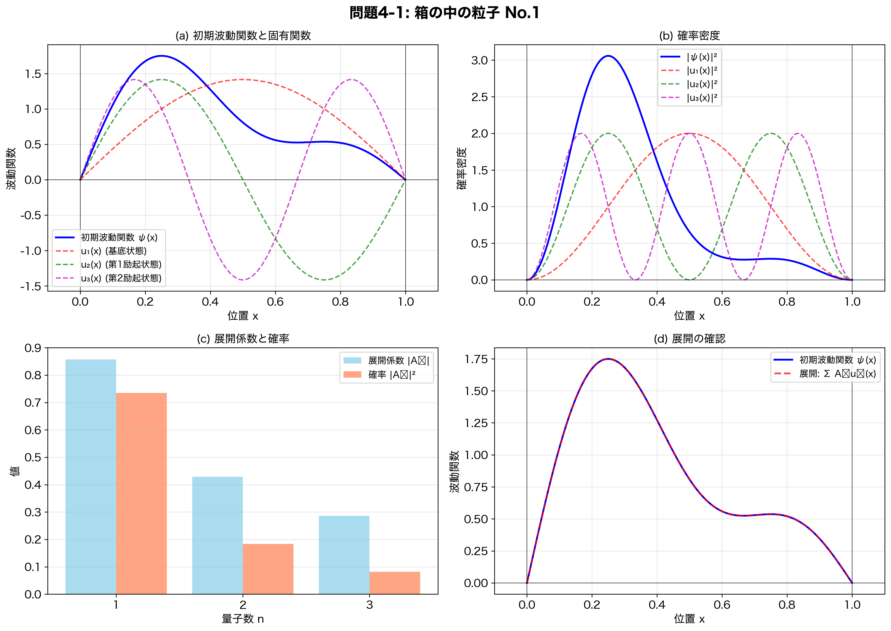

---

### (iii) エネルギーの測定値と確率

**問題の意味：**
エネルギーの測定を一回行ったときに得られるエネルギーの値を、確率とともに求める。

**解答：**

エネルギー固有値は：

$$E_n = \frac{\hbar^2 \pi^2 n^2}{2ma^2}$$

波動関数 $\psi(x)$ は、$u_1(x)$、$u_2(x)$、$u_3(x)$ の重ね合わせなので、測定により得られるエネルギー値は $E_1$、$E_2$、$E_3$ のいずれかである。

**用語解説：**
- **エネルギー固有値**: 各エネルギー固有状態に対応するエネルギー値。測定により得られる可能なエネルギー値。
- **測定の確率**: 波動関数が固有状態 $u_n$ に「どのくらい含まれているか」を表す。これは $|A_n|^2$ で与えられる。

**各エネルギーが測定される確率：**

- $E_1 = \frac{\hbar^2 \pi^2}{2ma^2}$ が得られる確率：$|A_1|^2 = \left(\frac{6}{7}\right)^2 = \frac{36}{49}$
- $E_2 = \frac{\hbar^2 \pi^2 \cdot 4}{2ma^2} = \frac{2\hbar^2 \pi^2}{ma^2}$ が得られる確率：$|A_2|^2 = \left(\frac{3}{7}\right)^2 = \frac{9}{49}$
- $E_3 = \frac{\hbar^2 \pi^2 \cdot 9}{2ma^2} = \frac{9\hbar^2 \pi^2}{2ma^2}$ が得られる確率：$|A_3|^2 = \left(\frac{2}{7}\right)^2 = \frac{4}{49}$

**確率の確認：**

$$\frac{36}{49} + \frac{9}{49} + \frac{4}{49} = \frac{49}{49} = 1$$

確率の総和が1であることを確認できた。

**答え：**

エネルギーの測定を一回行ったときに得られるエネルギーの値と確率は：

- $E_1 = \frac{\hbar^2 \pi^2}{2ma^2}$ が得られる確率：$\frac{36}{49}$
- $E_2 = \frac{2\hbar^2 \pi^2}{ma^2}$ が得られる確率：$\frac{9}{49}$
- $E_3 = \frac{9\hbar^2 \pi^2}{2ma^2}$ が得られる確率：$\frac{4}{49}$

**物理的意味：**
量子力学では、測定により確定的な値が得られるのではなく、確率的に異なる値が得られる。この確率は、波動関数が各固有状態にどのくらい「含まれているか」で決まる。

---

### (iv) エネルギーの平均値

**問題の意味：**
エネルギーの測定を多数回繰り返し行った結果得られるエネルギーの平均値を求める。

**解答：**

**用語解説：**
- **期待値（平均値）**: 同じ測定を多数回繰り返したときの平均値。各測定値にその確率を掛けて足し合わせたもの。

エネルギーの期待値は：

$$\langle E \rangle = \sum_{n=1}^{\infty} E_n |A_n|^2 = E_1 |A_1|^2 + E_2 |A_2|^2 + E_3 |A_3|^2$$

$$= \frac{\hbar^2 \pi^2}{2ma^2} \cdot \frac{36}{49} + \frac{2\hbar^2 \pi^2}{ma^2} \cdot \frac{9}{49} + \frac{9\hbar^2 \pi^2}{2ma^2} \cdot \frac{4}{49}$$

$$= \frac{\hbar^2 \pi^2}{2ma^2} \cdot \frac{1}{49}\left(36 + 2 \cdot 9 \cdot 2 + 9 \cdot 4\right)$$

$$= \frac{\hbar^2 \pi^2}{2ma^2} \cdot \frac{1}{49}\left(36 + 36 + 36\right)$$

$$= \frac{\hbar^2 \pi^2}{2ma^2} \cdot \frac{108}{49} = \frac{54\hbar^2 \pi^2}{49ma^2}$$

**別の計算方法：**

期待値は、波動関数を用いて直接計算することもできる：

$$\langle E \rangle = \int_{-\infty}^{\infty} dx \, \psi^*(x) \hat{H} \psi(x)$$

ここで、$\hat{H} = -\frac{\hbar^2}{2m}\frac{d^2}{dx^2}$ はハミルトニアン演算子である。展開表示を用いると、同じ結果が得られる。

**答え：**

$$\langle E \rangle = \frac{54\hbar^2 \pi^2}{49ma^2}$$

**物理的意味：**
エネルギーの平均値は、各エネルギー固有値の「重み付き平均」である。基底状態 $E_1$ への寄与が最も大きい（確率 $\frac{36}{49}$）ため、平均値は $E_1$ に近い値になる。

**考察：**
平均値は、個々の測定値（$E_1$、$E_2$、$E_3$）のいずれとも一致しない。これは、量子力学における測定の確率的性質を反映している。

---

## 問題 4-2: 測定: 箱の中の粒子 No.2 {#問題-4-2-測定-箱の中の粒子-no2}

**問題設定：**
次のような無限に深いポテンシャルに束縛された質量 $m$ の粒子を考える。但し、$a > 0$ とする。

ポテンシャル関数は：

$$V(x) = \begin{cases} 
0 & (|x| < a) \\
\infty & (a < |x|)
\end{cases}$$

これは、中心が $x = 0$ にあり、幅が $2a$ の無限に深い井戸型ポテンシャルである。

**用語解説：**
- **対称ポテンシャル**: $x = 0$ について対称なポテンシャル。この場合、固有関数は偶関数（対称）または奇関数（反対称）になる。

**エネルギー固有値：**

時間に依存しないシュレーディンガー方程式の許されるエネルギー固有値は：

$$E_n = \frac{\hbar^2 \pi^2 n^2}{8ma^2} \quad (n = 1, 2, 3, \ldots)$$

**規格化された固有関数：**

- **$n = 1, 3, 5, \ldots$ (奇数) の場合：**

$$u_n(x) = \begin{cases} 
\sqrt{\frac{1}{a}} \cos\left(\frac{n\pi x}{2a}\right) & (-a \leq x \leq a) \\
0 & (x < -a \text{ または } x > a)
\end{cases}$$

- **$n = 2, 4, 6, \ldots$ (偶数) の場合：**

$$u_n(x) = \begin{cases} 
\sqrt{\frac{1}{a}} \sin\left(\frac{n\pi x}{2a}\right) & (-a \leq x \leq a) \\
0 & (x < -a \text{ または } x > a)
\end{cases}$$

**用語解説：**
- **偶関数**: $f(-x) = f(x)$ を満たす関数。コサイン関数は偶関数。
- **奇関数**: $f(-x) = -f(x)$ を満たす関数。サイン関数は奇関数。

**初期波動関数：**

粒子がポテンシャルの壁に囲まれた領域の左半分に次の波動関数をもって局在していたとする：

$$\psi(x) = \begin{cases} 
\sqrt{\frac{1}{a}} & (-a < x < 0) \\
0 & (0 < x < a)
\end{cases}$$

この波動関数は、全空間で規格化されていると仮定する。

**用語解説：**
- **局在**: 粒子が特定の領域に集中して存在すること。
- **規格化**: $\int_{-\infty}^{\infty} |\psi(x)|^2 dx = 1$ が成り立つこと。

**波動関数の展開：**

この波動関数は、エネルギーの固有関数 $u_n(x)$ を用いて：

$$\psi(x) = \sum_{n=1}^{\infty} A_n u_n(x)$$

と展開できる。ここで、$A_n$ は展開係数（確率振幅）である。

### (i) 基底状態の確率

**問題の意味：**
測定を行った場合に、基底状態（$n = 1$ の状態）のエネルギーが得られる確率 $|A_1|^2$ を求めよ。

**解答：**

**ステップ1: 展開係数 $A_1$ の計算**

展開係数は、規格直交条件を用いて：

$$A_n = \int_{-\infty}^{\infty} dx \, u_n^*(x) \psi(x) = \int_{-a}^{a} dx \, u_n(x) \psi(x)$$

$u_n(x)$ は実関数なので、$u_n^*(x) = u_n(x)$ である。

基底状態（$n = 1$）の固有関数は：

$$u_1(x) = \begin{cases} 
\sqrt{\frac{1}{a}} \cos\left(\frac{\pi x}{2a}\right) & (-a \leq x \leq a) \\
0 & (\text{それ以外})
\end{cases}$$

したがって：

$$A_1 = \int_{-a}^{a} dx \, u_1(x) \psi(x) = \int_{-a}^{0} dx \, \sqrt{\frac{1}{a}} \cos\left(\frac{\pi x}{2a}\right) \cdot \sqrt{\frac{1}{a}}$$

$$= \frac{1}{a}\int_{-a}^{0} dx \, \cos\left(\frac{\pi x}{2a}\right)$$

**積分の計算：**

$$\int_{-a}^{0} \cos\left(\frac{\pi x}{2a}\right) dx = \left[\frac{2a}{\pi}\sin\left(\frac{\pi x}{2a}\right)\right]_{-a}^{0}$$

$$= \frac{2a}{\pi}\left[\sin(0) - \sin\left(-\frac{\pi}{2}\right)\right] = \frac{2a}{\pi}\left[0 - (-1)\right] = \frac{2a}{\pi}$$

したがって：

$$A_1 = \frac{1}{a} \cdot \frac{2a}{\pi} = \frac{2}{\pi}$$

**ステップ2: 確率の計算**

基底状態のエネルギーが得られる確率は：

$$|A_1|^2 = \left(\frac{2}{\pi}\right)^2 = \frac{4}{\pi^2}$$

**答え：**

$$|A_1|^2 = \frac{4}{\pi^2}$$

**物理的意味：**
初期状態が左半分に局在しているため、対称な基底状態（偶関数）への寄与は完全ではない。確率は $\frac{4}{\pi^2} \approx 0.405$ である。

---

### (ii) 第一励起状態の確率

**問題の意味：**
測定を行った場合に、第一励起状態（$n = 2$ の状態）のエネルギーが得られる確率 $|A_2|^2$ を求めよ。

**解答：**

**ステップ1: 展開係数 $A_2$ の計算**

第一励起状態（$n = 2$）の固有関数は：

$$u_2(x) = \begin{cases} 
\sqrt{\frac{1}{a}} \sin\left(\frac{2\pi x}{2a}\right) = \sqrt{\frac{1}{a}} \sin\left(\frac{\pi x}{a}\right) & (-a \leq x \leq a) \\
0 & (\text{それ以外})
\end{cases}$$

したがって：

$$A_2 = \int_{-a}^{a} dx \, u_2(x) \psi(x) = \int_{-a}^{0} dx \, \sqrt{\frac{1}{a}} \sin\left(\frac{\pi x}{a}\right) \cdot \sqrt{\frac{1}{a}}$$

$$= \frac{1}{a}\int_{-a}^{0} dx \, \sin\left(\frac{\pi x}{a}\right)$$

**積分の計算：**

$$\int_{-a}^{0} \sin\left(\frac{\pi x}{a}\right) dx = \left[-\frac{a}{\pi}\cos\left(\frac{\pi x}{a}\right)\right]_{-a}^{0}$$

$$= -\frac{a}{\pi}\left[\cos(0) - \cos(-\pi)\right] = -\frac{a}{\pi}[1 - (-1)] = -\frac{a}{\pi} \cdot 2 = -\frac{2a}{\pi}$$

したがって：

$$A_2 = \frac{1}{a} \cdot \left(-\frac{2a}{\pi}\right) = -\frac{2}{\pi}$$

**ステップ2: 確率の計算**

第一励起状態のエネルギーが得られる確率は：

$$|A_2|^2 = \left(-\frac{2}{\pi}\right)^2 = \frac{4}{\pi^2}$$

**答え：**

$$|A_2|^2 = \frac{4}{\pi^2}$$

**物理的意味：**
第一励起状態は奇関数（反対称）である。初期状態が左半分に局在しているため、この反対称状態への寄与も基底状態と同じ確率で現れる。これは、初期状態が対称性を破っているためである。

**考察：**
基底状態と第一励起状態の確率が同じであることは興味深い。これは、初期波動関数が左半分に均一に分布していることの結果である。

---

## 問題 4-3: 線形代数の復習

**問題の意味：**
この問題は、量子力学の基礎となる線形代数の概念を復習する。エルミート行列、固有値、固有ベクトル、対角化、交換関係など、量子力学で重要な概念を理解する。

**用語解説：**
- **行列**: 数を長方形に並べたもの。量子力学では、演算子を行列で表現する。
- **エルミート行列**: 自身の共役転置と等しい行列。量子力学では、物理量を表す演算子はエルミートである。
- **固有値・固有ベクトル**: 行列を作用させても方向が変わらないベクトルと、そのときの拡大率。

### (i) エルミート行列の定義

**問題の意味：**
エルミート行列の定義を述べる。

**解答：**

$n \times n$ 複素行列 $M$ がエルミート行列であるとは、以下が成り立つことである：

$$M^\dagger = M$$

ここで、$M^\dagger$ は $M$ のエルミート共役（随伴行列）で、転置して複素共役を取ったものである：

$$(M^\dagger)_{ij} = (M_{ji})^*$$

**用語解説：**
- **エルミート共役**: 行列の転置を取ってから、各要素の複素共役を取ったもの。記号は $M^\dagger$ または $M^*$。
- **転置**: 行列の行と列を入れ替えたもの。$(M^T)_{ij} = M_{ji}$。
- **複素共役**: 複素数の虚部の符号を変えたもの。$(a + bi)^* = a - bi$。

**具体例：**

$2 \times 2$ エルミート行列の例：

$$M = \begin{pmatrix} 
1 & 1+i \\
1-i & 2
\end{pmatrix}$$

このとき：

$$M^T = \begin{pmatrix} 
1 & 1-i \\
1+i & 2
\end{pmatrix}$$

$$M^\dagger = (M^T)^* = \begin{pmatrix} 
1 & 1+i \\
1-i & 2
\end{pmatrix} = M$$

したがって、$M$ はエルミート行列である。

**物理的意味：**
量子力学では、物理量（位置、運動量、エネルギーなど）を表す演算子はエルミートである必要がある。これにより、測定値が実数になることが保証される。

---

### (ii) エルミート行列の対角化と固有値方程式

**問題の意味：**
$n \times n$ エルミート行列 $M$ の対角化を考える。固有値方程式 $M\vec{v} = \lambda\vec{v}$ から、固有値 $\lambda$ が $\det(M - \lambda I_n) = 0$ から決定されることを示せ。

**解答：**

**固有値方程式：**

$$M\vec{v} = \lambda\vec{v}$$

ここで、$\lambda$ は固有値、$\vec{v}$ は固有ベクトルである。

**用語解説：**
- **固有値**: 行列を作用させてもベクトルの方向が変わらないときの拡大率。
- **固有ベクトル**: 固有値に対応するベクトル。行列を作用させても方向が変わらない。

**固有値方程式の変形：**

$$M\vec{v} = \lambda\vec{v}$$

$$M\vec{v} - \lambda\vec{v} = 0$$

$$(M - \lambda I_n)\vec{v} = 0$$

ここで、$I_n$ は $n \times n$ 単位行列である。

**用語解説：**
- **単位行列**: 対角成分が1で、それ以外が0の行列。任意のベクトルに作用させても変わらない。

**自明でない解が存在する条件：**

$(M - \lambda I_n)\vec{v} = 0$ が自明でない解（$\vec{v} \neq 0$）を持つためには、行列 $(M - \lambda I_n)$ が正則でない必要がある。すなわち：

$$\det(M - \lambda I_n) = 0$$

**用語解説：**
- **行列式**: 正方行列に対して定義される数値。行列が正則（逆行列が存在）かどうかを判定できる。
- **正則行列**: 逆行列が存在する行列。行列式が0でない。

**固有値の決定：**

$\det(M - \lambda I_n) = 0$ は、$\lambda$ に関する $n$ 次方程式である。これを特性方程式という。

この方程式を解くと、一般に $n$ 個の固有値が得られる（重複を含む）。それらを $\lambda_i$ $(i = 1, 2, \ldots, n)$ とし、対応する固有ベクトルを $\vec{v}_i$ と表す。

**注記：**
以下では簡単のため、固有値に縮退が無い場合のみを考える。すなわち、すべての固有値が異なると仮定する。

**物理的意味：**
固有値方程式は、量子力学の時間に依存しないシュレーディンガー方程式に対応する。固有値はエネルギー準位、固有ベクトルはエネルギー固有状態に対応する。

---

### (iii) エルミート行列の固有値は実数

**問題の意味：**
エルミート行列の固有値は必ず実数になることを示す。

**解答：**

固有値方程式：

$$M\vec{v} = \lambda\vec{v}$$

ここで、$M$ はエルミート行列、$\lambda$ は固有値、$\vec{v}$ は固有ベクトルとする。

**証明：**

固有値方程式の両辺に左から $\vec{v}^\dagger$ を掛ける：

$$\vec{v}^\dagger M\vec{v} = \vec{v}^\dagger \lambda\vec{v} = \lambda \vec{v}^\dagger \vec{v}$$

**用語解説：**
- **ベクトルの内積**: $\vec{v}^\dagger \vec{v} = \sum_{i=1}^{n} v_i^* v_i = |\vec{v}|^2$ はベクトルのノルムの2乗。

一方、エルミート性 $M^\dagger = M$ を用いると：

$$(\vec{v}^\dagger M\vec{v})^* = \vec{v}^\dagger M^\dagger \vec{v} = \vec{v}^\dagger M\vec{v}$$

したがって、$\vec{v}^\dagger M\vec{v}$ は実数である。

また、$\vec{v}^\dagger \vec{v} = |\vec{v}|^2$ も実数である。

したがって：

$$\lambda = \frac{\vec{v}^\dagger M\vec{v}}{\vec{v}^\dagger \vec{v}}$$

は実数である。

**別の証明方法：**

固有値方程式の複素共役を取る：

$$(M\vec{v})^* = (\lambda\vec{v})^*$$

$$M^*\vec{v}^* = \lambda^*\vec{v}^*$$

エルミート性 $M^\dagger = M$ より、$M^* = M^T$ であることに注意すると：

$$M^T\vec{v}^* = \lambda^*\vec{v}^*$$

転置を取ると：

$$\vec{v}^\dagger M = \lambda^*\vec{v}^\dagger$$

右から $\vec{v}$ を掛ける：

$$\vec{v}^\dagger M\vec{v} = \lambda^*\vec{v}^\dagger \vec{v}$$

一方、元の式から：

$$\vec{v}^\dagger M\vec{v} = \lambda\vec{v}^\dagger \vec{v}$$

したがって：

$$(\lambda - \lambda^*)\vec{v}^\dagger \vec{v} = 0$$

$\vec{v} \neq 0$ なので $\vec{v}^\dagger \vec{v} > 0$ である。したがって：

$$\lambda = \lambda^*$$

これは、$\lambda$ が実数であることを意味する。

**物理的意味：**
物理量の測定値は実数でなければならない。エルミート演算子の固有値が実数であることは、この要求を満たす。

---

### (iv) 異なる固有値に対応する固有ベクトルは直交

**問題の意味：**
異なる固有値に対応する固有ベクトルは直交することを示す。したがって、規格化定数をうまく選ぶことにより、$\vec{v}_i$ は規格直交条件を満たす。

**解答：**

異なる固有値 $\lambda_i$ と $\lambda_j$ ($\lambda_i \neq \lambda_j$) に対応する固有ベクトルを $\vec{v}_i$ と $\vec{v}_j$ とする。

**固有値方程式：**

$$M\vec{v}_i = \lambda_i \vec{v}_i$$

$$M\vec{v}_j = \lambda_j \vec{v}_j$$

**証明：**

第1式の両辺に左から $\vec{v}_j^\dagger$ を掛ける：

$$\vec{v}_j^\dagger M\vec{v}_i = \lambda_i \vec{v}_j^\dagger \vec{v}_i$$

第2式の両辺に左から $\vec{v}_i^\dagger$ を掛けて、複素共役を取る：

$$(\vec{v}_i^\dagger M\vec{v}_j)^* = (\lambda_j \vec{v}_i^\dagger \vec{v}_j)^*$$

$$(M\vec{v}_j)^\dagger \vec{v}_i = \lambda_j^* \vec{v}_i^\dagger \vec{v}_j$$

エルミート性と固有値が実数であることから：

$$\vec{v}_j^\dagger M\vec{v}_i = \lambda_j \vec{v}_j^\dagger \vec{v}_i$$

したがって：

$$(\lambda_i - \lambda_j)\vec{v}_j^\dagger \vec{v}_i = 0$$

$\lambda_i \neq \lambda_j$ なので：

$$\vec{v}_j^\dagger \vec{v}_i = 0$$

これは、$\vec{v}_i$ と $\vec{v}_j$ が直交することを意味する。

**用語解説：**
- **直交**: 2つのベクトルの内積が0であること。$\vec{v}_j^\dagger \vec{v}_i = 0$。

**規格直交条件：**

固有ベクトルを適切に規格化（ノルムを1にする）すると：

$$\vec{v}_i^\dagger \vec{v}_j = \delta_{ij}$$

ここで、$\delta_{ij}$ はクロネッカーのデルタ：

$$\delta_{ij} = \begin{cases} 
1 & (i = j) \\
0 & (i \neq j)
\end{cases}$$

**用語解説：**
- **規格化**: ベクトルのノルムを1にすること。$\vec{v}_i \to \frac{\vec{v}_i}{|\vec{v}_i|}$。
- **規格直交**: 直交し、かつ規格化されていること。

**物理的意味：**
異なるエネルギー固有状態は互いに直交する。これは、異なるエネルギー状態が独立であることを意味する。

---

### (v) 完全系条件

**問題の意味：**
$\vec{v}_i$ は $n$ 次元ベクトル空間の基底ベクトルとなり、任意のベクトルは $\vec{v}_i$ の1次結合で書くことができる。このことから、$\vec{v}_i$ が完全系条件を満たすことを示せ。

**解答：**

**基底としての性質：**

$n \times n$ エルミート行列の固有ベクトル $\vec{v}_i$ ($i = 1, 2, \ldots, n$) は、$n$ 個の線形独立なベクトルである（固有値に縮退がない場合）。

**用語解説：**
- **基底**: ベクトル空間の任意のベクトルを一意に表すことができる、線形独立なベクトルの組。
- **線形独立**: どのベクトルも他のベクトルの線形結合で表せないこと。

したがって、任意の $n$ 次元ベクトル $\vec{w}$ は：

$$\vec{w} = \sum_{i=1}^{n} c_i \vec{v}_i$$

と表せる。ここで、$c_i$ は展開係数である。

**展開係数の決定：**

規格直交条件を用いると：

$$\vec{v}_j^\dagger \vec{w} = \sum_{i=1}^{n} c_i \vec{v}_j^\dagger \vec{v}_i = \sum_{i=1}^{n} c_i \delta_{ij} = c_j$$

したがって：

$$c_j = \vec{v}_j^\dagger \vec{w}$$

**完全系条件の導出：**

任意のベクトル $\vec{w}$ に対して：

$$\vec{w} = \sum_{i=1}^{n} c_i \vec{v}_i = \sum_{i=1}^{n} (\vec{v}_i^\dagger \vec{w}) \vec{v}_i = \sum_{i=1}^{n} \vec{v}_i (\vec{v}_i^\dagger \vec{w})$$

$$= \left(\sum_{i=1}^{n} \vec{v}_i \vec{v}_i^\dagger\right) \vec{w}$$

したがって：

$$\sum_{i=1}^{n} \vec{v}_i \vec{v}_i^\dagger = I_n$$

ここで、$I_n$ は $n \times n$ 単位行列である。

**用語解説：**
- **完全系**: 任意のベクトルを基底ベクトルの線形結合で表すことができること。
- **射影演算子**: $\vec{v}_i \vec{v}_i^\dagger$ は、ベクトルを $\vec{v}_i$ 方向に射影する演算子。

**物理的意味：**
量子力学では、任意の波動関数はエネルギー固有関数の線形結合で表せる。これは、完全系条件の反映である。

---

### (vi) 同時対角化可能な条件

**問題の意味：**
2つの行列 $A, B$ が同時対角化可能であるための必要十分条件が、交換関係 $[A, B] = AB - BA = 0$ で与えられることを示せ。

**解答：**

**用語解説：**
- **同時対角化**: 同じ変換行列によって、両方の行列を対角化できること。
- **交換子**: $[A, B] = AB - BA$。$[A, B] = 0$ のとき、$A$ と $B$ は可換であるという。

**必要性（$\Rightarrow$）：**

$A$ と $B$ が同時対角化可能であると仮定する。すなわち、あるユニタリ行列 $U$ が存在して：

$$U^\dagger A U = \Lambda_A, \quad U^\dagger B U = \Lambda_B$$

ここで、$\Lambda_A$ と $\Lambda_B$ は対角行列である。

このとき：

$$AB = U \Lambda_A U^\dagger \cdot U \Lambda_B U^\dagger = U \Lambda_A \Lambda_B U^\dagger$$

$$BA = U \Lambda_B U^\dagger \cdot U \Lambda_A U^\dagger = U \Lambda_B \Lambda_A U^\dagger$$

対角行列は可換なので：

$$\Lambda_A \Lambda_B = \Lambda_B \Lambda_A$$

したがって：

$$AB = BA$$

すなわち：

$$[A, B] = 0$$

**十分性（$\Leftarrow$）：**

$[A, B] = 0$ と仮定する。$A$ を対角化する：

$$U^\dagger A U = \Lambda_A$$

ここで、$\Lambda_A$ は対角行列、$U$ はユニタリ行列である。

$B' = U^\dagger B U$ とおくと：

$$[A, B] = 0 \Rightarrow [U \Lambda_A U^\dagger, U B' U^\dagger] = 0$$

$$U[\Lambda_A, B']U^\dagger = 0 \Rightarrow [\Lambda_A, B'] = 0$$

$\Lambda_A$ が対角行列で、固有値に縮退がないと仮定すると、$[\Lambda_A, B'] = 0$ より $B'$ も対角行列である。

したがって、$A$ と $B$ は同時対角化可能である。

**用語解説：**
- **ユニタリ行列**: $U^\dagger U = I$ を満たす行列。内積を保つ変換。

**物理的意味：**
2つの物理量が同時に確定した値を持つためには、対応する演算子が可換である必要がある。これは、不確定性関係の基礎となる。

---

### (vii) 具体例による確認

**問題の意味：**
エルミート行列を具体的に自分で選び、これまで述べてきた一般的な結果が成り立つことを確かめよ。

**解答：**

**例：$2 \times 2$ エルミート行列**

$$M = \begin{pmatrix} 
2 & 1 \\
1 & 2
\end{pmatrix}$$

この行列は実対称行列であり、エルミート行列でもある。

**1. エルミート性の確認：**

$$M^\dagger = M^T = \begin{pmatrix} 
2 & 1 \\
1 & 2
\end{pmatrix} = M$$

**2. 固有値の計算：**

特性方程式：

$$\det(M - \lambda I) = \det\begin{pmatrix} 
2-\lambda & 1 \\
1 & 2-\lambda
\end{pmatrix} = (2-\lambda)^2 - 1 = \lambda^2 - 4\lambda + 3 = 0$$

$$(\lambda - 1)(\lambda - 3) = 0$$

したがって、固有値は $\lambda_1 = 1$、$\lambda_2 = 3$ である（実数）。

**3. 固有ベクトルの計算：**

$\lambda_1 = 1$ のとき：

$$(M - I)\vec{v}_1 = \begin{pmatrix} 
1 & 1 \\
1 & 1
\end{pmatrix}\begin{pmatrix} 
v_{11} \\
v_{12}
\end{pmatrix} = 0$$

$$v_{11} + v_{12} = 0 \Rightarrow v_{12} = -v_{11}$$

規格化すると：

$$\vec{v}_1 = \frac{1}{\sqrt{2}}\begin{pmatrix} 
1 \\
-1
\end{pmatrix}$$

$\lambda_2 = 3$ のとき：

$$(M - 3I)\vec{v}_2 = \begin{pmatrix} 
-1 & 1 \\
1 & -1
\end{pmatrix}\begin{pmatrix} 
v_{21} \\
v_{22}
\end{pmatrix} = 0$$

$$-v_{21} + v_{22} = 0 \Rightarrow v_{22} = v_{21}$$

規格化すると：

$$\vec{v}_2 = \frac{1}{\sqrt{2}}\begin{pmatrix} 
1 \\
1
\end{pmatrix}$$

**4. 規格直交条件の確認：**

$$\vec{v}_1^\dagger \vec{v}_1 = \frac{1}{2}(1^2 + (-1)^2) = 1$$

$$\vec{v}_2^\dagger \vec{v}_2 = \frac{1}{2}(1^2 + 1^2) = 1$$

$$\vec{v}_1^\dagger \vec{v}_2 = \frac{1}{2}(1 \cdot 1 + (-1) \cdot 1) = 0$$

**5. 完全系条件の確認：**

$$\vec{v}_1 \vec{v}_1^\dagger + \vec{v}_2 \vec{v}_2^\dagger = \frac{1}{2}\begin{pmatrix} 
1 \\
-1
\end{pmatrix}\begin{pmatrix} 
1 & -1
\end{pmatrix} + \frac{1}{2}\begin{pmatrix} 
1 \\
1
\end{pmatrix}\begin{pmatrix} 
1 & 1
\end{pmatrix}$$

$$= \frac{1}{2}\begin{pmatrix} 
1 & -1 \\
-1 & 1
\end{pmatrix} + \frac{1}{2}\begin{pmatrix} 
1 & 1 \\
1 & 1
\end{pmatrix} = \begin{pmatrix} 
1 & 0 \\
0 & 1
\end{pmatrix} = I$$

**物理的意味：**
この例は、エルミート行列の一般的な性質が実際に成り立つことを示している。量子力学では、このような性質が物理量の測定と深く関連している。

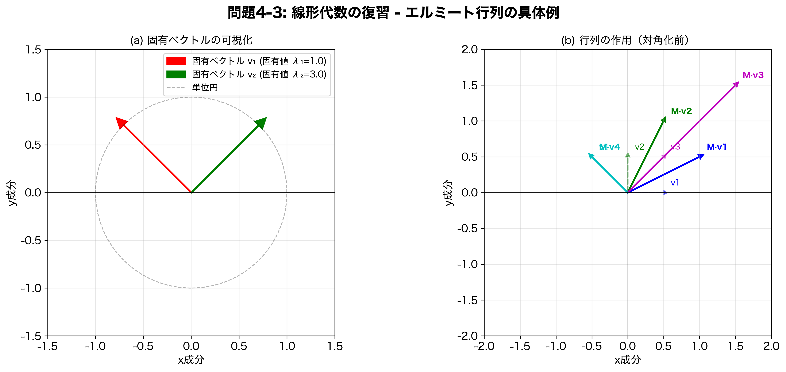

---

## 問題 4-4: レポート問題 演算子の交換関係と不確定性関係

**問題設定：**
この問題は、量子力学における演算子の交換関係と不確定性原理を扱う。位置演算子、運動量演算子、ハミルトニアン演算子の交換関係を計算し、エルミート性と不確定性関係を導出する。

**用語解説：**
- **演算子**: 関数に作用して別の関数を返すもの。量子力学では、物理量は演算子で表される。
- **交換関係**: 2つの演算子の積の順序を変えたときの差。$[A, B] = AB - BA$。
- **不確定性関係**: 2つの物理量を同時に正確に測定できないという関係。

### (i) 位置変数と運動量演算子の交換関係

**問題の意味：**
位置変数 $x$ と運動量演算子 $p = -i\hbar \frac{\partial}{\partial x}$ の間の交換関係を計算する。

**解答：**

交換子は：

$$[x, p] = [x, -i\hbar\frac{\partial}{\partial x}] = x\left(-i\hbar\frac{\partial}{\partial x}\right) - \left(-i\hbar\frac{\partial}{\partial x}\right)x$$

**用語解説：**
- **交換子**: $[A, B] = AB - BA$。演算子の順序を変えたときの差。

**計算：**

任意の関数 $f(x)$ に対して：

$$[x, p]f(x) = x \cdot \left(-i\hbar\frac{\partial f}{\partial x}\right) - \left(-i\hbar\frac{\partial}{\partial x}\right)(xf)$$

$$= -i\hbar x \frac{\partial f}{\partial x} + i\hbar\frac{\partial}{\partial x}(xf)$$

積の微分法則：

$$\frac{\partial}{\partial x}(xf) = f + x\frac{\partial f}{\partial x}$$

したがって：

$$[x, p]f(x) = -i\hbar x \frac{\partial f}{\partial x} + i\hbar\left(f + x\frac{\partial f}{\partial x}\right)$$

$$= -i\hbar x \frac{\partial f}{\partial x} + i\hbar f + i\hbar x \frac{\partial f}{\partial x} = i\hbar f$$

したがって：

$$[x, p] = i\hbar$$

**用語解説：**
- **積の微分法則**: $(fg)' = f'g + fg'$。

**物理的意味：**
位置と運動量は非可換である。これは、位置と運動量を同時に正確に測定できないことを意味し、不確定性原理の基礎となる。

---

### (ii) ハミルトニアン演算子の交換関係

**問題の意味：**
ハミルトニアン演算子 $H$ と位置演算子 $x$、および運動量演算子 $p$ との交換関係を計算する。

**解答：**

ハミルトニアン演算子は：

$$H = H(x, p) = -\frac{\hbar^2}{2m}\frac{\partial^2}{\partial x^2} + V(x)$$

**用語解説：**
- **ハミルトニアン**: 系の全エネルギーを表す演算子。運動エネルギーとポテンシャルエネルギーの和。

**$[x, H]$ の計算：**

$$[x, H] = xH - Hx$$

任意の関数 $f(x)$ に対して：

$$[x, H]f = x\left(-\frac{\hbar^2}{2m}\frac{\partial^2 f}{\partial x^2} + V(x)f\right) - \left(-\frac{\hbar^2}{2m}\frac{\partial^2}{\partial x^2} + V(x)\right)(xf)$$

$$= -\frac{\hbar^2}{2m}x\frac{\partial^2 f}{\partial x^2} + xV(x)f + \frac{\hbar^2}{2m}\frac{\partial^2}{\partial x^2}(xf) - V(x)xf$$

第3項を計算：

$$\frac{\partial^2}{\partial x^2}(xf) = \frac{\partial}{\partial x}\left(f + x\frac{\partial f}{\partial x}\right) = \frac{\partial f}{\partial x} + \frac{\partial f}{\partial x} + x\frac{\partial^2 f}{\partial x^2} = 2\frac{\partial f}{\partial x} + x\frac{\partial^2 f}{\partial x^2}$$

したがって：

$$[x, H]f = -\frac{\hbar^2}{2m}x\frac{\partial^2 f}{\partial x^2} + \frac{\hbar^2}{2m}\left(2\frac{\partial f}{\partial x} + x\frac{\partial^2 f}{\partial x^2}\right)$$

$$= \frac{\hbar^2}{m}\frac{\partial f}{\partial x} = \frac{i\hbar}{m} \cdot (-i\hbar)\frac{\partial f}{\partial x} = \frac{i\hbar}{m}pf$$

したがって：

$$[x, H] = \frac{i\hbar}{m}p$$

**$[p, H]$ の計算：**

$$[p, H] = pH - Hp = \left(-i\hbar\frac{\partial}{\partial x}\right)H - H\left(-i\hbar\frac{\partial}{\partial x}\right)$$

任意の関数 $f(x)$ に対して：

$$[p, H]f = -i\hbar\frac{\partial}{\partial x}\left(-\frac{\hbar^2}{2m}\frac{\partial^2 f}{\partial x^2} + V(x)f\right) + \frac{\hbar^2}{2m}\frac{\partial^2}{\partial x^2}\left(-i\hbar\frac{\partial f}{\partial x}\right) + V(x)\left(-i\hbar\frac{\partial f}{\partial x}\right)$$

$$= i\hbar\frac{\hbar^2}{2m}\frac{\partial^3 f}{\partial x^3} - i\hbar\frac{\partial}{\partial x}(V(x)f) - i\hbar\frac{\hbar^2}{2m}\frac{\partial^3 f}{\partial x^3} + i\hbar V(x)\frac{\partial f}{\partial x}$$

$$= -i\hbar\left(\frac{\partial V}{\partial x}f + V(x)\frac{\partial f}{\partial x}\right) + i\hbar V(x)\frac{\partial f}{\partial x}$$

$$= -i\hbar\frac{\partial V}{\partial x}f$$

したがって：

$$[p, H] = -i\hbar\frac{\partial V}{\partial x}$$

**物理的意味：**
位置とハミルトニアンは非可換である。これは、位置とエネルギーを同時に確定できないことを意味する。運動量とハミルトニアンの交換関係は、ポテンシャルの勾配に関連している。

---

### (iii) エルミート演算子と不確定性関係

**問題の意味：**
エルミート演算子の定義に基づき、運動量演算子とハミルトニアンのエルミート性を示し、非可換なエルミート演算子の交換子から導かれる別の演算子のエルミート性を説明し、さらに不確定性関係を導出する。

**用語解説：**
- **エルミート演算子**: 任意の規格化可能な波動関数 $\Psi_1(x,t)$, $\Psi_2(x,t)$ に対して、以下が成り立つ演算子：

$$\int dx \, \Psi_1^*(x, t) \cdot \mathcal{O}\Psi_2(x, t) = \int dx \, (\mathcal{O}\Psi_1(x, t))^* \cdot \Psi_2(x, t)$$

#### (a) 運動量演算子とハミルトニアンのエルミート性

**運動量演算子のエルミート性：**

部分積分を用いる：

$$\int_{-\infty}^{\infty} dx \, \Psi_1^*(x) \left(-i\hbar\frac{\partial}{\partial x}\right)\Psi_2(x) = -i\hbar\int_{-\infty}^{\infty} dx \, \Psi_1^*\frac{\partial\Psi_2}{\partial x}$$

部分積分：

$$= -i\hbar\left[\Psi_1^*\Psi_2\right]_{-\infty}^{\infty} + i\hbar\int_{-\infty}^{\infty} dx \, \frac{\partial\Psi_1^*}{\partial x}\Psi_2$$

規格化可能な波動関数では、境界で0になるので：

$$= i\hbar\int_{-\infty}^{\infty} dx \, \frac{\partial\Psi_1^*}{\partial x}\Psi_2 = \int_{-\infty}^{\infty} dx \, \left(-i\hbar\frac{\partial\Psi_1}{\partial x}\right)^*\Psi_2$$

したがって、運動量演算子はエルミートである。

**ハミルトニアンのエルミート性：**

$$H = -\frac{\hbar^2}{2m}\frac{\partial^2}{\partial x^2} + V(x)$$

$V(x)$ が実関数であると仮定すると、$V(x)$ は明らかにエルミートである。

運動エネルギー項について、2回の部分積分を行うと、エルミート性が示される（境界条件により境界項は0）。

したがって、ハミルトニアンはエルミートである。

#### (b) 交換子とエルミート性

**問題の意味：**
互いに可換でない2つのエルミート演算子 $A, B$ が次の交換関係を満たすとする：

$$[A, B] = i\hbar C$$

ここで、$C$ は別の演算子である。このとき、$C$ もエルミート演算子となることを説明する。

**解答：**

交換関係：

$$[A, B] = AB - BA = i\hbar C$$

両辺のエルミート共役を取る：

$$[A, B]^\dagger = (AB - BA)^\dagger = (AB)^\dagger - (BA)^\dagger = B^\dagger A^\dagger - A^\dagger B^\dagger$$

$A$ と $B$ はエルミートなので：

$$[A, B]^\dagger = BA - AB = -(AB - BA) = -[A, B]$$

一方：

$$[A, B]^\dagger = (i\hbar C)^\dagger = -i\hbar C^\dagger$$

したがって：

$$-i\hbar C^\dagger = -[A, B] = -i\hbar C$$

$$C^\dagger = C$$

すなわち、$C$ はエルミートである。

**物理的意味：**
位置と運動量の交換関係 $[x, p] = i\hbar$ から、$C = 1$（単位演算子）はエルミートである。これは、不確定性関係の導出に重要である。

#### (c) 不確定性関係の導出

**問題の意味：**
状態 $\Psi$ に対して物理量 $A, B$ の測定を行う際に、観測値の分布の幅を評価するために分散を考える。標準偏差（不確定性）が以下の不確定性関係を満たすことを示す：

$$\Delta A \cdot \Delta B \geq \frac{\hbar}{2}|\langle C \rangle|$$

**解答：**

**標準偏差の定義：**

$$\Delta A = \sqrt{\langle (A - \langle A \rangle)^2 \rangle} = \sqrt{\langle A^2 \rangle - \langle A \rangle^2}$$

$$\Delta B = \sqrt{\langle (B - \langle B \rangle)^2 \rangle} = \sqrt{\langle B^2 \rangle - \langle B \rangle^2}$$

**用語解説：**
- **期待値**: $\langle A \rangle = \int dx \, \Psi^*(x) A \Psi(x)$
- **分散**: $\langle (A - \langle A \rangle)^2 \rangle = \langle A^2 \rangle - \langle A \rangle^2$
- **標準偏差**: 分散の平方根。測定値のばらつきを表す。

**ヒントに従った導出：**

任意の実数 $\lambda$ に対して：

$$I(\lambda) = \int dx \, \left|(A - \langle A \rangle)\Psi(x,t) + i\lambda(B - \langle B \rangle)\Psi(x,t)\right|^2 \geq 0$$

**用語解説：**
- **実数 $\lambda$**: 任意の実数パラメータ。後で最適化する。

**展開：**

$$I(\lambda) = \int dx \, \left[(A - \langle A \rangle)\Psi + i\lambda(B - \langle B \rangle)\Psi\right]^* \left[(A - \langle A \rangle)\Psi + i\lambda(B - \langle B \rangle)\Psi\right]$$

$$= \int dx \, \left[(A - \langle A \rangle)\Psi\right]^* \left[(A - \langle A \rangle)\Psi\right] + i\lambda\int dx \, \left[(A - \langle A \rangle)\Psi\right]^* \left[(B - \langle B \rangle)\Psi\right]$$

$$- i\lambda\int dx \, \left[(B - \langle B \rangle)\Psi\right]^* \left[(A - \langle A \rangle)\Psi\right] + \lambda^2\int dx \, \left[(B - \langle B \rangle)\Psi\right]^* \left[(B - \langle B \rangle)\Psi\right]$$

エルミート性を用いると：

$$I(\lambda) = \langle (A - \langle A \rangle)^2 \rangle + i\lambda\langle [A - \langle A \rangle, B - \langle B \rangle] \rangle + \lambda^2\langle (B - \langle B \rangle)^2 \rangle$$

$$= (\Delta A)^2 + i\lambda\langle [A, B] \rangle + \lambda^2(\Delta B)^2$$

交換関係 $[A, B] = i\hbar C$ を用いると：

$$I(\lambda) = (\Delta A)^2 - \lambda\hbar\langle C \rangle + \lambda^2(\Delta B)^2 \geq 0$$

これは、$\lambda$ に関する2次不等式である。すべての $\lambda$ に対して成り立つため、判別式は0以下である：

$$(\hbar\langle C \rangle)^2 - 4(\Delta A)^2(\Delta B)^2 \leq 0$$

したがって：

$$(\Delta A)^2(\Delta B)^2 \geq \frac{\hbar^2}{4}\langle C \rangle^2$$

$$(\Delta A)(\Delta B) \geq \frac{\hbar}{2}|\langle C \rangle|$$

**位置と運動量の不確定性関係：**

$A = x$、$B = p$、$[x, p] = i\hbar$ より $C = 1$ である。したがって：

$$\Delta x \cdot \Delta p \geq \frac{\hbar}{2}$$

**物理的意味：**
位置と運動量を同時に正確に測定することはできない。一方を正確に測定しようとすると、他方の不確定性が大きくなる。これは、量子力学の基本原理である。

**考察：**
不確定性関係は、測定の限界を表すだけでなく、量子状態の本質的な性質を表している。最小不確定性状態（等号が成り立つ状態）は、ガウス型波動関数で実現される。

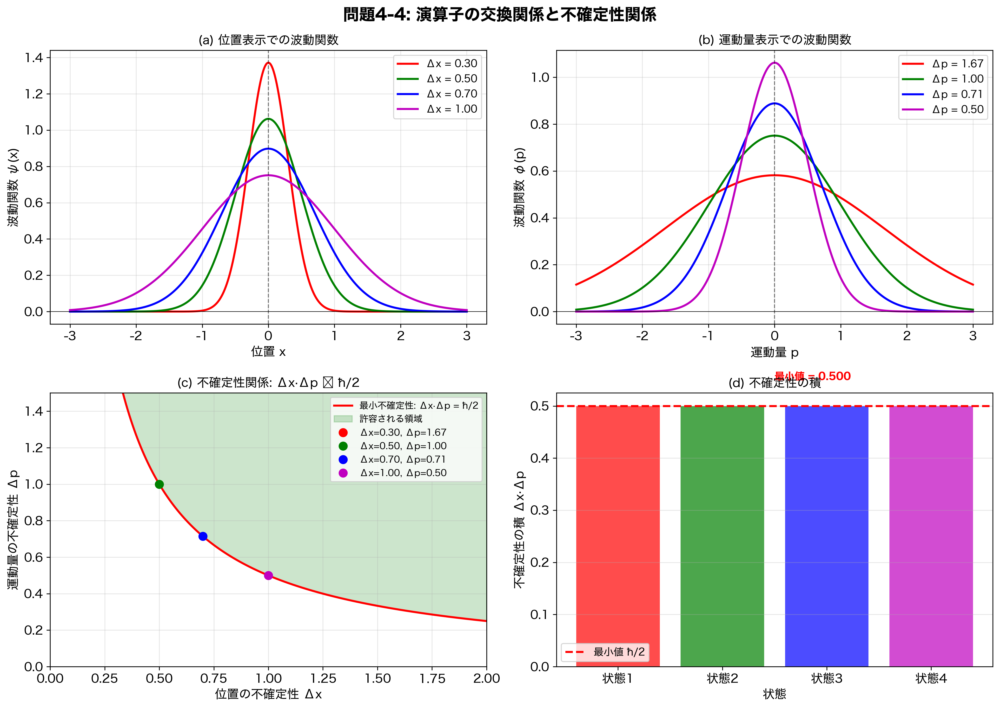

---

## 問題 5-1: トンネル効果

**問題設定：**
質量 $m$ の粒子が、以下のポテンシャル $V(x)$ の下で運動している：

$$V(x) = \begin{cases} 
V_0 & (|x| < a) \\
0 & (|x| > a)
\end{cases}$$

ここで、$V_0 > 0$、$a > 0$ とする。粒子はエネルギー $E$ を持ち（$0 < E < V_0$）、$x = -\infty$ から入射してくる。入射粒子の確率の流れは、$k = \sqrt{2mE}/\hbar$ として $\hbar k/m$ で与えられる。$x = \infty$ から入射してくる粒子はないものとする。

### (i) $|x| > a$ でのシュレーディンガー方程式

**問題の意味：**
ポテンシャル障壁の外側での時間に依存しないシュレーディンガー方程式を書く。この領域では、粒子は自由粒子として振る舞う。

**解答：**

$|x| > a$ の領域では $V(x) = 0$ であるから、時間に依存しないシュレーディンガー方程式は：

$$-\frac{\hbar^2}{2m}\frac{d^2}{dx^2}u(x) = Eu(x)$$

これは次のように書き直せる：

$$\frac{d^2}{dx^2}u(x) + \frac{2mE}{\hbar^2}u(x) = 0$$

$k = \sqrt{\frac{2mE}{\hbar^2}} > 0$ とおくと：

$$\frac{d^2}{dx^2}u(x) + k^2u(x) = 0$$

**記号の説明：**
- **$k$**: 波数（wave number）。$k = \frac{2\pi}{\lambda}$ で、$\lambda$ はド・ブロイ波長。$k = \frac{p}{\hbar}$ とも表され、運動量 $p = \sqrt{2mE}$ と関係している。$k$ が大きいほど、粒子の運動量が大きく、波長が短い。

**用語解説：**
- **自由粒子**: ポテンシャルが0の領域での粒子。波動関数は平面波の形をとる。
- **波数**: 単位長さあたりの波の数。$k = \frac{2\pi}{\lambda}$ で定義される。

**物理的意味：**
障壁の外側では、粒子は自由に運動できる。波動関数は進行波と反射波の重ね合わせで表される。$k$ は粒子の運動量を決定し、波動関数の振動の速さを表す。

---

### (ii) $|x| < a$ でのシュレーディンガー方程式

**問題の意味：**
ポテンシャル障壁の内側での時間に依存しないシュレーディンガー方程式を書く。この領域では、粒子のエネルギーはポテンシャルより小さいため、波動関数は指数関数的に減衰する。

**解答：**

$|x| < a$ の領域では $V(x) = V_0$ であるから、時間に依存しないシュレーディンガー方程式は：

$$-\frac{\hbar^2}{2m}\frac{d^2}{dx^2}u(x) + V_0 u(x) = Eu(x)$$

整理すると：

$$-\frac{\hbar^2}{2m}\frac{d^2}{dx^2}u(x) = (E - V_0)u(x)$$

$E < V_0$ であるから、$E - V_0 < 0$。したがって：

$$\frac{d^2}{dx^2}u(x) - \frac{2m(V_0 - E)}{\hbar^2}u(x) = 0$$

$\kappa = \sqrt{\frac{2m(V_0 - E)}{\hbar^2}} > 0$ とおくと：

$$\frac{d^2}{dx^2}u(x) - \kappa^2u(x) = 0$$

**記号の説明：**
- **$\kappa$**: 減衰定数（attenuation constant）。障壁内での波動関数の減衰の速さを表す。$\kappa$ が大きいほど、波動関数は速く減衰する。$\kappa = \frac{1}{\lambda_{\text{decay}}}$ で、$\lambda_{\text{decay}}$ は減衰長である。

**用語解説：**
- **ポテンシャル障壁**: 粒子のエネルギーより高いポテンシャル領域。古典的には粒子は通過できない。
- **減衰定数**: 指数関数的減衰の速さを表す定数。$\kappa$ が大きいほど、波動関数は速く0に近づく。

**物理的意味：**
障壁の内側では、粒子の運動エネルギーは負になる（古典的には不可能）。量子力学では、波動関数は指数関数的に減衰するが、完全には0にならない。$\kappa$ は、障壁の厚さと高さによって決まり、トンネル効果の確率に影響する。

---

### (iii) $x < -a$ での解

**問題の意味：**
入射波と反射波を含む解を求める。入射粒子の確率の流れが $\hbar k/m$ となるようにする。

**解答：**

**ステップ1: 一般解の導出**

$x < -a$ の領域では、ポテンシャル $V(x) = 0$ であるから、シュレーディンガー方程式は：

$$\frac{d^2}{dx^2}u(x) + k^2u(x) = 0$$

この2階線形微分方程式の一般解は、特性方程式 $\lambda^2 + k^2 = 0$ の解 $\lambda = \pm ik$ から：

$$u(x) = Ae^{ikx} + Be^{-ikx}$$

ここで、$A$ と $B$ は任意の定数である。

**ステップ2: 各項の物理的意味**

- **第1項 $Ae^{ikx}$**: 右向きの進行波（入射波）
  - $e^{ikx}$ は $x$ が増加すると位相が進むため、右向きに進行する波を表す
  - 時間依存性を考慮すると、$\Psi(x,t) = Ae^{i(kx - \omega t)}$ となり、位相速度 $v_p = \omega/k$ で右向きに進行する

- **第2項 $Be^{-ikx}$**: 左向きの進行波（反射波）
  - $e^{-ikx}$ は $x$ が増加すると位相が遅れるため、左向きに進行する波を表す
  - 時間依存性を考慮すると、$\Psi(x,t) = Be^{-i(kx + \omega t)}$ となり、左向きに進行する

**ステップ3: 確率の流れの導出（詳細）**

確率の流れ（確率流密度）は、確率密度の保存則から導かれる。

時間に依存するシュレーディンガー方程式：

$$i\hbar\frac{\partial \Psi}{\partial t} = -\frac{\hbar^2}{2m}\frac{\partial^2 \Psi}{\partial x^2} + V(x)\Psi$$

とその複素共役：

$$-i\hbar\frac{\partial \Psi^*}{\partial t} = -\frac{\hbar^2}{2m}\frac{\partial^2 \Psi^*}{\partial x^2} + V(x)\Psi^*$$

から、確率密度 $\rho(x,t) = |\Psi(x,t)|^2 = \Psi^*\Psi$ の時間変化を計算する：

$$\frac{\partial \rho}{\partial t} = \frac{\partial}{\partial t}(\Psi^*\Psi) = \Psi^*\frac{\partial \Psi}{\partial t} + \frac{\partial \Psi^*}{\partial t}\Psi$$

シュレーディンガー方程式を用いて：

$$\frac{\partial \rho}{\partial t} = \Psi^*\frac{1}{i\hbar}\left(-\frac{\hbar^2}{2m}\frac{\partial^2 \Psi}{\partial x^2} + V\Psi\right) + \frac{1}{-i\hbar}\left(-\frac{\hbar^2}{2m}\frac{\partial^2 \Psi^*}{\partial x^2} + V\Psi^*\right)\Psi$$

$$= \frac{i\hbar}{2m}\left(\Psi^*\frac{\partial^2 \Psi}{\partial x^2} - \frac{\partial^2 \Psi^*}{\partial x^2}\Psi\right)$$

$$= \frac{i\hbar}{2m}\frac{\partial}{\partial x}\left(\Psi^*\frac{\partial \Psi}{\partial x} - \frac{\partial \Psi^*}{\partial x}\Psi\right)$$

したがって、確率密度の保存則（連続の方程式）：

$$\frac{\partial \rho}{\partial t} + \frac{\partial j}{\partial x} = 0$$

から、確率の流れ $j$ は：

$$j = -\frac{i\hbar}{2m}\left(\Psi^*\frac{\partial \Psi}{\partial x} - \frac{\partial \Psi^*}{\partial x}\Psi\right) = \frac{\hbar}{2mi}\left(\Psi^*\frac{\partial \Psi}{\partial x} - \frac{\partial \Psi^*}{\partial x}\Psi\right)$$

時間に依存しない場合、$\Psi(x,t) = u(x)e^{-iEt/\hbar}$ であるから：

$$j = \frac{\hbar}{2mi}\left(u^*\frac{du}{dx} - \frac{du^*}{dx}u\right)$$

**ステップ4: 入射波の確率の流れの計算**

入射波 $u_{\text{inc}}(x) = Ae^{ikx}$ について、確率の流れを計算する。

$$\frac{du_{\text{inc}}}{dx} = ikAe^{ikx}$$

$$\frac{du_{\text{inc}}^*}{dx} = \frac{d}{dx}(A^*e^{-ikx}) = -ikA^*e^{-ikx}$$

したがって：

$$j_{\text{inc}} = \frac{\hbar}{2mi}\left(A^*e^{-ikx} \cdot ikAe^{ikx} - (-ikA^*e^{-ikx}) \cdot Ae^{ikx}\right)$$

$$= \frac{\hbar}{2mi}\left(ik|A|^2e^{-ikx}e^{ikx} + ik|A|^2e^{-ikx}e^{ikx}\right)$$

$$= \frac{\hbar}{2mi}\left(ik|A|^2 + ik|A|^2\right) = \frac{\hbar}{2mi} \cdot 2ik|A|^2 = \frac{\hbar k}{m}|A|^2$$

**ステップ5: 正規化条件の適用**

問題設定より、入射波の確率の流れは $\frac{\hbar k}{m}$ であるから：

$$j_{\text{inc}} = \frac{\hbar k}{m}|A|^2 = \frac{\hbar k}{m}$$

したがって、$|A|^2 = 1$ である。

位相を適切に選ぶことで、$A = 1$ とできる（一般性を失わない）。

**最終結果：**

$$u(x) = e^{ikx} + Be^{-ikx} \quad (x < -a)$$

ここで、$B$ は反射波の振幅であり、境界条件から決定される。

**用語解説：**
- **確率の流れ（確率流密度）**: 粒子の存在確率の流れを表す量。$j = \frac{\hbar}{2mi}\left(\Psi^*\frac{\partial \Psi}{\partial x} - \frac{\partial \Psi^*}{\partial x}\Psi\right)$ で定義される。単位は [長さ]$^{-1}$[時間]$^{-1}$。
- **連続の方程式**: 確率密度の保存則。$\frac{\partial \rho}{\partial t} + \frac{\partial j}{\partial x} = 0$ で表される。

**物理的意味：**
入射波は右向きに進行し、障壁で反射されて左向きの反射波が生じる。$B$ は反射波の振幅である。確率の流れは、単位時間あたりに単位面積を通過する確率を表し、粒子の流れの強さを特徴づける。

---

### (iv) $x > a$ での解

**問題の意味：**
透過波のみを含む解を求める。$x = \infty$ から入射してくる粒子はない。

**解答：**

**ステップ1: 一般解の導出**

$x > a$ の領域では、ポテンシャル $V(x) = 0$ であるから、シュレーディンガー方程式は：

$$\frac{d^2}{dx^2}u(x) + k^2u(x) = 0$$

これは(iii)と同じ微分方程式であるから、一般解は：

$$u(x) = Ce^{ikx} + De^{-ikx}$$

ここで、$C$ と $D$ は任意の定数である。

**ステップ2: 境界条件の適用**

問題設定より、「$x = \infty$ から入射してくる粒子はない」とされている。

- **$Ce^{ikx}$**: 右向きの進行波（透過波）
  - $x$ が大きくなる方向（右向き）に進行する
  - 障壁を通過した粒子を表す

- **$De^{-ikx}$**: 左向きの進行波
  - $x$ が小さくなる方向（左向き）に進行する
  - $x = \infty$ から入射してくる波を表す

**ステップ3: 物理的考察**

$x = \infty$ から入射してくる粒子がないという条件は、以下の物理的状況を表す：

1. **散乱問題の設定**: 粒子は $x = -\infty$ から入射し、障壁で散乱される
2. **透過波のみ**: 障壁を通過した後は、右向きに進行する透過波のみが存在する
3. **反射波の不在**: $x > a$ の領域では、左向きの波（$x = \infty$ からの入射波）は存在しない

**ステップ4: 数学的表現**

左向きの波 $De^{-ikx}$ が存在しないため、$D = 0$ としなければならない。

**最終結果：**

$$u(x) = Ce^{ikx} \quad (x > a)$$

ここで、$C$ は透過波の振幅であり、境界条件から決定される。

**補足：透過波の確率の流れ**

透過波の確率の流れは：

$$j_{\text{trans}} = \frac{\hbar k}{m}|C|^2$$

透過率は $T = |C|^2$ で与えられる（入射波の振幅を $A = 1$ としたため）。

**用語解説：**
- **透過波**: 障壁を通過した後の波。右向きに進行する。

**物理的意味：**
障壁を通過した粒子は、右向きに進行する透過波として表される。これがトンネル効果の結果である。

---

### (v) $-a < x < a$ での解

**問題の意味：**
障壁の内側での解を求める。$\kappa = \sqrt{2m(V_0-E)}/\hbar$ を用いて表す。

**解答：**

**ステップ1: シュレーディンガー方程式の導出**

$-a < x < a$ の領域では、ポテンシャル $V(x) = V_0$ であるから、時間に依存しないシュレーディンガー方程式は：

$$-\frac{\hbar^2}{2m}\frac{d^2}{dx^2}u(x) + V_0 u(x) = Eu(x)$$

整理すると：

$$-\frac{\hbar^2}{2m}\frac{d^2}{dx^2}u(x) = (E - V_0)u(x)$$

$E < V_0$ であるから、$E - V_0 < 0$。したがって：

$$\frac{d^2}{dx^2}u(x) = \frac{2m(E - V_0)}{\hbar^2}u(x) = -\frac{2m(V_0 - E)}{\hbar^2}u(x)$$

**ステップ2: 減衰定数 $\kappa$ の導入**

$\kappa = \sqrt{\frac{2m(V_0 - E)}{\hbar^2}} > 0$ とおく。

$\kappa$ は**減衰定数**（attenuation constant）と呼ばれ、以下の性質を持つ：

- $\kappa > 0$: $V_0 > E$ であるため
- 単位: [長さ]$^{-1}$
- 物理的意味: 波動関数の減衰の速さを表す

シュレーディンガー方程式は：

$$\frac{d^2}{dx^2}u(x) - \kappa^2 u(x) = 0$$

**ステップ3: 微分方程式の解法**

この2階線形微分方程式を解く。

特性方程式は $\lambda^2 - \kappa^2 = 0$ であるから、$\lambda = \pm \kappa$。

したがって、一般解は：

$$u(x) = Fe^{\kappa x} + Ge^{-\kappa x}$$

ここで、$F$ と $G$ は任意の定数である。

**ステップ4: 各項の物理的意味**

- **$Fe^{\kappa x}$**: $x$ が増加すると指数関数的に増加する項
  - $x = -a$ から $x = a$ に向かうと増加する
  - 左側から右側への寄与

- **$Ge^{-\kappa x}$**: $x$ が増加すると指数関数的に減衰する項
  - $x = -a$ から $x = a$ に向かうと減衰する
  - 右側から左側への寄与

**ステップ5: 波動関数の性質**

$E < V_0$ であるため、この領域では：

1. **古典的には不可能**: 粒子の運動エネルギー $E - V_0 < 0$ であるため、古典力学では粒子はこの領域に入れない
2. **量子力学的には可能**: 波動関数は指数関数的に減衰するが、完全には0にならない
3. **トンネル効果**: 波動関数が0でないため、粒子が障壁を通過する確率が存在する

**ステップ6: 減衰の速さ**

減衰定数 $\kappa$ が大きいほど、波動関数は速く減衰する：

- $\kappa$ が大きい → 障壁が高い（$V_0$ が大きい）または粒子のエネルギーが小さい（$E$ が小さい）
- $\kappa$ が小さい → 障壁が低い（$V_0$ が小さい）または粒子のエネルギーが大きい（$E$ が大きい）

減衰長（減衰が $1/e$ になる距離）は $\lambda_{\text{decay}} = 1/\kappa$ で与えられる。

**最終結果：**

$$u(x) = Fe^{\kappa x} + Ge^{-\kappa x} \quad (-a < x < a)$$

ここで、$F$ と $G$ は境界条件から決定される。

**用語解説：**
- **減衰定数**: 波動関数の減衰の速さを表す。$\kappa$ が大きいほど、波動関数は速く減衰する。

**物理的意味：**
障壁の内側では、波動関数は指数関数的に減衰する。しかし、完全には0にならないため、障壁を通過する確率が存在する。

---

### (vi) $x = -a$ での連続条件

**問題の意味：**
波動関数とその導関数が $x = -a$ で連続であるという条件を課す。

**解答：**

**ステップ1: 連続条件の必要性**

ポテンシャルが有限な点（$V(x)$ が不連続でない点）では、波動関数とその1階導関数は連続でなければならない。

これは以下の理由から：

1. **確率の流れの保存**: 確率の流れが保存されるため
2. **物理的妥当性**: 不連続な波動関数は物理的に許されない
3. **シュレーディンガー方程式の性質**: 有限なポテンシャルでは、波動関数は滑らかでなければならない

**ステップ2: 各領域での解の確認**

$x = -a$ は、領域 $x < -a$ と領域 $-a < x < a$ の境界である。

- **$x < -a$ での解**: $u(x) = e^{ikx} + Be^{-ikx}$
- **$-a < x < a$ での解**: $u(x) = Fe^{\kappa x} + Ge^{-\kappa x}$

**ステップ3: 波動関数の連続性**

波動関数は $x = -a$ で連続でなければならない：

$$u(-a^-) = u(-a^+)$$

ここで、$u(-a^-)$ は $x = -a$ に左側から近づいたときの値、$u(-a^+)$ は右側から近づいたときの値である。

左側（$x < -a$）での値：

$$u(-a^-) = e^{ik(-a)} + Be^{-ik(-a)} = e^{-ika} + Be^{ika}$$

右側（$-a < x < a$）での値：

$$u(-a^+) = Fe^{\kappa(-a)} + Ge^{-\kappa(-a)} = Fe^{-\kappa a} + Ge^{\kappa a}$$

したがって、連続条件は：

$$e^{-ika} + Be^{ika} = Fe^{-\kappa a} + Ge^{\kappa a} \quad (1)$$

**ステップ4: 導関数の連続性**

波動関数の1階導関数も $x = -a$ で連続でなければならない：

$$\left.\frac{du}{dx}\right|_{x=-a^-} = \left.\frac{du}{dx}\right|_{x=-a^+}$$

左側での導関数：

$$\frac{d}{dx}\left(e^{ikx} + Be^{-ikx}\right) = ik(e^{ikx} - Be^{-ikx})$$

したがって：

$$\left.\frac{du}{dx}\right|_{x=-a^-} = ik(e^{ik(-a)} - Be^{-ik(-a)}) = ik(e^{-ika} - Be^{ika})$$

右側での導関数：

$$\frac{d}{dx}\left(Fe^{\kappa x} + Ge^{-\kappa x}\right) = \kappa(Fe^{\kappa x} - Ge^{-\kappa x})$$

したがって：

$$\left.\frac{du}{dx}\right|_{x=-a^+} = \kappa(Fe^{\kappa(-a)} - Ge^{-\kappa(-a)}) = \kappa(Fe^{-\kappa a} - Ge^{\kappa a})$$

したがって、導関数の連続条件は：

$$ik(e^{-ika} - Be^{ika}) = \kappa(Fe^{-\kappa a} - Ge^{\kappa a}) \quad (2)$$

**ステップ5: 連続条件の物理的意味**

連続条件(1)と(2)は、以下の物理的意味を持つ：

1. **確率密度の連続性**: 波動関数の連続性により、確率密度 $|u(x)|^2$ が連続である
2. **確率の流れの保存**: 導関数の連続性により、確率の流れ $j = \frac{\hbar}{2mi}\left(u^*\frac{du}{dx} - \frac{du^*}{dx}u\right)$ が保存される
3. **粒子の保存**: 確率の流れの保存は、粒子が消滅・生成されないことを意味する

**ステップ6: 連続条件の重要性**

これらの連続条件は、4つの未知数 $B$、$C$、$F$、$G$ を決定するための重要な条件である。

- (1)と(2)は $x = -a$ での条件
- 同様に、$x = a$ でも連続条件が課される（次節(vii)）
- 合計4つの連続条件により、4つの未知数が一意に決定される

**最終結果：**

波動関数の連続性：

$$e^{-ika} + Be^{ika} = Fe^{-\kappa a} + Ge^{\kappa a} \quad (1)$$

導関数の連続性：

$$ik(e^{-ika} - Be^{ika}) = \kappa(Fe^{-\kappa a} - Ge^{\kappa a}) \quad (2)$$

**用語解説：**
- **連続条件**: 波動関数とその導関数は、ポテンシャルが有限な点で連続でなければならない。

**物理的意味：**
連続条件は、確率の流れの保存を保証する。不連続な波動関数は物理的に許されない。

---

### (vii) $x = a$ での連続条件

**問題の意味：**
波動関数とその導関数が $x = a$ で連続であるという条件を課す。

**解答：**

波動関数の連続性：

$$u(a^-) = u(a^+)$$

$$Fe^{\kappa a} + Ge^{-\kappa a} = Ce^{ika}$$

導関数の連続性：

$$\left.\frac{du}{dx}\right|_{x=a^-} = \left.\frac{du}{dx}\right|_{x=a^+}$$

$$\kappa(Fe^{\kappa a} - Ge^{-\kappa a}) = ikCe^{ika}$$

**用語解説：**
- **境界条件**: 異なる領域の境界での連続性条件。解を一意に決定する。

**物理的意味：**
境界での連続条件により、入射波、反射波、透過波の振幅の関係が決定される。

---

### (viii) 反射波と透過波の確率の流れ

**問題の意味：**
連続条件から、反射波と透過波の確率の流れを求める。

**解答：**

4つの連続条件から、$B$、$C$、$F$、$G$ を決定する。

波動関数の連続性（$x = -a$）：

$$e^{-ika} + Be^{ika} = Fe^{-\kappa a} + Ge^{\kappa a} \quad (1)$$

導関数の連続性（$x = -a$）：

$$ik(e^{-ika} - Be^{ika}) = \kappa(Fe^{-\kappa a} - Ge^{\kappa a}) \quad (2)$$

波動関数の連続性（$x = a$）：

$$Fe^{\kappa a} + Ge^{-\kappa a} = Ce^{ika} \quad (3)$$

導関数の連続性（$x = a$）：

$$\kappa(Fe^{\kappa a} - Ge^{-\kappa a}) = ikCe^{ika} \quad (4)$$

(3)と(4)から $F$ と $G$ を $C$ で表す：

(3) + (4)/$\kappa$：

$$2Fe^{\kappa a} = Ce^{ika} + \frac{ik}{\kappa}Ce^{ika} = Ce^{ika}\left(1 + \frac{ik}{\kappa}\right)$$

(3) - (4)/$\kappa$：

$$2Ge^{-\kappa a} = Ce^{ika} - \frac{ik}{\kappa}Ce^{ika} = Ce^{ika}\left(1 - \frac{ik}{\kappa}\right)$$

したがって：

$$F = \frac{C}{2}e^{ika - \kappa a}\left(1 + \frac{ik}{\kappa}\right)$$

$$G = \frac{C}{2}e^{ika + \kappa a}\left(1 - \frac{ik}{\kappa}\right)$$

これらを(1)と(2)に代入して $B$ と $C$ を求める。

**ステップ1: $F$ と $G$ を(1)と(2)に代入**

まず、$F$ と $G$ の式を整理する：

$$F = \frac{C}{2}e^{ika - \kappa a}\left(1 + \frac{ik}{\kappa}\right) = \frac{C}{2}e^{ika}e^{-\kappa a}\left(1 + \frac{ik}{\kappa}\right)$$

$$G = \frac{C}{2}e^{ika + \kappa a}\left(1 - \frac{ik}{\kappa}\right) = \frac{C}{2}e^{ika}e^{\kappa a}\left(1 - \frac{ik}{\kappa}\right)$$

これらを(1)に代入：

$$e^{-ika} + Be^{ika} = \frac{C}{2}e^{ika}e^{-\kappa a}\left(1 + \frac{ik}{\kappa}\right) \cdot e^{-\kappa a} + \frac{C}{2}e^{ika}e^{\kappa a}\left(1 - \frac{ik}{\kappa}\right) \cdot e^{\kappa a}$$

$$= \frac{C}{2}e^{ika}\left[e^{-2\kappa a}\left(1 + \frac{ik}{\kappa}\right) + e^{2\kappa a}\left(1 - \frac{ik}{\kappa}\right)\right]$$

両辺に $e^{ika}$ をかけて整理：

$$e^{-2ika} + B = \frac{C}{2}\left[e^{-2\kappa a}\left(1 + \frac{ik}{\kappa}\right) + e^{2\kappa a}\left(1 - \frac{ik}{\kappa}\right)\right] \quad (1')$$

次に、(2)に代入：

$$ik(e^{-ika} - Be^{ika}) = \kappa\left[\frac{C}{2}e^{ika}e^{-\kappa a}\left(1 + \frac{ik}{\kappa}\right) \cdot e^{-\kappa a} - \frac{C}{2}e^{ika}e^{\kappa a}\left(1 - \frac{ik}{\kappa}\right) \cdot e^{\kappa a}\right]$$

$$= \kappa \cdot \frac{C}{2}e^{ika}\left[e^{-2\kappa a}\left(1 + \frac{ik}{\kappa}\right) - e^{2\kappa a}\left(1 - \frac{ik}{\kappa}\right)\right]$$

両辺を $ik$ で割り、$e^{ika}$ をかけて整理：

$$e^{-2ika} - B = \frac{\kappa}{ik} \cdot \frac{C}{2}\left[e^{-2\kappa a}\left(1 + \frac{ik}{\kappa}\right) - e^{2\kappa a}\left(1 - \frac{ik}{\kappa}\right)\right]$$

$$= \frac{C}{2i}\left[e^{-2\kappa a}\left(\frac{\kappa}{k} + i\right) - e^{2\kappa a}\left(\frac{\kappa}{k} - i\right)\right] \quad (2')$$

**ステップ2: 双曲線関数を用いた整理**

(1')と(2')の右辺を双曲線関数で整理する。$e^{\pm 2\kappa a} = \cosh(2\kappa a) \pm \sinh(2\kappa a)$ を用いる。

(1')の右辺：

$$e^{-2\kappa a}\left(1 + \frac{ik}{\kappa}\right) + e^{2\kappa a}\left(1 - \frac{ik}{\kappa}\right)$$

$$= (\cosh(2\kappa a) - \sinh(2\kappa a))\left(1 + \frac{ik}{\kappa}\right) + (\cosh(2\kappa a) + \sinh(2\kappa a))\left(1 - \frac{ik}{\kappa}\right)$$

$$= 2\cosh(2\kappa a) - 2i\frac{k}{\kappa}\sinh(2\kappa a)$$

(2')の右辺：

$$e^{-2\kappa a}\left(\frac{\kappa}{k} + i\right) - e^{2\kappa a}\left(\frac{\kappa}{k} - i\right)$$

$$= (\cosh(2\kappa a) - \sinh(2\kappa a))\left(\frac{\kappa}{k} + i\right) - (\cosh(2\kappa a) + \sinh(2\kappa a))\left(\frac{\kappa}{k} - i\right)$$

$$= 2i\cosh(2\kappa a) - 2\frac{\kappa}{k}\sinh(2\kappa a)$$

したがって、(1')と(2')は：

$$e^{-2ika} + B = C\left[\cosh(2\kappa a) - i\frac{k}{\kappa}\sinh(2\kappa a)\right] \quad (1'')$$

$$e^{-2ika} - B = C\left[\cosh(2\kappa a) - i\frac{\kappa}{k}\sinh(2\kappa a)\right] \quad (2'')$$

**ステップ3: $B$ と $C$ の関係式**

(1'')と(2'')を加減することで、$B$ と $C$ の関係が得られる。

(1'') + (2'')：

$$2e^{-2ika} = C\left[2\cosh(2\kappa a) - i\left(\frac{k}{\kappa} + \frac{\kappa}{k}\right)\sinh(2\kappa a)\right]$$

$$\frac{k}{\kappa} + \frac{\kappa}{k} = \frac{k^2 + \kappa^2}{k\kappa}$$

したがって：

$$C = \frac{2e^{-2ika}}{2\cosh(2\kappa a) - i\frac{k^2 + \kappa^2}{k\kappa}\sinh(2\kappa a)}$$

(1'') - (2'')：

$$2B = C\left[-i\left(\frac{k}{\kappa} - \frac{\kappa}{k}\right)\sinh(2\kappa a)\right] = -iC\frac{k^2 - \kappa^2}{k\kappa}\sinh(2\kappa a)$$

したがって：

$$B = -\frac{iC}{2}\frac{k^2 - \kappa^2}{k\kappa}\sinh(2\kappa a)$$

**ステップ4: 確率の流れの一般形**

反射波の確率の流れ：

$$j_{\text{ref}} = \frac{\hbar k}{m}|B|^2$$

透過波の確率の流れ：

$$j_{\text{trans}} = \frac{\hbar k}{m}|C|^2$$

詳細な計算により、$|C|^2$ と $|B|^2$ が求められる（次節(ix)で詳述）。

確率の流れの保存則により：

$$j_{\text{inc}} = j_{\text{ref}} + j_{\text{trans}}$$

$A = 1$ としたため、$j_{\text{inc}} = \frac{\hbar k}{m}$ である。したがって：

$$1 = |B|^2 + |C|^2$$

これは、反射率 $R = |B|^2$ と透過率 $T = |C|^2$ の関係 $R + T = 1$ を意味する。

**用語解説：**
- **反射率**: 反射する確率。$R = |B|^2$ で定義される。
- **透過率**: 透過する確率。$T = |C|^2$ で定義される。

**物理的意味：**
確率の流れの保存により、$j_{\text{inc}} = j_{\text{ref}} + j_{\text{trans}}$ が成り立つ。これは、$|A|^2 = |B|^2 + |C|^2$ を意味する。

---

### (ix) 反射率と透過率

**問題の意味：**
反射率と透過率を求め、透過率が0でないこと（トンネル効果）を確認する。

**解答：**

**ステップ1: 連続条件の再整理**

4つの連続条件を再確認する：

$$e^{-ika} + Be^{ika} = Fe^{-\kappa a} + Ge^{\kappa a} \quad (1)$$

$$ik(e^{-ika} - Be^{ika}) = \kappa(Fe^{-\kappa a} - Ge^{\kappa a}) \quad (2)$$

$$Fe^{\kappa a} + Ge^{-\kappa a} = Ce^{ika} \quad (3)$$

$$\kappa(Fe^{\kappa a} - Ge^{-\kappa a}) = ikCe^{ika} \quad (4)$$

**ステップ2: $F$ と $G$ を $C$ で表す（再計算）**

(3)と(4)から $F$ と $G$ を求める。

(3) + (4)/$\kappa$：

$$Fe^{\kappa a} + Ge^{-\kappa a} + Fe^{\kappa a} - Ge^{-\kappa a} = Ce^{ika} + \frac{ik}{\kappa}Ce^{ika}$$

$$2Fe^{\kappa a} = Ce^{ika}\left(1 + \frac{ik}{\kappa}\right)$$

したがって：

$$F = \frac{C}{2}e^{ika - \kappa a}\left(1 + \frac{ik}{\kappa}\right) \quad (5)$$

(3) - (4)/$\kappa$：

$$Fe^{\kappa a} + Ge^{-\kappa a} - Fe^{\kappa a} + Ge^{-\kappa a} = Ce^{ika} - \frac{ik}{\kappa}Ce^{ika}$$

$$2Ge^{-\kappa a} = Ce^{ika}\left(1 - \frac{ik}{\kappa}\right)$$

したがって：

$$G = \frac{C}{2}e^{ika + \kappa a}\left(1 - \frac{ik}{\kappa}\right) \quad (6)$$

**ステップ3: $B$ と $C$ の関係式を導出**

(5)と(6)を(1)に代入：

$$e^{-ika} + Be^{ika} = \frac{C}{2}e^{ika - \kappa a}\left(1 + \frac{ik}{\kappa}\right)e^{-\kappa a} + \frac{C}{2}e^{ika + \kappa a}\left(1 - \frac{ik}{\kappa}\right)e^{\kappa a}$$

$$= \frac{C}{2}e^{ika}\left[e^{-2\kappa a}\left(1 + \frac{ik}{\kappa}\right) + e^{2\kappa a}\left(1 - \frac{ik}{\kappa}\right)\right]$$

両辺に $e^{-ika}$ をかける：

$$e^{-2ika} + B = \frac{C}{2}\left[e^{-2\kappa a}\left(1 + \frac{ik}{\kappa}\right) + e^{2\kappa a}\left(1 - \frac{ik}{\kappa}\right)\right] \quad (7)$$

(5)と(6)を(2)に代入：

$$ik(e^{-ika} - Be^{ika}) = \kappa\left[\frac{C}{2}e^{ika - \kappa a}\left(1 + \frac{ik}{\kappa}\right)e^{-\kappa a} - \frac{C}{2}e^{ika + \kappa a}\left(1 - \frac{ik}{\kappa}\right)e^{\kappa a}\right]$$

$$= \kappa \cdot \frac{C}{2}e^{ika}\left[e^{-2\kappa a}\left(1 + \frac{ik}{\kappa}\right) - e^{2\kappa a}\left(1 - \frac{ik}{\kappa}\right)\right]$$

両辺を $ik$ で割り、$e^{-ika}$ をかける：

$$e^{-2ika} - B = \frac{\kappa}{ik} \cdot \frac{C}{2}\left[e^{-2\kappa a}\left(1 + \frac{ik}{\kappa}\right) - e^{2\kappa a}\left(1 - \frac{ik}{\kappa}\right)\right]$$

$$= \frac{C}{2i}\left[e^{-2\kappa a}\left(\frac{\kappa}{k} + i\right) - e^{2\kappa a}\left(\frac{\kappa}{k} - i\right)\right] \quad (8)$$

**ステップ4: 双曲線関数を用いた整理**

$e^{\pm 2\kappa a} = \cosh(2\kappa a) \pm \sinh(2\kappa a)$ を用いて整理する。

(7)の右辺：

$$e^{-2\kappa a}\left(1 + \frac{ik}{\kappa}\right) + e^{2\kappa a}\left(1 - \frac{ik}{\kappa}\right)$$

$$= (\cosh(2\kappa a) - \sinh(2\kappa a))\left(1 + \frac{ik}{\kappa}\right) + (\cosh(2\kappa a) + \sinh(2\kappa a))\left(1 - \frac{ik}{\kappa}\right)$$

$$= \cosh(2\kappa a)\left(1 + \frac{ik}{\kappa} + 1 - \frac{ik}{\kappa}\right) + \sinh(2\kappa a)\left(-1 - \frac{ik}{\kappa} + 1 - \frac{ik}{\kappa}\right)$$

$$= 2\cosh(2\kappa a) - 2i\frac{k}{\kappa}\sinh(2\kappa a)$$

(8)の右辺：

$$e^{-2\kappa a}\left(\frac{\kappa}{k} + i\right) - e^{2\kappa a}\left(\frac{\kappa}{k} - i\right)$$

$$= (\cosh(2\kappa a) - \sinh(2\kappa a))\left(\frac{\kappa}{k} + i\right) - (\cosh(2\kappa a) + \sinh(2\kappa a))\left(\frac{\kappa}{k} - i\right)$$

$$= \cosh(2\kappa a)\left(\frac{\kappa}{k} + i - \frac{\kappa}{k} + i\right) + \sinh(2\kappa a)\left(-\frac{\kappa}{k} - i - \frac{\kappa}{k} + i\right)$$

$$= 2i\cosh(2\kappa a) - 2\frac{\kappa}{k}\sinh(2\kappa a)$$

したがって、(7)と(8)は：

$$e^{-2ika} + B = \frac{C}{2}\left[2\cosh(2\kappa a) - 2i\frac{k}{\kappa}\sinh(2\kappa a)\right] = C\left[\cosh(2\kappa a) - i\frac{k}{\kappa}\sinh(2\kappa a)\right] \quad (7')$$

$$e^{-2ika} - B = \frac{C}{2i}\left[2i\cosh(2\kappa a) - 2\frac{\kappa}{k}\sinh(2\kappa a)\right] = C\left[\cosh(2\kappa a) - i\frac{\kappa}{k}\sinh(2\kappa a)\right] \quad (8')$$

**ステップ5: $C$ を求める**

(7')と(8')を加える：

$$2e^{-2ika} = C\left[2\cosh(2\kappa a) - i\left(\frac{k}{\kappa} + \frac{\kappa}{k}\right)\sinh(2\kappa a)\right]$$

$$\frac{k}{\kappa} + \frac{\kappa}{k} = \frac{k^2 + \kappa^2}{k\kappa}$$

したがって：

$$2e^{-2ika} = C\left[2\cosh(2\kappa a) - i\frac{k^2 + \kappa^2}{k\kappa}\sinh(2\kappa a)\right]$$

$$C = \frac{2e^{-2ika}}{2\cosh(2\kappa a) - i\frac{k^2 + \kappa^2}{k\kappa}\sinh(2\kappa a)}$$

分母を実数化するため、共役複素数をかける：

$$C = \frac{2e^{-2ika}\left[2\cosh(2\kappa a) + i\frac{k^2 + \kappa^2}{k\kappa}\sinh(2\kappa a)\right]}{4\cosh^2(2\kappa a) + \frac{(k^2 + \kappa^2)^2}{k^2\kappa^2}\sinh^2(2\kappa a)}$$

**ステップ6: 透過率の計算**

透過率は $T = |C|^2$ である（$A = 1$ としたため）。

$C$ の式から $|C|^2$ を計算する：

$$C = \frac{2e^{-2ika}\left[2\cosh(2\kappa a) + i\frac{k^2 + \kappa^2}{k\kappa}\sinh(2\kappa a)\right]}{4\cosh^2(2\kappa a) + \frac{(k^2 + \kappa^2)^2}{k^2\kappa^2}\sinh^2(2\kappa a)}$$

複素数の絶対値の2乗は、分子と分母の絶対値の2乗の比である：

$$|C|^2 = \frac{|2e^{-2ika}|^2 \cdot \left|2\cosh(2\kappa a) + i\frac{k^2 + \kappa^2}{k\kappa}\sinh(2\kappa a)\right|^2}{\left|4\cosh^2(2\kappa a) + \frac{(k^2 + \kappa^2)^2}{k^2\kappa^2}\sinh^2(2\kappa a)\right|^2}$$

$|2e^{-2ika}|^2 = 4$ である。

分子の絶対値の2乗：

$$\left|2\cosh(2\kappa a) + i\frac{k^2 + \kappa^2}{k\kappa}\sinh(2\kappa a)\right|^2 = \left(2\cosh(2\kappa a)\right)^2 + \left(\frac{k^2 + \kappa^2}{k\kappa}\sinh(2\kappa a)\right)^2$$

$$= 4\cosh^2(2\kappa a) + \frac{(k^2 + \kappa^2)^2}{k^2\kappa^2}\sinh^2(2\kappa a)$$

分母は実数であるから、そのまま2乗する：

$$\left[4\cosh^2(2\kappa a) + \frac{(k^2 + \kappa^2)^2}{k^2\kappa^2}\sinh^2(2\kappa a)\right]^2$$

したがって：

$$|C|^2 = \frac{4\left[4\cosh^2(2\kappa a) + \frac{(k^2 + \kappa^2)^2}{k^2\kappa^2}\sinh^2(2\kappa a)\right]}{\left[4\cosh^2(2\kappa a) + \frac{(k^2 + \kappa^2)^2}{k^2\kappa^2}\sinh^2(2\kappa a)\right]^2}$$

$$= \frac{4}{4\cosh^2(2\kappa a) + \frac{(k^2 + \kappa^2)^2}{k^2\kappa^2}\sinh^2(2\kappa a)}$$

$\cosh^2(2\kappa a) = 1 + \sinh^2(2\kappa a)$ を用いて：

$$|C|^2 = \frac{4}{4(1 + \sinh^2(2\kappa a)) + \frac{(k^2 + \kappa^2)^2}{k^2\kappa^2}\sinh^2(2\kappa a)}$$

$$= \frac{4}{4 + 4\sinh^2(2\kappa a) + \frac{(k^2 + \kappa^2)^2}{k^2\kappa^2}\sinh^2(2\kappa a)}$$

$$= \frac{4}{4 + \left[4 + \frac{(k^2 + \kappa^2)^2}{k^2\kappa^2}\right]\sinh^2(2\kappa a)}$$

$$= \frac{4}{4 + \frac{4k^2\kappa^2 + (k^2 + \kappa^2)^2}{k^2\kappa^2}\sinh^2(2\kappa a)}$$

$$4k^2\kappa^2 + (k^2 + \kappa^2)^2 = 4k^2\kappa^2 + k^4 + 2k^2\kappa^2 + \kappa^4 = k^4 + 6k^2\kappa^2 + \kappa^4 = (k^2 + \kappa^2)^2 + 4k^2\kappa^2$$

より簡潔に：

$$|C|^2 = \frac{4k^2\kappa^2}{4k^2\kappa^2 + (k^2 + \kappa^2)^2\sinh^2(2\kappa a)}$$

$$= \frac{1}{1 + \frac{(k^2 + \kappa^2)^2}{4k^2\kappa^2}\sinh^2(2\kappa a)}$$

したがって、透過率は：

$$T = |C|^2 = \frac{1}{1 + \frac{(k^2 + \kappa^2)^2}{4k^2\kappa^2}\sinh^2(2\kappa a)}$$

**ステップ7: 反射率の計算**

確率の流れの保存により、$j_{\text{inc}} = j_{\text{ref}} + j_{\text{trans}}$ が成り立つ。

$A = 1$ としたため、$j_{\text{inc}} = \frac{\hbar k}{m}$、$j_{\text{ref}} = \frac{\hbar k}{m}|B|^2$、$j_{\text{trans}} = \frac{\hbar k}{m}|C|^2$ である。

したがって：

$$1 = |B|^2 + |C|^2$$

反射率は：

$$R = |B|^2 = 1 - |C|^2 = 1 - T$$

$$R = 1 - \frac{1}{1 + \frac{(k^2 + \kappa^2)^2}{4k^2\kappa^2}\sinh^2(2\kappa a)} = \frac{\frac{(k^2 + \kappa^2)^2}{4k^2\kappa^2}\sinh^2(2\kappa a)}{1 + \frac{(k^2 + \kappa^2)^2}{4k^2\kappa^2}\sinh^2(2\kappa a)}$$

**ステップ8: トンネル効果の確認**

透過率の式：

$$T = \frac{1}{1 + \frac{(k^2 + \kappa^2)^2}{4k^2\kappa^2}\sinh^2(2\kappa a)}$$

において、分母は常に1より大きい（$\sinh^2(2\kappa a) \geq 0$ であるため）。

したがって、$T < 1$ であるが、$T > 0$ である。

これは、粒子がエネルギーより高いポテンシャル障壁を通過する確率が0でないことを意味する。これが**トンネル効果**である。

**最終結果：**

透過率：

$$T = \frac{1}{1 + \frac{(k^2 + \kappa^2)^2}{4k^2\kappa^2}\sinh^2(2\kappa a)}$$

反射率：

$$R = 1 - T = \frac{\frac{(k^2 + \kappa^2)^2}{4k^2\kappa^2}\sinh^2(2\kappa a)}{1 + \frac{(k^2 + \kappa^2)^2}{4k^2\kappa^2}\sinh^2(2\kappa a)}$$

$T > 0$ であるから、透過率は0でない。

**用語解説：**
- **トンネル効果**: 粒子のエネルギーより高いポテンシャル障壁を通過する量子力学的現象。古典力学では不可能。

**物理的意味：**
トンネル効果は、量子力学の重要な現象である。粒子は、エネルギーが障壁の高さより低くても、確率的に障壁を通過できる。これは、粒子が波としての性質を持つことの結果である。

**考察：**
透過率は、障壁の幅 $2a$ と高さ $V_0$ に依存する。障壁が厚いほど、または高いほど、透過率は小さくなる。しかし、完全には0にならない。これは、量子力学と古典力学の重要な違いである。

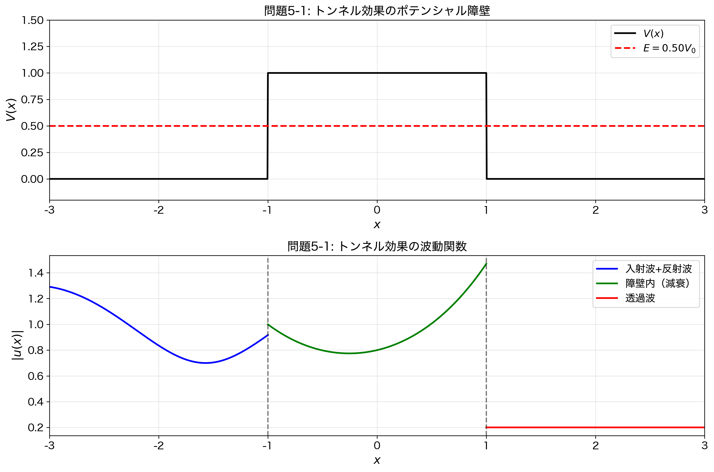

---

## 問題 5-2: ポテンシャルの井戸での束縛状態

**問題設定：**
質量 $m$ の粒子が、以下のポテンシャル $V(x)$ に束縛されている：

$$V(x) = \begin{cases} 
\infty & (x < 0) \\
-V_0 & (0 < x < a) \\
0 & (x > a)
\end{cases}$$

ここで、$V_0 > 0$、$a > 0$ とする。束縛状態を考えるため、ハミルトニアンの固有関数を $u(x)$、エネルギー固有値を $E$ とし、$-V_0 < E < 0$ の範囲で考える。

### (i) $x = 0$ での条件

**問題の意味：**
無限に高いポテンシャル壁での波動関数の条件を求める。

**解答：**

**ステップ1: 無限ポテンシャルの物理的意味**

$x < 0$ では $V(x) = \infty$ である。これは、粒子がこの領域に存在できないことを意味する。

**ステップ2: 波動関数の条件**

無限に高いポテンシャルでは、粒子の存在確率は0である。したがって：

$$u(x) = 0 \quad (x < 0)$$

**ステップ3: 連続性条件**

波動関数は連続でなければならない（ポテンシャルが有限な点では、波動関数とその導関数は連続）。

$x = 0$ での連続性：

$$u(0^-) = u(0^+)$$

左側では $u(0^-) = 0$ であるから：

$$u(0) = 0$$

**ステップ4: 導関数の条件**

無限ポテンシャル壁では、導関数は不連続でもよい（ポテンシャルが無限大のため）。しかし、波動関数自体は連続でなければならない。

**最終結果：**

$$u(0) = 0$$

**用語解説：**
- **無限ポテンシャル壁**: 粒子が通過できない完全に反射する壁。

**物理的意味：**
粒子は $x < 0$ の領域に存在できない。波動関数は $x = 0$ で0になる。

---

### (ii) $x = \infty$ での条件

**問題の意味：**
無限遠方での束縛状態の条件を求める。

**解答：**

**ステップ1: 束縛状態の定義**

束縛状態とは、粒子が有限の領域に局在した状態である。数学的には、波動関数が正規化可能でなければならない：

$$\int_{-\infty}^{\infty} |u(x)|^2 dx < \infty$$

**ステップ2: 無限遠での条件**

正規化可能性を満たすためには、$x \to \pm \infty$ で波動関数は0に収束しなければならない。

特に、$x \to \infty$ では：

$$\lim_{x \to \infty} u(x) = 0$$

**ステップ3: 物理的意味**

束縛状態では、粒子は有限の領域（この場合、$x > 0$ の領域）に閉じ込められている。無限遠では粒子を見出す確率は0である。

**ステップ4: 減衰の速さ**

$x > a$ の領域では、波動関数は指数関数的に減衰する（次節(iv)で詳述）。この減衰により、正規化可能性が保証される。

**最終結果：**

$$\lim_{x \to \infty} u(x) = 0$$

**用語解説：**
- **束縛状態**: 有限の領域に局在した状態。無限遠で波動関数は0に減衰する。

**物理的意味：**
束縛状態では、粒子は有限の領域に閉じ込められている。無限遠では粒子を見出す確率は0である。

---

### (iii) $0 < x < a$ でのシュレーディンガー方程式

**問題の意味：**
ポテンシャル井戸の内側での時間に依存しないシュレーディンガー方程式を書く。

**解答：**

**ステップ1: シュレーディンガー方程式の導出**

$0 < x < a$ では $V(x) = -V_0$ であるから、時間に依存しないシュレーディンガー方程式は：

$$-\frac{\hbar^2}{2m}\frac{d^2}{dx^2}u(x) + V(x)u(x) = Eu(x)$$

$$-\frac{\hbar^2}{2m}\frac{d^2}{dx^2}u(x) - V_0 u(x) = Eu(x)$$

**ステップ2: 方程式の整理**

両辺を整理すると：

$$-\frac{\hbar^2}{2m}\frac{d^2}{dx^2}u(x) = (E + V_0)u(x)$$

**ステップ3: 有効エネルギーの確認**

束縛状態では $-V_0 < E < 0$ であるから：

$$E + V_0 > 0$$

したがって、有効エネルギー $E + V_0$ は正の値である。

**ステップ4: 標準形への変換**

両辺を $-\frac{\hbar^2}{2m}$ で割ると：

$$\frac{d^2}{dx^2}u(x) = -\frac{2m(E + V_0)}{\hbar^2}u(x)$$

したがって：

$$\frac{d^2}{dx^2}u(x) + \frac{2m(E + V_0)}{\hbar^2}u(x) = 0$$

**ステップ5: 波数 $q$ の導入**

$q = \sqrt{\frac{2m(V_0 + E)}{\hbar^2}} > 0$ とおく。

$q$ は**波数**（wave number）であり、以下の性質を持つ：

- $q > 0$: $E + V_0 > 0$ であるため
- 単位: [長さ]$^{-1}$
- 物理的意味: 井戸内での波動関数の振動の速さを表す

シュレーディンガー方程式は：

$$\frac{d^2}{dx^2}u(x) + q^2u(x) = 0$$

**ステップ6: 解の性質**

この微分方程式は、振動する解（三角関数）を持つ。これは、井戸内で粒子の有効エネルギーが正であるため、粒子は振動的に運動することを意味する。

**最終結果：**

$$\frac{d^2}{dx^2}u(x) + q^2u(x) = 0$$

ここで、$q = \sqrt{\frac{2m(V_0 + E)}{\hbar^2}} > 0$ である。

**記号の説明：**
- **$q$**: ポテンシャル井戸内での波数。$q = \sqrt{\frac{2m(V_0 + E)}{\hbar^2}}$ で、有効エネルギー $E + V_0$ によって決まる。$q$ が大きいほど、波動関数の振動が速くなる。$q$ は、井戸内での粒子の運動量 $p = \hbar q = \sqrt{2m(V_0 + E)}$ と関係している。

**用語解説：**
- **ポテンシャル井戸**: 負のポテンシャル領域。粒子を束縛する。
- **有効エネルギー**: ポテンシャル井戸内での粒子の有効エネルギー。$E + V_0$ で表され、これは正の値である。

**物理的意味：**
井戸の内側では、粒子の有効エネルギーは $E + V_0 > 0$ である。波動関数は振動する解を持つ。$q$ は、井戸内での波動関数の振動の速さを決定し、エネルギー準位に影響する。

---

### (iv) $x > a$ でのシュレーディンガー方程式

**問題の意味：**
井戸の外側での時間に依存しないシュレーディンガー方程式を書く。

**解答：**

**ステップ1: シュレーディンガー方程式の導出**

$x > a$ では $V(x) = 0$ であるから、時間に依存しないシュレーディンガー方程式は：

$$-\frac{\hbar^2}{2m}\frac{d^2}{dx^2}u(x) + V(x)u(x) = Eu(x)$$

$$-\frac{\hbar^2}{2m}\frac{d^2}{dx^2}u(x) = Eu(x)$$

**ステップ2: エネルギーの符号**

束縛状態では $E < 0$ であるから、$|E| = -E > 0$ である。

**ステップ3: 方程式の整理**

両辺を $-\frac{\hbar^2}{2m}$ で割ると：

$$\frac{d^2}{dx^2}u(x) = -\frac{2mE}{\hbar^2}u(x) = \frac{2m|E|}{\hbar^2}u(x)$$

したがって：

$$\frac{d^2}{dx^2}u(x) - \frac{2m|E|}{\hbar^2}u(x) = 0$$

**ステップ4: 減衰定数 $\kappa$ の導入**

$\kappa = \sqrt{\frac{2m|E|}{\hbar^2}} > 0$ とおく。

$\kappa$ は**減衰定数**（attenuation constant）であり、以下の性質を持つ：

- $\kappa > 0$: $|E| > 0$ であるため
- 単位: [長さ]$^{-1}$
- 物理的意味: 波動関数の減衰の速さを表す

シュレーディンガー方程式は：

$$\frac{d^2}{dx^2}u(x) - \kappa^2 u(x) = 0$$

**ステップ5: 解の性質**

この微分方程式は、指数関数的に減衰する解を持つ。これは、井戸の外側で粒子のエネルギーが負であるため、粒子は古典的には存在できない領域であることを意味する。

**ステップ6: 束縛の強さ**

$\kappa$ が大きいほど、波動関数は速く減衰する。これは、束縛が強いことを意味する。

減衰長（減衰が $1/e$ になる距離）は $\lambda_{\text{decay}} = 1/\kappa$ で与えられる。

**最終結果：**

$$\frac{d^2}{dx^2}u(x) - \kappa^2 u(x) = 0$$

ここで、$\kappa = \sqrt{\frac{2m|E|}{\hbar^2}} > 0$ である。

**記号の説明：**
- **$\kappa$**: 減衰定数（問題5-1と同様）。束縛状態では、井戸の外側で波動関数が指数関数的に減衰する速さを表す。$\kappa = \sqrt{\frac{2m|E|}{\hbar^2}}$ で、束縛エネルギー $|E|$ が大きいほど、$\kappa$ は大きく、波動関数は速く減衰する。

**用語解説：**
- **減衰解**: 指数関数的に減衰する解。束縛状態では必要。
- **束縛エネルギー**: 束縛状態のエネルギー。$E < 0$ のとき、$|E|$ を束縛エネルギーという。

**物理的意味：**
井戸の外側では、粒子のエネルギーは負であるため、波動関数は指数関数的に減衰する。$\kappa$ は、波動関数が井戸の外に漏れ出す速さを決定し、束縛の強さを特徴づける。

---

### (v) $0 < x < a$ での解

**問題の意味：**
$q = \sqrt{2m(V_0 + E)}/\hbar$ を用いて、$0 < x < a$ での解を求める。

**解答：**

**ステップ1: 微分方程式の一般解**

(iii)で導出したシュレーディンガー方程式：

$$\frac{d^2}{dx^2}u(x) + q^2u(x) = 0$$

この2階線形微分方程式の一般解は、特性方程式 $\lambda^2 + q^2 = 0$ の解 $\lambda = \pm iq$ から：

$$u(x) = C_1 e^{iqx} + C_2 e^{-iqx}$$

オイラーの公式 $e^{i\theta} = \cos\theta + i\sin\theta$ を用いて、実数解として：

$$u(x) = A_1\cos(qx) + A_2\sin(qx)$$

ここで、$A_1$ と $A_2$ は任意の定数である。

**ステップ2: 境界条件の適用**

境界条件 $u(0) = 0$ を適用する：

$$u(0) = A_1\cos(0) + A_2\sin(0) = A_1 = 0$$

したがって、$A_1 = 0$ である。

**ステップ3: 最終的な解**

$A_2 = A$ とおくと：

$$u(x) = A\sin(qx) \quad (0 < x < a)$$

**ステップ4: 解の物理的意味**

- **正弦関数**: 井戸内で波動関数は振動する
- **$u(0) = 0$**: 左端（無限ポテンシャル壁）で波動関数は0になる
- **$A$**: 振幅定数であり、正規化条件から決定される

**ステップ5: 波数 $q$ の意味**

$q$ は井戸内での波数であり、波動関数の振動の速さを決定する。$q$ が大きいほど、波動関数は速く振動する。

**最終結果：**

$$u(x) = A\sin(qx) \quad (0 < x < a)$$

ここで、$A$ は正規化定数であり、境界条件から決定される。

**用語解説：**
- **正弦関数解**: 境界条件 $u(0) = 0$ を満たす解。

**物理的意味：**
井戸の内側では、波動関数は振動する。左端で0になる条件により、正弦関数が選ばれる。

---

### (vi) $x > a$ での解

**問題の意味：**
$\kappa = \sqrt{2m|E|}/\hbar$ を用いて、$x > a$ での解を求める。

**解答：**

**ステップ1: 微分方程式の一般解**

(iv)で導出したシュレーディンガー方程式：

$$\frac{d^2}{dx^2}u(x) - \kappa^2 u(x) = 0$$

この2階線形微分方程式の一般解は、特性方程式 $\lambda^2 - \kappa^2 = 0$ の解 $\lambda = \pm \kappa$ から：

$$u(x) = C_1 e^{\kappa x} + C_2 e^{-\kappa x}$$

ここで、$C_1$ と $C_2$ は任意の定数である。

**ステップ2: 束縛状態の条件**

束縛状態では、$\lim_{x \to \infty} u(x) = 0$ でなければならない。

- **$C_1 e^{\kappa x}$**: $x \to \infty$ で発散するため、$C_1 = 0$ でなければならない
- **$C_2 e^{-\kappa x}$**: $x \to \infty$ で0に収束する

したがって、$C_1 = 0$、$C_2 = B$ とおくと：

$$u(x) = Be^{-\kappa x} \quad (x > a)$$

**ステップ3: 解の物理的意味**

- **指数減衰**: 井戸の外側で波動関数は指数関数的に減衰する
- **$\lim_{x \to \infty} u(x) = 0$**: 無限遠で波動関数は0になる（束縛状態の条件）
- **$B$**: 振幅定数であり、境界条件から決定される

**ステップ4: 減衰の速さ**

減衰定数 $\kappa$ が大きいほど、波動関数は速く減衰する。これは、束縛が強いことを意味する。

減衰長（減衰が $1/e$ になる距離）は $\lambda_{\text{decay}} = 1/\kappa$ で与えられる。

**ステップ5: 正規化可能性**

この解は正規化可能である：

$$\int_a^{\infty} |u(x)|^2 dx = |B|^2 \int_a^{\infty} e^{-2\kappa x} dx = \frac{|B|^2}{2\kappa} e^{-2\kappa a} < \infty$$

**最終結果：**

$$u(x) = Be^{-\kappa x} \quad (x > a)$$

ここで、$B$ は正規化定数であり、境界条件から決定される。

**用語解説：**
- **指数減衰解**: 無限遠で0に収束する解。

**物理的意味：**
井戸の外側では、波動関数は指数関数的に減衰する。これにより、粒子は井戸の近くに束縛される。

---

### (vii) $x = a$ での連続条件

**問題の意味：**
波動関数とその導関数が $x = a$ で連続であるという条件を課す。

**解答：**

**ステップ1: 連続条件の必要性**

ポテンシャルが有限な点（$V(x)$ が不連続でない点）では、波動関数とその1階導関数は連続でなければならない。

これは以下の理由から：

1. **確率の流れの保存**: 確率の流れが保存されるため
2. **物理的妥当性**: 不連続な波動関数は物理的に許されない
3. **シュレーディンガー方程式の性質**: 有限なポテンシャルでは、波動関数は滑らかでなければならない

**ステップ2: 各領域での解の確認**

$x = a$ は、領域 $0 < x < a$ と領域 $x > a$ の境界である。

- **$0 < x < a$ での解**: $u(x) = A\sin(qx)$
- **$x > a$ での解**: $u(x) = Be^{-\kappa x}$

**ステップ3: 波動関数の連続性**

波動関数は $x = a$ で連続でなければならない：

$$u(a^-) = u(a^+)$$

ここで、$u(a^-)$ は $x = a$ に左側から近づいたときの値、$u(a^+)$ は右側から近づいたときの値である。

左側（$0 < x < a$）での値：

$$u(a^-) = A\sin(qa)$$

右側（$x > a$）での値：

$$u(a^+) = Be^{-\kappa a}$$

したがって、連続条件は：

$$A\sin(qa) = Be^{-\kappa a} \quad (1)$$

**ステップ4: 導関数の連続性**

波動関数の1階導関数も $x = a$ で連続でなければならない：

$$\left.\frac{du}{dx}\right|_{x=a^-} = \left.\frac{du}{dx}\right|_{x=a^+}$$

左側での導関数：

$$\frac{d}{dx}\left(A\sin(qx)\right) = Aq\cos(qx)$$

したがって：

$$\left.\frac{du}{dx}\right|_{x=a^-} = Aq\cos(qa)$$

右側での導関数：

$$\frac{d}{dx}\left(Be^{-\kappa x}\right) = -\kappa Be^{-\kappa x}$$

したがって：

$$\left.\frac{du}{dx}\right|_{x=a^+} = -\kappa Be^{-\kappa a}$$

したがって、導関数の連続条件は：

$$Aq\cos(qa) = -\kappa Be^{-\kappa a} \quad (2)$$

**ステップ5: 連続条件の物理的意味**

連続条件(1)と(2)は、以下の物理的意味を持つ：

1. **確率密度の連続性**: 波動関数の連続性により、確率密度 $|u(x)|^2$ が連続である
2. **確率の流れの保存**: 導関数の連続性により、確率の流れが保存される
3. **粒子の保存**: 確率の流れの保存は、粒子が消滅・生成されないことを意味する

**ステップ6: 連続条件の重要性**

これらの連続条件は、未知数 $A$、$B$、$q$、$\kappa$ の関係を決定する。

- (1)と(2)から $A$ と $B$ の比が決定される
- $q$ と $\kappa$ はエネルギー $E$ と関係している
- これらの条件により、エネルギー固有値が決定される

**最終結果：**

波動関数の連続性：

$$A\sin(qa) = Be^{-\kappa a} \quad (1)$$

導関数の連続性：

$$Aq\cos(qa) = -\kappa Be^{-\kappa a} \quad (2)$$

**用語解説：**
- **連続条件**: 波動関数とその導関数の連続性。確率の流れの保存を保証する。

**物理的意味：**
境界での連続条件により、エネルギー固有値が決定される。

---

### (viii) 束縛状態が存在しない条件

**問題の意味：**
連続条件から得られる方程式を解析し、束縛状態が存在しない場合の $V_0$ の条件を求める。

**解答：**

**ステップ1: 連続条件の再確認**

連続条件から：

$$A\sin(qa) = Be^{-\kappa a} \quad (1)$$
$$Aq\cos(qa) = -\kappa Be^{-\kappa a} \quad (2)$$

**ステップ2: $A$ と $B$ の消去**

(1)と(2)から $A$ と $B$ を消去する。

(2)を(1)で割る：

$$\frac{Aq\cos(qa)}{A\sin(qa)} = \frac{-\kappa Be^{-\kappa a}}{Be^{-\kappa a}}$$

$$\frac{q\cos(qa)}{\sin(qa)} = -\kappa$$

したがって：

$$q\cot(qa) = -\kappa$$

または：

$$\kappa = -q\cot(qa) \quad (3)$$

**ステップ3: 無次元パラメータの導入**

計算を簡潔にするため、無次元パラメータを導入する。

$\lambda = \frac{2mV_0a^2}{\hbar^2}$、$y = qa$ とおく。

**ステップ4: $q$ と $\kappa$ の関係**

$q$ と $\kappa$ の定義から：

$$q^2 = \frac{2m(V_0 + E)}{\hbar^2}$$

$$\kappa^2 = \frac{2m|E|}{\hbar^2} = \frac{2m(-E)}{\hbar^2}$$

**ステップ5: エネルギー $E$ の表現**

$q^2$ の式から $E$ を求める：

$$q^2 = \frac{2m(V_0 + E)}{\hbar^2}$$

$$E = -V_0 + \frac{\hbar^2 q^2}{2m}$$

**ステップ6: $\kappa^2$ の計算**

$E$ の式を $\kappa^2$ に代入：

$$\kappa^2 = \frac{2m(-E)}{\hbar^2} = \frac{2m}{\hbar^2}\left(V_0 - \frac{\hbar^2 q^2}{2m}\right)$$

$$= \frac{2mV_0}{\hbar^2} - q^2$$

無次元パラメータを用いて：

$$\kappa^2 = \frac{2mV_0}{\hbar^2} - q^2 = \frac{\lambda}{a^2} - \frac{y^2}{a^2} = \frac{\lambda - y^2}{a^2}$$

したがって：

$$\kappa = \frac{\sqrt{\lambda - y^2}}{a}$$

**ステップ7: 条件式の整理**

条件(3) $\kappa = -q\cot(qa)$ に代入：

$$\frac{\sqrt{\lambda - y^2}}{a} = -\frac{y}{a}\cot(y)$$

両辺に $a$ をかけて：

$$\sqrt{\lambda - y^2} = -y\cot(y)$$

両辺を $y$ で割って（$y > 0$ であるから）：

$$\frac{\sqrt{\lambda - y^2}}{y} = -\cot(y)$$

**ステップ8: 三角関数の変換**

$-\cot(y) = \tan\left(y - \frac{\pi}{2}\right)$ であるから：

$$\frac{\sqrt{\lambda - y^2}}{y} = \tan\left(y - \frac{\pi}{2}\right) \quad (4)$$

**ステップ9: グラフ解析**

左辺 $f(y) = \frac{\sqrt{\lambda - y^2}}{y}$ と右辺 $g(y) = \tan\left(y - \frac{\pi}{2}\right)$ のグラフを考える。

**$f(y)$ の性質：**

- 定義域: $0 < y < \sqrt{\lambda}$（$\lambda - y^2 \geq 0$ より）
- $y \to 0^+$: $f(y) \to +\infty$（発散）
- $y = \sqrt{\lambda}$: $f(y) = 0$
- $f(y)$ は単調減少関数

**$g(y)$ の性質：**

- $g(y) = \tan\left(y - \frac{\pi}{2}\right)$
- $y = \frac{\pi}{2}$: $g(y)$ は発散（$+\infty$ から $-\infty$ へ不連続）
- $y < \frac{\pi}{2}$: $g(y) < 0$
- $y > \frac{\pi}{2}$: $g(y) > 0$

**ステップ10: 解が存在する条件**

束縛状態が存在するためには、$f(y)$ と $g(y)$ が交わらなければならない。

$f(y)$ は $y = 0$ で $+\infty$ から始まり、$y = \sqrt{\lambda}$ で0になる。

$g(y)$ は $y = \frac{\pi}{2}$ で発散する。

**解が存在するための条件：**

$f(y)$ と $g(y)$ が交わるためには、$f(y)$ が $y = \frac{\pi}{2}$ で正の値を持たなければならない。

しかし、$f(y) > 0$ であるから、$g(y)$ も正でなければならない。これは $y > \frac{\pi}{2}$ の領域で起こる。

より重要なのは、$f(y)$ の定義域が $0 < y < \sqrt{\lambda}$ であることから、$\sqrt{\lambda} > \frac{\pi}{2}$ が必要である。

**ステップ11: 解が存在しない条件**

解が存在しないのは、$f(y)$ と $g(y)$ が交わらない場合である。

これは、$\lambda$ が十分小さいとき、すなわち：

$$\sqrt{\lambda} \leq \frac{\pi}{2}$$

したがって：

$$\lambda \leq \frac{\pi^2}{4}$$

より正確には、$\lambda < \frac{\pi^2}{4}$ のとき、解が存在しない。

**ステップ12: $V_0$ の条件**

$\lambda = \frac{2mV_0a^2}{\hbar^2}$ であるから：

$$\frac{2mV_0a^2}{\hbar^2} < \frac{\pi^2}{4}$$

したがって：

$$V_0 < \frac{\pi^2\hbar^2}{8ma^2}$$

**最終結果：**

束縛状態が存在しない条件は：

$$V_0 < \frac{\pi^2\hbar^2}{8ma^2}$$

すなわち、ポテンシャル井戸が浅い場合、束縛状態は存在しない。

**用語解説：**
- **束縛状態の存在条件**: ポテンシャル井戸が十分深い場合にのみ束縛状態が存在する。

**物理的意味：**
ポテンシャル井戸が浅い場合、粒子を束縛するのに十分なエネルギーがないため、束縛状態は存在しない。これは、不確定性関係と関連している。

**考察：**
束縛状態の存在には、ポテンシャル井戸の深さと幅の積が一定の閾値以上である必要がある。これは、量子力学における束縛の条件である。

---

## 問題 5-3: デルタ関数型ポテンシャルでの束縛状態

**問題設定：**
質量 $m$ の粒子が、ポテンシャル $V(x) = -\lambda\delta(x)$（$\lambda > 0$）の中にあり、エネルギー $E < 0$ の束縛状態を考える。

$x > 0$ における時間に依存しないシュレーディンガー方程式の解は、$u(x) = Ae^{-\kappa x}$（$x \to +\infty$ で $u(x) \to 0$ を満たす）と書ける。ここで、$\kappa = \sqrt{2m|E|}/\hbar$、$A$ は規格化定数で $A > 0$ と仮定する。$u(x)$ は $x=0$ で連続である。

### (i) $x < 0$ での解

**問題の意味：**
$x < 0$ でのシュレーディンガー方程式の解を求める。$x \to -\infty$ で $u(x) \to 0$ を満たす。

**解答：**

$x < 0$ でも $V(x) = 0$（$x \neq 0$）であるから、シュレーディンガー方程式は：

$$-\frac{\hbar^2}{2m}\frac{d^2}{dx^2}u(x) = Eu(x)$$

$E < 0$ であるから：

$$\frac{d^2}{dx^2}u(x) - \kappa^2 u(x) = 0$$

一般解は：

$$u(x) = Ce^{\kappa x} + De^{-\kappa x}$$

$x \to -\infty$ で $u(x) \to 0$ を満たすため、$De^{-\kappa x}$ の項は発散するので $D = 0$。

したがって：

$$u(x) = Ce^{\kappa x} \quad (x < 0)$$

連続性条件 $u(0^-) = u(0^+)$ より：

$$C = A$$

したがって：

$$u(x) = Ae^{\kappa x} \quad (x < 0)$$

**用語解説：**
- **デルタ関数**: 点 $x = 0$ に集中したポテンシャル。$\delta(x)$ は $x = 0$ で無限大、それ以外で0。

**物理的意味：**
デルタ関数ポテンシャルは、原点に非常に強い引力を及ぼす。波動関数は原点で連続であるが、導関数は不連続になる。

---

### (ii) $x=0$ での微分不連続性

**問題の意味：**
シュレーディンガー方程式を $x = -\epsilon$ から $x = \epsilon$ まで積分し、$\epsilon \to 0$ の極限を取ることで、導関数の不連続性の条件を求める。

**解答：**

シュレーディンガー方程式：

$$-\frac{\hbar^2}{2m}\frac{d^2}{dx^2}u(x) - \lambda\delta(x)u(x) = Eu(x)$$

**デルタ関数の性質を利用した導関数の不連続性の導出：**

デルタ関数を含む微分方程式では、原点付近で波動関数の導関数が不連続になる。これを導くため、方程式を $x = -\epsilon$ から $x = \epsilon$ まで積分する（$\epsilon > 0$）。

**重要なポイント：** $\epsilon$ を十分小さく取ることで、デルタ関数の効果のみが現れる。

$$-\frac{\hbar^2}{2m}\int_{-\epsilon}^{\epsilon}\frac{d^2}{dx^2}u(x)dx - \lambda\int_{-\epsilon}^{\epsilon}\delta(x)u(x)dx = E\int_{-\epsilon}^{\epsilon}u(x)dx$$

**各項を評価：**

**第1項：**

$$\int_{-\epsilon}^{\epsilon}\frac{d^2}{dx^2}u(x)dx = \left[\frac{du}{dx}\right]_{-\epsilon}^{\epsilon} = \left(\frac{du}{dx}\right)_{x=\epsilon} - \left(\frac{du}{dx}\right)_{x=-\epsilon}$$

**第2項：デルタ関数の積分**

デルタ関数の定義より：

$$\int_{-\epsilon}^{\epsilon}\delta(x)u(x)dx = u(0)$$

（$\delta(x)$ は $x = 0$ でのみ値を持ち、その値は無限大だが、積分すると $u(0)$ となる）

**第3項：**

$E\int_{-\epsilon}^{\epsilon}u(x)dx$ は、$\epsilon \to 0$ の極限で0になる（被積分関数が連続であるため）。

**極限の計算：**

$\epsilon \to 0$ の極限を取ると：

$$-\frac{\hbar^2}{2m}\left[\left(\frac{du}{dx}\right)_{x=0^+} - \left(\frac{du}{dx}\right)_{x=0^-}\right] - \lambda u(0) = 0$$

ここで、$0^+$ と $0^-$ は、それぞれ $x = 0$ の右側と左側からの極限を表す。

整理すると：

$$\left(\frac{du}{dx}\right)_{x=0^+} - \left(\frac{du}{dx}\right)_{x=0^-} = -\frac{2m\lambda}{\hbar^2}u(0)$$

**用語解説：**
- **デルタ関数 $\delta(x)$**: 点 $x = 0$ に集中した関数。$\int_{-\infty}^{\infty} \delta(x) dx = 1$、$x \neq 0$ で $\delta(x) = 0$。$\int \delta(x) f(x) dx = f(0)$ という性質を持つ。

**用語解説：**
- **デルタ関数の性質**: $\int_{-\epsilon}^{\epsilon}\delta(x)f(x)dx = f(0)$（$\epsilon > 0$）。

**物理的意味：**
デルタ関数ポテンシャルにより、波動関数の導関数は原点で不連続になる。この不連続性の大きさは、ポテンシャルの強さ $\lambda$ に比例する。

---

### (iii) エネルギー固有値

**問題の意味：**
(i)と(ii)の結果から、エネルギー固有値を決定する。

**解答：**

(i)より：

$$u(x) = \begin{cases}
Ae^{\kappa x} & (x < 0) \\
Ae^{-\kappa x} & (x > 0)
\end{cases}$$

したがって：

$$\left(\frac{du}{dx}\right)_{x=0^-} = A\kappa e^{0} = A\kappa$$

$$\left(\frac{du}{dx}\right)_{x=0^+} = -A\kappa e^{0} = -A\kappa$$

(ii)の条件より：

$$-A\kappa - A\kappa = -\frac{2m\lambda}{\hbar^2}A$$

$$-2A\kappa = -\frac{2m\lambda}{\hbar^2}A$$

$A \neq 0$ であるから：

$$2\kappa = \frac{2m\lambda}{\hbar^2}$$

したがって：

$$\kappa = \frac{m\lambda}{\hbar^2}$$

エネルギー固有値は：

$$E = -\frac{\hbar^2\kappa^2}{2m} = -\frac{\hbar^2}{2m}\left(\frac{m\lambda}{\hbar^2}\right)^2 = -\frac{m\lambda^2}{2\hbar^2}$$

**用語解説：**
- **束縛状態**: 負のエネルギーを持つ状態。デルタ関数ポテンシャルでは、ただ1つの束縛状態が存在する。

**物理的意味：**
デルタ関数ポテンシャルでは、束縛状態はただ1つだけ存在する。エネルギーは、ポテンシャルの強さ $\lambda$ の2乗に比例する。

---

### (iv) 規格化定数

**問題の意味：**
規格化条件から、規格化定数 $A$ を決定する。

**解答：**

規格化条件：

$$\int_{-\infty}^{\infty}|u(x)|^2 dx = 1$$

波動関数は区分的に定義されているので、積分を2つの部分に分ける：

$$\int_{-\infty}^{\infty}|u(x)|^2 dx = \int_{-\infty}^{0}|Ae^{\kappa x}|^2 dx + \int_{0}^{\infty}|Ae^{-\kappa x}|^2 dx$$

$$= |A|^2\int_{-\infty}^{0}e^{2\kappa x}dx + |A|^2\int_{0}^{\infty}e^{-2\kappa x}dx$$

**第1項の積分：**

$$\int_{-\infty}^{0}e^{2\kappa x}dx = \left[\frac{1}{2\kappa}e^{2\kappa x}\right]_{-\infty}^{0} = \frac{1}{2\kappa}(e^0 - 0) = \frac{1}{2\kappa}$$

（$x \to -\infty$ で $e^{2\kappa x} \to 0$ より）

**第2項の積分：**

$$\int_{0}^{\infty}e^{-2\kappa x}dx = \left[-\frac{1}{2\kappa}e^{-2\kappa x}\right]_{0}^{\infty} = -\frac{1}{2\kappa}(0 - e^0) = \frac{1}{2\kappa}$$

（$x \to \infty$ で $e^{-2\kappa x} \to 0$ より）

したがって：

$$|A|^2\left(\frac{1}{2\kappa} + \frac{1}{2\kappa}\right) = |A|^2 \cdot \frac{1}{\kappa} = 1$$

規格化条件より：

$$|A|^2 = \kappa = \frac{m\lambda}{\hbar^2}$$

$A > 0$ と仮定したので：

$$A = \sqrt{\kappa} = \sqrt{\frac{m\lambda}{\hbar^2}}$$

**用語解説：**
- **規格化**: 波動関数に定数をかけて、確率の総和を1にする操作。

**物理的意味：**
規格化定数は、粒子が全空間に存在する確率が1になるように決定される。

---

### (v) $|u(x)|^2$ の概形

**問題の意味：**
確率密度 $|u(x)|^2$ の概形を描く。

**解答：**

$$|u(x)|^2 = \begin{cases}
A^2e^{2\kappa x} = \kappa e^{2\kappa x} & (x < 0) \\
A^2e^{-2\kappa x} = \kappa e^{-2\kappa x} & (x > 0)
\end{cases}$$

$x = 0$ で最大値 $\kappa$ を取り、$|x|$ が増加するにつれて指数関数的に減衰する。

**用語解説：**
- **確率密度**: 位置 $x$ に粒子を見出す確率密度。$|u(x)|^2$ で与えられる。

**物理的意味：**
粒子は原点付近に最も高い確率で存在する。原点から離れるにつれて、存在確率は指数関数的に減少する。

**考察：**
デルタ関数ポテンシャルは、粒子を原点に強く束縛する。波動関数は原点で尖った形をとる。

---

### (vi) 位置の不確定性 $\Delta x$

**問題の意味：**
期待値 $\langle x \rangle$ と $\langle x^2 \rangle$ を計算し、位置の不確定性を求める。

**解答：**

対称性より：

$$\langle x \rangle = \int_{-\infty}^{\infty}x|u(x)|^2 dx = 0$$

$\langle x^2 \rangle$ を計算：

$$\langle x^2 \rangle = \int_{-\infty}^{\infty}x^2|u(x)|^2 dx = 2\int_{0}^{\infty}x^2\kappa e^{-2\kappa x}dx$$

$$= 2\kappa\int_{0}^{\infty}x^2e^{-2\kappa x}dx$$

部分積分を2回適用：

$$\int_{0}^{\infty}x^2e^{-2\kappa x}dx = \left[-\frac{x^2}{2\kappa}e^{-2\kappa x}\right]_{0}^{\infty} + \frac{1}{\kappa}\int_{0}^{\infty}xe^{-2\kappa x}dx$$

$$= 0 + \frac{1}{\kappa}\int_{0}^{\infty}xe^{-2\kappa x}dx$$

$$= \frac{1}{\kappa}\left(\left[-\frac{x}{2\kappa}e^{-2\kappa x}\right]_{0}^{\infty} + \frac{1}{2\kappa}\int_{0}^{\infty}e^{-2\kappa x}dx\right)$$

$$= \frac{1}{\kappa}\left(0 + \frac{1}{2\kappa} \cdot \frac{1}{2\kappa}\right) = \frac{1}{4\kappa^3}$$

したがって：

$$\langle x^2 \rangle = 2\kappa \cdot \frac{1}{4\kappa^3} = \frac{1}{2\kappa^2}$$

位置の不確定性は：

$$\Delta x = \sqrt{\langle x^2 \rangle - \langle x \rangle^2} = \sqrt{\frac{1}{2\kappa^2}} = \frac{1}{\kappa\sqrt{2}} = \frac{\hbar^2}{m\lambda\sqrt{2}}$$

**用語解説：**
- **不確定性**: 物理量の測定値のばらつき。

**物理的意味：**
位置の不確定性は、ポテンシャルの強さ $\lambda$ に反比例する。ポテンシャルが強いほど、粒子はより強く束縛され、位置の不確定性は小さくなる。

---

### (vii) 運動量の不確定性 $\Delta p$

**問題の意味：**
期待値 $\langle p \rangle$ と $\langle p^2 \rangle$ を計算し、運動量の不確定性を求める。$u(x)$ の微分は $x=0$ で不連続であることに注意する。

**解答：**

対称性より：

$$\langle p \rangle = 0$$

$\langle p^2 \rangle$ を計算。運動量演算子は $\hat{p} = -i\hbar\frac{d}{dx}$ であるから：

$$\langle p^2 \rangle = \int_{-\infty}^{\infty}u^*(x)\left(-\hbar^2\frac{d^2}{dx^2}\right)u(x)dx$$

シュレーディンガー方程式より：

$$-\frac{\hbar^2}{2m}\frac{d^2}{dx^2}u(x) - \lambda\delta(x)u(x) = Eu(x)$$

したがって：

$$-\hbar^2\frac{d^2}{dx^2}u(x) = 2mEu(x) + 2m\lambda\delta(x)u(x)$$

したがって：

$$\langle p^2 \rangle = \int_{-\infty}^{\infty}u^*(x)\left(2mEu(x) + 2m\lambda\delta(x)u(x)\right)dx$$

$$= 2mE\int_{-\infty}^{\infty}|u(x)|^2dx + 2m\lambda|u(0)|^2$$

$$= 2mE \cdot 1 + 2m\lambda \cdot \kappa = 2mE + 2m\lambda\kappa$$

$E = -\frac{\hbar^2\kappa^2}{2m}$、$\kappa = \frac{m\lambda}{\hbar^2}$ より：

$$\langle p^2 \rangle = 2m\left(-\frac{\hbar^2\kappa^2}{2m}\right) + 2m\lambda\kappa = -\hbar^2\kappa^2 + 2m\lambda\kappa$$

$$= -\hbar^2\kappa^2 + 2m\lambda \cdot \frac{m\lambda}{\hbar^2} = -\hbar^2\kappa^2 + \frac{2m^2\lambda^2}{\hbar^2}$$

$\kappa = \frac{m\lambda}{\hbar^2}$ を代入：

$$\langle p^2 \rangle = -\hbar^2\left(\frac{m\lambda}{\hbar^2}\right)^2 + \frac{2m^2\lambda^2}{\hbar^2} = -\frac{m^2\lambda^2}{\hbar^2} + \frac{2m^2\lambda^2}{\hbar^2} = \frac{m^2\lambda^2}{\hbar^2} = \hbar^2\kappa^2$$

運動量の不確定性は：

$$\Delta p = \sqrt{\langle p^2 \rangle - \langle p \rangle^2} = \sqrt{\hbar^2\kappa^2} = \hbar\kappa = \frac{m\lambda}{\hbar}$$

**用語解説：**
- **運動量の2乗の期待値**: 運動エネルギーと関連する量。

**物理的意味：**
運動量の不確定性は、ポテンシャルの強さ $\lambda$ に比例する。粒子がより強く束縛されるほど、運動量の不確定性は大きくなる。

---

### (viii) $\Delta x \cdot \Delta p$

**問題の意味：**
不確定性の積を計算する。

**解答：**

$$\Delta x \cdot \Delta p = \frac{1}{\kappa\sqrt{2}} \cdot \hbar\kappa = \frac{\hbar}{\sqrt{2}} = \frac{\hbar}{2} \cdot \sqrt{2} \approx 0.707\hbar > \frac{\hbar}{2}$$

**用語解説：**
- **不確定性関係**: $\Delta x \cdot \Delta p \geq \frac{\hbar}{2}$ が常に成り立つ。

**物理的意味：**
不確定性関係が満たされている。この値は最小値 $\frac{\hbar}{2}$ より大きいが、デルタ関数ポテンシャルの束縛状態は最小不確定性状態ではない。

**考察：**
デルタ関数ポテンシャルの束縛状態は、位置と運動量の不確定性のバランスが取れた状態である。ポテンシャルが強いほど、位置の不確定性は小さくなるが、運動量の不確定性は大きくなる。

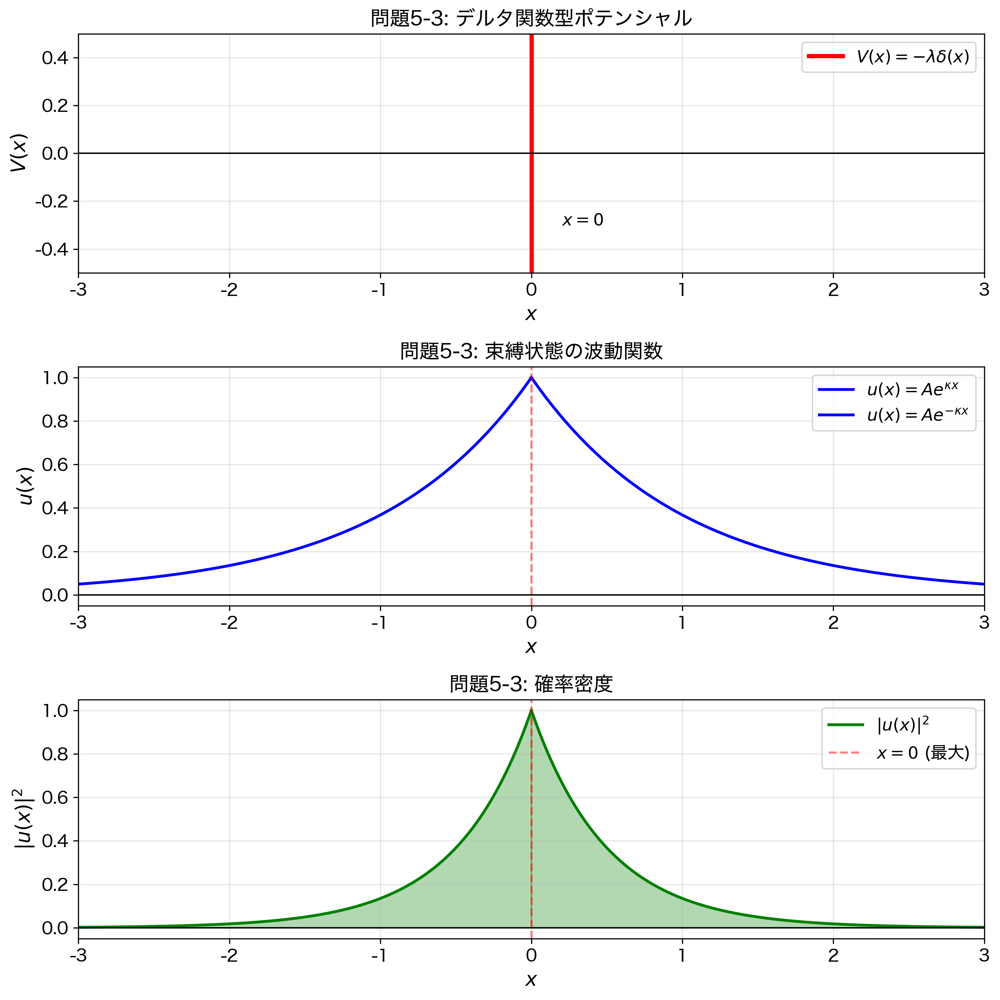

---

## 問題 6-1: 1次元のシュレーディンガー方程式についての一般的性質

**問題設定：**
1次元のシュレーディンガー方程式

$$\left(-\frac{\hbar^2}{2m}\frac{d^2}{dx^2} + V(x)\right)\psi(x) = E\psi(x)$$

を満たす束縛状態（波動関数が $|x| \to \infty$ で十分速く減衰する）について、以下の一般的性質を証明する。ここで、$V(x)$ は実関数である。

### (i) エネルギー準位は不連続である

**問題の意味：**
束縛状態では、エネルギー固有値が離散的（とびとびの値）になることを証明する。これは、量子力学の重要な特徴であり、古典力学との大きな違いである。

**解答：**

**証明の戦略：**
束縛状態のエネルギー固有値が離散的であることを示すために、連続スペクトルが存在しないことを証明する。

**束縛状態の定義：**
束縛状態とは、$|x| \to \infty$ で波動関数が十分速く減衰し、規格化可能な状態である。すなわち：

$$\int_{-\infty}^{\infty} |\psi(x)|^2 dx < \infty$$

**エネルギーの連続性の否定：**

エネルギーが連続的であると仮定する。連続スペクトルでは、固有関数は通常、規格化不可能な平面波の形をとる。しかし、束縛状態の定義により、波動関数は無限遠で減衰する必要がある。

具体的には：
- 連続スペクトルでは、$|x| \to \infty$ で波動関数は振動し続ける（進行波の形）
- 束縛状態では、$|x| \to \infty$ で波動関数は指数関数的に減衰する必要がある

この矛盾により、束縛状態では連続スペクトルは存在しない。

**より厳密な議論：**

1次元の束縛状態では、境界条件（$|x| \to \infty$ での減衰条件）が離散的なエネルギー固有値を決定する。これは、微分方程式の固有値問題における典型的な性質である。

**補足：**
この事実は、2次元以上のシュレーディンガー方程式の解に対しても成り立つ。ただし、2次元以上では、散乱状態も存在する。

**用語解説：**
- **離散スペクトル**: とびとびの値をとるエネルギー固有値。束縛状態は離散スペクトルを持つ。
- **連続スペクトル**: 連続的な値をとるエネルギー固有値。散乱状態は連続スペクトルを持つ。

**物理的意味：**
束縛状態では、粒子は有限の領域に閉じ込められているため、波動関数は定在波の形をとる。定在波の条件により、特定の波長（エネルギー）のみが許され、離散的なエネルギー準位が現れる。

**考察：**
これは、箱の中の粒子や調和振動子などの具体的な例でも確認できる。古典力学では連続的なエネルギーが許されるが、量子力学では境界条件により離散化される。

---

### (ii) エネルギー準位には縮退は存在しない

**問題の意味：**
各エネルギー固有値に対して、独立な固有関数が1つしか存在しないことを証明する。これは、1次元の束縛状態に特有の性質である。

**解答：**

**証明の戦略：**
同じエネルギー固有値 $E$ を持つ2つの独立な固有関数 $\psi_1(x)$ と $\psi_2(x)$ が存在すると仮定し、矛盾を導く。

**仮定：**
$$\left(-\frac{\hbar^2}{2m}\frac{d^2}{dx^2} + V(x)\right)\psi_1(x) = E\psi_1(x)$$
$$\left(-\frac{\hbar^2}{2m}\frac{d^2}{dx^2} + V(x)\right)\psi_2(x) = E\psi_2(x)$$

$\psi_1$ と $\psi_2$ は線形独立である。

**ロンスキアン（Wronskian）の使用：**

ロンスキアンを定義する：

$$W(x) = \psi_1(x)\frac{d\psi_2}{dx} - \psi_2(x)\frac{d\psi_1}{dx}$$

**ロンスキアンの微分：**

$$\frac{dW}{dx} = \frac{d\psi_1}{dx}\frac{d\psi_2}{dx} + \psi_1\frac{d^2\psi_2}{dx^2} - \frac{d\psi_2}{dx}\frac{d\psi_1}{dx} - \psi_2\frac{d^2\psi_1}{dx^2}$$

$$= \psi_1\frac{d^2\psi_2}{dx^2} - \psi_2\frac{d^2\psi_1}{dx^2}$$

シュレーディンガー方程式より：

$$\frac{d^2\psi_1}{dx^2} = \frac{2m}{\hbar^2}(V(x) - E)\psi_1$$
$$\frac{d^2\psi_2}{dx^2} = \frac{2m}{\hbar^2}(V(x) - E)\psi_2$$

これらを代入：

$$\frac{dW}{dx} = \psi_1 \cdot \frac{2m}{\hbar^2}(V(x) - E)\psi_2 - \psi_2 \cdot \frac{2m}{\hbar^2}(V(x) - E)\psi_1 = 0$$

したがって、$W(x)$ は定数である。

**無限遠での振る舞い：**

束縛状態では、$|x| \to \infty$ で波動関数は0に収束する：

$$\lim_{x \to \pm\infty} \psi_1(x) = 0, \quad \lim_{x \to \pm\infty} \psi_2(x) = 0$$

したがって：

$$\lim_{x \to \pm\infty} W(x) = 0$$

$W(x)$ は定数であるから、すべての $x$ で $W(x) = 0$ である。

**結論：**

$W(x) = 0$ は、$\psi_1$ と $\psi_2$ が線形従属であることを意味する。これは、$\psi_1$ と $\psi_2$ が線形独立であるという仮定に矛盾する。

したがって、同じエネルギー固有値を持つ2つの独立な固有関数は存在しない。

**用語解説：**
- **縮退**: 同じエネルギー固有値に対応する独立な固有関数が複数存在すること。1次元の束縛状態では縮退は存在しない。
- **ロンスキアン**: 2つの関数の線形独立性を判定するための量。$W(x) = 0$ なら線形従属、$W(x) \neq 0$ なら線形独立。

**物理的意味：**
1次元の束縛状態では、各エネルギー準位は一意に決定される。これは、1次元系の特殊性であり、2次元以上では対称性により縮退が生じる場合がある。

**考察：**
この結果は、1次元の束縛状態が数学的に非常に扱いやすいことを示している。縮退がないため、各エネルギー準位は明確に区別できる。

---

### (iii) ポテンシャルのパリティ対称性

**問題の意味：**
ポテンシャル $V(x)$ が $x$ の偶関数（$V(-x) = V(x)$）ならば、固有関数は偶関数または奇関数になることを証明する。

**解答：**

**仮定：**
$V(-x) = V(x)$（ポテンシャルは偶関数）

**シュレーディンガー方程式のパリティ変換：**

元のシュレーディンガー方程式：

$$-\frac{\hbar^2}{2m}\frac{d^2}{dx^2}\psi(x) + V(x)\psi(x) = E\psi(x)$$

変数変換 $x \to -x$ を行う：

$$\frac{d}{dx} \to -\frac{d}{dx}, \quad \frac{d^2}{dx^2} \to \frac{d^2}{dx^2}$$

（2階微分は符号が変わらない）

したがって：

$$-\frac{\hbar^2}{2m}\frac{d^2}{dx^2}\psi(-x) + V(-x)\psi(-x) = E\psi(-x)$$

$V(-x) = V(x)$ より：

$$-\frac{\hbar^2}{2m}\frac{d^2}{dx^2}\psi(-x) + V(x)\psi(-x) = E\psi(-x)$$

これは、$\psi(-x)$ も同じエネルギー固有値 $E$ に対する固有関数であることを示している。

**縮退の不存在との組み合わせ：**

(ii)の結果より、同じエネルギー固有値に対応する独立な固有関数は1つしか存在しない。したがって、$\psi(-x)$ は $\psi(x)$ の定数倍でなければならない：

$$\psi(-x) = C\psi(x)$$

定数 $C$ を決定するために、もう一度パリティ変換を適用：

$$\psi(x) = \psi(-(-x)) = C\psi(-x) = C^2\psi(x)$$

したがって、$C^2 = 1$、すなわち $C = \pm 1$。

**結論：**

- $C = 1$ の場合：$\psi(-x) = \psi(x)$（偶関数）
- $C = -1$ の場合：$\psi(-x) = -\psi(x)$（奇関数）

**用語解説：**
- **パリティ**: 空間反転 $x \to -x$ に対する対称性。偶関数は $\psi(-x) = \psi(x)$、奇関数は $\psi(-x) = -\psi(x)$。
- **パリティ対称性**: ポテンシャルが偶関数の場合、系はパリティ対称性を持つ。

**物理的意味：**
ポテンシャルが左右対称ならば、系の状態も対称性を持つ。基底状態は通常偶関数であり、励起状態は偶関数と奇関数が交互に現れる。

**考察：**
この結果は、調和振動子や箱の中の粒子など、対称的なポテンシャルを持つ系で確認できる。対称性を利用することで、問題を簡略化できる。

---

### (iv) エネルギー準位と節の数の関係

**問題の意味：**
エネルギー準位が上がるにつれて、波動関数の節（波動関数が符号を変えるゼロ点）の数が増えることを示す。これは、励起状態ほど複雑な振動構造を持つことを意味する。

**解答：**

**節の定義：**
波動関数 $\psi(x)$ の節とは、$\psi(x) = 0$ かつ $\psi'(x) \neq 0$ となる点である。

**証明の戦略：**
変分原理とノーダル定理（節の定理）を用いる。

**変分原理：**
エネルギー固有値は、対応する固有関数を変分法で求められる。基底状態は最小エネルギーを持つ。

**ノーダル定理：**
$n$ 番目のエネルギー固有状態（$n = 0, 1, 2, \ldots$）の波動関数は、ちょうど $n$ 個の節を持つ。

**基底状態（$n = 0$）：**
基底状態は最低エネルギーを持ち、節を持たない。これは、変分原理により、節を持つ関数はより高いエネルギーを持つためである。

**励起状態（$n \geq 1$）：**
各励起状態は、前の状態より1つ以上の節を持つ。これは、直交性と変分原理により導かれる。

**直交性の利用：**
異なるエネルギー固有状態は直交する：

$$\int_{-\infty}^{\infty} \psi_n^*(x)\psi_m(x) dx = 0 \quad (n \neq m)$$

$\psi_n$ と $\psi_{n+1}$ が直交するため、$\psi_{n+1}$ は $\psi_n$ と異なる符号構造を持つ必要がある。これは、$\psi_{n+1}$ が $\psi_n$ より多くの節を持つことを示唆する。

**用語解説：**
- **節**: 波動関数が0を横切る点。節の数は状態の励起度を特徴づける。
- **ノーダル定理**: エネルギー準位と節の数の関係を述べる定理。$n$ 番目の状態は $n$ 個の節を持つ。

**物理的意味：**
基底状態は最も滑らかで、節を持たない。励起状態では、エネルギーが高くなるほど波動関数の振動が増え、節の数が増える。これは、より複雑な運動パターンに対応している。

**考察：**
この結果は、箱の中の粒子や調和振動子で確認できる。基底状態は箱の中心にピークを持ち、第1励起状態は中央に節を持つ。

---

## 問題 6-2: エルミート多項式と母関数

**問題設定：**
エルミート多項式 $H_n(\xi)$ は、母関数 $S(\xi, s)$ を用いて定義される：

$$S(\xi, s) = e^{-s^2 + 2s\xi} = \sum_{n=0}^{\infty} \frac{H_n(\xi)}{n!}s^n$$

ここで、$s$ は複素パラメータである。

### (i) エルミート多項式の微分関係式

**問題の意味：**
母関数を $\xi$ で偏微分し、$s$ についての恒等式とみなすことで、エルミート多項式の微分関係式を導出する。

**解答：**

**ステップ1：母関数の $\xi$ による偏微分**

母関数を定義する：

$$S(\xi, s) = e^{-s^2 + 2s\xi}$$

$\xi$ で偏微分する：

$$\frac{\partial S}{\partial \xi} = \frac{\partial}{\partial \xi}e^{-s^2 + 2s\xi} = 2s \cdot e^{-s^2 + 2s\xi} = 2s S(\xi, s)$$

**ステップ2：エルミート多項式による展開**

一方、$S(\xi, s) = \sum_{n=0}^{\infty} \frac{H_n(\xi)}{n!}s^n$ より：

$$\frac{\partial S}{\partial \xi} = \frac{\partial}{\partial \xi}\sum_{n=0}^{\infty} \frac{H_n(\xi)}{n!}s^n = \sum_{n=0}^{\infty} \frac{1}{n!}\frac{dH_n(\xi)}{d\xi}s^n$$

**重要：微分と和の交換**

級数が一様収束する場合、微分と和の順序を交換できる。エルミート多項式の母関数は解析関数であるため、この交換が可能である。

**ステップ3：2つの表現を等置**

$$\sum_{n=0}^{\infty} \frac{1}{n!}\frac{dH_n(\xi)}{d\xi}s^n = 2s \sum_{n=0}^{\infty} \frac{H_n(\xi)}{n!}s^n$$

右辺を整理する：

$$2s \sum_{n=0}^{\infty} \frac{H_n(\xi)}{n!}s^n = \sum_{n=0}^{\infty} \frac{2H_n(\xi)}{n!}s^{n+1}$$

インデックスを $m = n+1$ と置き換える：

$$= \sum_{m=1}^{\infty} \frac{2H_{m-1}(\xi)}{(m-1)!}s^m = \sum_{m=1}^{\infty} \frac{2mH_{m-1}(\xi)}{m!}s^m$$

**ステップ4：$s$ についての恒等式**

$s$ についての恒等式として、各次数の係数を比較する：

$$\frac{1}{n!}\frac{dH_n(\xi)}{d\xi} = \frac{2nH_{n-1}(\xi)}{n!} \quad (n \geq 1)$$

両辺に $n!$ をかける：

$$\frac{dH_n(\xi)}{d\xi} = 2nH_{n-1}(\xi)$$

$n = 0$ の場合は、左辺は $H_0'(\xi) = 0$（$H_0(\xi) = 1$ は定数）であり、右辺は $2 \cdot 0 \cdot H_{-1}(\xi) = 0$ と解釈される。

**用語解説：**
- **母関数**: 数列を生成する関数。$S(\xi, s)$ の $s$ に関する展開係数として $H_n(\xi)$ を定義する。
- **恒等式**: すべての $s$ について成り立つ等式。各次数の係数を比較することで、関係式を得られる。

**物理的意味：**
エルミート多項式の微分関係式は、調和振動子の波動関数の導関数を計算する際に重要である。特に、昇降演算子の作用を理解する上で不可欠である。

**考察：**
この関係式により、高次のエルミート多項式を低次の多項式の導関数として表すことができる。これは、調和振動子の波動関数の計算を簡略化する。

---

### (ii) エルミート多項式の再帰関係式

**問題の意味：**
母関数を $s$ で偏微分し、$s$ についての恒等式とみなすことで、エルミート多項式の再帰関係式を導出する。

**解答：**

**ステップ1：母関数の $s$ による偏微分**

$$S(\xi, s) = e^{-s^2 + 2s\xi}$$

$s$ で偏微分する：

$$\frac{\partial S}{\partial s} = \frac{\partial}{\partial s}e^{-s^2 + 2s\xi} = (-2s + 2\xi)e^{-s^2 + 2s\xi} = (-2s + 2\xi)S(\xi, s)$$

**ステップ2：エルミート多項式による展開**

$$S(\xi, s) = \sum_{n=0}^{\infty} \frac{H_n(\xi)}{n!}s^n$$

$s$ で偏微分：

$$\frac{\partial S}{\partial s} = \sum_{n=1}^{\infty} \frac{H_n(\xi)}{n!}ns^{n-1} = \sum_{n=1}^{\infty} \frac{H_n(\xi)}{(n-1)!}s^{n-1}$$

インデックスを $m = n-1$ と置き換える：

$$= \sum_{m=0}^{\infty} \frac{H_{m+1}(\xi)}{m!}s^m$$

**ステップ3：2つの表現を等置**

$$\sum_{m=0}^{\infty} \frac{H_{m+1}(\xi)}{m!}s^m = (-2s + 2\xi)\sum_{n=0}^{\infty} \frac{H_n(\xi)}{n!}s^n$$

右辺を展開：

$$= -2s\sum_{n=0}^{\infty} \frac{H_n(\xi)}{n!}s^n + 2\xi\sum_{n=0}^{\infty} \frac{H_n(\xi)}{n!}s^n$$

$$= -2\sum_{n=0}^{\infty} \frac{H_n(\xi)}{n!}s^{n+1} + 2\xi\sum_{n=0}^{\infty} \frac{H_n(\xi)}{n!}s^n$$

第1項のインデックスを $m = n+1$ と置き換える：

$$= -2\sum_{m=1}^{\infty} \frac{H_{m-1}(\xi)}{(m-1)!}s^m + 2\xi\sum_{n=0}^{\infty} \frac{H_n(\xi)}{n!}s^n$$

$$= -2\sum_{m=1}^{\infty} \frac{mH_{m-1}(\xi)}{m!}s^m + 2\xi\sum_{n=0}^{\infty} \frac{H_n(\xi)}{n!}s^n$$

**ステップ4：$s$ についての恒等式**

各次数の係数を比較する：

- $s^0$ の係数：

$$\frac{H_1(\xi)}{0!} = 2\xi H_0(\xi)$$

したがって：$H_1(\xi) = 2\xi H_0(\xi) = 2\xi$（$H_0(\xi) = 1$ より）

- $s^m$（$m \geq 1$）の係数：

$$\frac{H_{m+1}(\xi)}{m!} = -2\frac{mH_{m-1}(\xi)}{m!} + 2\xi\frac{H_m(\xi)}{m!}$$

両辺に $m!$ をかける：

$$H_{m+1}(\xi) = -2mH_{m-1}(\xi) + 2\xi H_m(\xi)$$

整理すると：

$$H_{m+1}(\xi) - 2\xi H_m(\xi) + 2mH_{m-1}(\xi) = 0$$

$m = n$ と置き換えると：

$$H_{n+1}(\xi) - 2\xi H_n(\xi) + 2nH_{n-1}(\xi) = 0$$

**用語解説：**
- **再帰関係式**: 数列の各項が前の項（複数）で表される関係式。これにより、すべてのエルミート多項式を順次計算できる。

**物理的意味：**
再帰関係式により、調和振動子の異なるエネルギー準位の波動関数を関連付けることができる。これは、昇降演算子の作用と密接に関連している。

**考察：**
再帰関係式と微分関係式を組み合わせることで、エルミート多項式のすべての性質を導出できる。これは、調和振動子の問題を解く上で非常に有用である。

---

### (iii) エルミートの微分方程式

**問題の意味：**
(i)と(ii)の結果を用いて、エルミート多項式が満たす2階微分方程式を導出する。

**解答：**

**既知の関係式：**
- (i)より：$\frac{dH_n}{d\xi} = 2nH_{n-1}$  … (1)
- (ii)より：$H_{n+1} - 2\xi H_n + 2nH_{n-1} = 0$  … (2)

**ステップ1：(1)を$\xi$で微分**

(1)を$\xi$で微分：

$$\frac{d^2H_n}{d\xi^2} = 2n\frac{dH_{n-1}}{d\xi}$$

(1)を$n-1$に適用：

$$\frac{dH_{n-1}}{d\xi} = 2(n-1)H_{n-2}$$

したがって：

$$\frac{d^2H_n}{d\xi^2} = 2n \cdot 2(n-1)H_{n-2} = 4n(n-1)H_{n-2}$$  … (3)

**ステップ2：(2)を$\xi$で微分**

(2)を$\xi$で微分：

$$\frac{dH_{n+1}}{d\xi} - 2\xi\frac{dH_n}{d\xi} - 2H_n + 2n\frac{dH_{n-1}}{d\xi} = 0$$

(1)を適用：

$$2(n+1)H_n - 2\xi \cdot 2nH_{n-1} - 2H_n + 2n \cdot 2(n-1)H_{n-2} = 0$$

整理：

$$2(n+1)H_n - 4n\xi H_{n-1} - 2H_n + 4n(n-1)H_{n-2} = 0$$

$$2nH_n - 4n\xi H_{n-1} + 4n(n-1)H_{n-2} = 0$$

両辺を$2n$で割る（$n \geq 1$）：

$$H_n - 2\xi H_{n-1} + 2(n-1)H_{n-2} = 0$$  … (4)

**ステップ3：(4)から$H_{n-2}$を消去**

(4)より：

$$2(n-1)H_{n-2} = -H_n + 2\xi H_{n-1}$$

これを(3)に代入：

$$\frac{d^2H_n}{d\xi^2} = 4n(n-1) \cdot \frac{-H_n + 2\xi H_{n-1}}{2(n-1)} = 2n(-H_n + 2\xi H_{n-1})$$

$$= -2nH_n + 4n\xi H_{n-1}$$

(1)より $H_{n-1} = \frac{1}{2n}\frac{dH_n}{d\xi}$ を代入：

$$\frac{d^2H_n}{d\xi^2} = -2nH_n + 4n\xi \cdot \frac{1}{2n}\frac{dH_n}{d\xi}$$

$$= -2nH_n + 2\xi\frac{dH_n}{d\xi}$$

整理すると：

$$\frac{d^2H_n}{d\xi^2} - 2\xi\frac{dH_n}{d\xi} + 2nH_n = 0$$

これが**エルミートの微分方程式**である。

**用語解説：**
- **エルミートの微分方程式**: エルミート多項式が満たす2階線形微分方程式。調和振動子のシュレーディンガー方程式を無次元化した形に変換すると、この方程式が現れる。

**物理的意味：**
この微分方程式は、調和振動子の時間に依存しないシュレーディンガー方程式に対応する。エルミート多項式がこの方程式の解であることは、調和振動子の波動関数がエルミート多項式で表されることを意味する。

**考察：**
エルミートの微分方程式は、量子力学における調和振動子問題の核心である。この方程式を解くことで、すべてのエネルギー固有状態を求めることができる。

---

### (iv) 母関数を用いた積分の計算

**問題の意味：**
母関数 $S(\xi, s)$ を用いて、エルミート多項式の直交性を導くための準備として、積分 $I(s,t)$ を計算する。

**解答：**

積分を定義する：

$$I(s,t) = \int_{-\infty}^{\infty} d\xi \, S(\xi, s) S(\xi, t) e^{-\xi^2}$$

**ステップ1：母関数を代入**

$S(\xi, s) = e^{-s^2 + 2s\xi}$、$S(\xi, t) = e^{-t^2 + 2t\xi}$ より：

$$I(s,t) = \int_{-\infty}^{\infty} d\xi \, e^{-s^2 + 2s\xi} e^{-t^2 + 2t\xi} e^{-\xi^2}$$

$$= \int_{-\infty}^{\infty} d\xi \, e^{-s^2 - t^2 + 2s\xi + 2t\xi - \xi^2}$$

$$= e^{-s^2 - t^2} \int_{-\infty}^{\infty} d\xi \, e^{-\xi^2 + 2(s+t)\xi}$$

**ステップ2：平方完成**

指数部分を平方完成する：

$$-\xi^2 + 2(s+t)\xi = -(\xi^2 - 2(s+t)\xi)$$

$$= -[(\xi - (s+t))^2 - (s+t)^2]$$

$$= -(\xi - (s+t))^2 + (s+t)^2$$

したがって：

$$I(s,t) = e^{-s^2 - t^2} \int_{-\infty}^{\infty} d\xi \, e^{-(\xi - (s+t))^2 + (s+t)^2}$$

$$= e^{-s^2 - t^2 + (s+t)^2} \int_{-\infty}^{\infty} d\xi \, e^{-(\xi - (s+t))^2}$$

$$= e^{-s^2 - t^2 + s^2 + 2st + t^2} \int_{-\infty}^{\infty} d\xi \, e^{-(\xi - (s+t))^2}$$

$$= e^{2st} \int_{-\infty}^{\infty} d\xi \, e^{-(\xi - (s+t))^2}$$

**ステップ3：ガウス積分公式の適用**

ガウス積分公式：

$$\int_{-\infty}^{\infty} d\xi \, e^{-(\xi - a)^2} = \sqrt{\pi}$$

（$a$ は任意の定数）

ここで、$a = s+t$ であるから：

$$\int_{-\infty}^{\infty} d\xi \, e^{-(\xi - (s+t))^2} = \sqrt{\pi}$$

したがって：

$$I(s,t) = \sqrt{\pi} e^{2st}$$

**ステップ4：指数関数の展開**

$e^{2st}$ を $st$ について展開：

$$e^{2st} = \sum_{n=0}^{\infty} \frac{(2st)^n}{n!}$$

したがって：

$$I(s,t) = \sqrt{\pi} \sum_{n=0}^{\infty} \frac{(2st)^n}{n!} = \sum_{n=0}^{\infty} \frac{\sqrt{\pi} 2^n (st)^n}{n!}$$

**用語解説：**
- **ガウス積分**: $\int_{-\infty}^{\infty} e^{-x^2} dx = \sqrt{\pi}$ は基本的なガウス積分。変数をシフトしても値は変わらない。
- **平方完成**: 2次式を $(x-a)^2 + b$ の形に変形すること。指数関数の積分で頻繁に使用される。

**物理的意味：**
この積分は、エルミート多項式の直交性を導くための重要な準備である。調和振動子の波動関数の規格化にも関連している。

**考察：**
$e^{2st}$ の展開により、$s$ と $t$ の各次数の項が得られる。これが、エルミート多項式の直交性関係を導くための鍵となる。

---

### (v) エルミート多項式の直交性

**問題の意味：**
エルミート多項式を用いた $I(s,t)$ の展開と(iv)の結果を比較することで、エルミート多項式の直交性関係を導出する。

**解答：**

**ステップ1：エルミート多項式による展開**

母関数の定義より：

$$S(\xi, s) = \sum_{n=0}^{\infty} \frac{H_n(\xi)}{n!}s^n, \quad S(\xi, t) = \sum_{m=0}^{\infty} \frac{H_m(\xi)}{m!}t^m$$

したがって：

$$I(s,t) = \int_{-\infty}^{\infty} d\xi \, \left(\sum_{n=0}^{\infty} \frac{H_n(\xi)}{n!}s^n\right)\left(\sum_{m=0}^{\infty} \frac{H_m(\xi)}{m!}t^m\right) e^{-\xi^2}$$

$$= \sum_{n=0}^{\infty}\sum_{m=0}^{\infty} \frac{s^n t^m}{n! m!} \int_{-\infty}^{\infty} d\xi \, H_n(\xi) H_m(\xi) e^{-\xi^2}$$

**ステップ2：(iv)の結果と比較**

(iv)より：

$$I(s,t) = \sum_{n=0}^{\infty} \frac{\sqrt{\pi} 2^n (st)^n}{n!} = \sum_{n=0}^{\infty} \frac{\sqrt{\pi} 2^n s^n t^n}{n!}$$

**ステップ3：係数の比較**

2つの表現を比較すると、$s^n t^m$ の係数は以下のように一致する必要がある：

$$\frac{1}{n! m!} \int_{-\infty}^{\infty} d\xi \, H_n(\xi) H_m(\xi) e^{-\xi^2} = \begin{cases}
\frac{\sqrt{\pi} 2^n}{n!} & (n = m) \\
0 & (n \neq m)
\end{cases}$$

したがって：

$$\int_{-\infty}^{\infty} d\xi \, H_n(\xi) H_m(\xi) e^{-\xi^2} = \begin{cases}
\sqrt{\pi} 2^n n! & (n = m) \\
0 & (n \neq m)
\end{cases}$$

これが**エルミート多項式の直交性関係**である。

**用語解説：**
- **直交性**: 異なる次数のエルミート多項式が、重み関数 $e^{-\xi^2}$ の下で直交する性質。
- **規格化**: 同じ次数のエルミート多項式の2乗の積分が $\sqrt{\pi} 2^n n!$ であること。

**物理的意味：**
この直交性は、調和振動子の異なるエネルギー固有状態が直交することを意味する。これは、量子力学の基本的な性質である。

**考察：**
エルミート多項式の直交性により、任意の関数をエルミート多項式で展開できる（フーリエ級数のような）。これは、調和振動子の波動関数の展開に利用される。

---

### (vi) 調和振動子の波動関数の規格化定数

**問題の意味：**
調和振動子の波動関数 $u_n(x) = c_n H_n(\xi) e^{-\xi^2/2}$ が規格直交条件を満たすように、規格化定数 $c_n$ を決定する。

**解答：**

**規格直交条件：**

$$\int_{-\infty}^{\infty} dx \, u_n(x) u_m(x) = \delta_{nm}$$

**変数変換：**

$\xi = \sqrt{\frac{m\omega}{\hbar}} x$ より：

$$d\xi = \sqrt{\frac{m\omega}{\hbar}} dx, \quad dx = \sqrt{\frac{\hbar}{m\omega}} d\xi$$

波動関数は：

$$u_n(x) = c_n H_n(\xi) e^{-\xi^2/2}$$

**規格直交条件の計算：**

$$\int_{-\infty}^{\infty} dx \, u_n(x) u_m(x) = \int_{-\infty}^{\infty} dx \, c_n c_m H_n(\xi) H_m(\xi) e^{-\xi^2}$$

$$= c_n c_m \int_{-\infty}^{\infty} \sqrt{\frac{\hbar}{m\omega}} d\xi \, H_n(\xi) H_m(\xi) e^{-\xi^2}$$

$$= c_n c_m \sqrt{\frac{\hbar}{m\omega}} \int_{-\infty}^{\infty} d\xi \, H_n(\xi) H_m(\xi) e^{-\xi^2}$$

(v)の結果より：

$$\int_{-\infty}^{\infty} d\xi \, H_n(\xi) H_m(\xi) e^{-\xi^2} = \sqrt{\pi} 2^n n! \delta_{nm}$$

したがって：

$$\int_{-\infty}^{\infty} dx \, u_n(x) u_m(x) = c_n c_m \sqrt{\frac{\hbar}{m\omega}} \sqrt{\pi} 2^n n! \delta_{nm}$$

**規格化条件の適用：**

規格直交条件 $\int_{-\infty}^{\infty} dx \, u_n(x) u_m(x) = \delta_{nm}$ より、$n = m$ の場合：

$$c_n^2 \sqrt{\frac{\hbar}{m\omega}} \sqrt{\pi} 2^n n! = 1$$

したがって：

$$c_n^2 = \frac{1}{\sqrt{\frac{\hbar}{m\omega}} \sqrt{\pi} 2^n n!} = \sqrt{\frac{m\omega}{\pi\hbar}} \frac{1}{2^n n!}$$

$$c_n = \sqrt{\frac{m\omega}{\pi\hbar}} \frac{1}{\sqrt{2^n n!}} = \left(\frac{m\omega}{\pi\hbar}\right)^{1/4} \frac{1}{\sqrt{2^n n!}}$$

**用語解説：**
- **規格化定数**: 波動関数に適切な定数をかけて、規格化条件を満たすようにする定数。
- **規格直交性**: 異なる状態が直交し、同じ状態の規格化積分が1になる性質。

**物理的意味：**
規格化定数により、波動関数の絶対値の2乗が確率密度として正しく解釈される。これは、量子力学の確率解釈の基礎である。

**考察：**
規格化定数は、エネルギー準位 $n$ に依存する。基底状態（$n=0$）では最も大きく、励起状態では小さくなる。

---

## 問題 6-3: 調和振動子のゼロ点振動

**問題設定：**
1次元調和振動子の時間に依存するシュレーディンガー方程式と、ガウス型波束の時間発展を考察する。

---

### 時間発展とガウス型波束

1次元調和振動子の時間に依存するシュレーディンガー方程式：

$$i\hbar\frac{\partial}{\partial t}\Psi(x,t) = \left(-\frac{\hbar^2}{2m}\frac{\partial^2}{\partial x^2} + \frac{1}{2}m\omega^2x^2\right)\Psi(x,t)$$

### (i) 一般解と時間依存性

**問題の意味：**
エネルギー固有関数の重ね合わせとして一般解を表し、係数の時間依存性を決定する。

**解答：**

一般解として、エネルギー固有関数 $u_n(x)$ を用いて：

$$\Psi(x,t) = \sum_{n=0}^{\infty} \alpha_n(t) u_n(x)$$

これを時間に依存するシュレーディンガー方程式に代入：

$$i\hbar\frac{\partial}{\partial t}\sum_{n=0}^{\infty} \alpha_n(t) u_n(x) = \hat{H}\sum_{n=0}^{\infty} \alpha_n(t) u_n(x)$$

$$i\hbar\sum_{n=0}^{\infty} \frac{d\alpha_n}{dt} u_n(x) = \sum_{n=0}^{\infty} \alpha_n(t) E_n u_n(x)$$

各 $n$ について係数を比較：

$$i\hbar\frac{d\alpha_n}{dt} = E_n \alpha_n(t)$$

これは1階線形微分方程式であり、解は：

$$\alpha_n(t) = A_n e^{-iE_n t/\hbar}$$

ここで、$A_n$ は定数（初期条件から決定）。

**用語解説：**
- **時間発展**: 量子状態の時間変化。各エネルギー固有状態は独立に時間発展する。
- **位相因子**: $e^{-iE_n t/\hbar}$ は各エネルギー固有状態に付随する時間依存の位相。

**物理的意味：**
各エネルギー固有状態は、そのエネルギーに比例した角振動数で振動する。これは、時間発展演算子の作用に対応している。

---

### (ii) ガウス型波束の展開係数

**問題の意味：**
初期条件としてガウス型波束を考える。これをエネルギー固有状態で展開したときの係数を決定する。

**解答：**

初期条件：

$$\Psi(x, 0) = \left(\frac{m\omega}{\pi\hbar}\right)^{1/4} e^{-(\xi-\xi_0)^2/2}$$

ここで、$\xi = \sqrt{\frac{m\omega}{\hbar}} x$、$\xi_0$ は定数。

**エルミート多項式による展開：**

初期条件を規格化されたエネルギー固有状態 $u_n(x)$ で展開する：

$$\Psi(x, 0) = \sum_{n=0}^{\infty} A_n u_n(x)$$

**基底状態の波動関数：**

$$u_0(x) = c_0 H_0(\xi) e^{-\xi^2/2} = \left(\frac{m\omega}{\pi\hbar}\right)^{1/4} e^{-\xi^2/2}$$

（$H_0(\xi) = 1$ より）

一般に：

$$u_n(x) = c_n H_n(\xi) e^{-\xi^2/2} = \left(\frac{m\omega}{\pi\hbar}\right)^{1/4} \frac{1}{\sqrt{2^n n!}} H_n(\xi) e^{-\xi^2/2}$$

**初期条件の変形：**

$$\Psi(x, 0) = \left(\frac{m\omega}{\pi\hbar}\right)^{1/4} e^{-(\xi-\xi_0)^2/2}$$

指数部分を展開：

$$e^{-(\xi-\xi_0)^2/2} = e^{-\xi^2/2 + \xi_0\xi - \xi_0^2/2} = e^{-\xi^2/2} e^{\xi_0\xi - \xi_0^2/2}$$

**母関数の利用：**

エルミート多項式の母関数：

$$S(\xi, s) = e^{-s^2 + 2s\xi} = \sum_{n=0}^{\infty} \frac{H_n(\xi)}{n!}s^n$$

$s = \frac{\xi_0}{2}$ とおくと：

$$e^{-(\xi_0/2)^2 + 2(\xi_0/2)\xi} = e^{-\xi_0^2/4 + \xi_0\xi} = \sum_{n=0}^{\infty} \frac{H_n(\xi)}{n!}\left(\frac{\xi_0}{2}\right)^n$$

したがって：

$$e^{\xi_0\xi - \xi_0^2/4} = \sum_{n=0}^{\infty} \frac{H_n(\xi)}{n!}\left(\frac{\xi_0}{2}\right)^n$$

**初期条件の展開：**

$$\Psi(x, 0) = \left(\frac{m\omega}{\pi\hbar}\right)^{1/4} e^{-\xi^2/2} e^{\xi_0\xi - \xi_0^2/2}$$

$$= \left(\frac{m\omega}{\pi\hbar}\right)^{1/4} e^{-\xi^2/2} e^{-\xi_0^2/4} e^{\xi_0\xi - \xi_0^2/4}$$

$$= \left(\frac{m\omega}{\pi\hbar}\right)^{1/4} e^{-\xi^2/2} e^{-\xi_0^2/4} \sum_{n=0}^{\infty} \frac{H_n(\xi)}{n!}\left(\frac{\xi_0}{2}\right)^n$$

$$= e^{-\xi_0^2/4} \sum_{n=0}^{\infty} \frac{\xi_0^n}{2^n n!} \left(\frac{m\omega}{\pi\hbar}\right)^{1/4} H_n(\xi) e^{-\xi^2/2}$$

$$= e^{-\xi_0^2/4} \sum_{n=0}^{\infty} \frac{\xi_0^n}{\sqrt{2^n n!}} \cdot \frac{1}{\sqrt{2^n n!}} \left(\frac{m\omega}{\pi\hbar}\right)^{1/4} H_n(\xi) e^{-\xi^2/2}$$

$$= e^{-\xi_0^2/4} \sum_{n=0}^{\infty} \frac{\xi_0^n}{\sqrt{2^n n!}} u_n(x)$$

したがって、展開係数は：

$$A_n = \frac{\xi_0^n}{\sqrt{2^n n!}} e^{-\xi_0^2/4}$$

**用語解説：**
- **ガウス型波束**: ガウス関数の形を持つ波動関数のパケット。古典的な粒子に最も近い量子状態。

**物理的意味：**
ガウス型波束は、すべてのエネルギー固有状態の重ね合わせとして表される。係数はポアソン分布に従う。

---

### (iii) 時間発展した波動関数

**問題の意味：**
(i)と(ii)の結果を用いて、任意の時刻での波動関数を求める。これにより、ガウス型波束の時間発展が明らかになる。

**解答：**

(i)と(ii)より：

$$\Psi(x,t) = \sum_{n=0}^{\infty} A_n e^{-iE_n t/\hbar} u_n(x)$$

$A_n = \frac{\xi_0^n}{\sqrt{2^n n!}}e^{-\xi_0^2/4}$、$E_n = \hbar\omega(n + 1/2)$、$u_n(x) = c_n H_n(\xi)e^{-\xi^2/2}$ を代入：

$$= \sum_{n=0}^{\infty} \frac{\xi_0^n}{\sqrt{2^n n!}}e^{-\xi_0^2/4} e^{-i\hbar\omega(n+1/2)t/\hbar} c_n H_n(\xi)e^{-\xi^2/2}$$

$$= e^{-\xi_0^2/4 - i\omega t/2} c_0 e^{-\xi^2/2} \sum_{n=0}^{\infty} \frac{\xi_0^n}{\sqrt{2^n n!}} e^{-in\omega t} H_n(\xi)$$

規格化定数 $c_0 = \left(\frac{m\omega}{\pi\hbar}\right)^{1/4}$ より：

$$= \left(\frac{m\omega}{\pi\hbar}\right)^{1/4} e^{-\xi^2/2 - \xi_0^2/4 - i\omega t/2} \sum_{n=0}^{\infty} \frac{1}{n!}\left(\frac{\xi_0 e^{-i\omega t}}{2}\right)^n H_n(\xi)$$

**母関数の利用：**

エルミート多項式の母関数：

$$S(\xi, s) = e^{-s^2 + 2s\xi} = \sum_{n=0}^{\infty} \frac{H_n(\xi)}{n!}s^n$$

$s = \frac{\xi_0 e^{-i\omega t}}{2}$ とおくと：

$$e^{-(\xi_0 e^{-i\omega t}/2)^2 + 2(\xi_0 e^{-i\omega t}/2)\xi} = \sum_{n=0}^{\infty} \frac{H_n(\xi)}{n!}\left(\frac{\xi_0 e^{-i\omega t}}{2}\right)^n$$

左辺を計算：

$$e^{-\xi_0^2 e^{-2i\omega t}/4 + \xi_0\xi e^{-i\omega t}}$$

したがって：

$$\Psi(x,t) = \left(\frac{m\omega}{\pi\hbar}\right)^{1/4} e^{-\xi^2/2 - \xi_0^2/4 - i\omega t/2} e^{-\xi_0^2 e^{-2i\omega t}/4 + \xi_0\xi e^{-i\omega t}}$$

指数を整理：

$$= \left(\frac{m\omega}{\pi\hbar}\right)^{1/4} \exp\left[-\frac{\xi^2}{2} - \frac{\xi_0^2}{4} - \frac{i\omega t}{2} - \frac{\xi_0^2}{4}e^{-2i\omega t} + \xi_0\xi e^{-i\omega t}\right]$$

**用語解説：**
- **母関数**: 級数の和を閉じた形で表現する関数。エルミート多項式の母関数により、無限級数を指数関数で表せる。

**物理的意味：**
ガウス型波束は、時間発展しても形状を保ちながら振動する。これは、古典的な調和振動子の運動と対応している。

---

### (iv) 確率密度の時間発展

**問題の意味：**
波動関数の絶対値の2乗を計算し、古典的な振動運動との対応を確認する。

**解答：**

確率密度は：

$$|\Psi(x,t)|^2 = \Psi^*(x,t)\Psi(x,t)$$

(iii)より：

$$\Psi(x,t) = \left(\frac{m\omega}{\pi\hbar}\right)^{1/4} \exp\left[-\frac{\xi_0^2}{4}e^{-2i\omega t} + \xi_0\xi e^{-i\omega t} - \frac{\xi^2}{2} - \frac{\xi_0^2}{4} - \frac{i}{2}\omega t\right]$$

複素共役：

$$\Psi^*(x,t) = \left(\frac{m\omega}{\pi\hbar}\right)^{1/4} \exp\left[-\frac{\xi_0^2}{4}e^{2i\omega t} + \xi_0\xi e^{i\omega t} - \frac{\xi^2}{2} - \frac{\xi_0^2}{4} + \frac{i}{2}\omega t\right]$$

**複素指数の絶対値の計算：**

$z = a + ib$ のとき、$|e^z|^2 = e^{2a}$ であるから、指数の実部を計算する。

指数部分：

$$-\frac{\xi_0^2}{4}e^{-2i\omega t} + \xi_0\xi e^{-i\omega t} - \frac{\xi^2}{2} - \frac{\xi_0^2}{4} - \frac{i}{2}\omega t$$

実部を計算：

$$\Re\left(-\frac{\xi_0^2}{4}e^{-2i\omega t} + \xi_0\xi e^{-i\omega t} - \frac{\xi^2}{2} - \frac{\xi_0^2}{4}\right)$$

$e^{-i\theta} = \cos\theta - i\sin\theta$ より：

$$= -\frac{\xi_0^2}{4}\cos(2\omega t) + \xi_0\xi\cos(\omega t) - \frac{\xi^2}{2} - \frac{\xi_0^2}{4}$$

三角関数の恒等式：

$$\cos(2\theta) = 2\cos^2\theta - 1$$

より：

$$-\frac{\xi_0^2}{4}(2\cos^2(\omega t) - 1) = -\frac{\xi_0^2}{2}\cos^2(\omega t) + \frac{\xi_0^2}{4}$$

したがって実部は：

$$-\frac{\xi_0^2}{2}\cos^2(\omega t) + \frac{\xi_0^2}{4} + \xi_0\xi\cos(\omega t) - \frac{\xi^2}{2} - \frac{\xi_0^2}{4}$$

$$= -\frac{\xi_0^2}{2}\cos^2(\omega t) + \xi_0\xi\cos(\omega t) - \frac{\xi^2}{2}$$

平方完成：

$$-\frac{1}{2}(\xi^2 - 2\xi_0\xi\cos(\omega t) + \xi_0^2\cos^2(\omega t)) = -\frac{1}{2}(\xi - \xi_0\cos(\omega t))^2$$

したがって：

$$|\Psi(x,t)|^2 = \left(\frac{m\omega}{\pi\hbar}\right)^{1/2} \exp\left[-(\xi - \xi_0\cos(\omega t))^2\right]$$

**用語解説：**
- **複素指数の絶対値**: $|e^{a+ib}|^2 = e^{2a}$。指数の実部のみが絶対値に寄与する。

**物理的意味：**
確率密度の中心が $\xi_0\cos(\omega t)$ に従って振動する。これは、古典的な調和振動子の運動と一致する。ガウス型波束は時間発展しても形状を保ち、古典的な粒子のように振動する。

**考察：**
ガウス型波束は、古典的な粒子の運動を再現する。これは、量子力学と古典力学の対応原理の例である。波束の幅は時間とともに変化しない（コヒーレント状態の特徴）。

---

## 問題 6-4: 調和振動子の期待値と不確定性関係

**問題設定：**
調和振動子の波動関数 $u_n(x) = c_n H_n(\xi) e^{-\xi^2/2}$ とエネルギー固有値 $E_n = \hbar\omega(n + 1/2)$ について、期待値と不確定性関係を考察する。

### (i) エネルギー固有値の表現

**問題の意味：**
エネルギー固有値が期待値の形で表されることを示す。

**解答：**

エネルギー固有値の定義より：

$$\hat{H} u_n(x) = E_n u_n(x)$$

両辺に $u_n^*(x)$ をかけて積分：

$$\int_{-\infty}^{\infty} u_n^*(x) \hat{H} u_n(x) dx = E_n \int_{-\infty}^{\infty} u_n^*(x) u_n(x) dx$$

規格化条件より：

$$\int_{-\infty}^{\infty} u_n^*(x) u_n(x) dx = 1$$

したがって：

$$E_n = \int_{-\infty}^{\infty} u_n^*(x) \hat{H} u_n(x) dx = \langle H \rangle$$

**用語解説：**
- **期待値**: 物理量の測定結果の平均値。エネルギー固有値は、その状態でのエネルギーの期待値と一致する。

---

### (ii) 位置と運動量の期待値

**問題の意味：**
エネルギー固有状態での位置と運動量の期待値が0であることを示す。

**解答：**

**対称性の利用：**

調和振動子のポテンシャル $V(x) = \frac{1}{2}m\omega^2 x^2$ は偶関数である。したがって、問題6-1(iii)より、波動関数は偶関数または奇関数である。

**位置の期待値：**

$$\langle x \rangle = \int_{-\infty}^{\infty} u_n^*(x) x u_n(x) dx$$

$u_n(x)$ が偶関数または奇関数の場合、$x u_n^*(x) u_n(x)$ は奇関数である。奇関数の積分は0であるから：

$$\langle x \rangle = 0$$

**運動量の期待値：**

$$\langle p \rangle = \int_{-\infty}^{\infty} u_n^*(x) \left(-i\hbar\frac{d}{dx}\right) u_n(x) dx$$

$u_n(x)$ が実関数（位相因子を除く）の場合、期待値は純虚数または0である。物理量の期待値は実数でなければならないから：

$$\langle p \rangle = 0$$

**用語解説：**
- **パリティ対称性**: 偶関数・奇関数の対称性。これにより、多くの積分が0になる。

---

### (iii) エネルギーの分散表現

**問題の意味：**
エネルギーを位置と運動量の分散で表現する。

**解答：**

ハミルトニアン：

$$\hat{H} = \frac{\hat{p}^2}{2m} + \frac{1}{2}m\omega^2\hat{x}^2$$

期待値：

$$E_n = \langle H \rangle = \left\langle \frac{\hat{p}^2}{2m} + \frac{1}{2}m\omega^2\hat{x}^2 \right\rangle$$

$$= \frac{1}{2m}\langle \hat{p}^2 \rangle + \frac{1}{2}m\omega^2\langle \hat{x}^2 \rangle$$

(ii)より $\langle x \rangle = 0$、$\langle p \rangle = 0$ であるから：

$$\Delta x = \sqrt{\langle x^2 \rangle - \langle x \rangle^2} = \sqrt{\langle x^2 \rangle}$$
$$\Delta p = \sqrt{\langle p^2 \rangle - \langle p \rangle^2} = \sqrt{\langle p^2 \rangle}$$

したがって：

$$E_n = \frac{(\Delta p)^2}{2m} + \frac{1}{2}m\omega^2(\Delta x)^2$$

**物理的意味：**
エネルギーは、運動量の不確定性（運動エネルギー）と位置の不確定性（ポテンシャルエネルギー）の和として表される。

---

### (iv) 不確定性関係によるエネルギー下限

**問題の意味：**
不確定性関係を用いて、エネルギーの下限を導く。

**解答：**

不確定性関係：

$$\Delta x \cdot \Delta p \geq \frac{\hbar}{2}$$

(iii)の結果：

$$E_n = \frac{(\Delta p)^2}{2m} + \frac{1}{2}m\omega^2(\Delta x)^2$$

$\Delta p = \frac{\hbar}{2\Delta x}$（等号成立時）を代入：

$$E_n \geq \frac{1}{2m}\left(\frac{\hbar}{2\Delta x}\right)^2 + \frac{1}{2}m\omega^2(\Delta x)^2$$

$$= \frac{\hbar^2}{8m(\Delta x)^2} + \frac{1}{2}m\omega^2(\Delta x)^2$$

$\Delta x$ について最小化：

$$\frac{\partial E_n}{\partial (\Delta x)} = -\frac{\hbar^2}{4m(\Delta x)^3} + m\omega^2(\Delta x) = 0$$

$$(\Delta x)^4 = \frac{\hbar^2}{4m^2\omega^2}$$

$$(\Delta x)^2 = \frac{\hbar}{2m\omega}$$

代入すると：

$$E_n \geq \frac{\hbar^2}{8m} \cdot \frac{2m\omega}{\hbar} + \frac{1}{2}m\omega^2 \cdot \frac{\hbar}{2m\omega}$$

$$= \frac{\hbar\omega}{4} + \frac{\hbar\omega}{4} = \frac{\hbar\omega}{2}$$

したがって：

$$E_n \geq \frac{1}{2}\hbar\omega$$

**物理的意味：**
零点エネルギーは、不確定性関係の直接の結果である。これは、量子力学の基本的な特徴である。

---

### (v) 基底状態とゼロ点振動

**問題の意味：**
基底状態の波動関数の概形を描き、ゼロ点振動の物理的意味を説明する。

**解答：**

基底状態の波動関数：

$$u_0(x) = \left(\frac{m\omega}{\pi\hbar}\right)^{1/4} e^{-\frac{m\omega}{2\hbar}x^2}$$

これはガウス型関数であり、$x = 0$ で最大値を取る。

**ゼロ点振動の物理的意味：**

1. **不確定性関係の結果**: 位置と運動量を同時に0にすることはできない。したがって、基底状態でも粒子は静止できない。

2. **零点エネルギー**: 基底状態のエネルギー $E_0 = \frac{1}{2}\hbar\omega$ は0ではない。これは、古典力学と異なる重要な特徴である。

3. **確率分布**: 基底状態でも、粒子は原点付近に広がって存在する。これは、古典的な「静止状態」とは異なる。

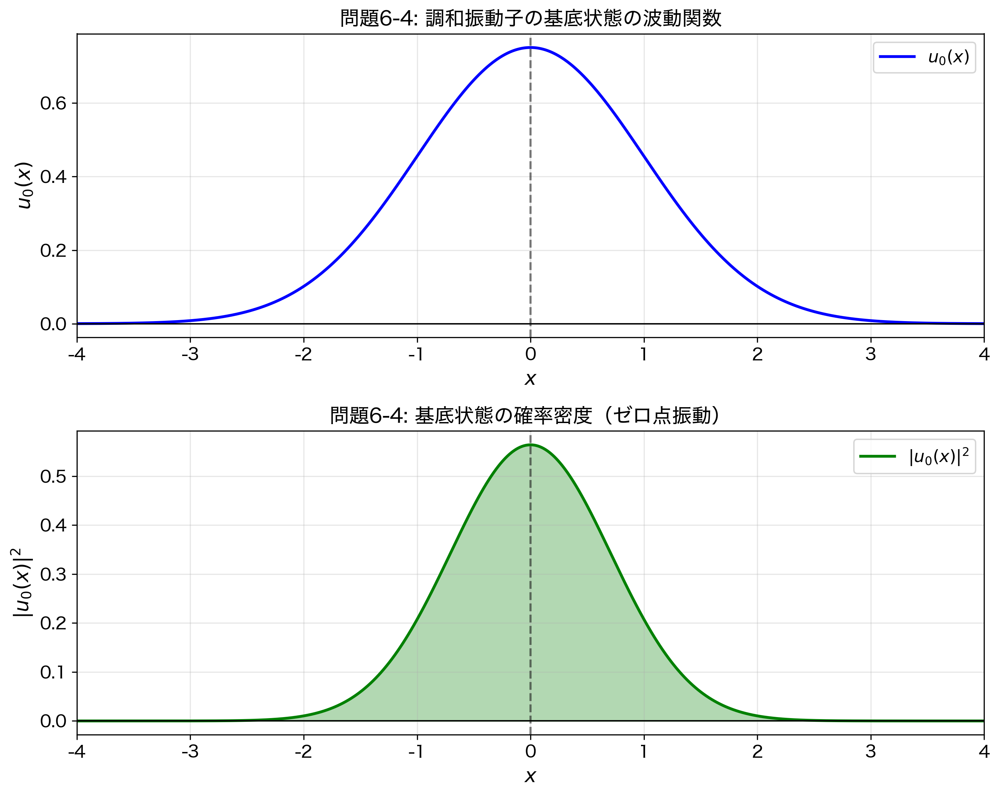

**考察：**
ゼロ点振動は、量子力学の基本的な特徴であり、すべての量子系に現れる。これは、真空のゆらぎとしても理解される。

---

## 問題 7-1: 演算子法による調和振動子問題の解法

**問題設定：**
調和振動子のハミルトニアン：

$$\hat{H} = \frac{\hat{p}^2}{2m} + \frac{1}{2}m\omega^2\hat{x}^2$$

昇降演算子（生成消滅演算子）：

$$\hat{a} = \sqrt{\frac{m\omega}{2\hbar}}\hat{x} + i\frac{\hat{p}}{\sqrt{2m\omega\hbar}}$$

$$\hat{a}^\dagger = \sqrt{\frac{m\omega}{2\hbar}}\hat{x} - i\frac{\hat{p}}{\sqrt{2m\omega\hbar}}$$

### (i) 交換関係 $[\hat{a}, \hat{a}^\dagger] = 1$

**問題の意味：**
昇降演算子の交換関係を計算し、これが調和振動子の量子化の基礎となることを示す。

**解答：**

交換子の定義より：

$$[\hat{a}, \hat{a}^\dagger] = \hat{a}\hat{a}^\dagger - \hat{a}^\dagger\hat{a}$$

定義を代入して計算：

$$\hat{a}\hat{a}^\dagger = \left(\sqrt{\frac{m\omega}{2\hbar}}\hat{x} + i\frac{\hat{p}}{\sqrt{2m\omega\hbar}}\right)\left(\sqrt{\frac{m\omega}{2\hbar}}\hat{x} - i\frac{\hat{p}}{\sqrt{2m\omega\hbar}}\right)$$

$$= \frac{m\omega}{2\hbar}\hat{x}^2 - i\sqrt{\frac{m\omega}{2\hbar}}\frac{1}{\sqrt{2m\omega\hbar}}\hat{x}\hat{p} + i\sqrt{\frac{m\omega}{2\hbar}}\frac{1}{\sqrt{2m\omega\hbar}}\hat{p}\hat{x} + \frac{1}{2m\omega\hbar}\hat{p}^2$$

$$= \frac{m\omega}{2\hbar}\hat{x}^2 + \frac{i}{2\hbar}(\hat{p}\hat{x} - \hat{x}\hat{p}) + \frac{1}{2m\omega\hbar}\hat{p}^2$$

交換関係 $[\hat{x}, \hat{p}] = i\hbar$ より：

$$\hat{p}\hat{x} - \hat{x}\hat{p} = -i\hbar$$

したがって：

$$\hat{a}\hat{a}^\dagger = \frac{m\omega}{2\hbar}\hat{x}^2 + \frac{1}{2m\omega\hbar}\hat{p}^2 + \frac{1}{2}$$

同様に：

$$\hat{a}^\dagger\hat{a} = \frac{m\omega}{2\hbar}\hat{x}^2 + \frac{1}{2m\omega\hbar}\hat{p}^2 - \frac{1}{2}$$

したがって：

$$[\hat{a}, \hat{a}^\dagger] = 1$$

---

### (ii) ハミルトニアンの表現

**問題の意味：**
ハミルトニアンを個数演算子 $\hat{N} = \hat{a}^\dagger\hat{a}$ で表現する。これにより、調和振動子のエネルギー準位が直接的に求められる。

**解答：**

**ステップ1：逆変換の導出**

$\hat{a}$ と $\hat{a}^\dagger$ の定義より、これらを連立させて $\hat{x}$ と $\hat{p}$ を表す。

定義：

$$\hat{a} = \sqrt{\frac{m\omega}{2\hbar}}\hat{x} + i\frac{\hat{p}}{\sqrt{2m\omega\hbar}}$$
$$\hat{a}^\dagger = \sqrt{\frac{m\omega}{2\hbar}}\hat{x} - i\frac{\hat{p}}{\sqrt{2m\omega\hbar}}$$

$\hat{a} + \hat{a}^\dagger$ を計算：

$$\hat{a} + \hat{a}^\dagger = 2\sqrt{\frac{m\omega}{2\hbar}}\hat{x} = \sqrt{\frac{2m\omega}{\hbar}}\hat{x}$$

したがって：

$$\hat{x} = \sqrt{\frac{\hbar}{2m\omega}}(\hat{a} + \hat{a}^\dagger)$$

$\hat{a}^\dagger - \hat{a}$ を計算：

$$\hat{a}^\dagger - \hat{a} = -2i\frac{\hat{p}}{\sqrt{2m\omega\hbar}} = -i\sqrt{\frac{2}{m\omega\hbar}}\hat{p}$$

したがって：

$$\hat{p} = i\sqrt{\frac{m\omega\hbar}{2}}(\hat{a}^\dagger - \hat{a})$$

**ステップ2：ハミルトニアンの計算**

$$\hat{H} = \frac{\hat{p}^2}{2m} + \frac{1}{2}m\omega^2\hat{x}^2$$

$\hat{x}^2$ を計算：

$$\hat{x}^2 = \frac{\hbar}{2m\omega}(\hat{a} + \hat{a}^\dagger)^2 = \frac{\hbar}{2m\omega}(\hat{a}^2 + \hat{a}\hat{a}^\dagger + \hat{a}^\dagger\hat{a} + (\hat{a}^\dagger)^2)$$

$\hat{p}^2$ を計算：

$$\hat{p}^2 = -\frac{m\omega\hbar}{2}(\hat{a}^\dagger - \hat{a})^2 = -\frac{m\omega\hbar}{2}((\hat{a}^\dagger)^2 - \hat{a}^\dagger\hat{a} - \hat{a}\hat{a}^\dagger + \hat{a}^2)$$

したがって：

$$\hat{H} = \frac{1}{2m} \cdot \left(-\frac{m\omega\hbar}{2}\right)((\hat{a}^\dagger)^2 - \hat{a}^\dagger\hat{a} - \hat{a}\hat{a}^\dagger + \hat{a}^2) + \frac{1}{2}m\omega^2 \cdot \frac{\hbar}{2m\omega}(\hat{a}^2 + \hat{a}\hat{a}^\dagger + \hat{a}^\dagger\hat{a} + (\hat{a}^\dagger)^2)$$

$$= -\frac{\omega\hbar}{4}((\hat{a}^\dagger)^2 - \hat{a}^\dagger\hat{a} - \hat{a}\hat{a}^\dagger + \hat{a}^2) + \frac{\omega\hbar}{4}(\hat{a}^2 + \hat{a}\hat{a}^\dagger + \hat{a}^\dagger\hat{a} + (\hat{a}^\dagger)^2)$$

$$= -\frac{\omega\hbar}{4}(\hat{a}^\dagger)^2 + \frac{\omega\hbar}{4}\hat{a}^\dagger\hat{a} + \frac{\omega\hbar}{4}\hat{a}\hat{a}^\dagger - \frac{\omega\hbar}{4}\hat{a}^2 + \frac{\omega\hbar}{4}\hat{a}^2 + \frac{\omega\hbar}{4}\hat{a}\hat{a}^\dagger + \frac{\omega\hbar}{4}\hat{a}^\dagger\hat{a} + \frac{\omega\hbar}{4}(\hat{a}^\dagger)^2$$

$$= \frac{\omega\hbar}{2}(\hat{a}^\dagger\hat{a} + \hat{a}\hat{a}^\dagger)$$

交換関係 $[\hat{a}, \hat{a}^\dagger] = 1$ より：

$$\hat{a}\hat{a}^\dagger = \hat{a}^\dagger\hat{a} + 1$$

したがって：

$$\hat{H} = \frac{\omega\hbar}{2}(2\hat{a}^\dagger\hat{a} + 1) = \hbar\omega\left(\hat{a}^\dagger\hat{a} + \frac{1}{2}\right) = \hbar\omega\left(\hat{N} + \frac{1}{2}\right)$$

**用語解説：**
- **個数演算子**: $\hat{N} = \hat{a}^\dagger\hat{a}$ は、状態に含まれる「励起の数」（量子数）を表す演算子。

**物理的意味：**
ハミルトニアンが個数演算子で表されることにより、エネルギー固有値は直接的に $E_n = \hbar\omega(n + 1/2)$ となることが分かる。定数項 $\hbar\omega/2$ は零点エネルギーを表す。

---

### (iii) 固有状態とエネルギー固有値

**問題の意味：**
基底状態から固有状態を生成し、エネルギー固有値を求める。

**解答：**

**ブラ・ケット記法の基礎（初学者向け）：**

量子力学では、状態を**ケット** $| \rangle$ で表します。例えば $|0\rangle$ は「基底状態」という状態を表す記号です。

- **ケット** $|\psi\rangle$：量子状態を表すベクトル（縦ベクトル）
- **ブラ** $\langle\psi|$：ケットの複素共役（横ベクトル）
- **ブラケット** $\langle\phi|\psi\rangle$：2つの状態の内積（スカラー値）

**演算子の作用の方向：**

演算子（$\hat{a}$ など）は**ケットの左側**から作用します：

$$\hat{a}|0\rangle$$

これは「演算子 $\hat{a}$ を状態 $|0\rangle$ に作用させる」という意味です。

**視覚的な理解：**

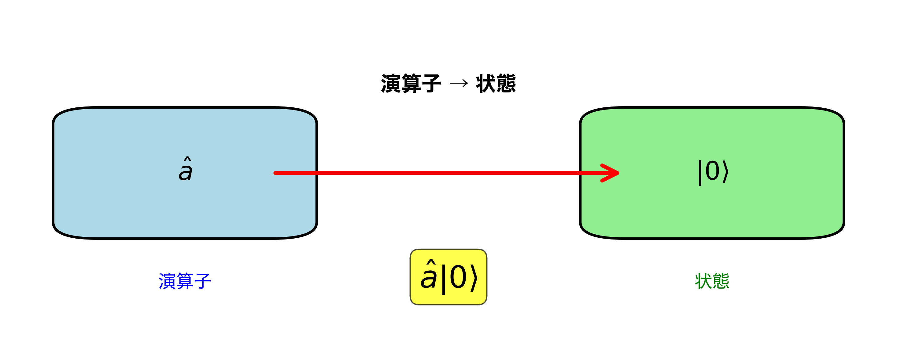

演算子は常に**右向き**に作用します。つまり、左から右へ読む順序で計算します。

**重要な注意点：**
- $\hat{a}|0\rangle$：演算子を**左から**作用させる（正しい）
- $|0\rangle\hat{a}$：このような書き方は**意味を持たない**（間違い）

**複数の演算子が並ぶ場合：**

$$\hat{a}^\dagger\hat{a}|0\rangle$$

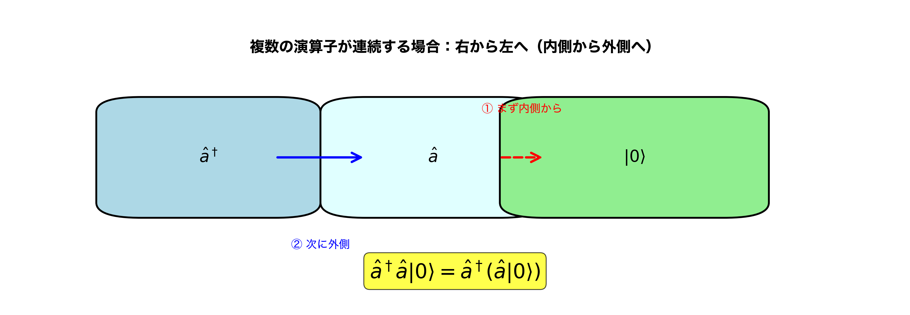

この場合、**右から左へ**（内側から外側へ）順番に作用させます：

1. まず $\hat{a}|0\rangle$ を計算
2. 次に $\hat{a}^\dagger$ をその結果に作用

つまり、$\hat{a}^\dagger(\hat{a}|0\rangle)$ という順序で計算します。

**エルミート共役（ダガー）の意味：**

$\hat{a}^\dagger$ は $\hat{a}$ の**エルミート共役**（複素共役転置）です。

- $\hat{a}$：消滅演算子（エネルギー準位を下げる）
- $\hat{a}^\dagger$：生成演算子（エネルギー準位を上げる）

**「生成」と「消滅」の名前の由来：**

調和振動子のエネルギー準位は、$\hbar\omega$ の整数倍で離散的に分布しています。各準位は「励起の数」$n$ で特徴づけられます。

- **生成演算子 $\hat{a}^\dagger$**：励起を1つ**増やす**（生成する）
  - $|0\rangle \xrightarrow{\hat{a}^\dagger} |1\rangle \xrightarrow{\hat{a}^\dagger} |2\rangle \cdots$
  - エネルギーが $\hbar\omega$ だけ上がる

- **消滅演算子 $\hat{a}$**：励起を1つ**減らす**（消滅させる）
  - $|2\rangle \xrightarrow{\hat{a}} |1\rangle \xrightarrow{\hat{a}} |0\rangle \xrightarrow{\hat{a}} 0$
  - エネルギーが $\hbar\omega$ だけ下がる
  - 基底状態 $|0\rangle$ に作用すると、それより低い準位は存在しないため、結果は0になる

**演算子の作用の具体例：**

1. **消滅演算子 $\hat{a}$ の作用：**
   - $\hat{a}|n\rangle = \sqrt{n}|n-1\rangle$：状態 $|n\rangle$ を1つ低い準位 $|n-1\rangle$ に移す
   - 特に、$\hat{a}|0\rangle = 0$：基底状態に作用させると0（ゼロベクトル）になる

2. **生成演算子 $\hat{a}^\dagger$ の作用：**
   - $\hat{a}^\dagger|n\rangle = \sqrt{n+1}|n+1\rangle$：状態 $|n\rangle$ を1つ高い準位 $|n+1\rangle$ に移す

3. **ブラに演算子を作用させる場合（右から作用）：**

   **基本原則：**
   - ブラ $\langle n|$ に演算子が**右から**作用する場合、それは対応するケットに**左から**作用する演算子の**エルミート共役**を意味します
   - $\langle n|\hat{a}^\dagger$ は、$\hat{a}|n\rangle$ の複素共役（転置）を表します
   - つまり、$\langle n|\hat{a}^\dagger = (\hat{a}|n\rangle)^\dagger$

   **具体的な計算方法：**

   $\langle n|\hat{a}^\dagger$ を計算するには、まず $\hat{a}|n\rangle$ を計算し、その複素共役を取ります：

   - $\hat{a}|n\rangle = \sqrt{n}|n-1\rangle$
   - その複素共役：$(\hat{a}|n\rangle)^\dagger = (\sqrt{n}|n-1\rangle)^\dagger = \sqrt{n}\langle n-1|$
   - したがって：$\langle n|\hat{a}^\dagger = \sqrt{n}\langle n-1|$

   **別の方法：直接計算**

   $\langle n|\hat{a}^\dagger$ に任意のケット $|m\rangle$ を右から作用させると：

   $$\langle n|\hat{a}^\dagger|m\rangle = \langle n|(\hat{a}^\dagger|m\rangle) = \langle n|\sqrt{m+1}|m+1\rangle = \sqrt{m+1}\langle n|m+1\rangle = \sqrt{m+1}\delta_{n,m+1}$$

   これは、$\langle n|\hat{a}^\dagger$ が $\sqrt{n}\langle n-1|$ と等しいことを示しています。

   **重要な関係式：**

   - $\langle n|\hat{a}^\dagger = \sqrt{n}\langle n-1|$（$n \geq 1$ の場合）
   - $\langle 0|\hat{a}^\dagger = \langle 1|$（$n = 0$ の場合）
   - $\langle n|\hat{a} = \sqrt{n+1}\langle n+1|$（一般に）

   **使用例：期待値の計算**

   $\langle n|\hat{a}^\dagger\hat{a}|n\rangle$ を計算する場合：

   - 方法1：$\langle n|\hat{a}^\dagger\hat{a}|n\rangle = \langle n|\hat{a}^\dagger(\hat{a}|n\rangle) = \langle n|\hat{a}^\dagger\sqrt{n}|n-1\rangle = \sqrt{n}\langle n|\hat{a}^\dagger|n-1\rangle$
   - 方法2：$\hat{a}^\dagger\hat{a}|n\rangle = n|n\rangle$ より、$\langle n|n|n\rangle = n\langle n|n\rangle = n$

**基底状態の定義：**

基底状態 $|0\rangle$ は、消滅演算子によって消える状態である：

$$\hat{a}|0\rangle = 0$$

**この定義の意味：**

1. **「消える」とは**：$\hat{a}|0\rangle = 0$ は、結果が**ゼロベクトル**（何もない状態）になることを意味します。これは「0という数」ではなく、「状態が存在しない」ことを表します。

2. **なぜ基底状態で消えるのか**：
   - 基底状態は最低エネルギーの状態
   - 消滅演算子はエネルギー準位を1つ下げる
   - 基底状態より低い準位は存在しない
   - したがって、$\hat{a}|0\rangle$ は「存在しない状態」= 0 になる

3. **生成演算子との対比**：
   - $\hat{a}^\dagger|0\rangle = |1\rangle$：基底状態から第1励起状態を生成できる
   - $\hat{a}|0\rangle = 0$：基底状態からさらに低い状態は作れない

**$\hat{a}^\dagger\hat{a}|0\rangle = 0$ の理由（詳しい説明）：**

基底状態の定義より $\hat{a}|0\rangle = 0$ であるから、演算子の作用を順番に追跡すると：

$$\hat{a}^\dagger\hat{a}|0\rangle = \hat{a}^\dagger(\hat{a}|0\rangle)$$

ここで、括弧内を先に計算：

$$\hat{a}|0\rangle = 0 \quad \text{（基底状態の定義より）}$$

したがって：

$$\hat{a}^\dagger\hat{a}|0\rangle = \hat{a}^\dagger \cdot 0 = 0$$

**計算の順序の理解：**

1. **まず内側から計算**：$\hat{a}|0\rangle = 0$
2. **次に外側の演算子を作用**：$\hat{a}^\dagger \cdot 0 = 0$

**なぜ $\hat{a}^\dagger \cdot 0 = 0$ なのか：**

演算子をゼロベクトルに作用させると、結果は必ずゼロベクトルになります。これは、どんな演算子 $\hat{O}$ に対しても $\hat{O} \cdot 0 = 0$ が成り立つからです。

**個数演算子の意味：**

$\hat{N} = \hat{a}^\dagger\hat{a}$ は**個数演算子**と呼ばれ、状態に含まれる「励起の数」（量子数）を表します。

- $\hat{N}|0\rangle = 0|0\rangle = 0$：基底状態には励起が0個
- $\hat{N}|n\rangle = n|n\rangle$：$n$ 番目の励起状態には励起が $n$ 個

つまり、$\hat{a}^\dagger\hat{a}|0\rangle = 0$ は「基底状態には励起が0個ある」ということを意味します。

**ブラ・ケット記法の計算例：**

1. **内積の計算**：
   - $\langle 0|0\rangle = 1$：同じ状態の内積は1（規格化条件）
   - $\langle n|m\rangle = \delta_{nm}$：異なる状態は直交（内積が0）

2. **期待値の計算**：
   - $\langle n|\hat{a}|m\rangle$：状態 $|m\rangle$ に $\hat{a}$ を作用させ、その結果と状態 $|n\rangle$ の内積を取る
   - 例：$\langle 1|\hat{a}|1\rangle = \langle 1|\sqrt{1}|0\rangle = \sqrt{1}\langle 1|0\rangle = 0$（直交性より）

3. **演算子の作用の順序**：
   - $\langle n|\hat{a}^\dagger\hat{a}|m\rangle$ の計算では：
     - まず $\hat{a}|m\rangle$ を計算（右から左へ）
     - 次に $\hat{a}^\dagger$ を作用
     - 最後に $\langle n|$ との内積を取る

4. **エルミート共役の関係**：
   - $\langle n|\hat{a}^\dagger|m\rangle = (\hat{a}|n\rangle)^\dagger|m\rangle = \langle m|\hat{a}|n\rangle^*$
   - つまり、$\langle n|\hat{a}^\dagger|m\rangle = \langle m|\hat{a}|n\rangle^*$（複素共役）

**演算子が「挟み込まれる」場合の詳しい説明：**

$\langle n|\hat{a}|m\rangle$ のような形では、演算子がブラとケットの**間に挟まれています**。

**計算の手順：**

1. **まず右側から計算**：$\hat{a}|m\rangle$ を計算
   - $\hat{a}|m\rangle = \sqrt{m}|m-1\rangle$（$m \geq 1$ の場合）
   - $\hat{a}|0\rangle = 0$（$m = 0$ の場合）

2. **次に左側のブラとの内積を取る**：
   - $\langle n|\hat{a}|m\rangle = \langle n|(\hat{a}|m\rangle) = \langle n|\sqrt{m}|m-1\rangle = \sqrt{m}\langle n|m-1\rangle$
   - 直交性より、$n = m-1$ のときのみ $\sqrt{m}$、それ以外は0

**具体例：**

- $\langle 1|\hat{a}|1\rangle = \langle 1|\sqrt{1}|0\rangle = \sqrt{1}\langle 1|0\rangle = 0$（直交性より）
- $\langle 0|\hat{a}|1\rangle = \langle 0|\sqrt{1}|0\rangle = \sqrt{1}\langle 0|0\rangle = 1$
- $\langle 2|\hat{a}|1\rangle = \langle 2|\sqrt{1}|0\rangle = \sqrt{1}\langle 2|0\rangle = 0$（直交性より）

**視覚的な理解：**

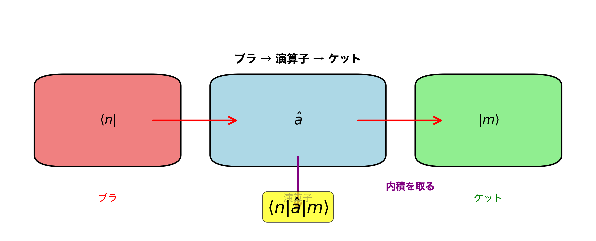

**複数の演算子が挟まれる場合：**

$\langle n|\hat{a}^\dagger\hat{a}|m\rangle$ の場合：

1. **右から左へ順番に計算**：
   - まず $\hat{a}|m\rangle = \sqrt{m}|m-1\rangle$
   - 次に $\hat{a}^\dagger(\hat{a}|m\rangle) = \hat{a}^\dagger\sqrt{m}|m-1\rangle = \sqrt{m}\sqrt{m}|m\rangle = m|m\rangle$
   - 最後に $\langle n|m|m\rangle = m\langle n|m\rangle = m\delta_{nm}$

**交換可能な演算子と交換不可能な演算子：**

**交換可能（可換）な場合：**

2つの演算子 $\hat{A}$ と $\hat{B}$ が**交換可能**（可換）であるとは：

$$[\hat{A}, \hat{B}] = \hat{A}\hat{B} - \hat{B}\hat{A} = 0$$

この場合、**順序を入れ替えても結果は同じ**です：

$$\hat{A}\hat{B}|\psi\rangle = \hat{B}\hat{A}|\psi\rangle$$

**例：**
- 同じ演算子：$\hat{a}\hat{a} = \hat{a}^2$（順序は関係ない）
- 数と演算子：$c\hat{a}|\psi\rangle = \hat{a}c|\psi\rangle$（$c$ は定数）

**交換不可能（非可換）な場合：**

2つの演算子が**交換不可能**（非可換）であるとは：

$$[\hat{A}, \hat{B}] \neq 0$$

この場合、**順序を入れ替えると結果が変わる**ため、順序に注意が必要です。

**重要な例：生成・消滅演算子の交換関係**

$$[\hat{a}, \hat{a}^\dagger] = \hat{a}\hat{a}^\dagger - \hat{a}^\dagger\hat{a} = 1$$

これは**交換不可能**です。したがって：

- $\hat{a}\hat{a}^\dagger|n\rangle \neq \hat{a}^\dagger\hat{a}|n\rangle$
- 実際には：
  - $\hat{a}\hat{a}^\dagger|n\rangle = (n+1)|n\rangle$
  - $\hat{a}^\dagger\hat{a}|n\rangle = n|n\rangle$

**交換関係の使い方：**

交換不可能な演算子の積を計算する際は、交換関係を使って順序を変えることができます：

$$\hat{a}\hat{a}^\dagger = [\hat{a}, \hat{a}^\dagger] + \hat{a}^\dagger\hat{a} = 1 + \hat{a}^\dagger\hat{a}$$

**具体例：$\hat{a}\hat{a}^\dagger|n\rangle$ の計算**

交換関係 $[\hat{a}, \hat{a}^\dagger] = 1$ より：

$$\hat{a}\hat{a}^\dagger = \hat{a}^\dagger\hat{a} + 1$$

したがって：

$$\hat{a}\hat{a}^\dagger|n\rangle = (\hat{a}^\dagger\hat{a} + 1)|n\rangle = \hat{a}^\dagger\hat{a}|n\rangle + |n\rangle = n|n\rangle + |n\rangle = (n+1)|n\rangle$$

**まとめ：順序の重要性**

1. **交換可能な場合**：順序を入れ替えてもOK
2. **交換不可能な場合**：順序を変えると結果が変わる
3. **計算の原則**：常に**右から左へ**（内側から外側へ）順番に計算する

**演算子の作用パターン一覧表：**

| 記法 | 意味 | 計算方法 | 例 |
|------|------|----------|-----|
| $\hat{a}\|n\rangle$ | ケットに左から作用 | 直接計算 | $\hat{a}\|1\rangle = \sqrt{1}\|0\rangle = \|0\rangle$ |
| $\langle n\|\hat{a}^\dagger$ | ブラに右から作用 | $(\hat{a}\|n\rangle)^\dagger$ | $\langle 1\|\hat{a}^\dagger = \sqrt{1}\langle 0\| = \langle 0\|$ |
| $\langle n\|\hat{a}\|m\rangle$ | ブラとケットの間に挟まれる | 右から左へ順番に計算 | $\langle 0\|\hat{a}\|1\rangle = 1$ |
| $\hat{a}\hat{a}^\dagger\|n\rangle$ | 複数の演算子が連続 | 右から左へ順番に計算 | $\hat{a}\hat{a}^\dagger\|n\rangle = (n+1)\|n\rangle$ |
| $\hat{a}^\dagger\hat{a}\|n\rangle$ | 複数の演算子が連続 | 右から左へ順番に計算 | $\hat{a}^\dagger\hat{a}\|n\rangle = n\|n\rangle$ |

**実践的な計算例：**

**例1：$\langle 2\|\hat{a}^\dagger\hat{a}\|2\rangle$ の計算**

方法1（段階的に）：
- $\hat{a}\|2\rangle = \sqrt{2}\|1\rangle$
- $\hat{a}^\dagger(\hat{a}\|2\rangle) = \hat{a}^\dagger\sqrt{2}\|1\rangle = \sqrt{2}\sqrt{2}\|2\rangle = 2\|2\rangle$
- $\langle 2\|2\|2\rangle = 2\langle 2\|2\rangle = 2$

方法2（個数演算子を直接使用）：
- $\hat{a}^\dagger\hat{a}\|2\rangle = \hat{N}\|2\rangle = 2\|2\rangle$
- $\langle 2\|2\|2\rangle = 2$

**例2：$\langle 1\|\hat{a}\hat{a}^\dagger\|1\rangle$ の計算**

交換関係 $[\hat{a}, \hat{a}^\dagger] = 1$ より：
- $\hat{a}\hat{a}^\dagger = \hat{a}^\dagger\hat{a} + 1 = \hat{N} + 1$
- $\hat{a}\hat{a}^\dagger\|1\rangle = (\hat{N} + 1)\|1\rangle = (1 + 1)\|1\rangle = 2\|1\rangle$
- $\langle 1\|2\|1\rangle = 2$

**例3：$\langle 0\|\hat{a}^\dagger\|1\rangle$ の計算**

- $\hat{a}^\dagger\|1\rangle = \sqrt{2}\|2\rangle$
- $\langle 0\|\sqrt{2}\|2\rangle = \sqrt{2}\langle 0\|2\rangle = 0$（直交性より）

**例4：$\langle 1\|\hat{a}\|0\rangle$ の計算**

- $\hat{a}\|0\rangle = 0$（基底状態の定義より）
- $\langle 1\|0 = 0$

**重要なポイントの再確認：**

1. **演算子は常に右向きに作用**：左から右へ読む
2. **複数の演算子がある場合**：右から左へ（内側から外側へ）順番に計算
3. **ブラに演算子が右から作用**：対応するケットに左から作用する演算子のエルミート共役
4. **交換関係を活用**：非可換な演算子の順序を変える際に使用
5. **ゼロベクトルへの作用**：どんな演算子を作用させても結果は0

(ii)の結果より：

$$\hat{H}|0\rangle = \hbar\omega\left(\hat{a}^\dagger\hat{a} + \frac{1}{2}\right)|0\rangle = \hbar\omega\left(0 + \frac{1}{2}\right)|0\rangle = \frac{\hbar\omega}{2}|0\rangle$$

したがって、基底状態のエネルギーは $E_0 = \frac{\hbar\omega}{2}$ である。

**励起状態の生成：**

$|n\rangle = \frac{1}{\sqrt{n!}}(\hat{a}^\dagger)^n|0\rangle$ と定義する。

**エネルギー固有値の計算：**

ハミルトニアンは個数演算子で表されます：

$$\hat{H}|n\rangle = \hbar\omega\left(\hat{a}^\dagger\hat{a} + \frac{1}{2}\right)|n\rangle$$

**個数演算子の固有値：**

(v)で示すように、個数演算子 $\hat{N} = \hat{a}^\dagger\hat{a}$ の固有値は $n$ です：

$$\hat{a}^\dagger\hat{a}|n\rangle = \hat{N}|n\rangle = n|n\rangle$$

**この関係の意味（詳しい説明）：**

1. **個数演算子の定義**：$\hat{N} = \hat{a}^\dagger\hat{a}$ は、状態 $|n\rangle$ に含まれる「励起の数」（量子数）を表す演算子です。

2. **固有値方程式**：$\hat{N}|n\rangle = n|n\rangle$ は、状態 $|n\rangle$ が個数演算子の固有値 $n$ の固有状態であることを意味します。

3. **$n$ の意味**：
   - $n = 0$：基底状態（励起が0個）
   - $n = 1$：第1励起状態（励起が1個）
   - $n = 2$：第2励起状態（励起が2個）
   - 一般に、$n$ は0以上の整数

4. **なぜ $\hat{a}^\dagger\hat{a}|n\rangle = n|n\rangle$ が成り立つのか**：
   - これは(v)で詳しく証明されますが、基本的には生成・消滅演算子の作用と交換関係から導かれます
   - 直感的には、$\hat{a}$ で1つ減らし、$\hat{a}^\dagger$ で1つ増やすと、元の状態に戻り、その過程で「励起の数」$n$ が現れます

**エネルギー固有値の導出：**

**なぜエネルギー固有値が求められるのか（根本的な理由）：**

1. **固有値方程式の一般的な意味**：
   
   演算子 $\hat{O}$ に対して、状態 $|\psi\rangle$ が固有値 $\lambda$ の固有状態であるとは：
   
   $$\hat{O}|\psi\rangle = \lambda|\psi\rangle$$
   
   このとき、状態 $|\psi\rangle$ で演算子 $\hat{O}$ を測定すると、必ず値 $\lambda$ が得られます。

2. **ハミルトニアンの固有値方程式**：
   
   エネルギー固有状態 $|n\rangle$ は、ハミルトニアン $\hat{H}$ の固有状態です：
   
   $$\hat{H}|n\rangle = E_n|n\rangle$$
   
   ここで $E_n$ がエネルギー固有値です。この式は「状態 $|n\rangle$ でエネルギーを測定すると、必ず値 $E_n$ が得られる」ことを意味します。

3. **ハミルトニアンと個数演算子の関係**：
   
   ハミルトニアンは個数演算子で表されます：
   
   $$\hat{H} = \hbar\omega\left(\hat{a}^\dagger\hat{a} + \frac{1}{2}\right) = \hbar\omega\left(\hat{N} + \frac{1}{2}\right)$$
   
   これは、ハミルトニアンが個数演算子の**関数**であることを意味します。

4. **なぜ個数演算子の固有値が分かるとエネルギー固有値が分かるのか**：
   
   **重要な原理**：演算子 $\hat{A}$ の固有状態 $|\psi\rangle$（固有値 $a$）に対して、$\hat{A}$ の関数 $f(\hat{A})$ を作用させると：
   
   $$f(\hat{A})|\psi\rangle = f(a)|\psi\rangle$$
   
   つまり、固有値も関数の値 $f(a)$ になります。
   
   **具体例**：
   - $\hat{A}|\psi\rangle = a|\psi\rangle$ ならば
   - $(\hat{A} + c)|\psi\rangle = (a + c)|\psi\rangle$（$c$ は定数）
   - $\hat{A}^2|\psi\rangle = a^2|\psi\rangle$
   - 一般に、$f(\hat{A})|\psi\rangle = f(a)|\psi\rangle$

5. **調和振動子への適用**：
   
   個数演算子の固有値関係：
   
   $$\hat{N}|n\rangle = n|n\rangle$$
   
   ハミルトニアンは個数演算子の関数：
   
   $$\hat{H} = \hbar\omega\left(\hat{N} + \frac{1}{2}\right)$$
   
   したがって、関数の性質より：
   
   $$\hat{H}|n\rangle = \hbar\omega\left(\hat{N} + \frac{1}{2}\right)|n\rangle = \hbar\omega\left(\hat{N}|n\rangle + \frac{1}{2}|n\rangle\right)$$
   
   $$= \hbar\omega\left(n|n\rangle + \frac{1}{2}|n\rangle\right) = \hbar\omega\left(n + \frac{1}{2}\right)|n\rangle$$
   
   これは、$\hat{H}|n\rangle = E_n|n\rangle$ の形になっています。したがって：
   
   $$E_n = \hbar\omega\left(n + \frac{1}{2}\right)$$

**計算の詳細なステップ：**

個数演算子の固有値関係 $\hat{a}^\dagger\hat{a}|n\rangle = n|n\rangle$ を用いると：

**ステップ1：ハミルトニアンを個数演算子で表現**

$$\hat{H}|n\rangle = \hbar\omega\left(\hat{a}^\dagger\hat{a} + \frac{1}{2}\right)|n\rangle$$

**ステップ2：分配法則を適用**

演算子の分配法則より：

$$= \hbar\omega\left(\hat{a}^\dagger\hat{a}|n\rangle + \frac{1}{2}|n\rangle\right)$$

**ステップ3：個数演算子の固有値関係を代入**

$\hat{a}^\dagger\hat{a}|n\rangle = n|n\rangle$ より：

$$= \hbar\omega\left(n|n\rangle + \frac{1}{2}|n\rangle\right)$$

**ステップ4：共通因子でくくる**

$|n\rangle$ が共通因子なので：

$$= \hbar\omega\left(n + \frac{1}{2}\right)|n\rangle$$

**ステップ5：固有値方程式の形を確認**

これは $\hat{H}|n\rangle = E_n|n\rangle$ の形になっています。したがって、エネルギー固有値は：

$$E_n = \hbar\omega\left(n + \frac{1}{2}\right)$$

**なぜこの方法でエネルギー固有値が求められるのか（まとめ）：**

1. **ハミルトニアンが個数演算子の関数**：$\hat{H} = \hbar\omega(\hat{N} + 1/2)$
2. **個数演算子の固有値が既知**：$\hat{N}|n\rangle = n|n\rangle$
3. **関数の性質**：演算子の関数を固有状態に作用させると、固有値も関数の値になる
4. **結果**：エネルギー固有値 $E_n = \hbar\omega(n + 1/2)$ が自動的に求まる

**重要なポイント：**

- 個数演算子の固有値 $n$ が分かれば、ハミルトニアンの固有値 $E_n$ は**自動的に**決まります
- これは、ハミルトニアンが個数演算子の**単純な関数**（線形関数）だからです
- もしハミルトニアンが $\hat{H} = f(\hat{N})$ の形なら、エネルギー固有値は $E_n = f(n)$ になります

**計算の流れのまとめ：**

1. ハミルトニアンを個数演算子で表現：$\hat{H} = \hbar\omega(\hat{N} + 1/2)$
2. 個数演算子の固有値関係：$\hat{N}|n\rangle = n|n\rangle$
3. ハミルトニアンに作用：$\hat{H}|n\rangle = \hbar\omega(n + 1/2)|n\rangle$
4. エネルギー固有値：$E_n = \hbar\omega(n + 1/2)$

**各項の物理的意味：**

- **$n\hbar\omega$**：$n$ 個のエネルギー量子のエネルギー（各量子が $\hbar\omega$ のエネルギーを持つ）
- **$\hbar\omega/2$**：零点エネルギー（不確定性原理により、基底状態でもエネルギーが0にならない）

**用語解説：**
- **基底状態**: 最低エネルギーの状態。消滅演算子で消える。
- **励起状態**: 基底状態より高いエネルギーの状態。生成演算子を作用させることで生成される。

**物理的意味：**
エネルギー準位は等間隔で離散的に分布する。各準位は、$\hbar\omega$ の整数倍だけ基底状態より高い。

---

### (iv) 規格直交性

**問題の意味：**
異なる状態が直交し、同じ状態が規格化されていることを示す。これは、異なるエネルギー固有状態が独立であることを意味する。

---

**試験解答としての記述例：**

**【規格化】** 基底状態 $\langle 0|0\rangle = 1$ を仮定する。

$|n\rangle = \frac{1}{\sqrt{n}}\hat{a}^\dagger|n-1\rangle$ より、

$$\langle n|n \rangle = \frac{1}{n}\langle n-1|\hat{a}\hat{a}^\dagger|n-1 \rangle = \frac{1}{n}\langle n-1|(\hat{a}^\dagger\hat{a}+1)|n-1 \rangle$$

（ $[\hat{a},\hat{a}^\dagger]=1$ を用いた。）$\hat{a}^\dagger\hat{a}|n-1\rangle=(n-1)|n-1\rangle$ および帰納法の仮定 $\langle n-1|n-1\rangle=1$ より、

$$\langle n|n \rangle = \frac{1}{n}\cdot n \langle n-1|n-1 \rangle = 1$$

よって任意の $n$ で $\langle n|n \rangle = 1$ が成り立つ。

**【直交性】** $m \neq n$ のとき、$m < n$ としてよい。$|n\rangle = \frac{1}{\sqrt{n!}}(\hat{a}^\dagger)^n|0\rangle$ および $\langle m| = \frac{1}{\sqrt{m!}}\langle 0|(\hat{a})^m$ より、

$$\langle m|n \rangle = \frac{1}{\sqrt{n!m!}}\langle 0|(\hat{a})^m(\hat{a}^\dagger)^n|0 \rangle$$

$m<n$ のとき $(\hat{a})^m(\hat{a}^\dagger)^n|0\rangle$ は $|n-m\rangle$ に比例するから $\langle 0|(\hat{a})^m(\hat{a}^\dagger)^n|0\rangle = 0$。したがって $\langle m|n \rangle = 0$。

以上より $\langle m|n \rangle = \delta_{mn}$ を示せた。

**記述のポイント：**
- **規格化**：帰納法・交換関係・$\hat{a}^\dagger\hat{a}|n\rangle=n|n\rangle$ の3つを必ず明示する。
- **直交性**：$m<n$ の一般性、「$\langle m|$ と $|n\rangle$ を $|0\rangle$ で表す」、$m<n$ なら $\langle 0|(\hat{a})^m(\hat{a}^\dagger)^n|0\rangle=0$ となる理由のいずれかを1行で触れる。
- 途中式は省略しすぎない。特に $\hat{a}\hat{a}^\dagger=\hat{a}^\dagger\hat{a}+1$ への変形は書いておくとよい。
- 問題で (v) が先に証明されている場合は「(v) より $\hat{a}^\dagger\hat{a}|n\rangle=n|n\rangle$」と参照してよい。

---

**解答：**

**基底状態の規格化：**

$$\langle 0|0 \rangle = 1$$

（基底状態は規格化されていると仮定する）

**帰納法による証明：**

**$n = 0$ の場合：** 規格化されている。

**$n \geq 1$ の場合：** $|n-1\rangle$ が規格化されていると仮定する。

$|n\rangle = \frac{1}{\sqrt{n}}(\hat{a}^\dagger)|n-1\rangle$ より：

$$\langle n|n \rangle = \frac{1}{n}\langle n-1|\hat{a}\hat{a}^\dagger|n-1 \rangle$$

交換関係より $\hat{a}\hat{a}^\dagger = \hat{a}^\dagger\hat{a} + 1$ であるから：

$$= \frac{1}{n}\langle n-1|(\hat{a}^\dagger\hat{a} + 1)|n-1 \rangle$$

(v)で示すように、$\hat{a}^\dagger\hat{a}|n-1\rangle = (n-1)|n-1\rangle$ であるから：

$$= \frac{1}{n}\langle n-1|((n-1) + 1)|n-1 \rangle = \frac{1}{n} \cdot n \langle n-1|n-1 \rangle = \langle n-1|n-1 \rangle = 1$$

したがって、$|n\rangle$ も規格化されている。

**規格化の証明の詳しい説明：**

**ステップ1：$|n\rangle$ の定義から内積を計算**

$|n\rangle$ の定義は2つの方法で表せます：

1. **再帰的な定義**：$|n\rangle = \frac{1}{\sqrt{n}}\hat{a}^\dagger|n-1\rangle$（$n \geq 1$）
2. **基底状態からの定義**：$|n\rangle = \frac{1}{\sqrt{n!}}(\hat{a}^\dagger)^n|0\rangle$

ここでは再帰的な定義を使います。

$|n\rangle = \frac{1}{\sqrt{n}}\hat{a}^\dagger|n-1\rangle$ より、そのエルミート共役（ブラ）は：

$$\langle n| = \frac{1}{\sqrt{n}}\langle n-1|\hat{a}$$

**なぜこうなるのか：**
- ケット $|n\rangle$ に定数 $c$ と演算子 $\hat{O}$ が作用している場合、そのブラは $\langle n| = c^*\langle n-1|\hat{O}^\dagger$ になります
- ここで $c = \frac{1}{\sqrt{n}}$ は実数なので $c^* = c$
- $\hat{a}^\dagger$ のエルミート共役は $\hat{a}$ なので、$\langle n| = \frac{1}{\sqrt{n}}\langle n-1|\hat{a}$

したがって、内積は：

$$\langle n|n \rangle = \left(\frac{1}{\sqrt{n}}\langle n-1|\hat{a}\right)\left(\frac{1}{\sqrt{n}}\hat{a}^\dagger|n-1\rangle\right) = \frac{1}{n}\langle n-1|\hat{a}\hat{a}^\dagger|n-1\rangle$$

**ステップ2：交換関係を適用**

昇降演算子の交換関係は：

$$[\hat{a}, \hat{a}^\dagger] = \hat{a}\hat{a}^\dagger - \hat{a}^\dagger\hat{a} = 1$$

これを変形すると：

$$\hat{a}\hat{a}^\dagger = \hat{a}^\dagger\hat{a} + 1$$

**なぜこの変形ができるのか：**
- 交換関係 $[\hat{a}, \hat{a}^\dagger] = 1$ の定義は $\hat{a}\hat{a}^\dagger - \hat{a}^\dagger\hat{a} = 1$
- 両辺に $\hat{a}^\dagger\hat{a}$ を加えると：$\hat{a}\hat{a}^\dagger = \hat{a}^\dagger\hat{a} + 1$

したがって：

$$\langle n|n \rangle = \frac{1}{n}\langle n-1|(\hat{a}^\dagger\hat{a} + 1)|n-1\rangle$$

**ステップ3：個数演算子の固有値関係を適用**

個数演算子 $\hat{N} = \hat{a}^\dagger\hat{a}$ の固有値関係：

$$\hat{a}^\dagger\hat{a}|n-1\rangle = (n-1)|n-1\rangle$$

**なぜこの関係が成り立つのか：**
- これは(v)で詳しく証明されますが、基本的には：
  - $|n\rangle$ は個数演算子の固有状態
  - 固有値は $n$（励起の数）
  - したがって $\hat{N}|n\rangle = n|n\rangle$、つまり $\hat{a}^\dagger\hat{a}|n\rangle = n|n\rangle$

この関係を $|n-1\rangle$ に適用すると：

$$\hat{a}^\dagger\hat{a}|n-1\rangle = (n-1)|n-1\rangle$$

したがって：

$$\langle n-1|(\hat{a}^\dagger\hat{a} + 1)|n-1\rangle = \langle n-1|(\hat{a}^\dagger\hat{a}|n-1\rangle + |n-1\rangle)$$

$$= \langle n-1|((n-1)|n-1\rangle + |n-1\rangle) = \langle n-1|n|n-1\rangle = n\langle n-1|n-1\rangle$$

**この計算の補足：**

1. **$(n-1)|n-1\rangle + |n-1\rangle$ の部分**  
   $|n-1\rangle$ が共通なので、くくると  
   $$(n-1)|n-1\rangle + |n-1\rangle = (n-1)|n-1\rangle + 1\cdot|n-1\rangle = \bigl((n-1)+1\bigr)|n-1\rangle = n|n-1\rangle$$  
   です（$n$ はただの数なので、$|n-1\rangle$ の係数が $(n-1)+1=n$ になる）。

2. **$\langle n-1|n|n-1\rangle = n\langle n-1|n-1\rangle$ の部分**  
   ここでの $n$ は**演算子ではなく数**（量子数）です。内積 $\langle \psi|\,c\,|\phi\rangle$ で $c$ が数のときは、  
   $$\langle n-1|\,n\,|n-1\rangle = n\,\langle n-1|n-1\rangle$$  
   と前に出せます。$\hat{N}|n\rangle = n|n\rangle$ の $n$ と同じです。

**ステップ4：帰納法の仮定を適用**

帰納法の仮定より、$|n-1\rangle$ は規格化されているので：

$$\langle n-1|n-1\rangle = 1$$

したがって：

$$\langle n|n \rangle = \frac{1}{n} \cdot n \cdot 1 = 1$$

これで $|n\rangle$ も規格化されていることが示されました。

**直交性の証明：**

$m \neq n$ の場合、一般性を失わず $m < n$ とする。

$$\langle m|n \rangle = \frac{1}{\sqrt{n!}}\langle m|(\hat{a}^\dagger)^n|0 \rangle$$

$\hat{a}^m|m\rangle = \sqrt{m!}|0\rangle$ より、$\langle m| = \frac{1}{\sqrt{m!}}\langle 0|(\hat{a})^m$ であるから：

$$= \frac{1}{\sqrt{n!m!}}\langle 0|(\hat{a})^m(\hat{a}^\dagger)^n|0 \rangle$$

$\hat{a}|0\rangle = 0$ であるから、$m < n$ の場合、この積は0になる。

したがって：

$$\langle m|n \rangle = \delta_{mn}$$

**直交性の証明の詳しい説明：**

**ステップ1：$|n\rangle$ を基底状態から表現**

$|n\rangle$ の定義より：

$$|n\rangle = \frac{1}{\sqrt{n!}}(\hat{a}^\dagger)^n|0\rangle$$

したがって、内積は：

$$\langle m|n \rangle = \frac{1}{\sqrt{n!}}\langle m|(\hat{a}^\dagger)^n|0\rangle$$

**ステップ2：$\langle m|$ を基底状態から表現**

消滅演算子の作用より：

$$\hat{a}|m\rangle = \sqrt{m}|m-1\rangle$$

これを繰り返し適用すると：

$$\hat{a}^m|m\rangle = \sqrt{m}\hat{a}^{m-1}|m-1\rangle = \sqrt{m}\sqrt{m-1}\hat{a}^{m-2}|m-2\rangle = \cdots = \sqrt{m!}|0\rangle$$

したがって：

$$\hat{a}^m|m\rangle = \sqrt{m!}|0\rangle$$

**なぜ $\langle m|$ が $\frac{1}{\sqrt{m!}}\langle 0|(\hat{a})^m$ になるのか：**

上記の関係 $\hat{a}^m|m\rangle = \sqrt{m!}|0\rangle$ の両辺のエルミート共役を取ると：

$$\langle m|(\hat{a}^\dagger)^m = \sqrt{m!}\langle 0|$$

しかし、$\hat{a}^\dagger$ のエルミート共役は $\hat{a}$ なので、より正確には：

$$\hat{a}^m|m\rangle = \sqrt{m!}|0\rangle$$

の両辺に左から $\langle m|$ を作用させると：

$$\langle m|\hat{a}^m|m\rangle = \sqrt{m!}\langle m|0\rangle$$

これは直接使えません。別のアプローチを取ります。

実際には、$\hat{a}^m|m\rangle = \sqrt{m!}|0\rangle$ の関係から、逆に：

$$|m\rangle = \frac{1}{\sqrt{m!}}(\hat{a}^\dagger)^m|0\rangle$$

したがって、そのエルミート共役は：

$$\langle m| = \frac{1}{\sqrt{m!}}\langle 0|(\hat{a})^m$$

**なぜこうなるのか：**
- $|m\rangle = \frac{1}{\sqrt{m!}}(\hat{a}^\dagger)^m|0\rangle$ のエルミート共役を取ると
- $\langle m| = \frac{1}{\sqrt{m!}}\langle 0|((\hat{a}^\dagger)^m)^\dagger = \frac{1}{\sqrt{m!}}\langle 0|(\hat{a})^m$
- ここで $((\hat{a}^\dagger)^m)^\dagger = (\hat{a})^m$ を使いました

**ステップ3：内積を計算**

$$\langle m|n \rangle = \frac{1}{\sqrt{n!}}\langle m|(\hat{a}^\dagger)^n|0\rangle = \frac{1}{\sqrt{n!}}\left(\frac{1}{\sqrt{m!}}\langle 0|(\hat{a})^m\right)(\hat{a}^\dagger)^n|0\rangle$$

$$= \frac{1}{\sqrt{n!m!}}\langle 0|(\hat{a})^m(\hat{a}^\dagger)^n|0\rangle$$

**ステップ4：$m < n$ の場合に0になることを示す**

ここで重要なのは、$(\hat{a})^m(\hat{a}^\dagger)^n|0\rangle$ を計算することです。

**重要な性質：**
- $\hat{a}|0\rangle = 0$（基底状態の定義）
- $(\hat{a}^\dagger)^n|0\rangle$ は $|n\rangle$ に比例する状態
- $m < n$ の場合、$(\hat{a})^m$ を $(\hat{a}^\dagger)^n|0\rangle$ に作用させると、最終的に $\hat{a}$ が $|0\rangle$ に作用することになります

**より詳しく：**

$(\hat{a}^\dagger)^n|0\rangle$ は $|n\rangle$ に比例するので、$n$ 個の励起を持っています。

$(\hat{a})^m$ を作用させると、$m$ 個の励起を消滅させます。

$m < n$ の場合、まだ $(n-m)$ 個の励起が残っています。

しかし、重要なのは、交換関係を使って $(\hat{a})^m(\hat{a}^\dagger)^n$ を計算することです。

**交換関係の一般化：**

$[\hat{a}, (\hat{a}^\dagger)^n] = n(\hat{a}^\dagger)^{n-1}$ という関係があります。

これを繰り返し使うと、$(\hat{a})^m(\hat{a}^\dagger)^n$ を計算できます。

しかし、より直接的な方法は：

$(\hat{a}^\dagger)^n|0\rangle$ は $|n\rangle$ に比例する状態で、$n$ 個の励起を持っています。

$(\hat{a})^m$ を作用させると、$m$ 個の励起を消滅させます。

$m < n$ の場合、結果は $|n-m\rangle$ に比例する状態になります。

しかし、$\langle 0|(\hat{a})^m(\hat{a}^\dagger)^n|0\rangle$ を計算する場合：

- $(\hat{a}^\dagger)^n|0\rangle$ は $|n\rangle$ に比例
- $(\hat{a})^m$ を作用させると、$m < n$ の場合、結果は $|n-m\rangle$ に比例（$n-m > 0$）
- したがって、$\langle 0|$ との内積は0になります（$\langle 0|n-m\rangle = 0$ for $n-m > 0$）

**より厳密な証明：**

**方法1：直接計算**

$(\hat{a}^\dagger)^n|0\rangle$ は $|n\rangle$ に比例する状態です（$n$ 個の励起を持つ）。

$(\hat{a})^m$ を作用させると、$m$ 個の励起を消滅させます。

$m < n$ の場合、結果は $|n-m\rangle$ に比例する状態になります（$n-m > 0$）。

したがって：

$$(\hat{a})^m(\hat{a}^\dagger)^n|0\rangle \propto |n-m\rangle \quad (n-m > 0)$$

$\langle 0|$ との内積を取ると：

$$\langle 0|(\hat{a})^m(\hat{a}^\dagger)^n|0\rangle \propto \langle 0|n-m\rangle = 0 \quad (n-m > 0)$$

**なぜ $\langle 0|n-m\rangle = 0$ なのか：**
- $n-m > 0$ なので、$|n-m\rangle$ は基底状態 $|0\rangle$ とは異なる状態
- 異なるエネルギー固有状態は直交する（これは後で示すべき性質ですが、ここでは直感的に理解）
- より正確には、$\langle 0|k\rangle = 0$ for $k > 0$ は、$|k\rangle$ が $|0\rangle$ から生成演算子を $k$ 回作用させた状態であることから明らか

**方法2：交換関係を使った計算**

交換関係 $[\hat{a}, \hat{a}^\dagger] = 1$ を繰り返し使うと：

$$(\hat{a})^m(\hat{a}^\dagger)^n = (\hat{a}^\dagger)^n(\hat{a})^m + \text{（$(\hat{a}^\dagger)$ を含む項）}$$

$m < n$ の場合、右辺の第2項には必ず $(\hat{a}^\dagger)$ が含まれます。

したがって：

$$(\hat{a})^m(\hat{a}^\dagger)^n|0\rangle = (\hat{a}^\dagger)^n(\hat{a})^m|0\rangle + \text{（$(\hat{a}^\dagger)$ を含む項）}|0\rangle$$

第1項：$(\hat{a})^m|0\rangle = 0$（$m \geq 1$ なので）

第2項：$(\hat{a}^\dagger)$ を含む項に $|0\rangle$ を作用させると、$|k\rangle$（$k \geq 1$）に比例する状態になります。

したがって：

$$\langle 0|(\hat{a})^m(\hat{a}^\dagger)^n|0\rangle = 0 \quad (m < n)$$

**まとめ：**

- $m = n$ の場合：$\langle n|n \rangle = 1$（規格化）
- $m \neq n$ の場合：$\langle m|n \rangle = 0$（直交）

したがって：

$$\langle m|n \rangle = \delta_{mn}$$

**用語解説：**
- **規格直交性**: 異なる状態が直交し、同じ状態の規格化積分が1になる性質。

---

### (v) 昇降演算子の作用

**問題の意味：**
昇降演算子が状態を1つ上下に移すことを示す。これにより、すべてのエネルギー固有状態を基底状態から生成できる。

**解答：**

**生成演算子 $\hat{a}^\dagger$ の作用：**

定義より：

$$|n\rangle = \frac{1}{\sqrt{n!}}(\hat{a}^\dagger)^n|0\rangle$$

したがって：

$$|n+1\rangle = \frac{1}{\sqrt{(n+1)!}}(\hat{a}^\dagger)^{n+1}|0\rangle = \frac{1}{\sqrt{n+1}}\hat{a}^\dagger \cdot \frac{1}{\sqrt{n!}}(\hat{a}^\dagger)^n|0\rangle = \frac{1}{\sqrt{n+1}}\hat{a}^\dagger|n\rangle$$

したがって：

$$\hat{a}^\dagger|n\rangle = \sqrt{n+1}|n+1\rangle$$

**消滅演算子 $\hat{a}$ の作用：**

$\hat{a}|n\rangle$ を計算する。

$$\hat{a}|n\rangle = \hat{a} \cdot \frac{1}{\sqrt{n!}}(\hat{a}^\dagger)^n|0\rangle$$

交換関係を繰り返し用いる：

$$\hat{a}(\hat{a}^\dagger)^n = [\hat{a}, (\hat{a}^\dagger)^n] + (\hat{a}^\dagger)^n\hat{a}$$

交換関係の性質より：

$$[\hat{a}, (\hat{a}^\dagger)^n] = n(\hat{a}^\dagger)^{n-1}$$

したがって：

$$\hat{a}|n\rangle = \frac{1}{\sqrt{n!}}\left(n(\hat{a}^\dagger)^{n-1} + (\hat{a}^\dagger)^n\hat{a}\right)|0\rangle$$

$\hat{a}|0\rangle = 0$ より：

$$= \frac{n}{\sqrt{n!}}(\hat{a}^\dagger)^{n-1}|0\rangle = \frac{n}{\sqrt{n!}}\sqrt{(n-1)!}|n-1\rangle = \sqrt{n}|n-1\rangle$$

**まとめ：**

$$\hat{a}^\dagger|n\rangle = \sqrt{n+1}|n+1\rangle$$
$$\hat{a}|n\rangle = \sqrt{n}|n-1\rangle$$

**用語解説：**
- **生成演算子**: 状態を1つ高いエネルギー準位に移す演算子。
- **消滅演算子**: 状態を1つ低いエネルギー準位に移す演算子。

---

### (vi) 位置と運動量の期待値

**問題の意味：**
エネルギー固有状態での位置と運動量の期待値を計算する。

**解答：**

**対称性による考察：**

調和振動子のポテンシャルは $V(x) = \frac{1}{2}m\omega^2 x^2$ であり、$x = 0$ について対称（偶関数）です。

エネルギー固有状態 $|n\rangle$ の波動関数 $u_n(x) = \langle x|n \rangle$ も、この対称性を反映しています。

**位置の期待値：**

位置の期待値は：

$$\langle n|\hat{x}|n \rangle = \int_{-\infty}^{\infty} u_n^*(x) \, x \, u_n(x) \, dx$$

波動関数 $u_n(x)$ の対称性を考えると：
- $n$ が偶数の場合：$u_n(x)$ は偶関数（$u_n(-x) = u_n(x)$）
- $n$ が奇数の場合：$u_n(x)$ は奇関数（$u_n(-x) = -u_n(x)$）

いずれの場合でも、被積分関数 $u_n^*(x) \, x \, u_n(x)$ は奇関数になります：
- $n$ が偶数の場合：$u_n^*(x)u_n(x)$ は偶関数、$x$ は奇関数 → 積は奇関数
- $n$ が奇数の場合：$u_n^*(x)u_n(x)$ は偶関数、$x$ は奇関数 → 積は奇関数

奇関数の $-\infty$ から $\infty$ までの積分は0になるため：

$$\langle n|\hat{x}|n \rangle = 0$$

**運動量の期待値：**

運動量の期待値は：

$$\langle n|\hat{p}|n \rangle = \int_{-\infty}^{\infty} u_n^*(x) \left(-i\hbar\frac{\partial}{\partial x}\right) u_n(x) \, dx$$

運動量演算子 $\hat{p} = -i\hbar\frac{\partial}{\partial x}$ は、波動関数の微分を取る演算子です。

波動関数の対称性と微分の関係：
- 偶関数を微分すると奇関数になる
- 奇関数を微分すると偶関数になる

したがって、被積分関数 $u_n^*(x) \frac{\partial u_n(x)}{\partial x}$ も奇関数になり、積分は0になります。

**より直接的な方法：昇降演算子を使った計算**

昇降演算子の定義：

$$\hat{a} = \sqrt{\frac{m\omega}{2\hbar}}\hat{x} + i\frac{\hat{p}}{\sqrt{2m\omega\hbar}}$$
$$\hat{a}^\dagger = \sqrt{\frac{m\omega}{2\hbar}}\hat{x} - i\frac{\hat{p}}{\sqrt{2m\omega\hbar}}$$

これらを逆に解くと：

$$\hat{x} = \sqrt{\frac{\hbar}{2m\omega}}(\hat{a} + \hat{a}^\dagger)$$
$$\hat{p} = -i\sqrt{\frac{m\omega\hbar}{2}}(\hat{a} - \hat{a}^\dagger)$$

位置の期待値：

$$\langle n|\hat{x}|n \rangle = \sqrt{\frac{\hbar}{2m\omega}}\langle n|(\hat{a} + \hat{a}^\dagger)|n \rangle$$

$$= \sqrt{\frac{\hbar}{2m\omega}}\left(\langle n|\hat{a}|n \rangle + \langle n|\hat{a}^\dagger|n \rangle\right)$$

$$= \sqrt{\frac{\hbar}{2m\omega}}\left(\sqrt{n}\langle n|n-1 \rangle + \sqrt{n+1}\langle n|n+1 \rangle\right)$$

異なるエネルギー固有状態は直交するため：

$$\langle n|n-1 \rangle = 0, \quad \langle n|n+1 \rangle = 0$$

したがって：

$$\langle n|\hat{x}|n \rangle = 0$$

同様に、運動量の期待値：

$$\langle n|\hat{p}|n \rangle = -i\sqrt{\frac{m\omega\hbar}{2}}\langle n|(\hat{a} - \hat{a}^\dagger)|n \rangle$$

$$= -i\sqrt{\frac{m\omega\hbar}{2}}\left(\sqrt{n}\langle n|n-1 \rangle - \sqrt{n+1}\langle n|n+1 \rangle\right) = 0$$

**まとめ：**

$$\langle n|\hat{x}|n \rangle = 0, \quad \langle n|\hat{p}|n \rangle = 0$$

これは、エネルギー固有状態では位置と運動量の平均値が0（原点に中心がある）ことを意味します。これは調和振動子の対称性から自然な結果です。

**試験解答例：**

昇降演算子の定義より：

$$\hat{x} = \sqrt{\frac{\hbar}{2m\omega}}(\hat{a} + \hat{a}^\dagger), \quad \hat{p} = -i\sqrt{\frac{m\omega\hbar}{2}}(\hat{a} - \hat{a}^\dagger)$$

したがって：

$$\langle n|\hat{x}|n \rangle = \sqrt{\frac{\hbar}{2m\omega}}\langle n|(\hat{a} + \hat{a}^\dagger)|n \rangle = \sqrt{\frac{\hbar}{2m\omega}}\left(\sqrt{n}\langle n|n-1 \rangle + \sqrt{n+1}\langle n|n+1 \rangle\right) = 0$$

$$\langle n|\hat{p}|n \rangle = -i\sqrt{\frac{m\omega\hbar}{2}}\langle n|(\hat{a} - \hat{a}^\dagger)|n \rangle = -i\sqrt{\frac{m\omega\hbar}{2}}\left(\sqrt{n}\langle n|n-1 \rangle - \sqrt{n+1}\langle n|n+1 \rangle\right) = 0$$

（異なるエネルギー固有状態は直交するため、$\langle n|n-1 \rangle = \langle n|n+1 \rangle = 0$）

---

### (vii) 位置表示での昇降演算子

**問題の意味：**
位置表示（$\langle x|$）における昇降演算子の表現を導出する。これにより、波動関数に対する昇降演算子の作用を計算できる。

**解答：**

**位置表示とは：**

位置表示とは、位置座標 $x$ の固有状態 $|x\rangle$ による表示のことです。任意の状態 $|\psi\rangle$ に対して、波動関数は：

$$\psi(x) = \langle x|\psi \rangle$$

と定義されます。位置表示では、演算子は波動関数に作用する形で表現されます。

**位置表示での演算子の対応：**

位置表示では、演算子は以下のように対応します：
- **位置演算子 $\hat{x}$**: 位置座標 $x$ を数として掛ける演算子
  $$\langle x|\hat{x}|\psi \rangle = x \langle x|\psi \rangle = x\psi(x)$$
  
- **運動量演算子 $\hat{p}$**: 微分演算子として作用
  $$\langle x|\hat{p}|\psi \rangle = -i\hbar\frac{\partial}{\partial x}\langle x|\psi \rangle = -i\hbar\frac{\partial \psi(x)}{\partial x}$$

これは、運動量が位置の共役変数であり、位置表示では運動量が微分演算子になるという量子力学の基本原理です。

**無次元化変数の導入：**

調和振動子の問題では、計算を簡潔にするために無次元化変数を導入します：

$$\xi = \sqrt{\frac{m\omega}{\hbar}} x$$

この変数 $\xi$ は無次元（単位がない）で、調和振動子の特徴的な長さスケール $\sqrt{\frac{\hbar}{m\omega}}$ で位置を規格化したものです。

**微分の変換：**

$x$ から $\xi$ への変換では、連鎖律を使います：

$$\frac{\partial}{\partial x} = \frac{d\xi}{dx}\frac{\partial}{\partial \xi}$$

$\xi = \sqrt{\frac{m\omega}{\hbar}} x$ より：

$$\frac{d\xi}{dx} = \sqrt{\frac{m\omega}{\hbar}}$$

したがって：

$$\frac{\partial}{\partial x} = \sqrt{\frac{m\omega}{\hbar}}\frac{\partial}{\partial \xi}$$

**運動量演算子の変換：**

位置表示での運動量演算子：

$$\hat{p} \to -i\hbar\frac{\partial}{\partial x}$$

$\xi$ 表示に変換すると：

$$\hat{p} \to -i\hbar\sqrt{\frac{m\omega}{\hbar}}\frac{\partial}{\partial \xi} = -i\sqrt{m\omega\hbar}\frac{\partial}{\partial \xi}$$

**昇降演算子の位置表示：**

昇降演算子の定義：

$$\hat{a} = \sqrt{\frac{m\omega}{2\hbar}}\hat{x} + i\frac{\hat{p}}{\sqrt{2m\omega\hbar}}$$

位置表示では、$\hat{x} \to x$、$\hat{p} \to -i\hbar\frac{\partial}{\partial x}$ なので：

$$\langle x|\hat{a}|\psi \rangle = \sqrt{\frac{m\omega}{2\hbar}}x\psi(x) + i\frac{1}{\sqrt{2m\omega\hbar}}\left(-i\hbar\frac{\partial \psi(x)}{\partial x}\right)$$

$$= \sqrt{\frac{m\omega}{2\hbar}}x\psi(x) + \frac{\hbar}{\sqrt{2m\omega\hbar}}\frac{\partial \psi(x)}{\partial x}$$

$$= \sqrt{\frac{m\omega}{2\hbar}}x\psi(x) + \sqrt{\frac{\hbar}{2m\omega}}\frac{\partial \psi(x)}{\partial x}$$

**$\xi$ 表示への変換：**

$\xi = \sqrt{\frac{m\omega}{\hbar}} x$ より、$x = \sqrt{\frac{\hbar}{m\omega}}\xi$ です。

また、$\frac{\partial}{\partial x} = \sqrt{\frac{m\omega}{\hbar}}\frac{\partial}{\partial \xi}$ より：

$$\langle x|\hat{a}|\psi \rangle = \sqrt{\frac{m\omega}{2\hbar}} \cdot \sqrt{\frac{\hbar}{m\omega}}\xi\psi(\xi) + \sqrt{\frac{\hbar}{2m\omega}} \cdot \sqrt{\frac{m\omega}{\hbar}}\frac{\partial \psi(\xi)}{\partial \xi}$$

$$= \frac{\xi}{\sqrt{2}}\psi(\xi) + \frac{1}{\sqrt{2}}\frac{\partial \psi(\xi)}{\partial \xi}$$

$$= \frac{1}{\sqrt{2}}\left(\xi + \frac{\partial}{\partial \xi}\right)\psi(\xi)$$

したがって、演算子として：

$$\langle x|\hat{a} = \frac{1}{\sqrt{2}}\left(\xi + \frac{d}{d\xi}\right)\langle x|$$

**生成演算子の位置表示：**

生成演算子の定義：

$$\hat{a}^\dagger = \sqrt{\frac{m\omega}{2\hbar}}\hat{x} - i\frac{\hat{p}}{\sqrt{2m\omega\hbar}}$$

同様の計算により：

$$\langle x|\hat{a}^\dagger|\psi \rangle = \sqrt{\frac{m\omega}{2\hbar}}x\psi(x) - i\frac{1}{\sqrt{2m\omega\hbar}}\left(-i\hbar\frac{\partial \psi(x)}{\partial x}\right)$$

$$= \sqrt{\frac{m\omega}{2\hbar}}x\psi(x) - \sqrt{\frac{\hbar}{2m\omega}}\frac{\partial \psi(x)}{\partial x}$$

$\xi$ 表示に変換すると：

$$= \frac{\xi}{\sqrt{2}}\psi(\xi) - \frac{1}{\sqrt{2}}\frac{\partial \psi(\xi)}{\partial \xi}$$

$$= \frac{1}{\sqrt{2}}\left(\xi - \frac{\partial}{\partial \xi}\right)\psi(\xi)$$

したがって：

$$\langle x|\hat{a}^\dagger = \frac{1}{\sqrt{2}}\left(\xi - \frac{d}{d\xi}\right)\langle x|$$

**まとめ：**

位置表示（$\xi$ 表示）での昇降演算子：

$$\langle x|\hat{a} = \frac{1}{\sqrt{2}}\left(\frac{d}{d\xi} + \xi\right)\langle x|$$

$$\langle x|\hat{a}^\dagger = \frac{1}{\sqrt{2}}\left(-\frac{d}{d\xi} + \xi\right)\langle x|$$

**物理的意味：**

- **消滅演算子 $\hat{a}$**: 波動関数に $\frac{1}{\sqrt{2}}\left(\frac{d}{d\xi} + \xi\right)$ を作用させる。これは、微分項と位置項の和で、状態を1つ低いエネルギー準位に移す。

- **生成演算子 $\hat{a}^\dagger$**: 波動関数に $\frac{1}{\sqrt{2}}\left(-\frac{d}{d\xi} + \xi\right)$ を作用させる。これは、微分項の符号が逆で、状態を1つ高いエネルギー準位に移す。

この表現により、波動関数に対して直接昇降演算子を作用させることができ、基底状態からすべてのエネルギー固有状態の波動関数を生成できます。

**用語解説：**
- **位置表示**: 位置座標 $x$ の固有状態 $|x\rangle$ による表示。波動関数 $\psi(x) = \langle x|\psi \rangle$。
- **無次元化変数**: 物理量を特徴的なスケールで規格化した変数。計算を簡潔にし、物理的な意味を明確にする。

**試験解答例：**

無次元化変数 $\xi = \sqrt{\frac{m\omega}{\hbar}} x$ を導入する。

位置表示では：
- $\hat{x} \to x = \sqrt{\frac{\hbar}{m\omega}}\xi$
- $\hat{p} \to -i\hbar\frac{\partial}{\partial x} = -i\sqrt{m\omega\hbar}\frac{\partial}{\partial \xi}$

昇降演算子の定義：

$$\hat{a} = \sqrt{\frac{m\omega}{2\hbar}}\hat{x} + i\frac{\hat{p}}{\sqrt{2m\omega\hbar}}$$

位置表示では：

$$\langle x|\hat{a} = \sqrt{\frac{m\omega}{2\hbar}}x + i\frac{1}{\sqrt{2m\omega\hbar}}\left(-i\sqrt{m\omega\hbar}\frac{\partial}{\partial \xi}\right)$$

$$= \sqrt{\frac{m\omega}{2\hbar}} \cdot \sqrt{\frac{\hbar}{m\omega}}\xi + \frac{1}{\sqrt{2}}\frac{\partial}{\partial \xi} = \frac{1}{\sqrt{2}}\left(\xi + \frac{d}{d\xi}\right)$$

同様に：

$$\hat{a}^\dagger = \sqrt{\frac{m\omega}{2\hbar}}\hat{x} - i\frac{\hat{p}}{\sqrt{2m\omega\hbar}}$$

$$\langle x|\hat{a}^\dagger = \frac{1}{\sqrt{2}}\left(-\frac{d}{d\xi} + \xi\right)$$

---

### (viii) 基底状態の微分方程式

**問題の意味：**
基底状態が $\hat{a}|0\rangle = 0$ を満たすことから、基底状態の波動関数が満たす微分方程式を導出する。

**解答：**

基底状態の波動関数を $u_0(x) = \langle x|0 \rangle$ とする。

基底状態の条件：$\hat{a}|0\rangle = 0$

位置表示で表す：

$$\langle x|\hat{a}|0\rangle = 0$$

(vii)の結果より：

$$\frac{1}{\sqrt{2}}\left(\frac{d}{d\xi} + \xi\right)u_0(\xi) = 0$$

両辺に $\sqrt{2}$ をかける：

$$\frac{du_0}{d\xi} + \xi u_0 = 0$$

これは1階線形微分方程式である。

**用語解説：**
- **基底状態の条件**: 消滅演算子で消える状態。これにより、最低エネルギー状態が特徴づけられる。

---

### (ix) 基底状態の波動関数

**問題の意味：**
(viii)の微分方程式を解き、規格化された基底状態の波動関数を求める。

**解答：**

**微分方程式の解法：**

$$\frac{du_0}{d\xi} + \xi u_0 = 0$$

変数分離：

$$\frac{du_0}{u_0} = -\xi d\xi$$

両辺を積分：

$$\int \frac{du_0}{u_0} = -\int \xi d\xi$$

$$\ln|u_0| = -\frac{\xi^2}{2} + C$$

したがって：

$$u_0(\xi) = A e^{-\xi^2/2}$$

ここで、$A = e^C$ は規格化定数である。

**規格化条件の適用：**

規格化条件：

$$\int_{-\infty}^{\infty} |u_0(x)|^2 dx = 1$$

$\xi = \sqrt{\frac{m\omega}{\hbar}} x$ より：

$$dx = \sqrt{\frac{\hbar}{m\omega}} d\xi$$

したがって：

$$\int_{-\infty}^{\infty} |u_0(\xi)|^2 \sqrt{\frac{\hbar}{m\omega}} d\xi = 1$$

$$|A|^2 \sqrt{\frac{\hbar}{m\omega}} \int_{-\infty}^{\infty} e^{-\xi^2} d\xi = 1$$

ガウス積分：

$$\int_{-\infty}^{\infty} e^{-\xi^2} d\xi = \sqrt{\pi}$$

したがって：

$$|A|^2 \sqrt{\frac{\hbar}{m\omega}} \sqrt{\pi} = 1$$

$$|A|^2 = \sqrt{\frac{m\omega}{\pi\hbar}}$$

位相を適切に選んで（通常は正の実数）：

$$A = \left(\frac{m\omega}{\pi\hbar}\right)^{1/4}$$

したがって、規格化された基底状態の波動関数は：

$$u_0(x) = \left(\frac{m\omega}{\pi\hbar}\right)^{1/4} e^{-\frac{m\omega}{2\hbar}x^2}$$

または、無次元変数で：

$$u_0(\xi) = \left(\frac{m\omega}{\pi\hbar}\right)^{1/4} e^{-\xi^2/2}$$

**用語解説：**
- **ガウス積分**: $\int_{-\infty}^{\infty} e^{-x^2} dx = \sqrt{\pi}$ は基本的なガウス積分。

**物理的意味：**
基底状態の波動関数はガウス型であり、原点で最大値を取る。これは、最小不確定性状態に対応している。

**考察：**
基底状態は、古典的な「静止状態」とは異なり、粒子は原点付近に広がって存在する。これは、ゼロ点振動の結果である。

---

## 問題 7-2: 個数演算子とコヒーレント状態

**問題設定：**
コヒーレント状態 $|\alpha\rangle = Ce^{\alpha\hat{a}^\dagger}|0\rangle$（$\alpha$ は実数）を考察する。

### (i) 消滅演算子の固有状態

**問題の意味：**
コヒーレント状態が消滅演算子の固有状態であることを示す。これにより、コヒーレント状態が「古典的」に最も近い量子状態であることが分かる。

**解答：**

コヒーレント状態の定義：

$$|\alpha\rangle = Ce^{\alpha\hat{a}^\dagger}|0\rangle$$

**重要な恒等式：**

2つの演算子 $\hat{A}$, $\hat{B}$ が $[\hat{A}, [\hat{A}, \hat{B}]] = 0$ を満たすとき：

$$[\hat{A}, e^{\hat{B}}] = [\hat{A}, \hat{B}]e^{\hat{B}}$$

ここで、$\hat{A} = \hat{a}$、$\hat{B} = \alpha\hat{a}^\dagger$ とおくと：

$$[\hat{a}, \alpha\hat{a}^\dagger] = \alpha[\hat{a}, \hat{a}^\dagger] = \alpha$$

$[\hat{a}, [\hat{a}, \alpha\hat{a}^\dagger]] = 0$ であるから、恒等式が適用できる：

$$[\hat{a}, e^{\alpha\hat{a}^\dagger}] = \alpha e^{\alpha\hat{a}^\dagger}$$

したがって：

$$\hat{a}|\alpha\rangle = C\hat{a}e^{\alpha\hat{a}^\dagger}|0\rangle = C([\hat{a}, e^{\alpha\hat{a}^\dagger}] + e^{\alpha\hat{a}^\dagger}\hat{a})|0\rangle$$

$\hat{a}|0\rangle = 0$ より：

$$= C\alpha e^{\alpha\hat{a}^\dagger}|0\rangle = \alpha|\alpha\rangle$$

したがって、コヒーレント状態は消滅演算子の固有状態である：

$$\hat{a}|\alpha\rangle = \alpha|\alpha\rangle$$

**用語解説：**
- **コヒーレント状態**: 消滅演算子の固有状態。古典的な電磁場の状態に最も近い量子状態。

**物理的意味：**
コヒーレント状態では、消滅演算子の期待値が実数になる。これは、古典的な振幅に対応する。

---

### (ii) 規格化定数

**問題の意味：**
規格化条件から定数 $C$ を決定する。

**解答：**

規格化条件：

$$\langle \alpha|\alpha \rangle = 1$$

$|\alpha\rangle = Ce^{\alpha\hat{a}^\dagger}|0\rangle$ より：

$$\langle \alpha|\alpha \rangle = |C|^2\langle 0|e^{\alpha\hat{a}}e^{\alpha\hat{a}^\dagger}|0 \rangle$$

**重要な公式：**

2つの演算子 $\hat{A}$, $\hat{B}$ が $[\hat{A}, \hat{B}]$ と可換なとき：

$$e^{\hat{A}}e^{\hat{B}} = e^{\hat{B}}e^{\hat{A}}e^{[\hat{A}, \hat{B}]}$$

ここで、$\hat{A} = \alpha\hat{a}$、$\hat{B} = \alpha\hat{a}^\dagger$ とおく。

$$[\alpha\hat{a}, \alpha\hat{a}^\dagger] = \alpha^2[\hat{a}, \hat{a}^\dagger] = \alpha^2$$

$[\alpha\hat{a}, \alpha^2] = 0$ であるから、公式が適用できる：

$$e^{\alpha\hat{a}}e^{\alpha\hat{a}^\dagger} = e^{\alpha\hat{a}^\dagger}e^{\alpha\hat{a}}e^{\alpha^2}$$

したがって：

$$\langle \alpha|\alpha \rangle = |C|^2 e^{\alpha^2}\langle 0|e^{\alpha\hat{a}^\dagger}e^{\alpha\hat{a}}|0 \rangle$$

$e^{\alpha\hat{a}}|0\rangle = |0\rangle$（$\hat{a}|0\rangle = 0$ より）であるから：

$$= |C|^2 e^{\alpha^2}\langle 0|e^{\alpha\hat{a}^\dagger}|0 \rangle = |C|^2 e^{\alpha^2}\langle 0|\sum_{n=0}^{\infty}\frac{(\alpha\hat{a}^\dagger)^n}{n!}|0 \rangle$$

$n \geq 1$ の項は $\langle 0|$ と $|0\rangle$ が直交するため0になり、$n = 0$ の項のみ残る：

$$= |C|^2 e^{\alpha^2}$$

規格化条件より：

$$|C|^2 e^{\alpha^2} = 1$$

したがって：

$$|C|^2 = e^{-\alpha^2}$$

位相を適切に選んで（通常は正の実数）：

$$C = e^{-\alpha^2/2}$$

**用語解説：**
- **ベイカー・キャンベル・ハウスドルフ公式**: 指数関数の積を扱う公式。本問題で使用した公式はその特殊ケース。

---

### (iii) 個数状態での展開とポアソン分布

**問題の意味：**
コヒーレント状態を個数状態で展開し、確率分布を求める。

**解答：**

(ii)より、規格化されたコヒーレント状態は：

$$|\alpha\rangle = e^{-\alpha^2/2}e^{\alpha\hat{a}^\dagger}|0\rangle$$

**個数状態での展開：**

$e^{\alpha\hat{a}^\dagger}$ を展開：

$$e^{\alpha\hat{a}^\dagger} = \sum_{n=0}^{\infty}\frac{(\alpha\hat{a}^\dagger)^n}{n!}$$

(iii)より：

$$|n\rangle = \frac{1}{\sqrt{n!}}(\hat{a}^\dagger)^n|0\rangle$$

したがって：

$$(\hat{a}^\dagger)^n|0\rangle = \sqrt{n!}|n\rangle$$

これを用いると：

$$e^{\alpha\hat{a}^\dagger}|0\rangle = \sum_{n=0}^{\infty}\frac{\alpha^n}{\sqrt{n!}}|n\rangle$$

したがって：

$$|\alpha\rangle = e^{-\alpha^2/2}\sum_{n=0}^{\infty}\frac{\alpha^n}{\sqrt{n!}}|n\rangle$$

**確率分布の計算：**

$n$ 個の量子を含む確率：

$$P(n) = |\langle n|\alpha \rangle|^2$$

展開係数より：

$$\langle n|\alpha \rangle = e^{-\alpha^2/2}\frac{\alpha^n}{\sqrt{n!}}$$

したがって：

$$P(n) = e^{-\alpha^2}\frac{\alpha^{2n}}{n!}$$

これは**ポアソン分布**である。平均値は $\alpha^2$ である。

**用語解説：**
- **ポアソン分布**: 離散確率分布の一種。$P(n) = \frac{\lambda^n e^{-\lambda}}{n!}$（$\lambda$ は平均値）。

**物理的意味：**
コヒーレント状態では、量子数の分布がポアソン分布に従う。これは、古典的な振幅 $\alpha$ を持つ電磁場の量子状態に対応する。

---

### (iv) 平均個数

**問題の意味：**
コヒーレント状態での平均量子数を求める。

**解答：**

個数演算子の期待値：

$$\langle \alpha|\hat{N}|\alpha \rangle = \langle \alpha|\hat{a}^\dagger\hat{a}|\alpha \rangle$$

(i)より、$\hat{a}|\alpha\rangle = \alpha|\alpha\rangle$ であり、エルミート共役を取ると：

$$\langle \alpha|\hat{a}^\dagger = \alpha^*\langle \alpha| = \alpha\langle \alpha|$$

（$\alpha$ は実数と仮定）

したがって：

$$\langle \alpha|\hat{N}|\alpha \rangle = \langle \alpha|\hat{a}^\dagger\hat{a}|\alpha \rangle = \alpha\langle \alpha|\alpha|\alpha \rangle = \alpha^2\langle \alpha|\alpha \rangle = \alpha^2$$

**別の方法：展開係数から計算**

(iii)より：

$$|\alpha\rangle = e^{-\alpha^2/2}\sum_{n=0}^{\infty}\frac{\alpha^n}{\sqrt{n!}}|n\rangle$$

したがって：

$$\langle \alpha|\hat{N}|\alpha \rangle = e^{-\alpha^2}\sum_{n,m=0}^{\infty}\frac{\alpha^n}{\sqrt{n!}}\frac{\alpha^m}{\sqrt{m!}}\langle m|\hat{N}|n \rangle$$

$\hat{N}|n\rangle = n|n\rangle$ より：

$$= e^{-\alpha^2}\sum_{n=0}^{\infty}\frac{\alpha^{2n}}{n!}n = e^{-\alpha^2}\alpha^2\sum_{n=1}^{\infty}\frac{\alpha^{2(n-1)}}{(n-1)!}$$

$m = n-1$ と置き換える：

$$= e^{-\alpha^2}\alpha^2\sum_{m=0}^{\infty}\frac{\alpha^{2m}}{m!} = e^{-\alpha^2}\alpha^2 e^{\alpha^2} = \alpha^2$$

**用語解説：**
- **平均個数**: コヒーレント状態での量子数の期待値。$\alpha^2$ に等しい。

**物理的意味：**
コヒーレント状態での平均量子数は、古典的な振幅の2乗に比例する。これは、古典的な強度に対応する。

---

## 問題 8-1: ハイゼンベルク演算子の時間依存性

**問題設定：**
ハイゼンベルク描像における演算子の時間発展について考察する。ハイゼンベルク描像では、状態ベクトルは時間に依存せず、演算子が時間発展する。

### (i) ハイゼンベルク方程式と交換関係の保存

**問題の意味：**
ハイゼンベルク描像では、演算子が時間に依存する。位置演算子 $\hat{x}(t)$ と運動量演算子 $\hat{p}(t)$ が、シュレーディンガー描像の演算子 $\hat{x}$、$\hat{p}$ と以下の関係にあるとき、ハイゼンベルク方程式が成り立つことを示し、交換関係が時間に依存しないことを証明する。

**解答：**

**前提条件：**
ハイゼンベルク描像での演算子は、シュレーディンガー描像での演算子 $\hat{x}$、$\hat{p}$ と以下の関係にある：

$$\hat{x}(t) = e^{i\hat{H}t/\hbar} \hat{x} e^{-i\hat{H}t/\hbar}$$

$$\hat{p}(t) = e^{i\hat{H}t/\hbar} \hat{p} e^{-i\hat{H}t/\hbar}$$

ここで、$\hat{H}$ はハミルトニアン演算子（時間に依存しないと仮定）である。

**ハイゼンベルク方程式の導出：**

$\hat{x}(t)$ の時間微分を計算する：

$$\frac{d}{dt}\hat{x}(t) = \frac{d}{dt}\left[e^{i\hat{H}t/\hbar} \hat{x} e^{-i\hat{H}t/\hbar}\right]$$

積の微分法則を用いる：

$$\frac{d}{dt}\hat{x}(t) = \frac{d}{dt}\left[e^{i\hat{H}t/\hbar}\right] \hat{x} e^{-i\hat{H}t/\hbar} + e^{i\hat{H}t/\hbar} \hat{x} \frac{d}{dt}\left[e^{-i\hat{H}t/\hbar}\right]$$

指数関数の微分：

$$\frac{d}{dt}e^{i\hat{H}t/\hbar} = \frac{i\hat{H}}{\hbar}e^{i\hat{H}t/\hbar}$$

$$\frac{d}{dt}e^{-i\hat{H}t/\hbar} = -\frac{i\hat{H}}{\hbar}e^{-i\hat{H}t/\hbar}$$

したがって：

$$\frac{d}{dt}\hat{x}(t) = \frac{i\hat{H}}{\hbar}e^{i\hat{H}t/\hbar} \hat{x} e^{-i\hat{H}t/\hbar} - e^{i\hat{H}t/\hbar} \hat{x} \frac{i\hat{H}}{\hbar}e^{-i\hat{H}t/\hbar}$$

$$= \frac{i}{\hbar}\left[\hat{H}e^{i\hat{H}t/\hbar} \hat{x} e^{-i\hat{H}t/\hbar} - e^{i\hat{H}t/\hbar} \hat{x} \hat{H}e^{-i\hat{H}t/\hbar}\right]$$

ここで、$\hat{H}$ と $e^{i\hat{H}t/\hbar}$ は交換する（$\hat{H}$ は自分自身と交換する）ので：

$$\hat{H}e^{i\hat{H}t/\hbar} = e^{i\hat{H}t/\hbar}\hat{H}$$

したがって：

$$\frac{d}{dt}\hat{x}(t) = \frac{i}{\hbar}\left[e^{i\hat{H}t/\hbar}\hat{H} \hat{x} e^{-i\hat{H}t/\hbar} - e^{i\hat{H}t/\hbar} \hat{x} \hat{H}e^{-i\hat{H}t/\hbar}\right]$$

$$= \frac{i}{\hbar}e^{i\hat{H}t/\hbar}\left[\hat{H}, \hat{x}\right]e^{-i\hat{H}t/\hbar}$$

ここで、交換関係の時間発展を考える。一般に、演算子 $\hat{A}(t) = e^{i\hat{H}t/\hbar}\hat{A}e^{-i\hat{H}t/\hbar}$ に対して：

$$[\hat{H}, \hat{A}(t)] = [\hat{H}, e^{i\hat{H}t/\hbar}\hat{A}e^{-i\hat{H}t/\hbar}]$$

$\hat{H}$ と $e^{i\hat{H}t/\hbar}$ は交換するので：

$$= e^{i\hat{H}t/\hbar}[\hat{H}, \hat{A}]e^{-i\hat{H}t/\hbar}$$

したがって：

$$\frac{d}{dt}\hat{x}(t) = \frac{i}{\hbar}[\hat{H}, \hat{x}(t)]$$

同様に、$\hat{p}(t)$ についても：

$$\frac{d}{dt}\hat{p}(t) = \frac{i}{\hbar}[\hat{H}, \hat{p}(t)]$$

これが**ハイゼンベルク方程式**である。

**交換関係の保存：**

シュレーディンガー描像で $[\hat{x}, \hat{p}] = i\hbar$ が成り立つとき、ハイゼンベルク描像でも任意の時刻 $t$ で $[\hat{x}(t), \hat{p}(t)] = i\hbar$ が成り立つことを示す。

$$[\hat{x}(t), \hat{p}(t)] = [e^{i\hat{H}t/\hbar} \hat{x} e^{-i\hat{H}t/\hbar}, e^{i\hat{H}t/\hbar} \hat{p} e^{-i\hat{H}t/\hbar}]$$

**交換関係の性質：**
一般に、ユニタリ変換 $U = e^{i\hat{H}t/\hbar}$ に対して、$U^\dagger = e^{-i\hat{H}t/\hbar}$ である。交換関係の性質より：

$$[U\hat{A}U^\dagger, U\hat{B}U^\dagger] = U\hat{A}U^\dagger U\hat{B}U^\dagger - U\hat{B}U^\dagger U\hat{A}U^\dagger = U\hat{A}\hat{B}U^\dagger - U\hat{B}\hat{A}U^\dagger = U[\hat{A}, \hat{B}]U^\dagger$$

したがって：

$$= e^{i\hat{H}t/\hbar}[\hat{x}, \hat{p}]e^{-i\hat{H}t/\hbar}$$

$[\hat{x}, \hat{p}] = i\hbar$ より：

$$= e^{i\hat{H}t/\hbar}(i\hbar)e^{-i\hat{H}t/\hbar} = i\hbar e^{i\hat{H}t/\hbar}e^{-i\hat{H}t/\hbar} = i\hbar$$

したがって、交換関係は時間に依存しない。

**用語解説：**
- **ハイゼンベルク描像**: 状態ベクトルが時間に依存せず、演算子が時間発展する描像。シュレーディンガー描像と等価。
- **ハイゼンベルク方程式**: 演算子の時間発展を記述する方程式。$\frac{d}{dt}\hat{A}(t) = \frac{i}{\hbar}[\hat{H}, \hat{A}(t)]$

**物理的意味：**
ハイゼンベルク描像では、演算子が時間発展することで、物理量の期待値が時間変化する。交換関係が保存されることは、量子力学の基本的な構造が時間に依存しないことを示している。

**図：ハイゼンベルク描像とシュレーディンガー描像の比較**

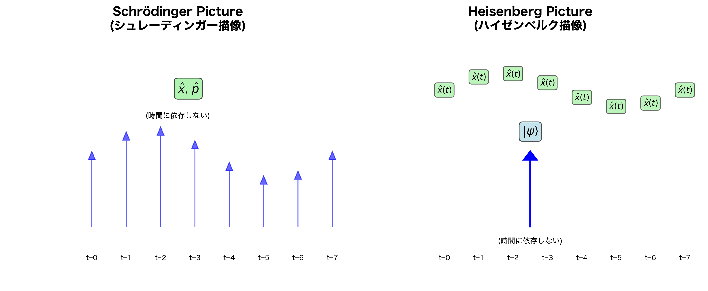

**図の説明：**
- **左図（シュレーディンガー描像）**: 状態ベクトル $|\psi(t)\rangle$ が時間発展し、演算子 $\hat{x}$、$\hat{p}$ は時間に依存しない。
- **右図（ハイゼンベルク描像）**: 状態ベクトル $|\psi\rangle$ は時間に依存せず、演算子 $\hat{x}(t)$、$\hat{p}(t)$ が時間発展する。
- 両描像は等価であり、物理量の期待値は同じ結果を与える。

---

### (ii) 調和振動子の時間発展

**問題の意味：**
調和振動子のハミルトニアンを用いて、位置演算子と運動量演算子の時間発展を具体的に求める。

**解答：**

**前提条件：**
調和振動子のハミルトニアンは、ハイゼンベルク描像での演算子を用いて：

$$\hat{H} = \frac{\hat{p}(t)^2}{2m} + \frac{1}{2}m\omega^2 \hat{x}(t)^2$$

ここで、$\hat{H}$ は時間に依存しない（定数）である。

**(a) 時間変化の式の導出：**

ハイゼンベルク方程式より：

$$\frac{d}{dt}\hat{x}(t) = \frac{i}{\hbar}[\hat{H}, \hat{x}(t)]$$

交換関係を計算する：

$$[\hat{H}, \hat{x}(t)] = \left[\frac{\hat{p}(t)^2}{2m} + \frac{1}{2}m\omega^2 \hat{x}(t)^2, \hat{x}(t)\right]$$

$$= \frac{1}{2m}[\hat{p}(t)^2, \hat{x}(t)] + \frac{1}{2}m\omega^2[\hat{x}(t)^2, \hat{x}(t)]$$

$[\hat{x}(t)^2, \hat{x}(t)] = 0$（同じ演算子同士は交換）より：

$$= \frac{1}{2m}[\hat{p}(t)^2, \hat{x}(t)]$$

**交換関係の公式の導出：**
一般に、$[\hat{A}^2, \hat{B}]$ を計算する：

$$[\hat{A}^2, \hat{B}] = \hat{A}^2\hat{B} - \hat{B}\hat{A}^2$$

ここで、$\hat{A}^2\hat{B} = \hat{A}(\hat{A}\hat{B}) = \hat{A}(\hat{B}\hat{A} + [\hat{A}, \hat{B}]) = \hat{A}\hat{B}\hat{A} + \hat{A}[\hat{A}, \hat{B}]$

また、$\hat{B}\hat{A}^2 = (\hat{B}\hat{A})\hat{A} = (\hat{A}\hat{B} - [\hat{A}, \hat{B}])\hat{A} = \hat{A}\hat{B}\hat{A} - [\hat{A}, \hat{B}]\hat{A}$

したがって：

$$[\hat{A}^2, \hat{B}] = \hat{A}\hat{B}\hat{A} + \hat{A}[\hat{A}, \hat{B}] - \hat{A}\hat{B}\hat{A} + [\hat{A}, \hat{B}]\hat{A} = \hat{A}[\hat{A}, \hat{B}] + [\hat{A}, \hat{B}]\hat{A}$$

この公式を用いると：

$$[\hat{p}(t)^2, \hat{x}(t)] = \hat{p}(t)[\hat{p}(t), \hat{x}(t)] + [\hat{p}(t), \hat{x}(t)]\hat{p}(t)$$

(i)より $[\hat{x}(t), \hat{p}(t)] = i\hbar$ なので、$[\hat{p}(t), \hat{x}(t)] = -i\hbar$ である。したがって：

$$[\hat{p}(t)^2, \hat{x}(t)] = \hat{p}(t)(-i\hbar) + (-i\hbar)\hat{p}(t) = -2i\hbar\hat{p}(t)$$

したがって：

$$[\hat{H}, \hat{x}(t)] = \frac{1}{2m}(-2i\hbar\hat{p}(t)) = -\frac{i\hbar}{m}\hat{p}(t)$$

よって：

$$\frac{d}{dt}\hat{x}(t) = \frac{i}{\hbar}\left(-\frac{i\hbar}{m}\hat{p}(t)\right) = \frac{\hat{p}(t)}{m}$$

次に、$\hat{p}(t)$ の時間変化：

$$\frac{d}{dt}\hat{p}(t) = \frac{i}{\hbar}[\hat{H}, \hat{p}(t)]$$

$$[\hat{H}, \hat{p}(t)] = \left[\frac{\hat{p}(t)^2}{2m} + \frac{1}{2}m\omega^2 \hat{x}(t)^2, \hat{p}(t)\right]$$

$$= \frac{1}{2m}[\hat{p}(t)^2, \hat{p}(t)] + \frac{1}{2}m\omega^2[\hat{x}(t)^2, \hat{p}(t)]$$

$[\hat{p}(t)^2, \hat{p}(t)] = 0$ より：

$$= \frac{1}{2}m\omega^2[\hat{x}(t)^2, \hat{p}(t)]$$

同様に、$[\hat{x}(t)^2, \hat{p}(t)] = \hat{x}(t)[\hat{x}(t), \hat{p}(t)] + [\hat{x}(t), \hat{p}(t)]\hat{x}(t) = \hat{x}(t)(i\hbar) + (i\hbar)\hat{x}(t) = 2i\hbar\hat{x}(t)$

したがって：

$$[\hat{H}, \hat{p}(t)] = \frac{1}{2}m\omega^2(2i\hbar\hat{x}(t)) = im\omega^2\hbar\hat{x}(t)$$

よって：

$$\frac{d}{dt}\hat{p}(t) = \frac{i}{\hbar}(im\omega^2\hbar\hat{x}(t)) = -m\omega^2\hat{x}(t)$$

まとめると：

$$\frac{d}{dt}\hat{x}(t) = \frac{\hat{p}(t)}{m}$$

$$\frac{d}{dt}\hat{p}(t) = -m\omega^2\hat{x}(t)$$

**(b) 微分方程式の解：**

上記の連立微分方程式：

$$\frac{d}{dt}\hat{x}(t) = \frac{\hat{p}(t)}{m} \tag{1}$$

$$\frac{d}{dt}\hat{p}(t) = -m\omega^2\hat{x}(t) \tag{2}$$

を解く。連立方程式を解く一つの方法は、一方の変数を消去して1つの微分方程式に変形することである。

**ステップ1：$\hat{x}(t)$ の2階微分方程式への変形**

式(1)を時間 $t$ で微分する：

$$\frac{d^2}{dt^2}\hat{x}(t) = \frac{d}{dt}\left(\frac{\hat{p}(t)}{m}\right) = \frac{1}{m}\frac{d}{dt}\hat{p}(t)$$

ここで式(2)を代入すると：

$$\frac{d^2}{dt^2}\hat{x}(t) = \frac{1}{m}(-m\omega^2\hat{x}(t)) = -\omega^2\hat{x}(t)$$

したがって、$\hat{x}(t)$ についての2階線形同次微分方程式が得られる：

$$\frac{d^2}{dt^2}\hat{x}(t) + \omega^2\hat{x}(t) = 0 \tag{3}$$

これは調和振動の方程式である。

**ステップ2：特性方程式による一般解の導出**

式(3)の解を求めるため、特性方程式を考える。$\hat{x}(t) = e^{\lambda t}$ の形の解を仮定すると（$\lambda$ は定数）：

$$\lambda^2 e^{\lambda t} + \omega^2 e^{\lambda t} = 0$$

$e^{\lambda t} \neq 0$ より：

$$\lambda^2 + \omega^2 = 0$$

したがって：

$$\lambda = \pm i\omega$$

ここで $i = \sqrt{-1}$ は虚数単位である。2つの独立な解 $e^{i\omega t}$ と $e^{-i\omega t}$ の線形結合が一般解となる。オイラーの公式 $e^{i\theta} = \cos\theta + i\sin\theta$ を用いると、実数解として：

$$\hat{x}(t) = \hat{A}\cos(\omega t) + \hat{B}\sin(\omega t) \tag{4}$$

ここで、$\hat{A}$、$\hat{B}$ は時間に依存しない演算子（初期時刻 $t=0$ での値から決まる定数演算子）である。

**ステップ3：初期条件による定数の決定**

初期条件：$t=0$ で $\hat{x}(0) = \hat{x}$、$\hat{p}(0) = \hat{p}$ を用いて $\hat{A}$ と $\hat{B}$ を決定する。

まず、$t=0$ を式(4)に代入：

$$\hat{x}(0) = \hat{A}\cos(0) + \hat{B}\sin(0) = \hat{A} \cdot 1 + \hat{B} \cdot 0 = \hat{A}$$

初期条件 $\hat{x}(0) = \hat{x}$ より：

$$\hat{A} = \hat{x} \tag{5}$$

次に、$\hat{B}$ を求める。式(4)を時間で微分：

$$\frac{d}{dt}\hat{x}(t) = -\omega\hat{A}\sin(\omega t) + \omega\hat{B}\cos(\omega t)$$

$t=0$ を代入：

$$\frac{d}{dt}\hat{x}(0) = -\omega\hat{A}\sin(0) + \omega\hat{B}\cos(0) = -\omega\hat{A} \cdot 0 + \omega\hat{B} \cdot 1 = \omega\hat{B}$$

一方、式(1)より：

$$\frac{d}{dt}\hat{x}(0) = \frac{\hat{p}(0)}{m} = \frac{\hat{p}}{m}$$

したがって：

$$\omega\hat{B} = \frac{\hat{p}}{m}$$

よって：

$$\hat{B} = \frac{\hat{p}}{m\omega} \tag{6}$$

**ステップ4：$\hat{x}(t)$ の最終形**

式(5)と式(6)を式(4)に代入：

$$\hat{x}(t) = \hat{x}\cos(\omega t) + \frac{\hat{p}}{m\omega}\sin(\omega t) \tag{7}$$

**ステップ5：$\hat{p}(t)$ の導出**

$\hat{p}(t)$ は式(1)と式(7)から求める。式(7)を時間で微分：

$$\frac{d}{dt}\hat{x}(t) = -\omega\hat{x}\sin(\omega t) + \omega\frac{\hat{p}}{m\omega}\cos(\omega t) = -\omega\hat{x}\sin(\omega t) + \frac{\hat{p}}{m}\cos(\omega t)$$

式(1)より $\hat{p}(t) = m\frac{d}{dt}\hat{x}(t)$ なので：

$$\hat{p}(t) = m\left(-\omega\hat{x}\sin(\omega t) + \frac{\hat{p}}{m}\cos(\omega t)\right) = -m\omega\hat{x}\sin(\omega t) + \hat{p}\cos(\omega t) \tag{8}$$

**まとめ：**

$$\hat{x}(t) = \hat{x}\cos(\omega t) + \frac{\hat{p}}{m\omega}\sin(\omega t)$$

$$\hat{p}(t) = \hat{p}\cos(\omega t) - m\omega\hat{x}\sin(\omega t)$$

**物理的意味：**
- 位置演算子と運動量演算子は、古典力学の調和振動子と同じ形で時間発展する
- $\cos(\omega t)$ と $\sin(\omega t)$ の項は、初期位置と初期運動量の寄与を表す
- 角振動数 $\omega$ で振動する

**図：調和振動子の時間発展**

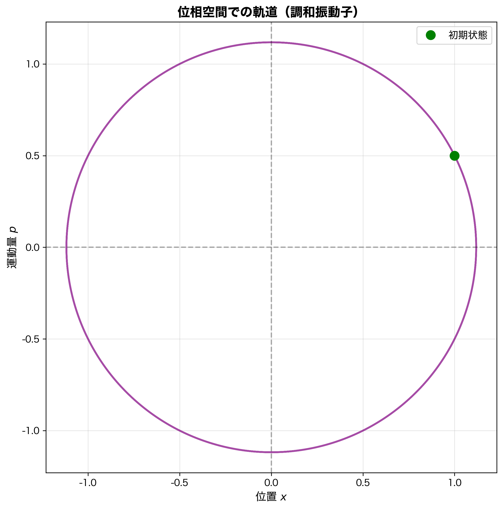

**図の説明：**
- **上図**: 位置演算子 $\hat{x}(t)$ の時間発展。調和振動の形で時間変化する。
- **下図**: 運動量演算子 $\hat{p}(t)$ の時間発展。位置に対して位相が $\pi/2$ ずれている。
- 両者は古典的な調和振動と同じ形で時間発展する。

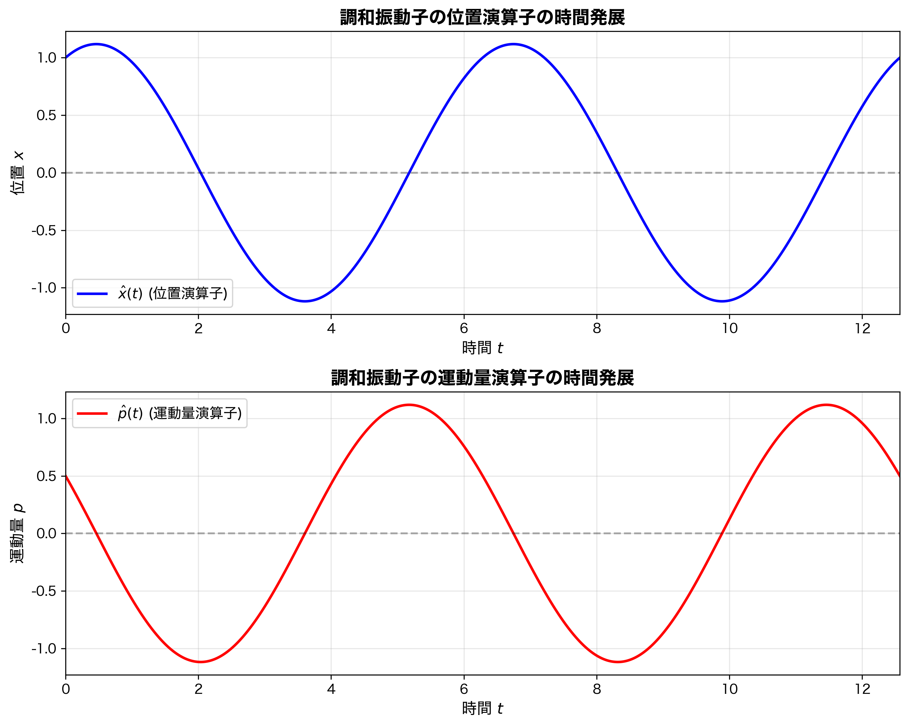

**図の説明：**
- 位相空間（位置 $x$ と運動量 $p$ の平面）での軌道は楕円形になる。
- これは古典力学の調和振動子と同じ形である。

**(c) 昇降演算子の時間発展：**

昇降演算子は以下のように定義される：

$$\hat{a}(t) = \sqrt{\frac{m\omega}{2\hbar}}\hat{x}(t) + i\frac{\hat{p}(t)}{\sqrt{2m\omega\hbar}}$$

$$\hat{a}^\dagger(t) = \sqrt{\frac{m\omega}{2\hbar}}\hat{x}(t) - i\frac{\hat{p}(t)}{\sqrt{2m\omega\hbar}}$$

(b)の結果を代入する：

$$\hat{a}(t) = \sqrt{\frac{m\omega}{2\hbar}}\left[\hat{x}\cos(\omega t) + \frac{\hat{p}}{m\omega}\sin(\omega t)\right] + i\frac{1}{\sqrt{2m\omega\hbar}}\left[\hat{p}\cos(\omega t) - m\omega\hat{x}\sin(\omega t)\right]$$

$$= \sqrt{\frac{m\omega}{2\hbar}}\hat{x}\cos(\omega t) + \sqrt{\frac{m\omega}{2\hbar}}\frac{\hat{p}}{m\omega}\sin(\omega t) + i\frac{\hat{p}}{\sqrt{2m\omega\hbar}}\cos(\omega t) - i\frac{m\omega\hat{x}}{\sqrt{2m\omega\hbar}}\sin(\omega t)$$

$$= \sqrt{\frac{m\omega}{2\hbar}}\hat{x}\cos(\omega t) + \frac{\hat{p}}{\sqrt{2m\omega\hbar}}\sin(\omega t) + i\frac{\hat{p}}{\sqrt{2m\omega\hbar}}\cos(\omega t) - i\sqrt{\frac{m\omega}{2\hbar}}\hat{x}\sin(\omega t)$$

$\hat{x}$ と $\hat{p}$ の項をまとめる：

$$\hat{a}(t) = \sqrt{\frac{m\omega}{2\hbar}}\hat{x}\left[\cos(\omega t) - i\sin(\omega t)\right] + \frac{\hat{p}}{\sqrt{2m\omega\hbar}}\left[\sin(\omega t) + i\cos(\omega t)\right]$$

オイラーの公式 $e^{-i\omega t} = \cos(\omega t) - i\sin(\omega t)$ と $ie^{-i\omega t} = i\cos(\omega t) + \sin(\omega t)$ を用いると：

$$\hat{a}(t) = \sqrt{\frac{m\omega}{2\hbar}}\hat{x}e^{-i\omega t} + \frac{\hat{p}}{\sqrt{2m\omega\hbar}}ie^{-i\omega t}$$

$$= e^{-i\omega t}\left[\sqrt{\frac{m\omega}{2\hbar}}\hat{x} + i\frac{\hat{p}}{\sqrt{2m\omega\hbar}}\right] = e^{-i\omega t}\hat{a}$$

同様に、$\hat{a}^\dagger(t)$ について：

$$\hat{a}^\dagger(t) = \sqrt{\frac{m\omega}{2\hbar}}\hat{x}(t) - i\frac{\hat{p}(t)}{\sqrt{2m\omega\hbar}}$$

$$= \sqrt{\frac{m\omega}{2\hbar}}\left[\hat{x}\cos(\omega t) + \frac{\hat{p}}{m\omega}\sin(\omega t)\right] - i\frac{1}{\sqrt{2m\omega\hbar}}\left[\hat{p}\cos(\omega t) - m\omega\hat{x}\sin(\omega t)\right]$$

$$= \sqrt{\frac{m\omega}{2\hbar}}\hat{x}\cos(\omega t) + \frac{\hat{p}}{\sqrt{2m\omega\hbar}}\sin(\omega t) - i\frac{\hat{p}}{\sqrt{2m\omega\hbar}}\cos(\omega t) + i\sqrt{\frac{m\omega}{2\hbar}}\hat{x}\sin(\omega t)$$

$$= \sqrt{\frac{m\omega}{2\hbar}}\hat{x}\left[\cos(\omega t) + i\sin(\omega t)\right] + \frac{\hat{p}}{\sqrt{2m\omega\hbar}}\left[\sin(\omega t) - i\cos(\omega t)\right]$$

$e^{i\omega t} = \cos(\omega t) + i\sin(\omega t)$ と $-ie^{i\omega t} = -i\cos(\omega t) + \sin(\omega t)$ を用いると：

$$\hat{a}^\dagger(t) = \sqrt{\frac{m\omega}{2\hbar}}\hat{x}e^{i\omega t} - i\frac{\hat{p}}{\sqrt{2m\omega\hbar}}e^{i\omega t}$$

$$= e^{i\omega t}\left[\sqrt{\frac{m\omega}{2\hbar}}\hat{x} - i\frac{\hat{p}}{\sqrt{2m\omega\hbar}}\right] = e^{i\omega t}\hat{a}^\dagger$$

まとめると：

$$\hat{a}(t) = e^{-i\omega t}\hat{a}$$

$$\hat{a}^\dagger(t) = e^{i\omega t}\hat{a}^\dagger$$

**別解：ハミルトニアンの交換子と個数演算子を用いた方法**

ハイゼンベルクの運動方程式を用いると、より直接的に計算できる。調和振動子のハミルトニアンは個数演算子 $\hat{N} = \hat{a}^\dagger\hat{a}$ を用いて：

$$\hat{H} = \hbar\omega\left(\hat{a}^\dagger\hat{a} + \frac{1}{2}\right) = \hbar\omega\left(\hat{N} + \frac{1}{2}\right)$$

まず、ハミルトニアンと昇降演算子の交換関係を計算する。交換子の基本公式 $[AB, C] = A[B, C] + [A, C]B$ を用いる。

**$[\hat{H}, \hat{a}]$ の計算：**

$$\hat{H} = \hbar\omega\left(\hat{a}^\dagger\hat{a} + \frac{1}{2}\right)$$

交換子の線形性 $[A + B, C] = [A, C] + [B, C]$ を用いると：

$$[\hat{H}, \hat{a}] = \left[\hbar\omega\left(\hat{a}^\dagger\hat{a} + \frac{1}{2}\right), \hat{a}\right] = \hbar\omega\left[\hat{a}^\dagger\hat{a} + \frac{1}{2}, \hat{a}\right] = \hbar\omega\left([\hat{a}^\dagger\hat{a}, \hat{a}] + \left[\frac{1}{2}, \hat{a}\right]\right)$$

ここで、$\frac{1}{2}$ は定数（スカラー）であり、任意の演算子 $\hat{a}$ と可換である。つまり：

$$\left[\frac{1}{2}, \hat{a}\right] = \frac{1}{2}\hat{a} - \hat{a}\frac{1}{2} = \frac{1}{2}\hat{a} - \frac{1}{2}\hat{a} = 0$$

したがって：

$$[\hat{H}, \hat{a}] = \hbar\omega\left([\hat{a}^\dagger\hat{a}, \hat{a}] + 0\right) = \hbar\omega[\hat{a}^\dagger\hat{a}, \hat{a}]$$

交換子の公式 $[AB, C] = A[B, C] + [A, C]B$ を $[\hat{a}^\dagger\hat{a}, \hat{a}]$ に適用する：

$$[\hat{a}^\dagger\hat{a}, \hat{a}] = \hat{a}^\dagger[\hat{a}, \hat{a}] + [\hat{a}^\dagger, \hat{a}]\hat{a}$$

ここで：
- $[\hat{a}, \hat{a}] = 0$（任意の演算子は自分自身と可換）
- $[\hat{a}^\dagger, \hat{a}] = -[\hat{a}, \hat{a}^\dagger] = -1$（交換関係の反対称性と $[\hat{a}, \hat{a}^\dagger] = 1$ より）

したがって：

$$[\hat{a}^\dagger\hat{a}, \hat{a}] = \hat{a}^\dagger \cdot 0 + (-1) \cdot \hat{a} = -\hat{a}$$

よって：

$$[\hat{H}, \hat{a}] = \hbar\omega[\hat{a}^\dagger\hat{a}, \hat{a}] = \hbar\omega(-\hat{a}) = -\hbar\omega\hat{a}$$

**$[\hat{H}, \hat{a}^\dagger]$ の計算：**

同様に、交換子の線形性を用いると：

$$[\hat{H}, \hat{a}^\dagger] = \left[\hbar\omega\left(\hat{a}^\dagger\hat{a} + \frac{1}{2}\right), \hat{a}^\dagger\right] = \hbar\omega\left([\hat{a}^\dagger\hat{a}, \hat{a}^\dagger] + \left[\frac{1}{2}, \hat{a}^\dagger\right]\right)$$

定数 $\frac{1}{2}$ は $\hat{a}^\dagger$ と可換なので $\left[\frac{1}{2}, \hat{a}^\dagger\right] = 0$ である。したがって：

$$[\hat{H}, \hat{a}^\dagger] = \hbar\omega[\hat{a}^\dagger\hat{a}, \hat{a}^\dagger]$$

交換子の公式 $[AB, C] = A[B, C] + [A, C]B$ を $[\hat{a}^\dagger\hat{a}, \hat{a}^\dagger]$ に適用する：

$$[\hat{a}^\dagger\hat{a}, \hat{a}^\dagger] = \hat{a}^\dagger[\hat{a}, \hat{a}^\dagger] + [\hat{a}^\dagger, \hat{a}^\dagger]\hat{a}$$

ここで：
- $[\hat{a}, \hat{a}^\dagger] = 1$（昇降演算子の基本交換関係）
- $[\hat{a}^\dagger, \hat{a}^\dagger] = 0$（任意の演算子は自分自身と可換）

したがって：

$$[\hat{a}^\dagger\hat{a}, \hat{a}^\dagger] = \hat{a}^\dagger \cdot 1 + 0 \cdot \hat{a} = \hat{a}^\dagger$$

よって：

$$[\hat{H}, \hat{a}^\dagger] = \hbar\omega[\hat{a}^\dagger\hat{a}, \hat{a}^\dagger] = \hbar\omega\hat{a}^\dagger$$

ハイゼンベルクの運動方程式：

$$\frac{d\hat{a}(t)}{dt} = \frac{i}{\hbar}[\hat{H}, \hat{a}(t)] = \frac{i}{\hbar}(-\hbar\omega\hat{a}(t)) = -i\omega\hat{a}(t)$$

$$\frac{d\hat{a}^\dagger(t)}{dt} = \frac{i}{\hbar}[\hat{H}, \hat{a}^\dagger(t)] = \frac{i}{\hbar}(\hbar\omega\hat{a}^\dagger(t)) = i\omega\hat{a}^\dagger(t)$$

これらの微分方程式を解く。$\hat{a}(t)$ について：

$$\frac{d\hat{a}(t)}{dt} = -i\omega\hat{a}(t)$$

これは1階線形微分方程式で、解は：

$$\hat{a}(t) = \hat{a}(0)e^{-i\omega t} = \hat{a}e^{-i\omega t}$$

同様に、$\hat{a}^\dagger(t)$ について：

$$\frac{d\hat{a}^\dagger(t)}{dt} = i\omega\hat{a}^\dagger(t)$$

解は：

$$\hat{a}^\dagger(t) = \hat{a}^\dagger(0)e^{i\omega t} = \hat{a}^\dagger e^{i\omega t}$$

したがって、同じ結果が得られる：

$$\hat{a}(t) = e^{-i\omega t}\hat{a}$$

$$\hat{a}^\dagger(t) = e^{i\omega t}\hat{a}^\dagger$$

**この方法の利点：**
- 位置演算子と運動量演算子の時間発展を事前に求める必要がない
- ハミルトニアンと昇降演算子の交換関係のみから直接導出できる
- 個数演算子 $\hat{N} = \hat{a}^\dagger\hat{a}$ がハミルトニアンと可換であること（$[\hat{H}, \hat{N}] = 0$）が本質的である

**用語解説：**
- **昇降演算子**: 調和振動子のエネルギー固有状態間を移動させる演算子。$\hat{a}$ は下降演算子、$\hat{a}^\dagger$ は上昇演算子。
- **調和振動**: 角振動数 $\omega$ で振動する運動。古典力学でも量子力学でも同じ形の方程式が現れる。

**物理的意味：**
調和振動子では、位置と運動量の演算子が古典的な調和振動と同じ形で時間発展する。昇降演算子は位相因子 $e^{\pm i\omega t}$ で時間発展し、これはエネルギー固有状態の時間発展と一致する。

---

## 問題 8-2: 位置演算子の固有ベクトル $|x\rangle$ は完全系条件を満たすか?

**問題設定：**
1次元調和振動子において、位置演算子の固有ベクトル $|x\rangle$ を生成演算子と基底状態を用いて表し、その完全性関係を調べる。

**前提条件：**
位置演算子 $\hat{x}$ と運動量演算子 $\hat{p}$ は、昇降演算子 $\hat{a}$、$\hat{a}^\dagger$ を用いて：

$$\hat{x} = \sqrt{\frac{\hbar}{2m\omega}}(\hat{a} + \hat{a}^\dagger)$$

$$\hat{p} = -i\sqrt{\frac{m\hbar\omega}{2}}(\hat{a} - \hat{a}^\dagger)$$

また、$[\hat{a}, \hat{a}^\dagger] = 1$ である。

### (i) 位置固有ベクトルの微分方程式

**問題の意味：**
位置固有ベクトル $|x\rangle$ を生成演算子 $\hat{a}^\dagger$ の関数と基底状態 $|0\rangle$ を用いて表し、固有値方程式を満たすための条件を求める。

**解答：**

**仮定：**
位置固有ベクトル $|x\rangle$ を以下の形で表す：

$$|x\rangle = f(\hat{a}^\dagger)|0\rangle$$

ここで、$f(\hat{a}^\dagger)$ は $\hat{a}^\dagger$ の関数、$|0\rangle$ は基底状態（$\hat{a}|0\rangle = 0$）である。

**固有値方程式：**
$|x\rangle$ が位置演算子の固有ベクトルであるためには：

$$\hat{x}|x\rangle = x|x\rangle$$

が成り立つ必要がある。

**左辺の計算：**
$\hat{x} = \sqrt{\frac{\hbar}{2m\omega}}(\hat{a} + \hat{a}^\dagger)$ より：

$$\hat{x}|x\rangle = \sqrt{\frac{\hbar}{2m\omega}}(\hat{a} + \hat{a}^\dagger)f(\hat{a}^\dagger)|0\rangle$$

$$= \sqrt{\frac{\hbar}{2m\omega}}\left[\hat{a}f(\hat{a}^\dagger)|0\rangle + \hat{a}^\dagger f(\hat{a}^\dagger)|0\rangle\right]$$

第1項について：$\hat{a}$ と $f(\hat{a}^\dagger)$ の交換関係を考える。

**交換関係の計算：**
まず、$[\hat{a}, (\hat{a}^\dagger)^n]$ を計算する。$[\hat{a}, \hat{a}^\dagger] = 1$ より：

$$[\hat{a}, (\hat{a}^\dagger)^n] = \hat{a}(\hat{a}^\dagger)^n - (\hat{a}^\dagger)^n\hat{a}$$

帰納法を用いると、$n=1$ のとき $[\hat{a}, \hat{a}^\dagger] = 1$ である。$n$ のとき成り立つと仮定すると：

$$[\hat{a}, (\hat{a}^\dagger)^{n+1}] = \hat{a}(\hat{a}^\dagger)^{n+1} - (\hat{a}^\dagger)^{n+1}\hat{a}$$

$$= \hat{a}(\hat{a}^\dagger)^n\hat{a}^\dagger - (\hat{a}^\dagger)^n\hat{a}^\dagger\hat{a}$$

ここで、$\hat{a}(\hat{a}^\dagger)^n = (\hat{a}^\dagger)^n\hat{a} + n(\hat{a}^\dagger)^{n-1}$（帰納法の仮定より）を用いると：

$$= [(\hat{a}^\dagger)^n\hat{a} + n(\hat{a}^\dagger)^{n-1}]\hat{a}^\dagger - (\hat{a}^\dagger)^n(\hat{a}\hat{a}^\dagger)$$

$$= (\hat{a}^\dagger)^n\hat{a}\hat{a}^\dagger + n(\hat{a}^\dagger)^n - (\hat{a}^\dagger)^n(\hat{a}^\dagger\hat{a} + 1)$$

$$= (\hat{a}^\dagger)^n\hat{a}\hat{a}^\dagger + n(\hat{a}^\dagger)^n - (\hat{a}^\dagger)^n\hat{a}^\dagger\hat{a} - (\hat{a}^\dagger)^n$$

$$= (\hat{a}^\dagger)^n[\hat{a}, \hat{a}^\dagger] + (n-1)(\hat{a}^\dagger)^n = (\hat{a}^\dagger)^n + (n-1)(\hat{a}^\dagger)^n = n(\hat{a}^\dagger)^n$$

したがって、$[\hat{a}, (\hat{a}^\dagger)^n] = n(\hat{a}^\dagger)^{n-1}$ が成り立つ。

$f(\hat{a}^\dagger)$ が $\hat{a}^\dagger$ のべき級数 $f(\hat{a}^\dagger) = \sum_{n=0}^{\infty}c_n(\hat{a}^\dagger)^n$ で表されるとき：

$$[\hat{a}, f(\hat{a}^\dagger)] = \sum_{n=0}^{\infty}c_n[\hat{a}, (\hat{a}^\dagger)^n] = \sum_{n=1}^{\infty}c_n n(\hat{a}^\dagger)^{n-1} = f'(\hat{a}^\dagger)$$

ここで、$f'(\hat{a}^\dagger)$ は $f$ を $\hat{a}^\dagger$ で形式的に微分したものである。

したがって：

$$\hat{a}f(\hat{a}^\dagger) = f(\hat{a}^\dagger)\hat{a} + f'(\hat{a}^\dagger)$$

$\hat{a}|0\rangle = 0$ より：

$$\hat{a}f(\hat{a}^\dagger)|0\rangle = f(\hat{a}^\dagger)\hat{a}|0\rangle + f'(\hat{a}^\dagger)|0\rangle = f'(\hat{a}^\dagger)|0\rangle$$

第2項について：$\hat{a}^\dagger$ と $f(\hat{a}^\dagger)$ は交換するので：

$$\hat{a}^\dagger f(\hat{a}^\dagger)|0\rangle = f(\hat{a}^\dagger)\hat{a}^\dagger|0\rangle$$

したがって：

$$\hat{x}|x\rangle = \sqrt{\frac{\hbar}{2m\omega}}\left[f'(\hat{a}^\dagger)|0\rangle + f(\hat{a}^\dagger)\hat{a}^\dagger|0\rangle\right]$$

$$= \sqrt{\frac{\hbar}{2m\omega}}\left[f'(\hat{a}^\dagger) + f(\hat{a}^\dagger)\hat{a}^\dagger\right]|0\rangle$$

**右辺の計算：**
$$x|x\rangle = xf(\hat{a}^\dagger)|0\rangle$$

**等式の条件：**
両辺を比較すると：

$$\sqrt{\frac{\hbar}{2m\omega}}\left[f'(\hat{a}^\dagger) + f(\hat{a}^\dagger)\hat{a}^\dagger\right]|0\rangle = xf(\hat{a}^\dagger)|0\rangle$$

この等式が成り立つためには、演算子部分が等しくなる必要がある。しかし、$|0\rangle$ は任意の状態ではないので、より直接的に考える。

$\xi = \sqrt{\frac{m\omega}{\hbar}}x$ とおくと、$x = \sqrt{\frac{\hbar}{m\omega}}\xi$ である。

等式を整理すると：

$$f'(\hat{a}^\dagger) + f(\hat{a}^\dagger)\hat{a}^\dagger = \sqrt{\frac{2m\omega}{\hbar}}x f(\hat{a}^\dagger) = \sqrt{2}\xi f(\hat{a}^\dagger)$$

したがって：

$$f'(\hat{a}^\dagger) + f(\hat{a}^\dagger)(\hat{a}^\dagger - \sqrt{2}\xi) = 0$$

これが $f(\hat{a}^\dagger)$ が満たすべき微分方程式である。

**用語解説：**
- **位置固有ベクトル**: 位置演算子の固有ベクトル。連続スペクトルを持つ。
- **生成演算子**: 基底状態から励起状態を作る演算子。$\hat{a}^\dagger|n\rangle = \sqrt{n+1}|n+1\rangle$

**物理的意味：**
位置固有ベクトルを生成演算子の関数として表すことで、調和振動子の基底状態から位置固有状態を構築できる。これは、位置表示とエネルギー固有状態表示の関係を示している。

**図：位置固有ベクトルの構成**

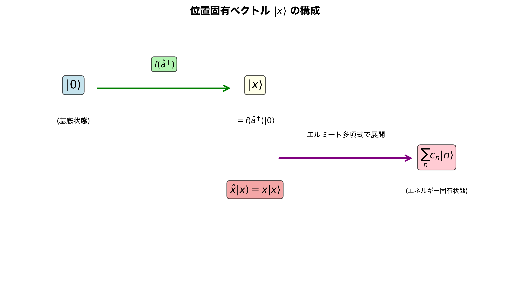

**図の説明：**
- 基底状態 $|0\rangle$ に生成演算子の関数 $f(\hat{a}^\dagger)$ を作用させることで、位置固有ベクトル $|x\rangle$ が得られる。
- 位置固有ベクトルは、固有値方程式 $\hat{x}|x\rangle = x|x\rangle$ を満たす。
- 位置固有ベクトルは、エルミート多項式を用いてエネルギー固有状態 $|n\rangle$ で展開できる。

---

### (ii) 微分方程式の解とエルミート多項式による展開

**問題の意味：**
(i)で求めた微分方程式を解き、位置固有ベクトルをエルミート多項式とエネルギー固有状態で展開する。

**解答：**

**微分方程式の解：**
(i)より、$f(\hat{a}^\dagger)$ は以下の微分方程式を満たす：

$$f'(\hat{a}^\dagger) + (\hat{a}^\dagger - \sqrt{2}\xi)f(\hat{a}^\dagger) = 0$$

この微分方程式を解く。変数分離形として：

$$\frac{f'(\hat{a}^\dagger)}{f(\hat{a}^\dagger)} = -(\hat{a}^\dagger - \sqrt{2}\xi)$$

両辺を $\hat{a}^\dagger$ で積分すると：

$$\ln f(\hat{a}^\dagger) = -\frac{1}{2}(\hat{a}^\dagger - \sqrt{2}\xi)^2 + C$$

ここで、$C$ は積分定数（$\hat{a}^\dagger$ に依存しない）である。

したがって：

$$f(\hat{a}^\dagger) = c(\xi)e^{-\frac{1}{2}(\hat{a}^\dagger - \sqrt{2}\xi)^2}$$

ここで、$c(\xi)$ は $\xi$ の関数である（積分定数を含む）。

したがって：

$$|x\rangle = c(\xi)e^{-\frac{1}{2}(\hat{a}^\dagger - \sqrt{2}\xi)^2}|0\rangle$$

**エルミート多項式による展開：**

指数関数を展開する：

$$e^{-\frac{1}{2}(\hat{a}^\dagger - \sqrt{2}\xi)^2} = e^{-\frac{1}{2}(\hat{a}^\dagger)^2 + \sqrt{2}\xi\hat{a}^\dagger - \xi^2}$$

$$= e^{-\xi^2}e^{-\frac{1}{2}(\hat{a}^\dagger)^2 + \sqrt{2}\xi\hat{a}^\dagger}$$

エルミート多項式の母関数は：

$$\sum_{n=0}^{\infty}\frac{H_n(\xi)}{n!}s^n = e^{-s^2 + 2s\xi}$$

ここで、$s$ は任意の変数である。この式で $s = \hat{a}^\dagger/\sqrt{2}$ とおくと：

$$s^2 = \left(\frac{\hat{a}^\dagger}{\sqrt{2}}\right)^2 = \frac{(\hat{a}^\dagger)^2}{2}$$

$$2s\xi = 2 \cdot \frac{\hat{a}^\dagger}{\sqrt{2}} \cdot \xi = \sqrt{2}\hat{a}^\dagger\xi$$

したがって：

$$\sum_{n=0}^{\infty}\frac{H_n(\xi)}{n!}\left(\frac{\hat{a}^\dagger}{\sqrt{2}}\right)^n = e^{-\frac{(\hat{a}^\dagger)^2}{2} + \sqrt{2}\hat{a}^\dagger\xi}$$

したがって：

$$e^{-\frac{1}{2}(\hat{a}^\dagger)^2 + \sqrt{2}\xi\hat{a}^\dagger} = \sum_{n=0}^{\infty}\frac{H_n(\xi)}{n!}\left(\frac{\hat{a}^\dagger}{\sqrt{2}}\right)^n$$

$$= \sum_{n=0}^{\infty}\frac{H_n(\xi)}{2^{n/2}n!}(\hat{a}^\dagger)^n$$

したがって：

$$|x\rangle = c(\xi)e^{-\xi^2}\sum_{n=0}^{\infty}\frac{H_n(\xi)}{2^{n/2}n!}(\hat{a}^\dagger)^n|0\rangle$$

規格化されたエネルギー固有状態は：

$$|n\rangle = \frac{1}{\sqrt{n!}}(\hat{a}^\dagger)^n|0\rangle$$

したがって：

$$(\hat{a}^\dagger)^n|0\rangle = \sqrt{n!}|n\rangle$$

これを用いると：

$$|x\rangle = c(\xi)e^{-\xi^2}\sum_{n=0}^{\infty}\frac{H_n(\xi)}{2^{n/2}n!}\sqrt{n!}|n\rangle$$

$$= c(\xi)e^{-\xi^2}\sum_{n=0}^{\infty}\frac{H_n(\xi)}{\sqrt{2^n n!}}|n\rangle$$

これが求める展開である。

**図：エルミート多項式**

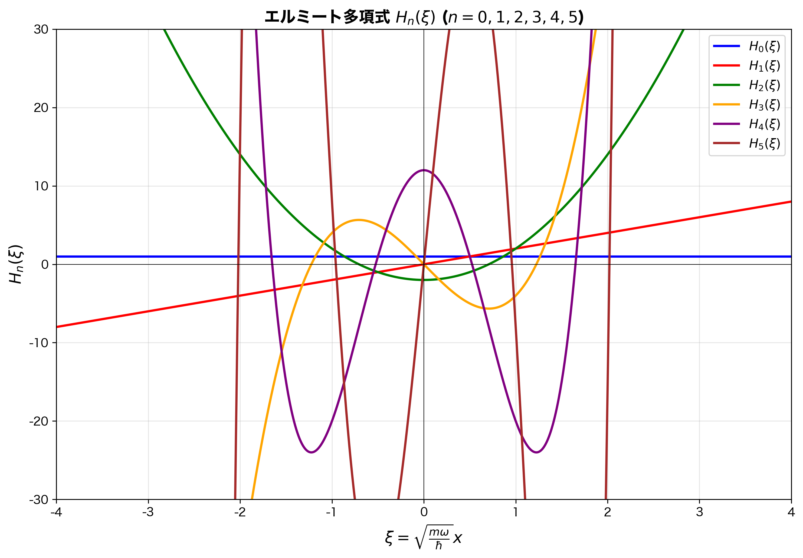

**図の説明：**
- エルミート多項式 $H_n(\xi)$ ($n = 0, 1, 2, 3, 4, 5$) のグラフ。
- $H_0(\xi) = 1$（定数）、$H_1(\xi) = 2\xi$（直線）、$H_2(\xi) = 4\xi^2 - 2$（放物線）など。
- 次数が高いほど、振動が激しくなる。
- これらの多項式は、調和振動子の波動関数の空間依存性を記述する。

**用語解説：**
- **エルミート多項式**: 調和振動子の波動関数に現れる特殊関数。$H_n(\xi)$ で表される。
- **母関数**: 関数の級数展開の係数を生成する関数。エルミート多項式の母関数は $e^{-s^2 + 2s\xi} = \sum_{n=0}^{\infty}\frac{H_n(\xi)}{n!}s^n$

**物理的意味：**
位置固有ベクトルをエネルギー固有状態で展開することで、位置表示とエネルギー表示の関係が明らかになる。エルミート多項式は、調和振動子の波動関数の空間依存性を記述する。

---

### (iii) 規格化定数の決定

**問題の意味：**
基底状態の波動関数が既知であることを用いて、$c(\xi)$ を決定する。

**解答：**

**前提条件：**
基底状態の波動関数は：

$$\langle x|0\rangle = \left(\frac{m\omega}{\pi\hbar}\right)^{1/4}e^{-\xi^2/2}H_0(\xi)$$

ここで、$H_0(\xi) = 1$ である（0次のエルミート多項式は定数1）。

**内積の計算：**
(ii)より：

$$|x\rangle = c(\xi)e^{-\xi^2}\sum_{n=0}^{\infty}\frac{H_n(\xi)}{\sqrt{2^n n!}}|n\rangle$$

したがって：

$$\langle x|0\rangle = c(\xi)e^{-\xi^2}\sum_{n=0}^{\infty}\frac{H_n(\xi)}{\sqrt{2^n n!}}\langle 0|n\rangle$$

$\langle 0|n\rangle = \delta_{n,0}$（直交性）より：

$$\langle x|0\rangle = c(\xi)e^{-\xi^2}\frac{H_0(\xi)}{\sqrt{2^0 \cdot 0!}} = c(\xi)e^{-\xi^2}H_0(\xi) = c(\xi)e^{-\xi^2}$$

**規格化定数の決定：**
既知の結果と比較すると：

$$c(\xi)e^{-\xi^2} = \left(\frac{m\omega}{\pi\hbar}\right)^{1/4}e^{-\xi^2/2}H_0(\xi) = \left(\frac{m\omega}{\pi\hbar}\right)^{1/4}e^{-\xi^2/2}$$

したがって：

$$c(\xi) = \left(\frac{m\omega}{\pi\hbar}\right)^{1/4}e^{\xi^2/2}$$

これが求める規格化定数である。

**用語解説：**
- **規格化定数**: 波動関数や状態ベクトルを規格化するための定数。確率解釈に必要。
- **基底状態**: エネルギーが最小の状態。調和振動子では $|0\rangle$。

**物理的意味：**
規格化定数は、位置固有ベクトルが正しく規格化されるように決まる。基底状態の波動関数が既知であることから、位置固有ベクトルの規格化定数が一意に決まる。

---

### (iv) 完全性関係の証明

**問題の意味：**
位置固有ベクトルの完全性関係とエネルギー固有状態の完全性関係が等しいことを示す。

**解答：**

**左辺の計算：**
位置固有ベクトルの完全性関係：

$$\int_{-\infty}^{\infty}dx |x\rangle\langle x|$$

(ii)と(iii)より：

$$|x\rangle = c(\xi)e^{-\xi^2}\sum_{n=0}^{\infty}\frac{H_n(\xi)}{\sqrt{2^n n!}}|n\rangle$$

$$c(\xi) = \left(\frac{m\omega}{\pi\hbar}\right)^{1/4}e^{\xi^2/2}$$

したがって：

$$|x\rangle = \left(\frac{m\omega}{\pi\hbar}\right)^{1/4}e^{-\xi^2/2}\sum_{n=0}^{\infty}\frac{H_n(\xi)}{\sqrt{2^n n!}}|n\rangle$$

エルミート共役を取ると：

$$\langle x| = \left(\frac{m\omega}{\pi\hbar}\right)^{1/4}e^{-\xi^2/2}\sum_{m=0}^{\infty}\frac{H_m(\xi)}{\sqrt{2^m m!}}\langle m|$$

したがって：

$$|x\rangle\langle x| = \left(\frac{m\omega}{\pi\hbar}\right)^{1/2}e^{-\xi^2}\sum_{n,m=0}^{\infty}\frac{H_n(\xi)H_m(\xi)}{\sqrt{2^n n!}\sqrt{2^m m!}}|n\rangle\langle m|$$

積分を計算する：

$$\int_{-\infty}^{\infty}dx |x\rangle\langle x| = \left(\frac{m\omega}{\pi\hbar}\right)^{1/2}\sum_{n,m=0}^{\infty}\frac{1}{\sqrt{2^n n!}\sqrt{2^m m!}}|n\rangle\langle m|\int_{-\infty}^{\infty}dx e^{-\xi^2}H_n(\xi)H_m(\xi)$$

**変数変換：**
$\xi = \sqrt{\frac{m\omega}{\hbar}}x$ より、$x$ を $\xi$ で微分すると：

$$\frac{d\xi}{dx} = \sqrt{\frac{m\omega}{\hbar}}$$

したがって：

$$dx = \sqrt{\frac{\hbar}{m\omega}}d\xi$$

積分変数を $\xi$ に変換すると：

したがって：

$$\int_{-\infty}^{\infty}dx |x\rangle\langle x| = \left(\frac{m\omega}{\pi\hbar}\right)^{1/2}\sqrt{\frac{\hbar}{m\omega}}\sum_{n,m=0}^{\infty}\frac{1}{\sqrt{2^n n!}\sqrt{2^m m!}}|n\rangle\langle m|\int_{-\infty}^{\infty}d\xi e^{-\xi^2}H_n(\xi)H_m(\xi)$$

$$= \frac{1}{\sqrt{\pi}}\sum_{n,m=0}^{\infty}\frac{1}{\sqrt{2^n n!}\sqrt{2^m m!}}|n\rangle\langle m|\int_{-\infty}^{\infty}d\xi e^{-\xi^2}H_n(\xi)H_m(\xi)$$

**エルミート多項式の直交性：**
エルミート多項式の直交性：

$$\int_{-\infty}^{\infty}d\xi e^{-\xi^2}H_n(\xi)H_m(\xi) = \sqrt{\pi}2^n n!\delta_{nm}$$

したがって：

$$\int_{-\infty}^{\infty}dx |x\rangle\langle x| = \frac{1}{\sqrt{\pi}}\sum_{n,m=0}^{\infty}\frac{1}{\sqrt{2^n n!}\sqrt{2^m m!}}|n\rangle\langle m|\sqrt{\pi}2^n n!\delta_{nm}$$

$$= \sum_{n,m=0}^{\infty}\frac{1}{\sqrt{2^n n!}\sqrt{2^m m!}}|n\rangle\langle m|2^n n!\delta_{nm}$$

$$= \sum_{n=0}^{\infty}\frac{2^n n!}{\sqrt{2^n n!}\sqrt{2^n n!}}|n\rangle\langle n|$$

$$= \sum_{n=0}^{\infty}\frac{2^n n!}{2^n n!}|n\rangle\langle n| = \sum_{n=0}^{\infty}|n\rangle\langle n|$$

したがって：

$$\int_{-\infty}^{\infty}dx |x\rangle\langle x| = \sum_{n=0}^{\infty}|n\rangle\langle n|$$

これが求める等式である。

**用語解説：**
- **完全性関係**: 状態の集合が完全系をなすことを示す関係。任意の状態をその集合で展開できる。
- **エルミート多項式の直交性**: 異なる次数のエルミート多項式が直交する性質。重み関数 $e^{-\xi^2}$ に関して直交する。

**物理的意味：**
位置固有ベクトルとエネルギー固有状態は、どちらも完全系をなす。この等式は、位置表示とエネルギー表示が等価であることを示している。

---

### (v) 恒等演算子との関係

**問題の意味：**
$\sum_{n=0}^{\infty}|n\rangle\langle n|$ が恒等演算子 $\hat{I}$ に等しい理由を説明する。

**解答：**

**完全性関係：**
エネルギー固有状態 $|n\rangle$ ($n = 0, 1, 2, \ldots$) は、調和振動子のヒルベルト空間の完全正規直交基底をなす。

**任意の状態への作用：**
任意の状態ベクトル $|\psi\rangle$ に対して：

$$\left(\sum_{n=0}^{\infty}|n\rangle\langle n|\right)|\psi\rangle = \sum_{n=0}^{\infty}|n\rangle\langle n|\psi\rangle$$

$\langle n|\psi\rangle$ は状態 $|\psi\rangle$ の $|n\rangle$ 成分（展開係数）である。したがって：

$$= \sum_{n=0}^{\infty}c_n|n\rangle$$

ここで、$c_n = \langle n|\psi\rangle$ である。

**完全性の意味：**
エネルギー固有状態が完全系をなすということは、任意の状態 $|\psi\rangle$ が：

$$|\psi\rangle = \sum_{n=0}^{\infty}c_n|n\rangle$$

の形で一意に展開できることを意味する。したがって：

$$\left(\sum_{n=0}^{\infty}|n\rangle\langle n|\right)|\psi\rangle = |\psi\rangle$$

これは、任意の $|\psi\rangle$ に対して成り立つので：

$$\sum_{n=0}^{\infty}|n\rangle\langle n| = \hat{I}$$

ここで、$\hat{I}$ は恒等演算子である。

**別の説明：**
射影演算子の和として理解することもできる。$|n\rangle\langle n|$ は状態 $|n\rangle$ への射影演算子である。すべてのエネルギー固有状態への射影の和は、ヒルベルト空間全体への射影、すなわち恒等演算子である。

**用語解説：**
- **恒等演算子**: 任意の状態ベクトルをそれ自身に写す演算子。$\hat{I}|\psi\rangle = |\psi\rangle$
- **完全正規直交基底**: ヒルベルト空間の基底で、正規直交性と完全性を満たすもの。
- **射影演算子**: 状態ベクトルを特定の部分空間に射影する演算子。$|n\rangle\langle n|$ は $|n\rangle$ 方向への射影。

**物理的意味：**
エネルギー固有状態の完全性関係は、任意の量子状態がエネルギー固有状態の重ね合わせとして表せることを意味する。これは、量子力学の基本的な原理の一つである。

---
