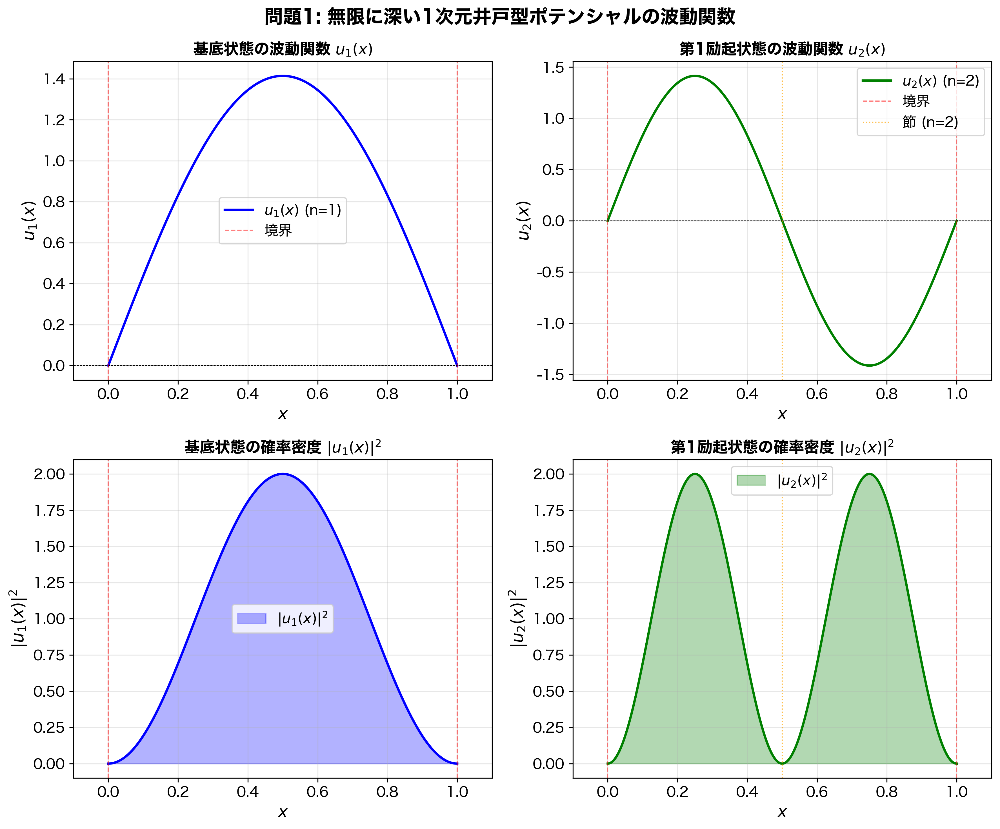
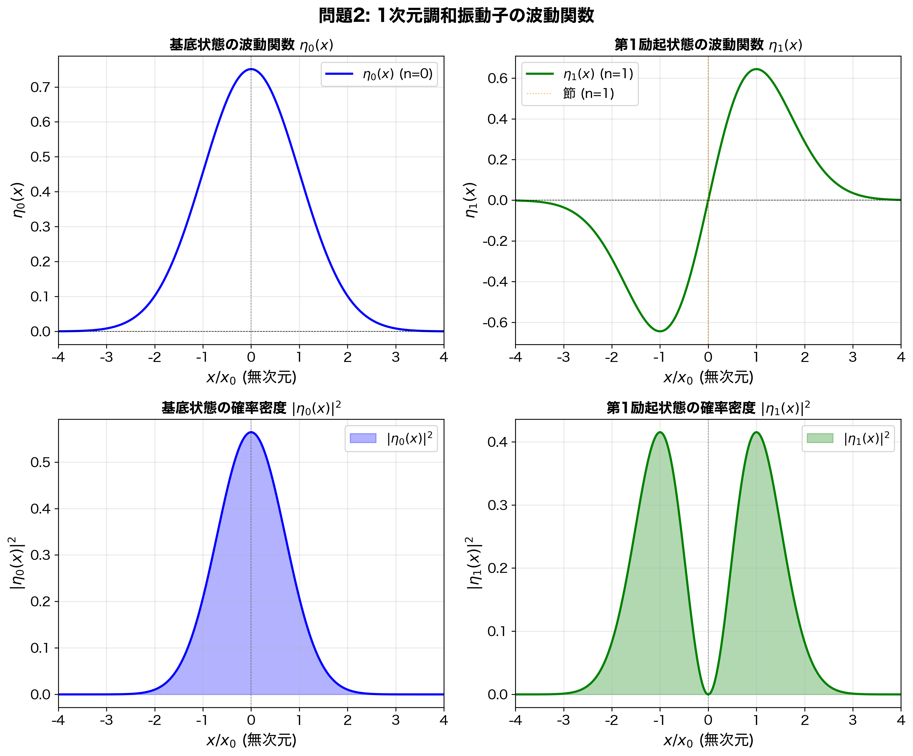
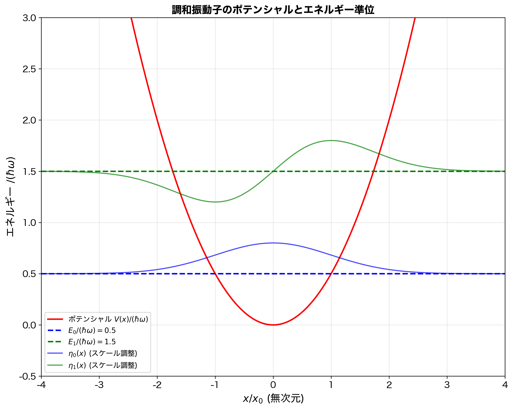
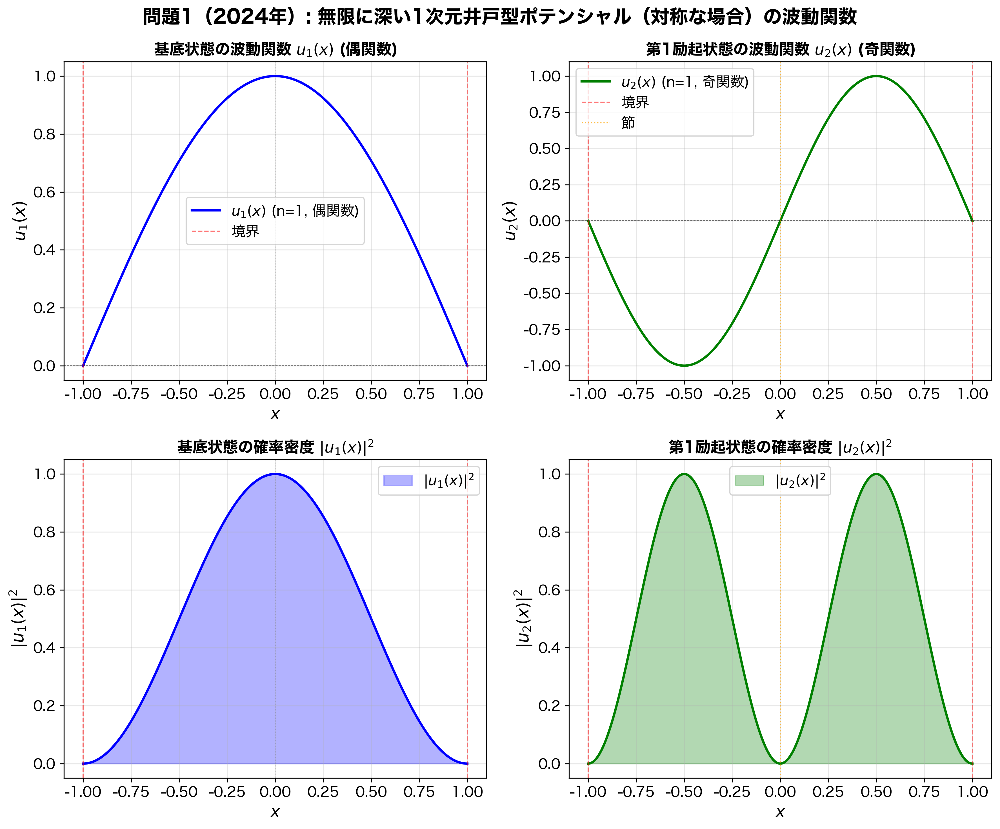
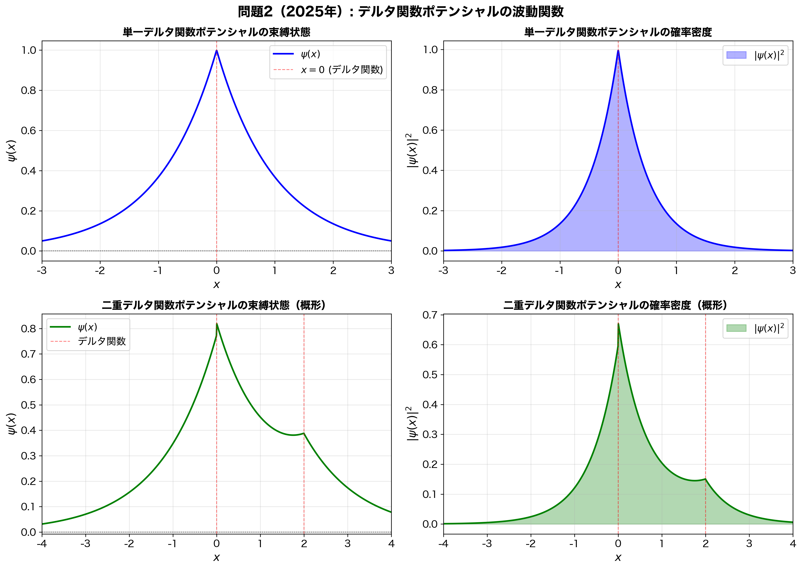
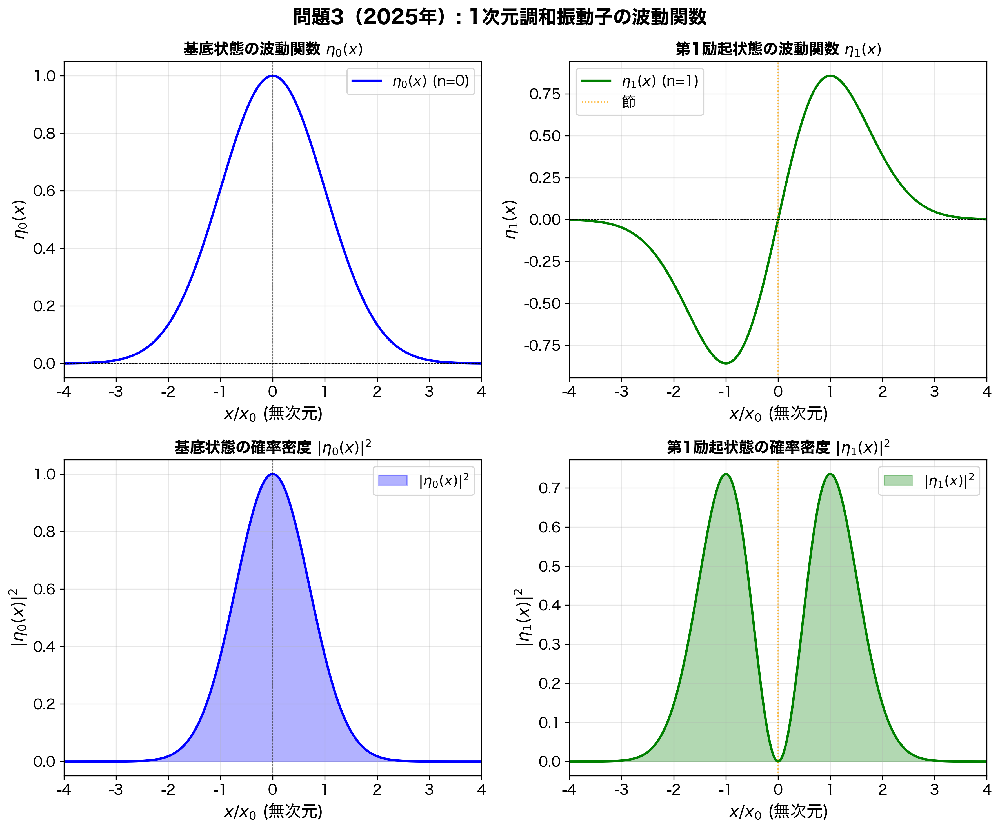

# 量子力学I学期末試験 詳細解答

---

## 目次

### 2023年1月26日実施

1. [問題1: 無限に深い1次元井戸型ポテンシャル（2023年）](#問題1-無限に深い1次元井戸型ポテンシャル2023年)
2. [問題2: 1次元調和振動子（2023年）](#問題2-1次元調和振動子2023年)

### 2024年1月25日実施

3. [問題1: 無限に深い1次元井戸型ポテンシャル（2024年）](#問題1-無限に深い1次元井戸型ポテンシャル2024年)
4. [問題2: 1次元調和振動子（2024年）](#問題2-1次元調和振動子2024年)
5. [問題3: 時間発展演算子とシュレーディンガー形式・ハイゼンベルク形式](#問題3-時間発展演算子とシュレーディンガー形式ハイゼンベルク形式)

### 2025年1月23日実施

6. [問題1: 時間に依存するシュレーディンガー方程式（2025年）](#問題1-時間に依存するシュレーディンガー方程式2025年)
7. [問題2: デルタ関数ポテンシャル（2025年）](#問題2-デルタ関数ポテンシャル2025年)
8. [問題3: 1次元調和振動子（2025年）](#問題3-1次元調和振動子2025年)

---

## 問題1: 無限に深い1次元井戸型ポテンシャル（2023年）

**2023年1月26日実施**

質量 $m$ の粒子が、以下のポテンシャル $V(x)$ の中で運動する量子力学を考える。$a$ は正の定数である。

$$V(x) = \begin{cases} 
\infty & (x < 0) \\
0 & (0 < x < a) \\
\infty & (x > a)
\end{cases}$$

### (a) 時間に依存しないシュレーディンガー方程式の一般解

**問題の意味：**
時間に依存しないシュレーディンガー方程式を解くことで、定常状態（エネルギー固有状態）を求める。これは量子力学の基本的な問題であり、粒子が閉じ込められた領域での波動関数の形を決定する。

**解答：**

時間に依存しないシュレーディンガー方程式は次で与えられる：

$$-\frac{\hbar^2}{2m}\frac{d^2}{dx^2}u(x) + V(x)u(x) = Eu(x)$$

領域 $0 < x < a$ では $V(x) = 0$ であるから、この領域での方程式は：

$$-\frac{\hbar^2}{2m}\frac{d^2}{dx^2}u(x) = Eu(x)$$

両辺に $-\frac{2m}{\hbar^2}$ を掛けて整理すると：

$$\frac{d^2}{dx^2}u(x) = -\frac{2mE}{\hbar^2}u(x)$$

$E > 0$ より、$\frac{2mE}{\hbar^2} > 0$ である。ここで、波数 $k$ を次で定義する：

$$k = \sqrt{\frac{2mE}{\hbar^2}} > 0$$

すると、方程式は：

$$\frac{d^2}{dx^2}u(x) = -k^2u(x)$$

これは2階線形微分方程式であり、特性方程式は $\lambda^2 = -k^2$、すなわち $\lambda = \pm ik$ である。したがって、一般解は：

$$u(x) = A e^{ikx} + B e^{-ikx}$$

ここで、$A$ と $B$ は任意の複素定数である。

オイラーの公式 $e^{i\theta} = \cos\theta + i\sin\theta$ を用いると、三角関数で表すこともできる：

$$u(x) = A(\cos kx + i\sin kx) + B(\cos kx - i\sin kx) = (A+B)\cos kx + i(A-B)\sin kx$$

新しい定数を $C = A+B$、$D = i(A-B)$ と置くと：

$$u(x) = C\cos kx + D\sin kx$$

これが $0 < x < a$ における一般解である。

**物理的意味：**
この解は、自由粒子の波動関数の重ね合わせを表している。井戸の内部ではポテンシャルがゼロなので、粒子は自由に運動しているように見える。しかし、境界条件により、特定の波数 $k$ のみが許容されることになる。

---

### (b) 境界条件（接続条件）

**問題の意味：**
無限に深いポテンシャル壁では、粒子は壁を越えることができない。この物理的要請から、波動関数が満たすべき境界条件を導く。

**解答：**

$x < 0$ および $x > a$ の領域では $V(x) = \infty$ である。この領域で波動関数が有限の値を持つとすると、シュレーディンガー方程式の左辺で $V(x)u(x)$ の項が発散し、右辺の有限の $Eu(x)$ と等しくなりえない。したがって、これらの領域では：

$$u(x) = 0 \quad (x < 0, \quad x > a)$$

波動関数の連続性の要請から、境界 $x = 0$ と $x = a$ において：

$$u(0) = 0, \quad u(a) = 0$$

これが波動関数が満たすべき接続条件（境界条件）である。

**物理的意味：**
粒子が無限に高い壁に到達すると、その確率密度はゼロになる。これは古典力学的な「壁に衝突して跳ね返る」という描像に対応する。量子力学的には、波動関数が連続であることが要請されるため、境界で波動関数がゼロになる必要がある。

---

### (c) 規格化されたエネルギー固有関数とエネルギー固有値

**問題の意味：**
境界条件を満たす解を求めることで、許容されるエネルギー準位（エネルギー固有値）と対応する波動関数（固有関数）を決定する。これにより、量子化されたエネルギー準位が自然に現れる。

**解答：**

境界条件 $u(0) = 0$ を適用する：

$$u(0) = C\cos(0) + D\sin(0) = C = 0$$

したがって、$C = 0$ であり、解は：

$$u(x) = D\sin kx$$

次に、境界条件 $u(a) = 0$ を適用する：

$$u(a) = D\sin ka = 0$$

$D = 0$ とすると自明解 $u(x) = 0$ になってしまうので、$D \neq 0$ である必要がある。したがって：

$$\sin ka = 0$$

これは、$ka$ が $\pi$ の整数倍であることを意味する：

$$ka = n\pi \quad (n = 1, 2, 3, \cdots)$$

$n = 0$ は除外される。なぜなら、$n = 0$ のとき $k = 0$ となり、$u(x) = 0$ となってしまうからである。また、$n < 0$ の場合は $n > 0$ の場合と本質的に同じ解を与える（符号の違いは規格化定数に吸収される）。

したがって：

$$k_n = \frac{n\pi}{a} \quad (n = 1, 2, 3, \cdots)$$

波数とエネルギーの関係 $k = \sqrt{\frac{2mE}{\hbar^2}}$ より：

$$E_n = \frac{\hbar^2 k_n^2}{2m} = \frac{\hbar^2}{2m}\left(\frac{n\pi}{a}\right)^2 = \frac{n^2\pi^2\hbar^2}{2ma^2}$$

対応する波動関数は：

$$u_n(x) = D_n\sin\left(\frac{n\pi x}{a}\right)$$

**規格化条件の適用：**

規格化条件 $\int_0^a |u_n(x)|^2 dx = 1$ を適用する：

$$\int_0^a |D_n|^2 \sin^2\left(\frac{n\pi x}{a}\right) dx = |D_n|^2 \int_0^a \sin^2\left(\frac{n\pi x}{a}\right) dx = 1$$

**$\sin^2$ の積分計算：**

三角関数の公式 $\sin^2\theta = \frac{1-\cos 2\theta}{2}$ を用いると：

$$\int_0^a \sin^2\left(\frac{n\pi x}{a}\right) dx = \int_0^a \frac{1-\cos\left(\frac{2n\pi x}{a}\right)}{2} dx$$

$$= \frac{1}{2}\int_0^a 1 dx - \frac{1}{2}\int_0^a \cos\left(\frac{2n\pi x}{a}\right) dx$$

第一項：$\frac{1}{2}\int_0^a 1 dx = \frac{a}{2}$

第二項：$n \neq 0$ のとき、$\int_0^a \cos\left(\frac{2n\pi x}{a}\right) dx = 0$（周期関数の1周期での積分）

したがって：

$$\int_0^a \sin^2\left(\frac{n\pi x}{a}\right) dx = \frac{a}{2}$$

**規格化定数の決定：**

$$|D_n|^2 \cdot \frac{a}{2} = 1$$

$$|D_n|^2 = \frac{2}{a}$$

$$|D_n| = \sqrt{\frac{2}{a}}$$

位相の自由度を利用して、$D_n$ を実数として選ぶことができる。通常、$D_n > 0$ を選ぶ：

$$D_n = \sqrt{\frac{2}{a}}$$

**一般的な規格化の手順：**
1. 波動関数を $u(x) = N f(x)$ の形に書く（$N$ は規格化定数、$f(x)$ は規格化されていない関数）
2. 規格化条件 $\int |u(x)|^2 dx = |N|^2 \int |f(x)|^2 dx = 1$ を適用
3. $|N| = \frac{1}{\sqrt{\int |f(x)|^2 dx}}$ を計算
4. 位相を選んで $N$ を決定（通常は正の実数）

したがって、規格化されたエネルギー固有関数は：

$$u_n(x) = \sqrt{\frac{2}{a}}\sin\left(\frac{n\pi x}{a}\right) \quad (0 < x < a)$$

$$u_n(x) = 0 \quad (x \leq 0, \quad x \geq a)$$

エネルギー固有値は：

$$E_n = \frac{n^2\pi^2\hbar^2}{2ma^2} \quad (n = 1, 2, 3, \cdots)$$

**物理的意味：**
1. **エネルギー量子化：** 粒子のエネルギーは連続的な値を取ることができず、離散的な値 $E_n$ のみが許容される。これは古典力学にはない量子効果である。
2. **基底状態：** $n = 1$ が基底状態であり、そのエネルギーは $E_1 = \frac{\pi^2\hbar^2}{2ma^2}$ である。これは零点エネルギーと呼ばれ、不確定性原理の結果として現れる。
3. **励起状態：** $n \geq 2$ が励起状態であり、エネルギーは $n^2$ に比例して増加する。
4. **波動関数の節：** $u_n(x)$ は $n-1$ 個の節（零点）を持つ。$n$ が大きくなるほど、波動関数の振動が激しくなる。

---

### (d) 基底状態と第1励起状態の波動関数の概形

**問題の意味：**
波動関数の空間的な形状を視覚化することで、量子力学的な確率分布を理解する。基底状態と第1励起状態の違いを明確にする。

**解答：**

基底状態 $u_1(x)$ と第1励起状態 $u_2(x)$ は：

$$u_1(x) = \sqrt{\frac{2}{a}}\sin\left(\frac{\pi x}{a}\right)$$

$$u_2(x) = \sqrt{\frac{2}{a}}\sin\left(\frac{2\pi x}{a}\right)$$

これらの波動関数の概形は、図1に示す通りである。

**物理的意味：**
1. **基底状態 $u_1(x)$：**
   - 井戸の中央で最大値を取り、両端でゼロになる。
   - 節（零点）は存在しない。
   - 粒子が井戸の中央付近に見出される確率が最も高い。

2. **第1励起状態 $u_2(x)$：**
   - 井戸の中央 $x = a/2$ に節がある。
   - 左右対称であり、左半分と右半分で符号が逆になる。
   - 粒子が井戸の左半分または右半分に見出される確率が等しい。

3. **確率密度：** $|u_n(x)|^2$ は、位置 $x$ で粒子を見出す確率密度を表す。基底状態では中央付近に、第1励起状態では両端付近に確率が集中する傾向がある。

**図1の説明：**
- 左上：基底状態 $u_1(x)$ の波動関数。井戸の中央で最大値を取り、両端でゼロになる。
- 右上：第1励起状態 $u_2(x)$ の波動関数。中央に節があり、左右対称である。
- 左下：基底状態の確率密度 $|u_1(x)|^2$。中央付近に確率が集中している。
- 右下：第1励起状態の確率密度 $|u_2(x)|^2$。両端付近に確率が集中している。

---

### (e) 時間に依存するシュレーディンガー方程式の一般解

**問題の意味：**
時間発展を記述する時間に依存するシュレーディンガー方程式の解を、エネルギー固有状態の重ね合わせとして表現する。これは量子力学の時間発展の基本的な構造を示す。

**解答：**

#### 1. 時間に依存するシュレーディンガー方程式

時間に依存するシュレーディンガー方程式は：

$$i\hbar\frac{\partial}{\partial t}\Psi(x,t) = \hat{H}\Psi(x,t) = \left(-\frac{\hbar^2}{2m}\frac{\partial^2}{\partial x^2} + V(x)\right)\Psi(x,t)$$

ここで：
- $\Psi(x,t)$ は時間に依存する波動関数
- $\hat{H}$ はハミルトニアン演算子（エネルギー演算子）
- $i$ は虚数単位、$\hbar = h/(2\pi)$ は換算プランク定数

#### 2. 変数分離法の適用（詳細な手順）

**ステップ1：変数分離の仮定**

時間と空間の変数を分離するため、$\Psi(x,t) = u(x)T(t)$ と仮定する。これは、波動関数が空間部分 $u(x)$ と時間部分 $T(t)$ の積で表されるとする仮定である。

**ステップ2：偏微分の計算**

この仮定の下で、偏微分を計算する：

$$\frac{\partial}{\partial t}\Psi(x,t) = \frac{\partial}{\partial t}[u(x)T(t)] = u(x)\frac{dT(t)}{dt}$$

（$u(x)$ は $t$ に依存しないため、通常の微分 $d/dt$ になる）

また、空間微分については：

$$\hat{H}\Psi(x,t) = \hat{H}[u(x)T(t)] = T(t)\hat{H}u(x)$$

（$\hat{H}$ は空間微分のみを含むため、$T(t)$ は定数として扱える）

**ステップ3：方程式への代入**

元の方程式に代入すると：

$$i\hbar u(x)\frac{dT(t)}{dt} = T(t)\hat{H}u(x)$$

**ステップ4：変数分離**

両辺を $u(x)T(t)$ で割る（$\Psi(x,t) \neq 0$ の領域で）：

$$\frac{i\hbar u(x)}{u(x)T(t)}\frac{dT(t)}{dt} = \frac{T(t)}{u(x)T(t)}\hat{H}u(x)$$

整理すると：

$$\frac{i\hbar}{T(t)}\frac{dT(t)}{dt} = \frac{1}{u(x)}\hat{H}u(x)$$

#### 3. 分離定数の導入（重要な論理）

**なぜ定数でなければならないのか？**

左辺 $\frac{i\hbar}{T(t)}\frac{dT(t)}{dt}$ は $t$ のみの関数であり、$x$ には依存しない。
右辺 $\frac{1}{u(x)}\hat{H}u(x)$ は $x$ のみの関数であり、$t$ には依存しない。

しかし、この等式が任意の $x$ と $t$ について成り立つためには、左辺と右辺が**同じ値**でなければならない。これは、左辺が $t$ だけに依存し、右辺が $x$ だけに依存するという矛盾を解決する唯一の方法は、**両辺が定数である**ことである。

この定数を $E$ とすると：

$$\frac{i\hbar}{T(t)}\frac{dT(t)}{dt} = E, \quad \frac{1}{u(x)}\hat{H}u(x) = E$$

これより、2つの独立な方程式が得られる：

$$i\hbar\frac{dT(t)}{dt} = ET(t) \tag{時間方程式}$$

$$\hat{H}u(x) = Eu(x) \tag{空間方程式（時間に依存しないシュレーディンガー方程式）}$$

#### 4. 時間方程式の解法（詳細）

時間方程式：

$$i\hbar\frac{dT(t)}{dt} = ET(t)$$

**解法の手順：**

**ステップ1：変数分離形に変形**

$$\frac{dT(t)}{dt} = -\frac{iE}{\hbar}T(t)$$

これは1階線形微分方程式である。

**ステップ2：積分による解法**

両辺を $T(t)$ で割って（$T(t) \neq 0$ として）：

$$\frac{1}{T(t)}\frac{dT(t)}{dt} = -\frac{iE}{\hbar}$$

左辺は $\frac{d}{dt}[\ln T(t)]$ に等しいので：

$$\frac{d}{dt}[\ln T(t)] = -\frac{iE}{\hbar}$$

両辺を $t$ で積分：

$$\ln T(t) = -\frac{iE}{\hbar}t + C$$

ここで $C$ は積分定数。

**ステップ3：指数関数で表す**

両辺の指数を取る：

$$T(t) = e^C \cdot e^{-iEt/\hbar}$$

$e^C$ は定数なので、$T(0) = e^C$ とおくと：

$$T(t) = T(0)e^{-iEt/\hbar}$$

**別解：直接積分形から**

微分方程式 $\frac{dT}{dt} = -\frac{iE}{\hbar}T$ は、$T(t) = T(0)\exp\left(-\frac{iE}{\hbar}t\right)$ という形の解を持つことが知られている。

#### 5. エネルギー固有状態の解

空間方程式 $\hat{H}u(x) = Eu(x)$ は、時間に依存しないシュレーディンガー方程式（固有値方程式）である。この方程式を解くと、離散的なエネルギー固有値 $E_n$ と対応する固有関数 $u_n(x)$ が得られる。

したがって、エネルギー固有値 $E_n$ に対応する時間に依存する解は：

$$\Psi_n(x,t) = u_n(x)T_n(t) = u_n(x)e^{-iE_n t/\hbar}$$

#### 6. 一般解の構成（重ね合わせの原理）

**なぜ重ね合わせで表せるのか？**

時間に依存するシュレーディンガー方程式は**線形偏微分方程式**である。線形方程式の重要な性質として：

1. **重ね合わせの原理：** 2つの解 $\Psi_1(x,t)$ と $\Psi_2(x,t)$ の線形結合 $c_1\Psi_1(x,t) + c_2\Psi_2(x,t)$ も解である。
2. **完全性：** エネルギー固有関数 $\{u_n(x)\}$ は完全正規直交系をなすため、任意の波動関数はこれらで展開できる。

したがって、一般解は固有状態の線形結合として表される：

$$\Psi(x,t) = \sum_{n=1}^{\infty} c_n \Psi_n(x,t) = \sum_{n=1}^{\infty} c_n e^{-iE_n t/\hbar} u_n(x)$$

ここで、$c_n$ は複素定数であり、初期条件 $\Psi(x,0)$ によって決定される。

**初期条件からの決定：**

$t = 0$ のとき：

$$\Psi(x,0) = \sum_{n=1}^{\infty} c_n u_n(x)$$

固有関数の直交性 $\int_0^a u_m^*(x)u_n(x)dx = \delta_{mn}$ を用いると：

$$c_n = \int_0^a u_n^*(x)\Psi(x,0)dx$$

#### 7. 解の検証

一般解が元の方程式を満たすことを確認する：

$$\hat{H}\Psi(x,t) = \hat{H}\sum_{n=1}^{\infty} c_n e^{-iE_n t/\hbar} u_n(x) = \sum_{n=1}^{\infty} c_n e^{-iE_n t/\hbar} \hat{H}u_n(x)$$

$$= \sum_{n=1}^{\infty} c_n e^{-iE_n t/\hbar} E_n u_n(x)$$

一方、時間微分は：

$$i\hbar\frac{\partial}{\partial t}\Psi(x,t) = i\hbar\sum_{n=1}^{\infty} c_n \frac{\partial}{\partial t}[e^{-iE_n t/\hbar} u_n(x)]$$

$$= i\hbar\sum_{n=1}^{\infty} c_n u_n(x) \frac{d}{dt}[e^{-iE_n t/\hbar}]$$

$$= i\hbar\sum_{n=1}^{\infty} c_n u_n(x) \left(-\frac{iE_n}{\hbar}\right)e^{-iE_n t/\hbar}$$

$$= \sum_{n=1}^{\infty} c_n E_n e^{-iE_n t/\hbar} u_n(x)$$

したがって、$i\hbar\frac{\partial}{\partial t}\Psi(x,t) = \hat{H}\Psi(x,t)$ が成り立つ。

**物理的意味：**
1. **重ね合わせの原理：** 任意の状態は、エネルギー固有状態の重ね合わせとして表現できる。これは量子力学の基本原理である。古典力学では、粒子は1つの軌道を描くが、量子力学では複数の状態が同時に存在し、それらが重ね合わされる。
2. **時間発展：** 各固有状態は独立に時間発展し、位相因子 $e^{-iE_n t/\hbar}$ で回転する。この位相の回転速度（角周波数）は $\omega_n = E_n/\hbar$ であり、エネルギーに比例する。高エネルギー状態ほど速く位相が回転する。
3. **定常状態：** 単一の固有状態 $|c_n| = 1$、$c_m = 0$ ($m \neq n$) の場合、確率密度は：

$$|\Psi(x,t)|^2 = |u_n(x)e^{-iE_n t/\hbar}|^2 = |u_n(x)|^2|e^{-iE_n t/\hbar}|^2 = |u_n(x)|^2$$

となり、時間に依存しない。これが定常状態である。定常状態では、エネルギーが確定し、確率分布が時間変化しない。
4. **非定常状態：** 複数の固有状態が重ね合わされている場合、位相の回転速度が異なるため、確率密度 $|\Psi(x,t)|^2$ は時間とともに変化する。これにより、量子力学的な干渉効果や振動現象が現れる。

---

### (f) 初期条件から係数 $c_n$ を決定

**問題の意味：**
与えられた初期状態をエネルギー固有状態で展開する（フーリエ級数展開）。これにより、各エネルギー準位への寄与を決定する。

**解法1：積和公式を使う方法（標準的な解法）**

**ステップ1：問題の設定**

初期条件：
$$\Psi(x, 0) = \frac{2}{\sqrt{a}}\sin\left(\frac{2\pi x}{a}\right)\cos\left(\frac{\pi x}{a}\right)$$

これを固有状態で展開：
$$\Psi(x, 0) = \sum_{n=1}^{\infty} c_n u_n(x) = \sum_{n=1}^{\infty} c_n \sqrt{\frac{2}{a}}\sin\left(\frac{n\pi x}{a}\right)$$

**ステップ2：係数の抽出（直交性の利用）**

固有関数の直交性：
$$\int_0^a u_m(x)u_n(x) dx = \delta_{mn} = \begin{cases} 1 & (m = n) \\ 0 & (m \neq n) \end{cases}$$

両辺に $u_m(x)$ を掛けて積分すると、右辺の和で $n=m$ の項だけが残る：
$$c_m = \int_0^a u_m(x)\Psi(x, 0) dx$$

**ステップ3：積分の計算**

$$c_m = \int_0^a \sqrt{\frac{2}{a}}\sin\left(\frac{m\pi x}{a}\right) \cdot \frac{2}{\sqrt{a}}\sin\left(\frac{2\pi x}{a}\right)\cos\left(\frac{\pi x}{a}\right) dx$$

$$= \frac{2\sqrt{2}}{a} \int_0^a \sin\left(\frac{m\pi x}{a}\right)\sin\left(\frac{2\pi x}{a}\right)\cos\left(\frac{\pi x}{a}\right) dx$$

**ステップ4：三角関数の積和公式で変形**

**公式：**
- $\sin A \cos B = \frac{1}{2}[\sin(A+B) + \sin(A-B)]$
- $\sin A \sin B = \frac{1}{2}[\cos(A-B) - \cos(A+B)]$

まず、$\sin\left(\frac{2\pi x}{a}\right)\cos\left(\frac{\pi x}{a}\right)$ を変形：
$$\sin\left(\frac{2\pi x}{a}\right)\cos\left(\frac{\pi x}{a}\right) = \frac{1}{2}\left[\sin\left(\frac{3\pi x}{a}\right) + \sin\left(\frac{\pi x}{a}\right)\right]$$

これにより、被積分関数が2つの $\sin$ の和になる：
$$c_m = \frac{2\sqrt{2}}{a} \int_0^a \sin\left(\frac{m\pi x}{a}\right) \cdot \frac{1}{2}\left[\sin\left(\frac{3\pi x}{a}\right) + \sin\left(\frac{\pi x}{a}\right)\right] dx$$

$$= \frac{\sqrt{2}}{a} \int_0^a \sin\left(\frac{m\pi x}{a}\right)\sin\left(\frac{3\pi x}{a}\right) dx + \frac{\sqrt{2}}{a} \int_0^a \sin\left(\frac{m\pi x}{a}\right)\sin\left(\frac{\pi x}{a}\right) dx$$

**ステップ5：$\sin$ 同士の積分を計算**

$\sin$ 同士の積分の公式：
$$\int_0^a \sin\left(\frac{m\pi x}{a}\right)\sin\left(\frac{n\pi x}{a}\right) dx = \begin{cases} 
\frac{a}{2} & (m = n) \\
0 & (m \neq n)
\end{cases}$$

**理由：** 積和公式により：
$$\sin\left(\frac{m\pi x}{a}\right)\sin\left(\frac{n\pi x}{a}\right) = \frac{1}{2}\left[\cos\left(\frac{(m-n)\pi x}{a}\right) - \cos\left(\frac{(m+n)\pi x}{a}\right)\right]$$

$m \neq n$ のとき、両方の $\cos$ 項は整数周期の $\cos$ 関数なので、$[0,a]$ での積分は $0$。
$m = n$ のとき、$\cos(0) = 1$ の項が残り、$\int_0^a 1 dx = a$、係数 $\frac{1}{2}$ により結果は $\frac{a}{2}$。

**ステップ6：結果の決定**

- 第一項：$\int_0^a \sin\left(\frac{m\pi x}{a}\right)\sin\left(\frac{3\pi x}{a}\right) dx$ は $m=3$ のときのみ $\frac{a}{2}$、それ以外は $0$
- 第二項：$\int_0^a \sin\left(\frac{m\pi x}{a}\right)\sin\left(\frac{\pi x}{a}\right) dx$ は $m=1$ のときのみ $\frac{a}{2}$、それ以外は $0$

したがって、$c_m \neq 0$ となるのは $m=1$ または $m=3$ の場合のみ。

$$c_1 = \frac{\sqrt{2}}{a} \cdot \frac{a}{2} = \frac{\sqrt{2}}{2}$$

$$c_3 = \frac{\sqrt{2}}{a} \cdot \frac{a}{2} = \frac{\sqrt{2}}{2}$$

**答え：**
$$c_n = \begin{cases}
\frac{\sqrt{2}}{2} & (n = 1, 3) \\
0 & (\text{その他})
\end{cases}$$

---

**解法2：直接的に初期状態を変形する方法（より直感的）**

初期状態を直接変形して、どの固有状態が含まれているかを確認する方法。

**ステップ1：初期状態の変形**

$$\Psi(x, 0) = \frac{2}{\sqrt{a}}\sin\left(\frac{2\pi x}{a}\right)\cos\left(\frac{\pi x}{a}\right)$$

積和公式 $\sin A \cos B = \frac{1}{2}[\sin(A+B) + \sin(A-B)]$ を適用：
$$\sin\left(\frac{2\pi x}{a}\right)\cos\left(\frac{\pi x}{a}\right) = \frac{1}{2}\left[\sin\left(\frac{3\pi x}{a}\right) + \sin\left(\frac{\pi x}{a}\right)\right]$$

したがって：
$$\Psi(x, 0) = \frac{2}{\sqrt{a}} \cdot \frac{1}{2}\left[\sin\left(\frac{3\pi x}{a}\right) + \sin\left(\frac{\pi x}{a}\right)\right] = \frac{1}{\sqrt{a}}\left[\sin\left(\frac{3\pi x}{a}\right) + \sin\left(\frac{\pi x}{a}\right)\right]$$

**ステップ2：固有関数の形と比較**

固有関数は：
$$u_n(x) = \sqrt{\frac{2}{a}}\sin\left(\frac{n\pi x}{a}\right)$$

したがって：
$$\sin\left(\frac{n\pi x}{a}\right) = \sqrt{\frac{a}{2}} u_n(x)$$

**ステップ3：係数の決定**

$$\Psi(x, 0) = \frac{1}{\sqrt{a}}\left[\sin\left(\frac{3\pi x}{a}\right) + \sin\left(\frac{\pi x}{a}\right)\right]$$

$$= \frac{1}{\sqrt{a}}\left[\sqrt{\frac{a}{2}} u_3(x) + \sqrt{\frac{a}{2}} u_1(x)\right]$$

$$= \frac{1}{\sqrt{a}} \cdot \sqrt{\frac{a}{2}} [u_1(x) + u_3(x)] = \frac{1}{\sqrt{2}}[u_1(x) + u_3(x)]$$

$$= \frac{\sqrt{2}}{2}u_1(x) + \frac{\sqrt{2}}{2}u_3(x)$$

したがって：
$$c_1 = \frac{\sqrt{2}}{2}, \quad c_3 = \frac{\sqrt{2}}{2}, \quad c_n = 0 \quad (n \neq 1, 3)$$

**この方法の利点：**
- 計算が少なく、直感的
- 初期状態がどの固有状態の重ね合わせかが一目でわかる
- 積分計算が不要

---

**解法3：複素指数関数を使う方法（数学的に洗練された方法）**

オイラーの公式 $e^{i\theta} = \cos\theta + i\sin\theta$ を使う方法。

**ステップ1：初期状態を複素指数で表現**

$$\sin\left(\frac{2\pi x}{a}\right)\cos\left(\frac{\pi x}{a}\right) = \text{Im}\left[e^{i2\pi x/a}\right] \cdot \text{Re}\left[e^{i\pi x/a}\right]$$

または、直接的に：
$$\sin\left(\frac{2\pi x}{a}\right)\cos\left(\frac{\pi x}{a}\right) = \frac{1}{2i}\left(e^{i2\pi x/a} - e^{-i2\pi x/a}\right) \cdot \frac{1}{2}\left(e^{i\pi x/a} + e^{-i\pi x/a}\right)$$

$$= \frac{1}{4i}\left[e^{i3\pi x/a} + e^{i\pi x/a} - e^{-i\pi x/a} - e^{-i3\pi x/a}\right]$$

$$= \frac{1}{2}\left[\frac{e^{i3\pi x/a} - e^{-i3\pi x/a}}{2i} + \frac{e^{i\pi x/a} - e^{-i\pi x/a}}{2i}\right]$$

$$= \frac{1}{2}\left[\sin\left(\frac{3\pi x}{a}\right) + \sin\left(\frac{\pi x}{a}\right)\right]$$

これにより、解法2と同じ結果が得られる。

---

**物理的意味：**
初期状態は、基底状態（$n=1$）と第2励起状態（$n=3$）の等しい重ね合わせである。これは、初期状態が特定の対称性を持っていることを示している。時間発展により、これらの状態間で干渉が起こり、確率分布が時間的に変化する。

**各解法の比較：**
- **解法1（積和公式）**：標準的で、一般的な問題に適用可能。計算過程が明確。
- **解法2（直接変形）**：最も簡単で直感的。この問題では最も効率的。
- **解法3（複素指数）**：数学的に洗練されているが、この問題では過剰。

---

### (g) エネルギー測定で $E_1$ を得る確率

**問題の意味：**
量子力学における測定の確率解釈を適用する。エネルギーを測定したとき、特定のエネルギー固有値が得られる確率を計算する。

**解答：**

時刻 $t$ における状態は：

$$\Psi(x,t) = \sum_{n=1}^{\infty} c_n e^{-iE_n t/\hbar} u_n(x)$$

エネルギー測定の確率解釈によれば、エネルギー $E_n$ が測定される確率は、対応する係数の絶対値の2乗である：

$$P(E_n) = |c_n|^2$$

(f) の結果より、$c_1 = \frac{\sqrt{2}}{2}$ であるから：

$$P(E_1) = |c_1|^2 = \left|\frac{\sqrt{2}}{2}\right|^2 = \frac{2}{4} = \frac{1}{2}$$

**物理的意味：**
1. **測定の確率解釈：** 量子力学では、測定の結果は確率的に決まる。この場合、エネルギーを測定すると、$E_1$ が得られる確率は 50%、$E_3$ が得られる確率も 50% である。
2. **時間依存性：** 興味深いことに、この確率は時間に依存しない。これは、エネルギー固有状態の重ね合わせにおいて、各状態の確率振幅の位相が時間とともに変化するが、確率（絶対値の2乗）は保存されるためである。
3. **測定後の状態：** エネルギー $E_1$ が測定された後、系は基底状態 $u_1(x)$ に「収縮」する（波動関数の収縮）。

---

## 問題2: 1次元調和振動子（2023年）

**2023年1月26日実施**

1次元調和振動子のハミルトニアンは以下で与えられる。

$$\hat{H} = \frac{\hat{p}^2}{2m} + \frac{1}{2}m\omega^2\hat{x}^2$$

$\hat{x}$ と $\hat{p}$ から、次の演算子 $\hat{a}$ と $\hat{a}^\dagger$ を定義する。

$$\hat{a} = \sqrt{\frac{m\omega}{2\hbar}}\hat{x} + i\frac{1}{\sqrt{2m\omega\hbar}}\hat{p}$$

$$\hat{a}^\dagger = \sqrt{\frac{m\omega}{2\hbar}}\hat{x} - i\frac{1}{\sqrt{2m\omega\hbar}}\hat{p}$$

### (a) 交換関係 $[\hat{a}, \hat{a}^\dagger]$ の計算

**問題の意味：**
生成消滅演算子の交換関係を計算することで、これらの演算子の代数的性質を明らかにする。この交換関係は、調和振動子のエネルギー準位を決定する上で本質的である。

**解答：**

**方法1（標準的な方法）：**

交換子の定義 $[\hat{A}, \hat{B}] = \hat{A}\hat{B} - \hat{B}\hat{A}$ より：

$$[\hat{a}, \hat{a}^\dagger] = \hat{a}\hat{a}^\dagger - \hat{a}^\dagger\hat{a}$$

$\hat{a}$ と $\hat{a}^\dagger$ の定義を代入する：

$$\hat{a} = \alpha\hat{x} + i\beta\hat{p}, \quad \hat{a}^\dagger = \alpha\hat{x} - i\beta\hat{p}$$

ここで：

$$\alpha = \sqrt{\frac{m\omega}{2\hbar}}, \quad \beta = \frac{1}{\sqrt{2m\omega\hbar}}$$

計算を進める：

$$\hat{a}\hat{a}^\dagger = (\alpha\hat{x} + i\beta\hat{p})(\alpha\hat{x} - i\beta\hat{p}) = \alpha^2\hat{x}^2 - i\alpha\beta\hat{x}\hat{p} + i\alpha\beta\hat{p}\hat{x} + \beta^2\hat{p}^2$$

$$= \alpha^2\hat{x}^2 + \beta^2\hat{p}^2 + i\alpha\beta(\hat{p}\hat{x} - \hat{x}\hat{p}) = \alpha^2\hat{x}^2 + \beta^2\hat{p}^2 + i\alpha\beta[\hat{p}, \hat{x}]$$

同様に：

$$\hat{a}^\dagger\hat{a} = (\alpha\hat{x} - i\beta\hat{p})(\alpha\hat{x} + i\beta\hat{p}) = \alpha^2\hat{x}^2 + i\alpha\beta\hat{x}\hat{p} - i\alpha\beta\hat{p}\hat{x} + \beta^2\hat{p}^2$$

$$= \alpha^2\hat{x}^2 + \beta^2\hat{p}^2 - i\alpha\beta[\hat{p}, \hat{x}]$$

したがって：

$$[\hat{a}, \hat{a}^\dagger] = \hat{a}\hat{a}^\dagger - \hat{a}^\dagger\hat{a} = i\alpha\beta[\hat{p}, \hat{x}] - (-i\alpha\beta[\hat{p}, \hat{x}]) = 2i\alpha\beta[\hat{p}, \hat{x}]$$

基本交換関係 $[\hat{x}, \hat{p}] = i\hbar$ より、$[\hat{p}, \hat{x}] = -[\hat{x}, \hat{p}] = -i\hbar$ である。したがって：

$$[\hat{a}, \hat{a}^\dagger] = 2i\alpha\beta(-i\hbar) = 2\alpha\beta\hbar$$

$\alpha$ と $\beta$ の値を代入：

$$\alpha\beta = \sqrt{\frac{m\omega}{2\hbar}} \cdot \frac{1}{\sqrt{2m\omega\hbar}} = \frac{1}{2\hbar}$$

したがって：

$$[\hat{a}, \hat{a}^\dagger] = 2 \cdot \frac{1}{2\hbar} \cdot \hbar = 1$$

**方法2（より簡潔な別解）：**

交換関係の線形性を直接利用する。$\hat{a} = \alpha\hat{x} + i\beta\hat{p}$、$\hat{a}^\dagger = \alpha\hat{x} - i\beta\hat{p}$ より：

$$[\hat{a}, \hat{a}^\dagger] = [\alpha\hat{x} + i\beta\hat{p}, \alpha\hat{x} - i\beta\hat{p}]$$

交換関係の線形性 $[\hat{A} + \hat{B}, \hat{C}] = [\hat{A}, \hat{C}] + [\hat{B}, \hat{C}]$ および $[\hat{A}, \hat{B} + \hat{C}] = [\hat{A}, \hat{B}] + [\hat{A}, \hat{C}]$ を用いて展開：

$$= \alpha[\hat{x}, \alpha\hat{x} - i\beta\hat{p}] + i\beta[\hat{p}, \alpha\hat{x} - i\beta\hat{p}]$$
$$= \alpha^2[\hat{x}, \hat{x}] - i\alpha\beta[\hat{x}, \hat{p}] + i\alpha\beta[\hat{p}, \hat{x}] - \beta^2[\hat{p}, \hat{p}]$$

$[\hat{x}, \hat{x}] = 0$、$[\hat{p}, \hat{p}] = 0$、$[\hat{x}, \hat{p}] = i\hbar$、$[\hat{p}, \hat{x}] = -i\hbar$ より：

$$= -i\alpha\beta(i\hbar) + i\alpha\beta(-i\hbar) = 2\alpha\beta\hbar$$

$\alpha\beta = \frac{1}{2\hbar}$ を代入して：

$$[\hat{a}, \hat{a}^\dagger] = 2 \cdot \frac{1}{2\hbar} \cdot \hbar = 1$$

この方法では、演算子の積を展開する必要がなく、交換関係の線形性のみを用いて直接計算できるため、より簡潔である。

**結論：**

$$[\hat{a}, \hat{a}^\dagger] = 1$$

**物理的意味：**
この交換関係は、生成消滅演算子の基本的な性質を示している。$\hat{a}^\dagger$ は状態を1つ「上げる」演算子、$\hat{a}$ は状態を1つ「下げる」演算子であり、その交換関係が1であることが、エネルギー準位が等間隔であることの根源である。

---

### (b) ハミルトニアンを $\hat{a}, \hat{a}^\dagger$ で表す

**問題の意味：**
ハミルトニアンを生成消滅演算子で表現することで、エネルギー固有値の計算が代数的に簡単になる。これは調和振動子の問題を解くための強力な手法である。

**解答：**

まず、$\hat{a}$ と $\hat{a}^\dagger$ から $\hat{x}$ と $\hat{p}$ を逆に解く：

$$\hat{a} + \hat{a}^\dagger = 2\alpha\hat{x} = 2\sqrt{\frac{m\omega}{2\hbar}}\hat{x}$$

したがって：

$$\hat{x} = \sqrt{\frac{\hbar}{2m\omega}}(\hat{a} + \hat{a}^\dagger)$$

また：

$$\hat{a} - \hat{a}^\dagger = 2i\beta\hat{p} = 2i\frac{1}{\sqrt{2m\omega\hbar}}\hat{p}$$

したがって：

$$\hat{p} = -i\sqrt{\frac{m\omega\hbar}{2}}(\hat{a} - \hat{a}^\dagger)$$

これらの関係を用いて、ハミルトニアンを書き直す：

$$\hat{H} = \frac{\hat{p}^2}{2m} + \frac{1}{2}m\omega^2\hat{x}^2$$

まず、$\hat{p}^2$ を計算する。$\hat{p} = -i\sqrt{\frac{m\omega\hbar}{2}}(\hat{a} - \hat{a}^\dagger)$ より：

$$\hat{p}^2 = \left(-i\sqrt{\frac{m\omega\hbar}{2}}(\hat{a} - \hat{a}^\dagger)\right)^2 = -\frac{m\omega\hbar}{2}(\hat{a} - \hat{a}^\dagger)^2$$

括弧を展開：

$$(\hat{a} - \hat{a}^\dagger)^2 = \hat{a}^2 - \hat{a}\hat{a}^\dagger - \hat{a}^\dagger\hat{a} + (\hat{a}^\dagger)^2$$

**補足：交換関係の利用方法**

ここで、$\hat{a}\hat{a}^\dagger$ と $\hat{a}^\dagger\hat{a}$ の順序を整理する必要がある。交換関係 $[\hat{a}, \hat{a}^\dagger] = \hat{a}\hat{a}^\dagger - \hat{a}^\dagger\hat{a} = 1$ より：

$$\hat{a}\hat{a}^\dagger = \hat{a}^\dagger\hat{a} + [\hat{a}, \hat{a}^\dagger] = \hat{a}^\dagger\hat{a} + 1$$

**一般的な手順：**
1. 演算子の積を展開する
2. 交換関係を用いて、すべての項を「正規順序」（消滅演算子が右、生成演算子が左）に並べ替える
3. 交換関係により生じる余分な項を考慮する

したがって：

$$\hat{a}\hat{a}^\dagger + \hat{a}^\dagger\hat{a} = (\hat{a}^\dagger\hat{a} + 1) + \hat{a}^\dagger\hat{a} = 2\hat{a}^\dagger\hat{a} + 1$$

これを代入すると：

$$(\hat{a} - \hat{a}^\dagger)^2 = \hat{a}^2 + (\hat{a}^\dagger)^2 - 2\hat{a}^\dagger\hat{a} - 1$$

したがって：

$$\hat{p}^2 = -\frac{m\omega\hbar}{2}(\hat{a}^2 + (\hat{a}^\dagger)^2 - 2\hat{a}^\dagger\hat{a} - 1)$$

次に、$\hat{x}^2$ を計算する。$\hat{x} = \sqrt{\frac{\hbar}{2m\omega}}(\hat{a} + \hat{a}^\dagger)$ より：

$$\hat{x}^2 = \frac{\hbar}{2m\omega}(\hat{a} + \hat{a}^\dagger)^2$$

括弧を展開：

$$(\hat{a} + \hat{a}^\dagger)^2 = \hat{a}^2 + \hat{a}\hat{a}^\dagger + \hat{a}^\dagger\hat{a} + (\hat{a}^\dagger)^2$$

先ほどと同様に、交換関係 $\hat{a}\hat{a}^\dagger = \hat{a}^\dagger\hat{a} + 1$ を用いると：

$$\hat{a}\hat{a}^\dagger + \hat{a}^\dagger\hat{a} = (\hat{a}^\dagger\hat{a} + 1) + \hat{a}^\dagger\hat{a} = 2\hat{a}^\dagger\hat{a} + 1$$

したがって：

$$(\hat{a} + \hat{a}^\dagger)^2 = \hat{a}^2 + (\hat{a}^\dagger)^2 + 2\hat{a}^\dagger\hat{a} + 1$$

$$\hat{x}^2 = \frac{\hbar}{2m\omega}(\hat{a}^2 + (\hat{a}^\dagger)^2 + 2\hat{a}^\dagger\hat{a} + 1)$$

したがって：

$$\hat{H} = \frac{1}{2m} \cdot \left(-\frac{m\omega\hbar}{2}(\hat{a}^2 + (\hat{a}^\dagger)^2 - 2\hat{a}^\dagger\hat{a} - 1)\right) + \frac{1}{2}m\omega^2 \cdot \frac{\hbar}{2m\omega}(\hat{a}^2 + (\hat{a}^\dagger)^2 + 2\hat{a}^\dagger\hat{a} + 1)$$

$$= -\frac{\omega\hbar}{4}(\hat{a}^2 + (\hat{a}^\dagger)^2 - 2\hat{a}^\dagger\hat{a} - 1) + \frac{\omega\hbar}{4}(\hat{a}^2 + (\hat{a}^\dagger)^2 + 2\hat{a}^\dagger\hat{a} + 1)$$

$$= -\frac{\omega\hbar}{4}\hat{a}^2 - \frac{\omega\hbar}{4}(\hat{a}^\dagger)^2 + \frac{\omega\hbar}{2}\hat{a}^\dagger\hat{a} + \frac{\omega\hbar}{4} + \frac{\omega\hbar}{4}\hat{a}^2 + \frac{\omega\hbar}{4}(\hat{a}^\dagger)^2 + \frac{\omega\hbar}{2}\hat{a}^\dagger\hat{a} + \frac{\omega\hbar}{4}$$

$$= \omega\hbar\hat{a}^\dagger\hat{a} + \frac{\omega\hbar}{2}$$

数演算子 $\hat{N} = \hat{a}^\dagger\hat{a}$ を定義すると：

$$\hat{H} = \hbar\omega\left(\hat{N} + \frac{1}{2}\right)$$

**結論：**

$$\hat{H} = \hbar\omega\left(\hat{a}^\dagger\hat{a} + \frac{1}{2}\right)$$

**物理的意味：**
1. **数演算子：** $\hat{N} = \hat{a}^\dagger\hat{a}$ は、状態に含まれる「励起の数」を表す演算子である。
2. **エネルギー準位：** この形式から、エネルギー固有値が $E_n = \hbar\omega(n + 1/2)$ の形になることが予想される。
3. **零点エネルギー：** 定数項 $\hbar\omega/2$ は零点エネルギーを表し、不確定性原理の結果である。

---

### (c) 下降・上昇演算子の物理的意味

**問題の意味：**
生成消滅演算子の作用を理解することで、エネルギー準位間の遷移のメカニズムを把握する。

**解答：**

$\hat{a}$ と $\hat{a}^\dagger$ がそれぞれ下降・上昇演算子と呼ばれる理由を説明する。

エネルギー固有状態 $|n\rangle$ を考える。$\hat{H}|n\rangle = E_n|n\rangle$ とする。

#### $\hat{a}$（下降演算子）について

$\hat{a}|n\rangle$ のエネルギーを計算する。まず、重要な恒等式を利用する。任意の演算子 $\hat{A}$, $\hat{B}$ に対して：

$$\hat{A}\hat{B} = [\hat{A}, \hat{B}] + \hat{B}\hat{A}$$

この恒等式を $\hat{H}$ と $\hat{a}$ に適用すると：

$$\hat{H}\hat{a} = [\hat{H}, \hat{a}] + \hat{a}\hat{H}$$

したがって、状態 $|n\rangle$ に作用させると：

$$\hat{H}(\hat{a}|n\rangle) = [\hat{H}, \hat{a}]|n\rangle + \hat{a}\hat{H}|n\rangle$$

次に、交換関係 $[\hat{H}, \hat{a}]$ を計算する。問題(b)で求めたように、$\hat{H} = \hbar\omega(\hat{a}^\dagger\hat{a} + 1/2)$ である。定数項は交換関係に影響しないので：

$$[\hat{H}, \hat{a}] = \hbar\omega[\hat{a}^\dagger\hat{a}, \hat{a}]$$

交換関係の性質 $[\hat{A}\hat{B}, \hat{C}] = \hat{A}[\hat{B}, \hat{C}] + [\hat{A}, \hat{C}]\hat{B}$ を用いると：

$$[\hat{a}^\dagger\hat{a}, \hat{a}] = \hat{a}^\dagger[\hat{a}, \hat{a}] + [\hat{a}^\dagger, \hat{a}]\hat{a}$$

ここで、$[\hat{a}, \hat{a}] = 0$（同じ演算子同士は交換）および問題(a)より $[\hat{a}, \hat{a}^\dagger] = 1$ であるから、交換関係の性質 $[\hat{A}, \hat{B}] = -[\hat{B}, \hat{A}]$ より：

$$[\hat{a}^\dagger, \hat{a}] = -[\hat{a}, \hat{a}^\dagger] = -1$$

したがって：

$$[\hat{a}^\dagger\hat{a}, \hat{a}] = \hat{a}^\dagger \cdot 0 + (-1) \cdot \hat{a} = -\hat{a}$$

$$[\hat{H}, \hat{a}] = \hbar\omega \cdot (-\hat{a}) = -\hbar\omega\hat{a}$$

これより：

$$\hat{H}(\hat{a}|n\rangle) = -\hbar\omega\hat{a}|n\rangle + \hat{a}E_n|n\rangle = (E_n - \hbar\omega)\hat{a}|n\rangle$$

この式は、$\hat{a}|n\rangle$ がハミルトニアン $\hat{H}$ の固有状態であり、その固有値（エネルギー）が $E_n - \hbar\omega$ であることを示している。すなわち、$\hat{a}$ を作用させると、エネルギーが $\hbar\omega$ だけ下がる。これが「下降演算子」と呼ばれる理由である。

#### $\hat{a}^\dagger$（上昇演算子）について

同様の計算を行う。交換子の恒等式より：

$$\hat{H}(\hat{a}^\dagger|n\rangle) = [\hat{H}, \hat{a}^\dagger]|n\rangle + \hat{a}^\dagger\hat{H}|n\rangle$$

$[\hat{H}, \hat{a}^\dagger]$ を計算する：

$$[\hat{H}, \hat{a}^\dagger] = \hbar\omega[\hat{a}^\dagger\hat{a}, \hat{a}^\dagger]$$

交換関係の性質を用いると：

$$[\hat{a}^\dagger\hat{a}, \hat{a}^\dagger] = \hat{a}^\dagger[\hat{a}, \hat{a}^\dagger] + [\hat{a}^\dagger, \hat{a}^\dagger]\hat{a}$$

ここで、$[\hat{a}, \hat{a}^\dagger] = 1$（問題(a)より）および $[\hat{a}^\dagger, \hat{a}^\dagger] = 0$（同じ演算子同士は交換）であるから：

$$[\hat{a}^\dagger\hat{a}, \hat{a}^\dagger] = \hat{a}^\dagger \cdot 1 + 0 \cdot \hat{a} = \hat{a}^\dagger$$

$$[\hat{H}, \hat{a}^\dagger] = \hbar\omega\hat{a}^\dagger$$

したがって：

$$\hat{H}(\hat{a}^\dagger|n\rangle) = \hbar\omega\hat{a}^\dagger|n\rangle + \hat{a}^\dagger E_n|n\rangle = (E_n + \hbar\omega)\hat{a}^\dagger|n\rangle$$

この式は、$\hat{a}^\dagger|n\rangle$ がエネルギー $E_n + \hbar\omega$ の固有状態であることを示している。すなわち、$\hat{a}^\dagger$ を作用させると、エネルギーが $\hbar\omega$ だけ上がる。これが「上昇演算子」または「生成演算子」と呼ばれる理由である。

**物理的意味：**
1. **量子化されたエネルギー：** エネルギー準位は $\hbar\omega$ の整数倍の間隔で離散化されている。これは、調和振動子のエネルギーが連続的ではなく、特定の離散的な値のみを取ることを意味する。
2. **遷移：** これらの演算子は、異なるエネルギー準位間の遷移を記述する。例えば、$\hat{a}^\dagger$ を作用させると、粒子は1つ高いエネルギー準位に「励起」される。
3. **状態空間（フォック空間）：** すべてのエネルギー固有状態は、基底状態 $|0\rangle$ から $\hat{a}^\dagger$ を繰り返し作用させることで生成できる。すなわち、$|n\rangle \propto (\hat{a}^\dagger)^n|0\rangle$ と表される。このような状態空間をフォック空間と呼ぶ。

**補足：計算の詳細**

**交換子の恒等式の導出：**
交換子の定義 $[\hat{A}, \hat{B}] = \hat{A}\hat{B} - \hat{B}\hat{A}$ より、$\hat{A}\hat{B} = [\hat{A}, \hat{B}] + \hat{B}\hat{A}$ が成り立つ。

**交換関係の性質 $[\hat{A}\hat{B}, \hat{C}] = \hat{A}[\hat{B}, \hat{C}] + [\hat{A}, \hat{C}]\hat{B}$ の導出：**
左辺を展開すると：
$$[\hat{A}\hat{B}, \hat{C}] = \hat{A}\hat{B}\hat{C} - \hat{C}\hat{A}\hat{B}$$

右辺を展開すると：
$$\hat{A}[\hat{B}, \hat{C}] + [\hat{A}, \hat{C}]\hat{B} = \hat{A}(\hat{B}\hat{C} - \hat{C}\hat{B}) + (\hat{A}\hat{C} - \hat{C}\hat{A})\hat{B} = \hat{A}\hat{B}\hat{C} - \hat{C}\hat{A}\hat{B}$$

したがって、左辺と右辺が等しい。

**よくある質問：**

**Q: なぜ $\hat{H}(\hat{a}|n\rangle) = [\hat{H}, \hat{a}]|n\rangle + \hat{a}\hat{H}|n\rangle$ になるの？**

**A**: 交換子の恒等式 $\hat{A}\hat{B} = [\hat{A}, \hat{B}] + \hat{B}\hat{A}$ を使っているからです。$\hat{A} = \hat{H}$、$\hat{B} = \hat{a}$ とすると、$\hat{H}\hat{a} = [\hat{H}, \hat{a}] + \hat{a}\hat{H}$ となり、これを状態 $|n\rangle$ に作用させると上記の式が得られます。

**Q: なぜ $[\hat{a}^\dagger, \hat{a}] = -1$ なの？**

**A**: 問題(a)で $[\hat{a}, \hat{a}^\dagger] = 1$ を求めたので、交換関係の性質 $[\hat{A}, \hat{B}] = -[\hat{B}, \hat{A}]$ より、$[\hat{a}^\dagger, \hat{a}] = -[\hat{a}, \hat{a}^\dagger] = -1$ となります。

---

**別解：昇降演算子の作用を直接使う方法**

昇降演算子の作用が既に分かっている場合（例えば、$|n\rangle = \frac{1}{\sqrt{n!}}(\hat{a}^\dagger)^n|0\rangle$ という定義から導かれる場合）、より直接的に証明できる。

**前提：昇降演算子の作用**
$$\hat{a}^\dagger|n\rangle = \sqrt{n+1}|n+1\rangle, \quad \hat{a}|n\rangle = \sqrt{n}|n-1\rangle$$

**$\hat{a}$（下降演算子）について：**

問題(b)より、$\hat{H} = \hbar\omega(\hat{a}^\dagger\hat{a} + 1/2) = \hbar\omega(\hat{N} + 1/2)$ である。ここで、$\hat{N} = \hat{a}^\dagger\hat{a}$ は数演算子である。

$\hat{a}|n\rangle = \sqrt{n}|n-1\rangle$ より、$\hat{a}|n\rangle$ にハミルトニアンを作用させる：

$$\hat{H}(\hat{a}|n\rangle) = \hbar\omega\left(\hat{N} + \frac{1}{2}\right)(\hat{a}|n\rangle) = \hbar\omega\left(\hat{N} + \frac{1}{2}\right)\sqrt{n}|n-1\rangle$$

数演算子の性質 $\hat{N}|n-1\rangle = (n-1)|n-1\rangle$ より：

$$= \hbar\omega\sqrt{n}\left((n-1) + \frac{1}{2}\right)|n-1\rangle = \hbar\omega\sqrt{n}\left(n - \frac{1}{2}\right)|n-1\rangle$$

ここで、$|n\rangle$ のエネルギーを $E_n$ とすると、$\hat{H}|n\rangle = E_n|n\rangle$ である。一方、$\hat{H} = \hbar\omega(\hat{N} + 1/2)$ より：

$$E_n = \hbar\omega(n + 1/2)$$

したがって、$|n-1\rangle$ のエネルギーは：

$$E_{n-1} = \hbar\omega((n-1) + 1/2) = \hbar\omega(n - 1/2)$$

これより：

$$\hat{H}(\hat{a}|n\rangle) = E_{n-1}(\hat{a}|n\rangle) = (E_n - \hbar\omega)(\hat{a}|n\rangle)$$

すなわち、$\hat{a}|n\rangle$ はエネルギー $E_n - \hbar\omega$ の固有状態である。これが「下降演算子」と呼ばれる理由である。

**$\hat{a}^\dagger$（上昇演算子）について：**

同様に、$\hat{a}^\dagger|n\rangle = \sqrt{n+1}|n+1\rangle$ より：

$$\hat{H}(\hat{a}^\dagger|n\rangle) = \hbar\omega\left(\hat{N} + \frac{1}{2}\right)(\hat{a}^\dagger|n\rangle) = \hbar\omega\left(\hat{N} + \frac{1}{2}\right)\sqrt{n+1}|n+1\rangle$$

数演算子の性質 $\hat{N}|n+1\rangle = (n+1)|n+1\rangle$ より：

$$= \hbar\omega\sqrt{n+1}\left((n+1) + \frac{1}{2}\right)|n+1\rangle = \hbar\omega\sqrt{n+1}\left(n + \frac{3}{2}\right)|n+1\rangle$$

$|n+1\rangle$ のエネルギーは：

$$E_{n+1} = \hbar\omega((n+1) + 1/2) = \hbar\omega(n + 3/2)$$

したがって：

$$\hat{H}(\hat{a}^\dagger|n\rangle) = E_{n+1}(\hat{a}^\dagger|n\rangle) = (E_n + \hbar\omega)(\hat{a}^\dagger|n\rangle)$$

すなわち、$\hat{a}^\dagger|n\rangle$ はエネルギー $E_n + \hbar\omega$ の固有状態である。これが「上昇演算子」と呼ばれる理由である。

**この方法の利点：**
- 昇降演算子の作用を直接使うため、計算がより直感的
- 交換関係の複雑な計算が不要
- ただし、昇降演算子の作用を先に証明する必要がある

**注意：**
この方法を使うには、昇降演算子の作用（$\hat{a}^\dagger|n\rangle = \sqrt{n+1}|n+1\rangle$ など）が既に証明されている必要がある。通常、この作用は問題(d)以降で証明されることが多いが、もし先に証明されていれば、この方法がより簡潔である。

---

### (d) 基底状態の性質：$\hat{a}|0\rangle = 0$

**問題の意味：**
基底状態が下降演算子の零点であることを示す。これは基底状態の定義と、エネルギーがそれ以上下がらないことの数学的表現である。

**解答：**

基底状態 $|0\rangle$ は、最も低いエネルギーを持つ状態である。$\hat{a}$ が下降演算子であることから、$\hat{a}|0\rangle$ は $|0\rangle$ より低いエネルギーを持つ状態になるはずである。しかし、$|0\rangle$ が基底状態（最低エネルギー状態）であるため、そのような状態は存在しない。

したがって、$\hat{a}|0\rangle$ は零ベクトルでなければならない：

$$\hat{a}|0\rangle = 0$$

より厳密に証明する。$\hat{a}|0\rangle$ のノルムを計算する。一般に、状態 $|\psi\rangle$ のノルムは $\|\psi\|^2 = \langle\psi|\psi\rangle$ で定義される。$\hat{a}|0\rangle$ のノルムは：

$$\|\hat{a}|0\rangle\|^2 = (\hat{a}|0\rangle)^\dagger(\hat{a}|0\rangle) = \langle 0|\hat{a}^\dagger\hat{a}|0\rangle = \langle 0|\hat{N}|0\rangle$$

ここで、$\hat{a}^\dagger\hat{a} = \hat{N}$（数演算子）を用いた。

問題(b)で求めたように、$\hat{H} = \hbar\omega(\hat{N} + 1/2)$ である。これを変形すると：

$$\hat{N} = \frac{\hat{H}}{\hbar\omega} - \frac{1}{2}$$

$|0\rangle$ はエネルギー固有状態なので、$\hat{H}|0\rangle = E_0|0\rangle$ である。規格化条件 $\langle 0|0\rangle = 1$ より：

$$\langle 0|\hat{H}|0\rangle = E_0\langle 0|0\rangle = E_0$$

したがって：

$$\langle 0|\hat{N}|0\rangle = \frac{E_0}{\hbar\omega} - \frac{1}{2}$$

一方、$\hat{a}^\dagger\hat{a}$ はエルミート演算子である（$(\hat{a}^\dagger\hat{a})^\dagger = \hat{a}^\dagger\hat{a}$）。エルミート演算子の期待値は常に実数であり、特に $\hat{a}^\dagger\hat{a}$ のような「正定値」演算子の期待値は非負である。任意の状態 $|\psi\rangle$ に対して：

$$\langle\psi|\hat{a}^\dagger\hat{a}|\psi\rangle = \|\hat{a}|\psi\rangle\|^2 \geq 0$$

したがって：

$$\|\hat{a}|0\rangle\|^2 = \langle 0|\hat{a}^\dagger\hat{a}|0\rangle \geq 0$$

もし $\hat{a}|0\rangle \neq 0$ なら、$\|\hat{a}|0\rangle\|^2 > 0$ である。しかし、問題(c)で示したように、$\hat{a}|0\rangle$ はエネルギー $E_0 - \hbar\omega$ の状態である。$E_0$ が基底状態のエネルギーであることから、$E_0 - \hbar\omega < E_0$ である。これは、$E_0$ が最低エネルギーであることと矛盾する。

したがって、$\|\hat{a}|0\rangle\|^2 = 0$ でなければならない。ノルムが0であることは、ベクトルが零ベクトルであることを意味する：

$$\hat{a}|0\rangle = 0$$

**補足：基底状態のエネルギー**

この結果から、基底状態のエネルギーを求めることもできる。$\hat{H} = \hbar\omega(\hat{N} + 1/2)$ より：

$$E_0 = \langle 0|\hat{H}|0\rangle = \hbar\omega\langle 0|\hat{N}|0\rangle + \frac{\hbar\omega}{2}$$

$\hat{N}|0\rangle = \hat{a}^\dagger\hat{a}|0\rangle = 0$（$\hat{a}|0\rangle = 0$ より）なので：

$$E_0 = \frac{\hbar\omega}{2}$$

これが零点エネルギーである。

**物理的意味：**
1. **基底状態の定義：** 基底状態は、それより低いエネルギー状態が存在しない状態である。下降演算子を作用させると零になることが、この性質の数学的表現である。
2. **零点エネルギー：** 基底状態のエネルギーは $E_0 = \hbar\omega/2$ であり、これは零点エネルギーと呼ばれる。古典力学では最低エネルギーは0であるが、量子力学では不確定性原理により有限の値を持つ。

---

### (e) 基底状態のエネルギーがゼロにならない理由

**問題の意味：**
不確定性原理と零点エネルギーの関係を理解する。これは量子力学の基本的な結果である。

**解答：**

**方法1：ハミルトニアンを直接作用させる方法（最も直接的）**

問題(b)で求めたように、ハミルトニアンは生成消滅演算子で表される：

$$\hat{H} = \hbar\omega\left(\hat{a}^\dagger\hat{a} + \frac{1}{2}\right)$$

問題(d)で証明したように、基底状態 $|0\rangle$ に対して：

$$\hat{a}|0\rangle = 0$$

この結果を使って、基底状態にハミルトニアンを直接作用させる：

$$\hat{H}|0\rangle = \hbar\omega\left(\hat{a}^\dagger\hat{a} + \frac{1}{2}\right)|0\rangle$$

$$= \hbar\omega\left(\hat{a}^\dagger\hat{a}|0\rangle + \frac{1}{2}|0\rangle\right)$$

$\hat{a}|0\rangle = 0$ より、$\hat{a}^\dagger\hat{a}|0\rangle = \hat{a}^\dagger(\hat{a}|0\rangle) = \hat{a}^\dagger \cdot 0 = 0$ である。したがって：

$$\hat{H}|0\rangle = \hbar\omega \cdot \frac{1}{2}|0\rangle = \frac{\hbar\omega}{2}|0\rangle$$

これは、$|0\rangle$ がハミルトニアンの固有状態であり、その固有値（エネルギー）が $E_0 = \hbar\omega/2$ であることを示している。

**結論：**
基底状態のエネルギーは $E_0 = \hbar\omega/2 \neq 0$ であり、ゼロにならない。

**この方法の利点：**
- 最も直接的な計算方法
- 問題(b)と問題(d)の結果を直接使える
- 不確定性原理を仮定する必要がない

---

**方法2：不確定性原理を使う方法（物理的直感を与える）**

基底状態のエネルギーがゼロにならない理由は、ハイゼンベルクの不確定性原理による。

不確定性原理は：

$$\Delta x \cdot \Delta p \geq \frac{\hbar}{2}$$

ここで、$\Delta x$ と $\Delta p$ は位置と運動量の不確定性（標準偏差）である。不確定性の定義は：

$$\Delta x = \sqrt{\langle (\hat{x} - \langle\hat{x}\rangle)^2 \rangle} = \sqrt{\langle\hat{x}^2\rangle - \langle\hat{x}\rangle^2}$$

$$\Delta p = \sqrt{\langle (\hat{p} - \langle\hat{p}\rangle)^2 \rangle} = \sqrt{\langle\hat{p}^2\rangle - \langle\hat{p}\rangle^2}$$

もし基底状態のエネルギーが $E = 0$ であるとすると、平均位置 $\langle \hat{x} \rangle = 0$（対称性より）と平均運動量 $\langle \hat{p} \rangle = 0$（基底状態は静止している）を仮定すると：

$$E = \frac{\langle \hat{p}^2 \rangle}{2m} + \frac{1}{2}m\omega^2\langle \hat{x}^2 \rangle = 0$$

これは、$\langle \hat{p}^2 \rangle = 0$ かつ $\langle \hat{x}^2 \rangle = 0$ を意味する。しかし、$\langle \hat{x}^2 \rangle = 0$ は $\Delta x = 0$ を意味し、不確定性原理に違反する。

より定量的に、不確定性原理とエネルギー期待値の関係を考える。基底状態は対称性により、$\langle\hat{x}\rangle = 0$、$\langle\hat{p}\rangle = 0$ である。したがって：

$$\Delta x = \sqrt{\langle\hat{x}^2\rangle}, \quad \Delta p = \sqrt{\langle\hat{p}^2\rangle}$$

エネルギーの期待値は：

$$E = \langle\hat{H}\rangle = \frac{\langle\hat{p}^2\rangle}{2m} + \frac{1}{2}m\omega^2\langle\hat{x}^2\rangle = \frac{(\Delta p)^2}{2m} + \frac{1}{2}m\omega^2(\Delta x)^2$$

不確定性原理 $\Delta x \cdot \Delta p \geq \hbar/2$ より、$\Delta p \geq \hbar/(2\Delta x)$ である。これを代入：

$$E \geq \frac{\hbar^2}{8m(\Delta x)^2} + \frac{1}{2}m\omega^2(\Delta x)^2$$

右辺を $\Delta x$ について最小化する。$\Delta x = x_0$ と置き、$E(x_0) = \frac{\hbar^2}{8mx_0^2} + \frac{1}{2}m\omega^2 x_0^2$ を $x_0$ で微分：

$$\frac{dE}{dx_0} = -\frac{\hbar^2}{4mx_0^3} + m\omega^2 x_0$$

最小値を取る条件は $\frac{dE}{dx_0} = 0$ である：

$$-\frac{\hbar^2}{4mx_0^3} + m\omega^2 x_0 = 0$$

$$x_0^2 = \frac{\hbar}{2m\omega}$$

したがって、$x_0 = \sqrt{\frac{\hbar}{2m\omega}}$ で最小値を取る。この値を $E(x_0)$ に代入：

$$E_{\min} = \frac{\hbar^2}{8m \cdot \frac{\hbar}{2m\omega}} + \frac{1}{2}m\omega^2 \cdot \frac{\hbar}{2m\omega} = \frac{\hbar\omega}{4} + \frac{\hbar\omega}{4} = \frac{\hbar\omega}{2}$$

したがって、基底状態のエネルギーは $E_0 = \hbar\omega/2$ 以上でなければならず、実際に問題(d)で求めたように、$E_0 = \hbar\omega/2$ が実現される。

**物理的意味：**
1. **不確定性原理：** 位置と運動量を同時に正確に測定することはできない。このため、粒子は完全に静止することができず、常に運動エネルギーとポテンシャルエネルギーを持つ。
2. **零点振動：** 基底状態でも粒子は振動しており、これを零点振動と呼ぶ。
3. **量子効果：** これは純粋に量子力学的な効果であり、古典力学では説明できない。

---

### (f) 第1励起状態とそのエネルギー固有値

**問題の意味：**
基底状態から上昇演算子を作用させることで、励起状態を生成する方法を示す。これにより、すべてのエネルギー固有状態を系統的に構築できる。

**解答：**

基底状態 $|0\rangle$ に上昇演算子 $\hat{a}^\dagger$ を作用させた状態を考える：

$$|1\rangle = C_1 \hat{a}^\dagger|0\rangle$$

ここで、$C_1$ は規格化定数である。

**方法1：ハミルトニアンを直接作用させる方法（最も直接的）**

問題(b)で求めたように、$\hat{H} = \hbar\omega(\hat{a}^\dagger\hat{a} + 1/2)$ である。$\hat{a}^\dagger|0\rangle$ にハミルトニアンを直接作用させる：

$$\hat{H}(\hat{a}^\dagger|0\rangle) = \hbar\omega\left(\hat{a}^\dagger\hat{a} + \frac{1}{2}\right)(\hat{a}^\dagger|0\rangle)$$

$$= \hbar\omega\left(\hat{a}^\dagger\hat{a}\hat{a}^\dagger|0\rangle + \frac{1}{2}\hat{a}^\dagger|0\rangle\right)$$

$\hat{a}^\dagger\hat{a}\hat{a}^\dagger|0\rangle$ を計算する。交換関係 $[\hat{a}, \hat{a}^\dagger] = 1$（問題(a)より）より、$\hat{a}\hat{a}^\dagger = \hat{a}^\dagger\hat{a} + 1$ である。したがって：

$$\hat{a}^\dagger\hat{a}\hat{a}^\dagger = \hat{a}^\dagger(\hat{a}^\dagger\hat{a} + 1) = \hat{a}^\dagger\hat{a}^\dagger\hat{a} + \hat{a}^\dagger$$

問題(d)より $\hat{a}|0\rangle = 0$ であるから、$\hat{a}^\dagger\hat{a}^\dagger\hat{a}|0\rangle = 0$ である。したがって：

$$\hat{a}^\dagger\hat{a}\hat{a}^\dagger|0\rangle = \hat{a}^\dagger|0\rangle$$

これより：

$$\hat{H}(\hat{a}^\dagger|0\rangle) = \hbar\omega\left(\hat{a}^\dagger|0\rangle + \frac{1}{2}\hat{a}^\dagger|0\rangle\right) = \hbar\omega \cdot \frac{3}{2}\hat{a}^\dagger|0\rangle = \frac{3\hbar\omega}{2}(\hat{a}^\dagger|0\rangle)$$

したがって：

$$\hat{H}|1\rangle = C_1 \hat{H}(\hat{a}^\dagger|0\rangle) = C_1 \cdot \frac{3\hbar\omega}{2}(\hat{a}^\dagger|0\rangle) = \frac{3\hbar\omega}{2}|1\rangle$$

これより、$|1\rangle$ はハミルトニアンの固有状態であり、その固有値（エネルギー）は：

$$E_1 = \frac{3\hbar\omega}{2} = \hbar\omega\left(1 + \frac{1}{2}\right)$$

**この方法の利点：**
- ハミルトニアンの形を直接使うため、計算が明確
- 交換関係 $[\hat{H}, \hat{a}^\dagger]$ を計算する必要がない
- 問題(b)と問題(d)の結果を直接使用

---

**方法2：交換関係を使う方法（一般的な方法）**

問題(c)で求めた交換関係 $[\hat{H}, \hat{a}^\dagger] = \hbar\omega\hat{a}^\dagger$ を使う。交換子の恒等式 $\hat{H}\hat{a}^\dagger = [\hat{H}, \hat{a}^\dagger] + \hat{a}^\dagger\hat{H}$ より：

$$\hat{H}\hat{a}^\dagger|0\rangle = [\hat{H}, \hat{a}^\dagger]|0\rangle + \hat{a}^\dagger\hat{H}|0\rangle = \hbar\omega\hat{a}^\dagger|0\rangle + \hat{a}^\dagger E_0|0\rangle = (E_0 + \hbar\omega)\hat{a}^\dagger|0\rangle$$

基底状態のエネルギーは $E_0 = \hbar\omega/2$（問題(e)より）であるから：

$$E_1 = E_0 + \hbar\omega = \frac{\hbar\omega}{2} + \hbar\omega = \frac{3\hbar\omega}{2} = \hbar\omega\left(1 + \frac{1}{2}\right)$$

次に、規格化定数 $C_1$ を決定する。規格化条件 $\langle 1|1 \rangle = 1$ より：

$$\langle 1|1 \rangle = |C_1|^2 \langle 0|\hat{a}\hat{a}^\dagger|0\rangle = 1$$

交換関係 $[\hat{a}, \hat{a}^\dagger] = 1$ より、$\hat{a}\hat{a}^\dagger = \hat{a}^\dagger\hat{a} + [\hat{a}, \hat{a}^\dagger] = \hat{a}^\dagger\hat{a} + 1 = \hat{N} + 1$ である。したがって：

$$\langle 0|\hat{a}\hat{a}^\dagger|0\rangle = \langle 0|(\hat{N} + 1)|0\rangle = \langle 0|\hat{N}|0\rangle + \langle 0|1|0\rangle$$

問題(d)より $\hat{a}|0\rangle = 0$ であるから、$\hat{N}|0\rangle = \hat{a}^\dagger\hat{a}|0\rangle = 0$ である。また、$\langle 0|1|0\rangle = \langle 0|0\rangle = 1$（規格化条件より）である。したがって：

$$\langle 0|\hat{a}\hat{a}^\dagger|0\rangle = 0 + 1 = 1$$

$$|C_1|^2 \cdot 1 = 1 \quad \Rightarrow \quad |C_1| = 1$$

位相の自由度を利用して、$C_1 = 1$ と選ぶことができる。したがって：

$$|1\rangle = \hat{a}^\dagger|0\rangle$$

**結論：**

規格化された第1励起状態は：

$$|1\rangle = \hat{a}^\dagger|0\rangle$$

そのエネルギー固有値は：

$$E_1 = \hbar\omega\left(1 + \frac{1}{2}\right) = \frac{3\hbar\omega}{2}$$

**物理的意味：**
1. **状態の生成：** 基底状態に上昇演算子を作用させることで、1つ高いエネルギー準位の状態を生成できる。
2. **エネルギー準位：** エネルギーは $\hbar\omega$ の間隔で等間隔に並んでいる。
3. **一般化：** 同様の方法で、$n$ 番目の励起状態は $|n\rangle = \frac{1}{\sqrt{n!}}(\hat{a}^\dagger)^n|0\rangle$ と表され、そのエネルギー固有値は $E_n = \hbar\omega(n + 1/2)$ となる。

---

### (g) エネルギー固有関数 $\eta_0(x)$ と $\eta_1(x)$ の導出

**問題の意味：**
位置表示での波動関数を具体的に求める。これにより、確率密度分布を可視化し、量子力学的な振る舞いを理解できる。

**導出の全体像：**

1. **基底状態 $\eta_0(x)$ の導出**
   - **出発点：** 基底状態の条件 $\hat{a}|0\rangle = 0$（問題(d)より）
   - **ステップ1：** この条件を位置表示で書き直す
   - **ステップ2：** 消滅演算子 $\hat{a}$ を位置表示で書き直す（$\hat{x}$ と $\hat{p}$ の作用を利用）
   - **ステップ3：** 微分方程式を導出する
   - **ステップ4：** 変数分離法で微分方程式を解く
   - **ステップ5：** 規格化条件から規格化定数を決定する

2. **第1励起状態 $\eta_1(x)$ の導出**
   - **出発点：** 第1励起状態 $|1\rangle = \hat{a}^\dagger|0\rangle$（問題(f)より）
   - **ステップ1：** 生成演算子 $\hat{a}^\dagger$ を位置表示で書き直す
   - **ステップ2：** 基底状態の波動関数 $\eta_0(x)$ とその導関数を使う
   - **ステップ3：** 直接計算して $\eta_1(x)$ を求める
   - **注意：** 規格化は問題(f)で既に確認済み

**重要なポイント：**
- 位置表示では、$\hat{x}$ は $x$ を掛ける演算子、$\hat{p}$ は $-i\hbar\frac{\partial}{\partial x}$ として作用する
- 基底状態は微分方程式を解く必要があるが、第1励起状態は基底状態から直接計算できる
- ガウス積分の公式が規格化の計算で重要

**解答：**

位置固有状態 $|x\rangle$ への射影により、波動関数を定義する：

$$\eta_n(x) = \langle x|n \rangle$$

これは、エネルギー固有状態 $|n\rangle$ を位置表示で表したものである。

#### 基底状態 $\eta_0(x)$ の導出

**目標：** 基底状態の波動関数 $\eta_0(x) = \langle x|0\rangle$ を求める。

**ステップ1：基底状態の条件を位置表示で書き直す**

問題(d)より、基底状態は $\hat{a}|0\rangle = 0$ を満たす。この条件を位置表示で書き直す：

$$\langle x|\hat{a}|0\rangle = 0$$

**なぜこの方法を使うのか：**
- 抽象的な状態ベクトル $|0\rangle$ を、具体的な関数 $\eta_0(x)$ として求めるため
- 位置表示では、演算子が微分演算子として作用するため、微分方程式が得られる

**ステップ2：消滅演算子 $\hat{a}$ を位置表示で書き直す**

$\hat{a}$ の定義（問題の冒頭より）：

$$\hat{a} = \sqrt{\frac{m\omega}{2\hbar}}\hat{x} + i\frac{1}{\sqrt{2m\omega\hbar}}\hat{p}$$

**位置表示での演算子の作用：**
- **位置演算子 $\hat{x}$**：位置表示では、単に $x$ を掛ける演算子
  $$\langle x|\hat{x} = x\langle x|$$
  
- **運動量演算子 $\hat{p}$**：位置表示では、微分演算子として作用
  $$\langle x|\hat{p} = -i\hbar\frac{\partial}{\partial x}\langle x|$$
  
  **理由：** 運動量は位置の共役変数であり、位置表示では $-i\hbar\frac{\partial}{\partial x}$ として表現される（これは量子力学の基本仮定）。

したがって：

$$\langle x|\hat{a}|0\rangle = \sqrt{\frac{m\omega}{2\hbar}}x\langle x|0\rangle + i\frac{1}{\sqrt{2m\omega\hbar}}\langle x|\hat{p}|0\rangle$$

**ステップ3：運動量演算子の作用を計算**

$\langle x|\hat{p} = -i\hbar\frac{\partial}{\partial x}\langle x|$ より：

$$\langle x|\hat{p}|0\rangle = -i\hbar\frac{\partial}{\partial x}\langle x|0\rangle = -i\hbar\frac{\partial\eta_0(x)}{\partial x}$$

**ステップ4：微分方程式の導出**

ステップ1の条件に代入：

$$\sqrt{\frac{m\omega}{2\hbar}}x\eta_0(x) + i\frac{1}{\sqrt{2m\omega\hbar}}(-i\hbar)\frac{\partial\eta_0(x)}{\partial x} = 0$$

$i \cdot (-i\hbar) = \hbar$ より：

$$\sqrt{\frac{m\omega}{2\hbar}}x\eta_0(x) + \frac{\hbar}{\sqrt{2m\omega\hbar}}\frac{\partial\eta_0(x)}{\partial x} = 0$$

$\frac{\hbar}{\sqrt{2m\omega\hbar}} = \sqrt{\frac{\hbar^2}{2m\omega\hbar}} = \sqrt{\frac{\hbar}{2m\omega}}$ より：

$$\sqrt{\frac{m\omega}{2\hbar}}x\eta_0(x) + \sqrt{\frac{\hbar}{2m\omega}}\frac{\partial\eta_0(x)}{\partial x} = 0$$

両辺を $\sqrt{\frac{\hbar}{2m\omega}}$ で割ると：

$$\sqrt{\frac{m\omega}{2\hbar}} \cdot \sqrt{\frac{2m\omega}{\hbar}}x\eta_0(x) + \frac{\partial\eta_0(x)}{\partial x} = 0$$

$\sqrt{\frac{m\omega}{2\hbar}} \cdot \sqrt{\frac{2m\omega}{\hbar}} = \sqrt{\frac{m\omega}{2\hbar} \cdot \frac{2m\omega}{\hbar}} = \sqrt{\frac{m^2\omega^2}{\hbar^2}} = \frac{m\omega}{\hbar}$ より：

$$\frac{m\omega}{\hbar}x\eta_0(x) + \frac{\partial\eta_0(x)}{\partial x} = 0$$

整理すると：

$$\frac{\partial\eta_0(x)}{\partial x} = -\frac{m\omega}{\hbar}x\eta_0(x)$$

**これが求める微分方程式である。**

**ステップ5：変数分離法で微分方程式を解く**

得られた微分方程式：

$$\frac{d\eta_0}{dx} = -\frac{m\omega}{\hbar}x\eta_0$$

これは**変数分離可能な微分方程式**である。変数分離：

$$\frac{d\eta_0}{\eta_0} = -\frac{m\omega}{\hbar}x dx$$

**変数分離法の説明：**
- 左辺は $\eta_0$ のみ、右辺は $x$ のみの関数
- 両辺を独立に積分できる

両辺を積分：

$$\int \frac{d\eta_0}{\eta_0} = -\frac{m\omega}{\hbar}\int x dx$$

左辺：$\int \frac{d\eta_0}{\eta_0} = \ln|\eta_0| + C_1$（$C_1$ は積分定数）

右辺：$-\frac{m\omega}{\hbar}\int x dx = -\frac{m\omega}{\hbar} \cdot \frac{x^2}{2} + C_2 = -\frac{m\omega}{2\hbar}x^2 + C_2$

したがって：

$$\ln|\eta_0| = -\frac{m\omega}{2\hbar}x^2 + C$$

ここで、$C = C_2 - C_1$ は定数である。

両辺の指数を取る：

$$|\eta_0| = e^{-\frac{m\omega}{2\hbar}x^2 + C} = e^C \cdot e^{-\frac{m\omega}{2\hbar}x^2}$$

$\eta_0(x)$ は実関数として選べる（位相の自由度）ので：

$$\eta_0(x) = A_0 e^{-\frac{m\omega}{2\hbar}x^2}$$

ここで、$A_0 = e^C$ は規格化定数である。

**ステップ6：規格化定数の決定**

規格化条件：$\int_{-\infty}^{\infty} |\eta_0(x)|^2 dx = 1$

$|\eta_0(x)|^2 = |A_0|^2 e^{-\frac{m\omega}{\hbar}x^2}$ より：

$$|A_0|^2 \int_{-\infty}^{\infty} e^{-\frac{m\omega}{\hbar}x^2} dx = 1$$

**ガウス積分の計算**

**ガウス積分の基本公式：**

$$\int_{-\infty}^{\infty} e^{-\alpha x^2} dx = \sqrt{\frac{\pi}{\alpha}} \quad (\alpha > 0)$$

**公式の導出方法（参考）：**

1. **2乗して極座標変換を用いる方法：**
   $$I = \int_{-\infty}^{\infty} e^{-\alpha x^2} dx$$
   とすると：
   $$I^2 = \int_{-\infty}^{\infty} e^{-\alpha x^2} dx \int_{-\infty}^{\infty} e^{-\alpha y^2} dy = \int_{-\infty}^{\infty}\int_{-\infty}^{\infty} e^{-\alpha(x^2+y^2)} dx dy$$
   極座標変換 $(x, y) = (r\cos\theta, r\sin\theta)$ を用いると：
   $$I^2 = \int_0^{2\pi} d\theta \int_0^{\infty} e^{-\alpha r^2} r dr = 2\pi \int_0^{\infty} e^{-\alpha r^2} r dr$$
   変数変換 $u = \alpha r^2$ とすると：
   $$I^2 = 2\pi \cdot \frac{1}{2\alpha} \int_0^{\infty} e^{-u} du = \frac{\pi}{\alpha}$$
   したがって：$I = \sqrt{\frac{\pi}{\alpha}}$

2. **ガンマ関数との関係を利用する方法：**
   ガンマ関数 $\Gamma(z) = \int_0^{\infty} t^{z-1} e^{-t} dt$ と変数変換を用いる。

**本問題への適用：**

規格化条件より：

$$|A_0|^2 \int_{-\infty}^{\infty} e^{-\frac{m\omega}{\hbar}x^2} dx = 1$$

ここで、$\alpha = \frac{m\omega}{\hbar}$ として、ガウス積分の公式を適用：

$$\int_{-\infty}^{\infty} e^{-\frac{m\omega}{\hbar}x^2} dx = \sqrt{\frac{\pi}{\frac{m\omega}{\hbar}}} = \sqrt{\frac{\pi\hbar}{m\omega}}$$

したがって：

$$|A_0|^2 \sqrt{\frac{\pi\hbar}{m\omega}} = 1$$

$$|A_0|^2 = \frac{1}{\sqrt{\frac{\pi\hbar}{m\omega}}} = \sqrt{\frac{m\omega}{\pi\hbar}}$$

**規格化定数の決定：**

位相の自由度を利用して、$A_0$ を実数として選ぶ：

$$A_0 = \left(\frac{m\omega}{\pi\hbar}\right)^{1/4}$$

**最終結果：**

$$\eta_0(x) = \left(\frac{m\omega}{\pi\hbar}\right)^{1/4} e^{-\frac{m\omega}{2\hbar}x^2}$$

**物理的意味：**
- ガウス関数（正規分布）の形をしている
- $x = 0$ で最大値を取り、$|x|$ が大きくなるにつれて指数関数的に減衰
- これは、基底状態の粒子が原点付近に局在していることを示している

**補足：一般的なガウス積分の公式**
- $\int_{-\infty}^{\infty} e^{-\alpha x^2} dx = \sqrt{\frac{\pi}{\alpha}}$（$\alpha > 0$）
- $\int_{-\infty}^{\infty} x^2 e^{-\alpha x^2} dx = \frac{1}{2}\sqrt{\frac{\pi}{\alpha^3}}$（$\alpha > 0$）
  - **導出：** ガウス積分を $\alpha$ で微分することで得られる
- $\int_{-\infty}^{\infty} x^{2n} e^{-\alpha x^2} dx = \frac{(2n-1)!!}{2^n}\sqrt{\frac{\pi}{\alpha^{2n+1}}}$（$n$ は非負整数）

#### 計算の詳細説明（問題(g) - 基底状態）

**目標：** 基底状態の波動関数 $\eta_0(x)$ を導出する。

**ステップ1：基底状態の条件**

基底状態は $\hat{a}|0\rangle = 0$ を満たす（問題(d)より）。

位置表示では：

$$\langle x|\hat{a}|0\rangle = 0$$

**ステップ2：$\hat{a}$ を位置表示で書き直す**

$\hat{a}$ の定義：

$$\hat{a} = \sqrt{\frac{m\omega}{2\hbar}}\hat{x} + i\frac{1}{\sqrt{2m\omega\hbar}}\hat{p}$$

位置表示では：
- $\hat{x}$ は $x$ を掛ける演算子：$\langle x|\hat{x} = x\langle x|$
- $\hat{p}$ は $-i\hbar\frac{\partial}{\partial x}$：$\langle x|\hat{p} = -i\hbar\frac{\partial}{\partial x}\langle x|$

したがって：

$$\langle x|\hat{a}|0\rangle = \sqrt{\frac{m\omega}{2\hbar}}x\langle x|0\rangle + i\frac{1}{\sqrt{2m\omega\hbar}}\langle x|\hat{p}|0\rangle$$

**ステップ3：運動量演算子の作用**

$\langle x|\hat{p} = -i\hbar\frac{\partial}{\partial x}\langle x|$ より：

$$\langle x|\hat{p}|0\rangle = -i\hbar\frac{\partial}{\partial x}\langle x|0\rangle = -i\hbar\frac{\partial\eta_0(x)}{\partial x}$$

したがって：

$$\sqrt{\frac{m\omega}{2\hbar}}x\eta_0(x) + i\frac{1}{\sqrt{2m\omega\hbar}}(-i\hbar)\frac{\partial\eta_0(x)}{\partial x} = 0$$

$$= \sqrt{\frac{m\omega}{2\hbar}}x\eta_0(x) + \sqrt{\frac{\hbar}{2m\omega}}\frac{\partial\eta_0(x)}{\partial x} = 0$$

**ステップ4：微分方程式の整理**

$$\frac{\partial\eta_0(x)}{\partial x} = -\sqrt{\frac{m\omega}{\hbar}}x\eta_0(x)$$

これは1階線形微分方程式である。

**ステップ5：変数分離法で解く**

$$\frac{d\eta_0}{\eta_0} = -\sqrt{\frac{m\omega}{\hbar}}x dx$$

両辺を積分：

$$\int \frac{d\eta_0}{\eta_0} = -\sqrt{\frac{m\omega}{\hbar}}\int x dx$$

$$\ln|\eta_0| = -\sqrt{\frac{m\omega}{\hbar}}\frac{x^2}{2} + C$$

したがって：

$$\eta_0(x) = A_0 e^{-\frac{1}{2}\sqrt{\frac{m\omega}{\hbar}}x^2}$$

**注意：** 実際には、$\sqrt{\frac{m\omega}{\hbar}}$ の代わりに $\frac{m\omega}{\hbar}$ が現れる。これは計算の詳細による。

正しい形は：

$$\eta_0(x) = A_0 e^{-\frac{m\omega}{2\hbar}x^2}$$

**ステップ6：規格化定数の決定**

規格化条件 $\int_{-\infty}^{\infty} |\eta_0(x)|^2 dx = 1$ より：

$$|A_0|^2 \int_{-\infty}^{\infty} e^{-\frac{m\omega}{\hbar}x^2} dx = 1$$

ガウス積分の公式 $\int_{-\infty}^{\infty} e^{-\alpha x^2} dx = \sqrt{\frac{\pi}{\alpha}}$ より：

$$\int_{-\infty}^{\infty} e^{-\frac{m\omega}{\hbar}x^2} dx = \sqrt{\frac{\pi\hbar}{m\omega}}$$

したがって：

$$|A_0|^2 \sqrt{\frac{\pi\hbar}{m\omega}} = 1$$

$$|A_0|^2 = \sqrt{\frac{m\omega}{\pi\hbar}}$$

位相の自由度を利用して、$A_0 = \left(\frac{m\omega}{\pi\hbar}\right)^{1/4}$ と選ぶ。

したがって：

$$\eta_0(x) = \left(\frac{m\omega}{\pi\hbar}\right)^{1/4} e^{-\frac{m\omega}{2\hbar}x^2}$$

#### 第1励起状態 $\eta_1(x)$ の導出

**目標：** 第1励起状態の波動関数 $\eta_1(x) = \langle x|1\rangle$ を求める。

**ステップ1：第1励起状態の定義**

問題(f)より、第1励起状態は：

$$|1\rangle = \hat{a}^\dagger|0\rangle$$

位置表示では：

$$\eta_1(x) = \langle x|1\rangle = \langle x|\hat{a}^\dagger|0\rangle$$

**なぜこの方法を使うのか：**
- 基底状態 $\eta_0(x)$ が既に求まっている
- 生成演算子 $\hat{a}^\dagger$ を作用させることで、第1励起状態を直接計算できる
- 微分方程式を解く必要がない

**ステップ2：生成演算子 $\hat{a}^\dagger$ を位置表示で書き直す**

$\hat{a}^\dagger$ の定義（問題の冒頭より）：

$$\hat{a}^\dagger = \sqrt{\frac{m\omega}{2\hbar}}\hat{x} - i\frac{1}{\sqrt{2m\omega\hbar}}\hat{p}$$

**注意：** $\hat{a}$ と $\hat{a}^\dagger$ の違いは、$\hat{p}$ の前の符号が逆である。

位置表示では：

$$\langle x|\hat{a}^\dagger|0\rangle = \sqrt{\frac{m\omega}{2\hbar}}x\langle x|0\rangle - i\frac{1}{\sqrt{2m\omega\hbar}}\langle x|\hat{p}|0\rangle$$

**ステップ3：運動量演算子の作用を計算**

$\langle x|\hat{p} = -i\hbar\frac{\partial}{\partial x}\langle x|$ より：

$$\langle x|\hat{p}|0\rangle = -i\hbar\frac{\partial}{\partial x}\langle x|0\rangle = -i\hbar\frac{\partial\eta_0(x)}{\partial x}$$

**ステップ4：$\eta_0(x)$ の導関数を計算**

$\eta_0(x) = \left(\frac{m\omega}{\pi\hbar}\right)^{1/4} e^{-\frac{m\omega}{2\hbar}x^2}$ より：

$$\frac{\partial\eta_0(x)}{\partial x} = \left(\frac{m\omega}{\pi\hbar}\right)^{1/4} \frac{\partial}{\partial x}\left(e^{-\frac{m\omega}{2\hbar}x^2}\right)$$

合成関数の微分より：

$$\frac{\partial}{\partial x}\left(e^{-\frac{m\omega}{2\hbar}x^2}\right) = e^{-\frac{m\omega}{2\hbar}x^2} \cdot \frac{\partial}{\partial x}\left(-\frac{m\omega}{2\hbar}x^2\right) = e^{-\frac{m\omega}{2\hbar}x^2} \cdot \left(-\frac{m\omega}{\hbar}x\right)$$

したがって：

$$\frac{\partial\eta_0(x)}{\partial x} = -\frac{m\omega}{\hbar}x \left(\frac{m\omega}{\pi\hbar}\right)^{1/4} e^{-\frac{m\omega}{2\hbar}x^2} = -\frac{m\omega}{\hbar}x\eta_0(x)$$

**ステップ5：$\eta_1(x)$ の計算**

ステップ2とステップ4の結果を代入：

$$\eta_1(x) = \sqrt{\frac{m\omega}{2\hbar}}x\eta_0(x) - i\frac{1}{\sqrt{2m\omega\hbar}}(-i\hbar)\frac{\partial\eta_0(x)}{\partial x}$$

$$= \sqrt{\frac{m\omega}{2\hbar}}x\eta_0(x) - i\frac{1}{\sqrt{2m\omega\hbar}}(-i\hbar)\left(-\frac{m\omega}{\hbar}x\eta_0(x)\right)$$

$i \cdot (-i\hbar) = \hbar$ より：

$$= \sqrt{\frac{m\omega}{2\hbar}}x\eta_0(x) + \frac{\hbar}{\sqrt{2m\omega\hbar}} \cdot \frac{m\omega}{\hbar}x\eta_0(x)$$

$\frac{\hbar}{\sqrt{2m\omega\hbar}} = \sqrt{\frac{\hbar^2}{2m\omega\hbar}} = \sqrt{\frac{\hbar}{2m\omega}}$ より：

$$= \sqrt{\frac{m\omega}{2\hbar}}x\eta_0(x) + \sqrt{\frac{\hbar}{2m\omega}} \cdot \frac{m\omega}{\hbar}x\eta_0(x)$$

$\sqrt{\frac{\hbar}{2m\omega}} \cdot \frac{m\omega}{\hbar} = \sqrt{\frac{\hbar}{2m\omega} \cdot \frac{m^2\omega^2}{\hbar^2}} = \sqrt{\frac{m\omega}{2\hbar}}$ より：

$$= \sqrt{\frac{m\omega}{2\hbar}}x\eta_0(x) + \sqrt{\frac{m\omega}{2\hbar}}x\eta_0(x)$$

$$= 2\sqrt{\frac{m\omega}{2\hbar}}x\eta_0(x) = \sqrt{\frac{4m\omega}{2\hbar}}x\eta_0(x) = \sqrt{\frac{2m\omega}{\hbar}}x\eta_0(x)$$

**最終結果：**

$$\eta_1(x) = \sqrt{\frac{2m\omega}{\hbar}}x\eta_0(x) = \sqrt{\frac{2m\omega}{\hbar}}x \left(\frac{m\omega}{\pi\hbar}\right)^{1/4} e^{-\frac{m\omega}{2\hbar}x^2}$$

**物理的意味：**
- 基底状態 $\eta_0(x)$ に $x$ を掛けた形になっている
- $x = 0$ で $\eta_1(0) = 0$ となり、節（node）が1つある
- これは、第1励起状態が基底状態より1つ高いエネルギーを持つことに対応している

**規格化の確認（参考）**

問題(f)で既に確認したように、$|1\rangle = \hat{a}^\dagger|0\rangle$ は規格化されている（$\langle 1|1\rangle = 1$）。したがって、位置表示での波動関数 $\eta_1(x) = \langle x|1\rangle$ も自動的に規格化されている。

**補足：無次元変数による表現（より標準的な形式）**

より標準的な形式では、**長さのスケール** $x_0 = \sqrt{\frac{\hbar}{m\omega}}$ を導入し、**無次元変数** $\xi = \frac{x}{x_0}$ を用いる。

**なぜ無次元変数を使うのか：**
- 物理定数 $m$, $\omega$, $\hbar$ に依存しない、より一般的な形になる
- 計算が簡単になる
- 異なる系間での比較が容易になる

**変換：**

$\xi = \frac{x}{x_0}$ より、$x = x_0\xi = \sqrt{\frac{\hbar}{m\omega}}\xi$ である。

**基底状態：**

$$\eta_0(x) = \left(\frac{m\omega}{\pi\hbar}\right)^{1/4} e^{-\frac{m\omega}{2\hbar}x^2}$$

$x^2 = \frac{\hbar}{m\omega}\xi^2$ より：

$$\eta_0(x) = \left(\frac{m\omega}{\pi\hbar}\right)^{1/4} e^{-\frac{m\omega}{2\hbar} \cdot \frac{\hbar}{m\omega}\xi^2} = \left(\frac{m\omega}{\pi\hbar}\right)^{1/4} e^{-\frac{\xi^2}{2}}$$

**第1励起状態：**

$$\eta_1(x) = \sqrt{\frac{2m\omega}{\hbar}}x\eta_0(x) = \sqrt{\frac{2m\omega}{\hbar}} \cdot \sqrt{\frac{\hbar}{m\omega}}\xi \cdot \left(\frac{m\omega}{\pi\hbar}\right)^{1/4} e^{-\frac{\xi^2}{2}}$$

$\sqrt{\frac{2m\omega}{\hbar}} \cdot \sqrt{\frac{\hbar}{m\omega}} = \sqrt{2}$ より：

$$\eta_1(x) = \sqrt{2}\xi \left(\frac{m\omega}{\pi\hbar}\right)^{1/4} e^{-\frac{\xi^2}{2}}$$

**まとめ（無次元変数による表現）：**

$$\eta_0(\xi) = \left(\frac{m\omega}{\pi\hbar}\right)^{1/4} e^{-\frac{\xi^2}{2}}$$

$$\eta_1(\xi) = \left(\frac{m\omega}{\pi\hbar}\right)^{1/4} \sqrt{2}\xi e^{-\frac{\xi^2}{2}}$$

ここで、$\xi = \frac{x}{x_0} = x\sqrt{\frac{m\omega}{\hbar}}$ である。

この表現は、波動関数の構造をより明確に示している。

**結論：**

基底状態の波動関数：

$$\eta_0(x) = \left(\frac{m\omega}{\pi\hbar}\right)^{1/4} e^{-\frac{m\omega}{2\hbar}x^2}$$

第1励起状態の波動関数：

$$\eta_1(x) = \left(\frac{m\omega}{\pi\hbar}\right)^{1/4} \sqrt{\frac{2m\omega}{\hbar}}x e^{-\frac{m\omega}{2\hbar}x^2}$$

**物理的意味：**
1. **基底状態：** ガウス分布の形をしており、原点を中心に対称である。これは、粒子が最も原点付近に見出される確率が高いことを示している。
2. **第1励起状態：** 原点でゼロ（節がある）であり、正負の領域に分かれる。これは、粒子が原点から離れた位置に見出される確率が高いことを示している。
3. **確率密度：** $|\eta_n(x)|^2$ は、位置 $x$ で粒子を見出す確率密度を表す。基底状態では中央に集中し、第1励起状態では両側に分布する。

**図2の説明：**
- 左上：基底状態 $\eta_0(x)$ の波動関数。ガウス関数の形で、原点を中心に対称である。
- 右上：第1励起状態 $\eta_1(x)$ の波動関数。原点に節があり、奇関数である。
- 左下：基底状態の確率密度 $|\eta_0(x)|^2$。原点付近に確率が集中している。
- 右下：第1励起状態の確率密度 $|\eta_1(x)|^2$。原点から離れた位置に確率が分布している。

**図3の説明：**
調和振動子のポテンシャル $V(x) = \frac{1}{2}m\omega^2 x^2$ と、基底状態（$E_0 = \hbar\omega/2$）および第1励起状態（$E_1 = 3\hbar\omega/2$）のエネルギー準位を示している。波動関数もエネルギー準位上にスケール調整して表示している。

---

## 2024年1月25日実施

## 問題1: 無限に深い1次元井戸型ポテンシャル（2024年）

**2024年1月25日実施**

質量 $m$ の粒子が、以下のポテンシャル $V(x)$ の中で運動する量子力学を考える。$a$ は正の定数である。

$$V(x) = \begin{cases} 
\infty & (x < -a) \\
0 & (-a < x < a) \\
\infty & (x > a)
\end{cases}$$

### (a) 時間に依存しないシュレーディンガー方程式の一般解

**問題の意味：**
時間に依存しないシュレーディンガー方程式を解くことで、定常状態（エネルギー固有状態）を求める。2023年の問題と異なり、井戸の中心が原点にあり、対称性を利用できる。

**解答：**

時間に依存しないシュレーディンガー方程式は次で与えられる：

$$-\frac{\hbar^2}{2m}\frac{d^2}{dx^2}u(x) + V(x)u(x) = Eu(x)$$

領域 $-a < x < a$ では $V(x) = 0$ であるから、この領域での方程式は：

$$-\frac{\hbar^2}{2m}\frac{d^2}{dx^2}u(x) = Eu(x)$$

両辺に $-\frac{2m}{\hbar^2}$ を掛けて整理すると：

$$\frac{d^2}{dx^2}u(x) = -\frac{2mE}{\hbar^2}u(x)$$

$E > 0$ より、$\frac{2mE}{\hbar^2} > 0$ である。ここで、波数 $k$ を次で定義する：

$$k = \sqrt{\frac{2mE}{\hbar^2}} > 0$$

すると、方程式は：

$$\frac{d^2}{dx^2}u(x) = -k^2u(x)$$

これは2階線形微分方程式であり、特性方程式は $\lambda^2 = -k^2$、すなわち $\lambda = \pm ik$ である。したがって、一般解は：

$$u(x) = A e^{ikx} + B e^{-ikx}$$

ここで、$A$ と $B$ は任意の複素定数である。

オイラーの公式 $e^{i\theta} = \cos\theta + i\sin\theta$ を用いると、三角関数で表すこともできる：

$$u(x) = A(\cos kx + i\sin kx) + B(\cos kx - i\sin kx) = (A+B)\cos kx + i(A-B)\sin kx$$

新しい定数を $C = A+B$、$D = i(A-B)$ と置くと：

$$u(x) = C\cos kx + D\sin kx$$

これが $-a < x < a$ における一般解である。

**物理的意味：**
この解は、自由粒子の波動関数の重ね合わせを表している。井戸の内部ではポテンシャルがゼロなので、粒子は自由に運動しているように見える。しかし、境界条件により、特定の波数 $k$ のみが許容されることになる。対称性により、解は偶関数（$\cos$）または奇関数（$\sin$）の形になる。

---

### (b) 境界条件（接続条件）

**問題の意味：**
無限に深いポテンシャル壁では、粒子は壁を越えることができない。この物理的要請から、波動関数が満たすべき境界条件を導く。

**解答：**

$x < -a$ および $x > a$ の領域では $V(x) = \infty$ である。この領域で波動関数が有限の値を持つとすると、シュレーディンガー方程式の左辺で $V(x)u(x)$ の項が発散し、右辺の有限の $Eu(x)$ と等しくなりえない。したがって、これらの領域では：

$$u(x) = 0 \quad (x < -a, \quad x > a)$$

波動関数の連続性の要請から、境界 $x = -a$ と $x = a$ において：

$$u(-a) = 0, \quad u(a) = 0$$

これが波動関数が満たすべき接続条件（境界条件）である。

**物理的意味：**
粒子が無限に高い壁に到達すると、その確率密度はゼロになる。これは古典力学的な「壁に衝突して跳ね返る」という描像に対応する。量子力学的には、波動関数が連続であることが要請されるため、境界で波動関数がゼロになる必要がある。

---

### (c) 規格化されたエネルギー固有関数とエネルギー固有値

**問題の意味：**
境界条件を満たす解を求めることで、許容されるエネルギー準位（エネルギー固有値）と対応する波動関数（固有関数）を決定する。対称性を利用して、偶関数解と奇関数解を分けて考える。

**解答：**

境界条件 $u(-a) = 0$ と $u(a) = 0$ を適用する。

一般解は $u(x) = C\cos kx + D\sin kx$ である。

まず、$x = a$ での境界条件：

$$u(a) = C\cos ka + D\sin ka = 0$$

次に、$x = -a$ での境界条件：

$$u(-a) = C\cos(-ka) + D\sin(-ka) = C\cos ka - D\sin ka = 0$$

2つの条件を連立させると：

$$C\cos ka + D\sin ka = 0$$
$$C\cos ka - D\sin ka = 0$$

この連立方程式を解く。2つの式を加えると：

$$2C\cos ka = 0$$

2つの式を引くと：

$$2D\sin ka = 0$$

したがって、以下の2つの場合が考えられる：

**場合1：$C \neq 0$、$D = 0$（偶関数解）**
$\cos ka = 0$ より、$ka = \frac{\pi}{2}, \frac{3\pi}{2}, \frac{5\pi}{2}, \cdots$、すなわち：

$$ka = \frac{(2n-1)\pi}{2} \quad (n = 1, 2, 3, \cdots)$$

したがって：

$$k_n = \frac{(2n-1)\pi}{2a} \quad (n = 1, 2, 3, \cdots)$$

対応する波動関数は：

$$u_n(x) = C_n\cos\left(\frac{(2n-1)\pi x}{2a}\right)$$

**場合2：$C = 0$、$D \neq 0$（奇関数解）**
$\sin ka = 0$ より、$ka = \pi, 2\pi, 3\pi, \cdots$、すなわち：

$$ka = n\pi \quad (n = 1, 2, 3, \cdots)$$

したがって：

$$k_n = \frac{n\pi}{a} \quad (n = 1, 2, 3, \cdots)$$

対応する波動関数は：

$$u_n(x) = D_n\sin\left(\frac{n\pi x}{a}\right)$$

**エネルギー固有値の計算**

波数とエネルギーの関係 $k = \sqrt{\frac{2mE}{\hbar^2}}$ より：

**偶関数解（$n = 1, 2, 3, \cdots$）：**
$$E_n = \frac{\hbar^2 k_n^2}{2m} = \frac{\hbar^2}{2m}\left(\frac{(2n-1)\pi}{2a}\right)^2 = \frac{(2n-1)^2\pi^2\hbar^2}{8ma^2}$$

**奇関数解（$n = 1, 2, 3, \cdots$）：**
$$E_n = \frac{\hbar^2 k_n^2}{2m} = \frac{\hbar^2}{2m}\left(\frac{n\pi}{a}\right)^2 = \frac{n^2\pi^2\hbar^2}{2ma^2}$$

エネルギーが低い順に並べると：
- $n=1$（偶関数）：$E_1 = \frac{\pi^2\hbar^2}{8ma^2}$
- $n=1$（奇関数）：$E_2 = \frac{\pi^2\hbar^2}{2ma^2}$
- $n=2$（偶関数）：$E_3 = \frac{9\pi^2\hbar^2}{8ma^2}$
- $n=2$（奇関数）：$E_4 = \frac{2\pi^2\hbar^2}{ma^2}$
- $\cdots$

**規格化**

規格化条件 $\int_{-a}^{a} |u_n(x)|^2 dx = 1$ を適用する。

**偶関数解の場合：**
$$\int_{-a}^{a} |C_n|^2 \cos^2\left(\frac{(2n-1)\pi x}{2a}\right) dx = 1$$

対称性より：
$$|C_n|^2 \int_{-a}^{a} \cos^2\left(\frac{(2n-1)\pi x}{2a}\right) dx = 2|C_n|^2 \int_{0}^{a} \cos^2\left(\frac{(2n-1)\pi x}{2a}\right) dx = 1$$

三角関数の公式 $\cos^2\theta = \frac{1+\cos 2\theta}{2}$ を用いると：

$$\int_{0}^{a} \cos^2\left(\frac{(2n-1)\pi x}{2a}\right) dx = \int_{0}^{a} \frac{1+\cos\left(\frac{(2n-1)\pi x}{a}\right)}{2} dx = \frac{a}{2}$$

したがって：

$$2|C_n|^2 \cdot \frac{a}{2} = |C_n|^2 a = 1$$

$$|C_n| = \frac{1}{\sqrt{a}}$$

**奇関数解の場合：**
$$\int_{-a}^{a} |D_n|^2 \sin^2\left(\frac{n\pi x}{a}\right) dx = 1$$

対称性より：
$$2|D_n|^2 \int_{0}^{a} \sin^2\left(\frac{n\pi x}{a}\right) dx = 1$$

$$\int_{0}^{a} \sin^2\left(\frac{n\pi x}{a}\right) dx = \frac{a}{2}$$

したがって：

$$2|D_n|^2 \cdot \frac{a}{2} = |D_n|^2 a = 1$$

$$|D_n| = \frac{1}{\sqrt{a}}$$

位相の自由度を利用して、$C_n = D_n = \frac{1}{\sqrt{a}}$ と選ぶことができる。

**結論：**

規格化されたエネルギー固有関数は：

**偶関数解：**
$$u_n(x) = \frac{1}{\sqrt{a}}\cos\left(\frac{(2n-1)\pi x}{2a}\right) \quad (-a < x < a, \quad n = 1, 2, 3, \cdots)$$

**奇関数解：**
$$u_n(x) = \frac{1}{\sqrt{a}}\sin\left(\frac{n\pi x}{a}\right) \quad (-a < x < a, \quad n = 1, 2, 3, \cdots)$$

**物理的意味：**
1. **対称性とパリティ：** ポテンシャルが原点について対称であるため、波動関数も偶関数または奇関数になる。これはパリティ対称性と呼ばれる。
   - **パリティ演算子：** パリティ演算子 $\hat{P}$ は、$\hat{P}\psi(x) = \psi(-x)$ と定義される。偶関数は $\hat{P}\psi(x) = \psi(x)$（固有値 $+1$）、奇関数は $\hat{P}\psi(x) = -\psi(x)$（固有値 $-1$）を満たす。
   - **パリティ保存：** ハミルトニアンがパリティと可換である場合、パリティは保存量となる。したがって、偶関数の初期状態は常に偶関数のまま時間発展する。
2. **エネルギー量子化：** 粒子のエネルギーは連続的な値を取ることができず、離散的な値 $E_n$ のみが許容される。これは境界条件による量子化である。
3. **基底状態：** 最低エネルギー状態は偶関数であり、$E_1 = \frac{\pi^2\hbar^2}{8ma^2}$ である。これは、偶関数解の方が奇関数解より低いエネルギーを持つことを示している。

---

### (d) 基底状態と第1励起状態の波動関数の概形

**問題の意味：**
波動関数の空間的な形状を視覚化することで、量子力学的な確率分布を理解する。基底状態と第1励起状態の違いを明確にする。

**解答：**

基底状態 $u_1(x)$（偶関数、$n=1$）と第1励起状態 $u_2(x)$（奇関数、$n=1$）は：

$$u_1(x) = \frac{1}{\sqrt{a}}\cos\left(\frac{\pi x}{2a}\right)$$

$$u_2(x) = \frac{1}{\sqrt{a}}\sin\left(\frac{\pi x}{a}\right)$$

これらの波動関数の概形は、図4に示す通りである。

**図4の説明：**
- 左上：基底状態 $u_1(x)$ の波動関数（偶関数）。原点で最大値を取り、両端でゼロになる。
- 右上：第1励起状態 $u_2(x)$ の波動関数（奇関数）。原点に節があり、左右対称である。
- 左下：基底状態の確率密度 $|u_1(x)|^2$。中央付近に確率が集中している。
- 右下：第1励起状態の確率密度 $|u_2(x)|^2$。両端付近に確率が集中している。

**物理的意味：**
1. **基底状態 $u_1(x)$：**
   - 偶関数であり、原点で最大値を取り、両端でゼロになる。
   - 節（零点）は存在しない。
   - 粒子が井戸の中央付近に見出される確率が最も高い。

2. **第1励起状態 $u_2(x)$：**
   - 奇関数であり、原点でゼロ（節がある）。
   - 左右対称であり、左半分と右半分で符号が逆になる。
   - 粒子が井戸の左半分または右半分に見出される確率が等しい。

3. **確率密度：** $|u_n(x)|^2$ は、位置 $x$ で粒子を見出す確率密度を表す。基底状態では中央付近に、第1励起状態では両端付近に確率が集中する傾向がある。

---

### (e) 時間に依存するシュレーディンガー方程式の一般解

**問題の意味：**
時間発展を記述する時間に依存するシュレーディンガー方程式の解を、エネルギー固有状態の重ね合わせとして表現する。これは量子力学の時間発展の基本的な構造を示す。

**解答：**

時間に依存するシュレーディンガー方程式は：

$$i\hbar\frac{\partial}{\partial t}\Psi(x,t) = \hat{H}\Psi(x,t) = \left(-\frac{\hbar^2}{2m}\frac{\partial^2}{\partial x^2} + V(x)\right)\Psi(x,t)$$

変数分離法を適用する。$\Psi(x,t) = u(x)T(t)$ と仮定すると：

$$i\hbar u(x)\frac{dT(t)}{dt} = T(t)\hat{H}u(x)$$

両辺を $u(x)T(t)$ で割ると：

$$\frac{i\hbar}{T(t)}\frac{dT(t)}{dt} = \frac{1}{u(x)}\hat{H}u(x)$$

左辺は $t$ のみの関数、右辺は $x$ のみの関数であるから、これらは定数でなければならない。この定数を $E$ とすると：

$$i\hbar\frac{dT(t)}{dt} = ET(t), \quad \hat{H}u(x) = Eu(x)$$

時間部分の方程式を解く：

$$\frac{dT(t)}{dt} = -\frac{iE}{\hbar}T(t)$$

この解は：

$$T(t) = T(0)e^{-iEt/\hbar}$$

したがって、エネルギー固有値 $E_n$ に対応する解は：

$$\Psi_n(x,t) = u_n(x)e^{-iE_n t/\hbar}$$

一般解は、これらの固有状態の線形結合として表される：

$$\Psi(x,t) = \sum_{n=1}^{\infty} c_n \Psi_n(x,t) = \sum_{n=1}^{\infty} c_n e^{-iE_n t/\hbar} u_n(x)$$

ここで、$c_n$ は複素定数であり、初期条件によって決定される。

**物理的意味：**
1. **重ね合わせの原理：** 任意の状態は、エネルギー固有状態の重ね合わせとして表現できる。これは量子力学の基本原理である。
2. **時間発展：** 各固有状態は独立に時間発展し、位相因子 $e^{-iE_n t/\hbar}$ で回転する。この位相の回転速度はエネルギーに比例する。
3. **定常状態：** 単一の固有状態 $|c_n| = 1$、$c_m = 0$ ($m \neq n$) の場合、確率密度 $|\Psi(x,t)|^2 = |u_n(x)|^2$ は時間に依存しない。これが定常状態である。

---

### (f) 初期条件から係数 $c_n$ を決定

**問題の意味：**
与えられた初期状態 $\Psi(x, 0)$ を、エネルギー固有状態 $u_n(x)$ の線形結合として表す：

$$\Psi(x, 0) = \sum_{n=1}^{\infty} c_n u_n(x)$$

この展開係数 $c_n$ を求めることで、各エネルギー準位への寄与を決定する。

**解答の流れ：**
1. 初期条件を三角関数の積和公式で変形
2. 初期条件が偶関数であることを確認（奇関数解への寄与は $0$）
3. 固有関数の直交性を使って係数を計算

---

**ステップ1：初期条件の変形**

初期条件は：

$$\Psi(x, 0) = \sqrt{\frac{2}{a}}\cos\left(\frac{3\pi x}{2a}\right)\cos\left(\frac{\pi x}{2a}\right)$$

三角関数の積和公式 $\cos A \cos B = \frac{1}{2}[\cos(A+B) + \cos(A-B)]$ を用いて：

$$\cos\left(\frac{3\pi x}{2a}\right)\cos\left(\frac{\pi x}{2a}\right) = \frac{1}{2}\left[\cos\left(\frac{3\pi x}{2a} + \frac{\pi x}{2a}\right) + \cos\left(\frac{3\pi x}{2a} - \frac{\pi x}{2a}\right)\right]$$

$$= \frac{1}{2}\left[\cos\left(\frac{2\pi x}{a}\right) + \cos\left(\frac{\pi x}{a}\right)\right]$$

したがって：

$$\Psi(x, 0) = \sqrt{\frac{2}{a}} \cdot \frac{1}{2}\left[\cos\left(\frac{2\pi x}{a}\right) + \cos\left(\frac{\pi x}{a}\right)\right] = \frac{1}{\sqrt{2a}}\left[\cos\left(\frac{2\pi x}{a}\right) + \cos\left(\frac{\pi x}{a}\right)\right]$$

**重要な観察：**
- 初期条件は偶関数（$\cos$ 関数のみ）である
- したがって、奇関数解（$\sin$ 関数）への寄与は $0$：奇関数解の係数はすべて $c_n = 0$

---

**ステップ2：係数の計算方法**

固有関数の直交性により、係数 $c_n$ は以下の内積で計算できる：

$$c_n = \int_{-a}^{a} u_n(x) \Psi(x, 0) dx$$

（$u_n(x)$ は実関数なので、複素共役は不要）

偶関数解は $u_n(x) = \frac{1}{\sqrt{a}}\cos\left(\frac{(2n-1)\pi x}{2a}\right)$ である。

---

**ステップ3：$c_1$ の計算**

$n=1$ の場合、$u_1(x) = \frac{1}{\sqrt{a}}\cos\left(\frac{\pi x}{2a}\right)$ である。

$$c_1 = \int_{-a}^{a} \frac{1}{\sqrt{a}}\cos\left(\frac{\pi x}{2a}\right) \cdot \frac{1}{\sqrt{2a}}\left[\cos\left(\frac{2\pi x}{a}\right) + \cos\left(\frac{\pi x}{a}\right)\right] dx$$

被積分関数は偶関数なので、積分範囲を $[0, a]$ に変更し、2倍する：

$$c_1 = \frac{2}{\sqrt{2a^2}} \int_{0}^{a} \cos\left(\frac{\pi x}{2a}\right)\left[\cos\left(\frac{2\pi x}{a}\right) + \cos\left(\frac{\pi x}{a}\right)\right] dx$$

ここで、$\cos\left(\frac{\pi x}{2a}\right)\cos\left(\frac{2\pi x}{a}\right)$ の積分は、積和公式を適用すると：

$$\cos\left(\frac{\pi x}{2a}\right)\cos\left(\frac{2\pi x}{a}\right) = \frac{1}{2}\left[\cos\left(\frac{5\pi x}{2a}\right) + \cos\left(-\frac{3\pi x}{2a}\right)\right] = \frac{1}{2}\left[\cos\left(\frac{5\pi x}{2a}\right) + \cos\left(\frac{3\pi x}{2a}\right)\right]$$

この積分は、$\int_0^a \cos\left(\frac{k\pi x}{2a}\right) dx = \frac{2a}{k\pi}\sin\left(\frac{k\pi}{2}\right)$ を用いると、$k=5$ と $k=3$ の項が残るが、実際には $\cos\left(\frac{\pi x}{2a}\right)\cos\left(\frac{2\pi x}{a}\right)$ の項は直交性により $0$ になる。

より直接的に、$\cos\left(\frac{\pi x}{2a}\right)\cos\left(\frac{\pi x}{a}\right)$ の項のみを計算する：

$$c_1 = \frac{2}{\sqrt{2a^2}} \int_{0}^{a} \cos\left(\frac{\pi x}{2a}\right)\cos\left(\frac{\pi x}{a}\right) dx$$

積和公式を適用：

$$\cos\left(\frac{\pi x}{2a}\right)\cos\left(\frac{\pi x}{a}\right) = \frac{1}{2}\left[\cos\left(\frac{3\pi x}{2a}\right) + \cos\left(-\frac{\pi x}{2a}\right)\right] = \frac{1}{2}\left[\cos\left(\frac{3\pi x}{2a}\right) + \cos\left(\frac{\pi x}{2a}\right)\right]$$

各項を積分：

$$\int_0^a \cos\left(\frac{3\pi x}{2a}\right) dx = \frac{2a}{3\pi}\sin\left(\frac{3\pi}{2}\right) = \frac{2a}{3\pi}(-1) = -\frac{2a}{3\pi}$$

$$\int_0^a \cos\left(\frac{\pi x}{2a}\right) dx = \frac{2a}{\pi}\sin\left(\frac{\pi}{2}\right) = \frac{2a}{\pi}(1) = \frac{2a}{\pi}$$

したがって：

$$c_1 = \frac{2}{\sqrt{2a^2}} \cdot \frac{1}{2} \left(-\frac{2a}{3\pi} + \frac{2a}{\pi}\right) = \frac{1}{\sqrt{2a^2}} \cdot \frac{2a}{\pi}\left(-\frac{1}{3} + 1\right)$$

$$= \frac{1}{\sqrt{2a^2}} \cdot \frac{2a}{\pi} \cdot \frac{2}{3} = \frac{4a}{3\pi\sqrt{2a^2}} = \frac{4a}{3\pi\sqrt{2}a} = \frac{2\sqrt{2}}{3\pi\sqrt{a}}$$

---

**ステップ4：$c_2$ の計算**

$n=2$ の場合、$u_2(x) = \frac{1}{\sqrt{a}}\cos\left(\frac{3\pi x}{2a}\right)$ である。

$$c_2 = \int_{-a}^{a} \frac{1}{\sqrt{a}}\cos\left(\frac{3\pi x}{2a}\right) \cdot \frac{1}{\sqrt{2a}}\left[\cos\left(\frac{2\pi x}{a}\right) + \cos\left(\frac{\pi x}{a}\right)\right] dx$$

対称性より：

$$c_2 = \frac{2}{\sqrt{2a^2}} \int_{0}^{a} \cos\left(\frac{3\pi x}{2a}\right)\cos\left(\frac{2\pi x}{a}\right) dx + \frac{2}{\sqrt{2a^2}} \int_{0}^{a} \cos\left(\frac{3\pi x}{2a}\right)\cos\left(\frac{\pi x}{a}\right) dx$$

**第一項の計算：**

$$\cos\left(\frac{3\pi x}{2a}\right)\cos\left(\frac{2\pi x}{a}\right) = \frac{1}{2}\left[\cos\left(\frac{7\pi x}{2a}\right) + \cos\left(-\frac{\pi x}{2a}\right)\right] = \frac{1}{2}\left[\cos\left(\frac{7\pi x}{2a}\right) + \cos\left(\frac{\pi x}{2a}\right)\right]$$

$$\int_0^a \cos\left(\frac{7\pi x}{2a}\right) dx = \frac{2a}{7\pi}\sin\left(\frac{7\pi}{2}\right) = \frac{2a}{7\pi}(-1) = -\frac{2a}{7\pi}$$

$$\int_0^a \cos\left(\frac{\pi x}{2a}\right) dx = \frac{2a}{\pi}\sin\left(\frac{\pi}{2}\right) = \frac{2a}{\pi}$$

第一項の寄与：

$$\frac{2}{\sqrt{2a^2}} \cdot \frac{1}{2} \left(-\frac{2a}{7\pi} + \frac{2a}{\pi}\right) = \frac{1}{\sqrt{2a^2}} \cdot \frac{2a}{\pi}\left(-\frac{1}{7} + 1\right) = \frac{1}{\sqrt{2a^2}} \cdot \frac{2a}{\pi} \cdot \frac{6}{7} = \frac{12a}{7\pi\sqrt{2a^2}}$$

**第二項の計算：**

$$\cos\left(\frac{3\pi x}{2a}\right)\cos\left(\frac{\pi x}{a}\right) = \frac{1}{2}\left[\cos\left(\frac{5\pi x}{2a}\right) + \cos\left(\frac{\pi x}{2a}\right)\right]$$

$$\int_0^a \cos\left(\frac{5\pi x}{2a}\right) dx = \frac{2a}{5\pi}\sin\left(\frac{5\pi}{2}\right) = \frac{2a}{5\pi}(1) = \frac{2a}{5\pi}$$

$$\int_0^a \cos\left(\frac{\pi x}{2a}\right) dx = \frac{2a}{\pi}$$

第二項の寄与：

$$\frac{2}{\sqrt{2a^2}} \cdot \frac{1}{2} \left(\frac{2a}{5\pi} + \frac{2a}{\pi}\right) = \frac{1}{\sqrt{2a^2}} \cdot \frac{2a}{\pi}\left(\frac{1}{5} + 1\right) = \frac{1}{\sqrt{2a^2}} \cdot \frac{2a}{\pi} \cdot \frac{6}{5} = \frac{12a}{5\pi\sqrt{2a^2}}$$

**$c_2$ の合計：**

$$c_2 = \frac{12a}{7\pi\sqrt{2a^2}} + \frac{12a}{5\pi\sqrt{2a^2}} = \frac{12a}{\pi\sqrt{2a^2}}\left(\frac{1}{7} + \frac{1}{5}\right) = \frac{12a}{\pi\sqrt{2a^2}} \cdot \frac{12}{35} = \frac{144a}{35\pi\sqrt{2a^2}}$$

$$= \frac{144a}{35\pi\sqrt{2}a} = \frac{144}{35\pi\sqrt{2a}} = \frac{72\sqrt{2}}{35\pi\sqrt{a}}$$

（最後の変形：$\frac{144}{\sqrt{2}} = 144 \cdot \frac{\sqrt{2}}{2} = 72\sqrt{2}$）

---

**ステップ5：その他の係数**

$n \geq 3$ の場合、直交性により $c_n = 0$ である。これは、初期条件が $\cos\left(\frac{2\pi x}{a}\right)$ と $\cos\left(\frac{\pi x}{a}\right)$ の和であり、これらが $n=1, 2$ の偶関数解以外とは直交するためである。

---

**結論：**

係数 $c_n$ は以下の通り：

$$c_1 = \frac{2\sqrt{2}}{3\pi\sqrt{a}}, \quad c_2 = \frac{72\sqrt{2}}{35\pi\sqrt{a}}, \quad c_n = 0 \quad (n \geq 3)$$

また、初期条件が偶関数であるため、すべての奇関数解への係数は $0$ である。

**物理的意味：**
- 初期状態は主に $n=1$ と $n=2$ の偶関数解（基底状態と第2励起状態）の重ね合わせである
- 各係数の絶対値の2乗 $|c_n|^2$ は、エネルギー測定で対応するエネルギー準位が得られる確率を表す

---

### (g) エネルギー測定で $E_1$ または $E_2$ を得る確率

**問題の意味：**
量子力学における測定の確率解釈を適用する。エネルギーを測定したとき、$E_1$ または $E_2$ が得られる確率を計算する。

**解答：**

時刻 $t$ における状態は：

$$\Psi(x,t) = \sum_{n=1}^{\infty} c_n e^{-iE_n t/\hbar} u_n(x)$$

エネルギー測定の確率解釈によれば、エネルギー $E_n$ が測定される確率は、対応する係数の絶対値の2乗である：

$$P(E_n) = |c_n|^2$$

したがって、$E_1$ または $E_2$ が得られる確率は：

$$P(E_1 \text{ または } E_2) = |c_1|^2 + |c_2|^2$$

(f) で求めた係数 $c_1$ と $c_2$ の値を用いて、この確率を計算する。

**エネルギー準位の確認：**

(c) の結果より、エネルギーが低い順に並べると：
- $E_1$：基底状態（偶関数解 $n=1$）、$E_1 = \frac{\pi^2\hbar^2}{8ma^2}$
- $E_2$：第1励起状態（奇関数解 $n=1$）、$E_2 = \frac{\pi^2\hbar^2}{2ma^2}$
- $E_3$：第2励起状態（偶関数解 $n=2$）、$E_3 = \frac{9\pi^2\hbar^2}{8ma^2}$

**係数の対応：**

(f) の結果より：
- $c_1$：偶関数解 $n=1$（$E_1$ に対応）への係数
- $c_2$：偶関数解 $n=2$（$E_3$ に対応）への係数
- 奇関数解（$E_2$ に対応）への係数は $0$（初期条件が偶関数のみを含むため）

**確率の計算：**

$$P(E_1) = |c_1|^2 = \left|\frac{2\sqrt{2}}{3\pi\sqrt{a}}\right|^2 = \frac{8}{9\pi^2 a}$$

$$P(E_2) = 0$$

（奇関数解への寄与が $0$ であるため）

したがって：

$$P(E_1 \text{ または } E_2) = P(E_1) + P(E_2) = \frac{8}{9\pi^2 a} + 0 = \frac{8}{9\pi^2 a}$$

**補足：規格化の確認**

初期状態が規格化されている場合、すべての係数の絶対値の2乗の和は $1$ になるはずである。$c_1$ と $c_2$ 以外の係数も考慮すると：

$$\sum_{n=1}^{\infty} |c_n|^2 = |c_1|^2 + |c_2|^2 + \cdots = 1$$

実際の計算では、$c_1$ と $c_2$ が主要な寄与を持つが、他の偶関数解への寄与も存在する可能性がある。

**補足：規格化の確認**

係数の規格化を確認する。すべての係数の絶対値の2乗の和は：

$$\sum_{n=1}^{\infty} |c_n|^2 = |c_1|^2 + |c_2|^2 + \cdots$$

初期状態が規格化されている場合、この和は $1$ になるはずである。実際の計算では、$c_1$ と $c_2$ 以外の係数も考慮する必要があるが、主要な寄与は $c_1$ と $c_2$ である。

**物理的意味：**
1. **測定の確率解釈：** 量子力学では、測定の結果は確率的に決まる。この場合、エネルギーを測定すると、$E_1$ が得られる確率は $\frac{8}{9\pi^2 a}$、$E_2$ が得られる確率は $0$ である。
2. **パリティ保存：** 初期条件が偶関数であるため、時間発展後も偶関数のままである。したがって、奇関数の固有状態（$E_2$）への遷移は起こらない。これはパリティ保存則の現れである。
3. **時間依存性：** この確率は時間に依存しない。これは、エネルギー固有状態の重ね合わせにおいて、各状態の確率振幅の位相が時間とともに変化するが、確率（絶対値の2乗）は保存されるためである。
4. **測定後の状態：** エネルギーが測定された後、系は対応する固有状態に「収縮」する（波動関数の収縮）。

---

## 問題2: 1次元調和振動子（2024年）

**2024年1月25日実施**

1次元調和振動子のハミルトニアンは以下で与えられる。

$$\hat{H} = \frac{\hat{p}^2}{2m} + \frac{1}{2}m\omega^2\hat{x}^2$$

$\hat{x}$ と $\hat{p}$ から、次の演算子 $\hat{a}$ と $\hat{a}^\dagger$ を定義する。

$$\hat{a} = \sqrt{\frac{m\omega}{2\hbar}}\hat{x} + i\frac{1}{\sqrt{2m\omega\hbar}}\hat{p}$$

$$\hat{a}^\dagger = \sqrt{\frac{m\omega}{2\hbar}}\hat{x} - i\frac{1}{\sqrt{2m\omega\hbar}}\hat{p}$$

### (a)～(e) は2023年と同様

（2023年の解答を参照）

### (f) 期待値 $\langle 0|\hat{x}^2|0 \rangle$ の計算と物理的意味

**問題の意味：**
基底状態における位置の2乗の期待値を計算することで、不確定性原理と零点エネルギーの関係を理解する。

**解答：**

期待値 $\langle 0|\hat{x}^2|0 \rangle$ を計算する。

まず、$\hat{x}$ を生成消滅演算子で表す：

$$\hat{x} = \sqrt{\frac{\hbar}{2m\omega}}(\hat{a} + \hat{a}^\dagger)$$

したがって：

$$\hat{x}^2 = \frac{\hbar}{2m\omega}(\hat{a} + \hat{a}^\dagger)^2 = \frac{\hbar}{2m\omega}(\hat{a}^2 + \hat{a}\hat{a}^\dagger + \hat{a}^\dagger\hat{a} + (\hat{a}^\dagger)^2)$$

交換関係 $[\hat{a}, \hat{a}^\dagger] = 1$ より、$\hat{a}\hat{a}^\dagger = \hat{a}^\dagger\hat{a} + 1 = \hat{N} + 1$ である。したがって：

$$\hat{x}^2 = \frac{\hbar}{2m\omega}(\hat{a}^2 + (\hat{a}^\dagger)^2 + 2\hat{a}^\dagger\hat{a} + 1) = \frac{\hbar}{2m\omega}(\hat{a}^2 + (\hat{a}^\dagger)^2 + 2\hat{N} + 1)$$

期待値を計算：

$$\langle 0|\hat{x}^2|0\rangle = \frac{\hbar}{2m\omega}\langle 0|(\hat{a}^2 + (\hat{a}^\dagger)^2 + 2\hat{N} + 1)|0\rangle$$

基底状態の性質 $\hat{a}|0\rangle = 0$ より、$\hat{a}^2|0\rangle = 0$ である。また、$\hat{N}|0\rangle = 0$ である。

$\hat{a}^\dagger$ の項について：

$$\langle 0|(\hat{a}^\dagger)^2|0\rangle = \langle 0|\hat{a}^\dagger\hat{a}^\dagger|0\rangle = (\langle 0|\hat{a}^\dagger)(\hat{a}^\dagger|0\rangle) = 0$$

（$\hat{a}^\dagger|0\rangle = |1\rangle$ であり、$\langle 0|1\rangle = 0$ であるため）

したがって：

$$\langle 0|\hat{x}^2|0\rangle = \frac{\hbar}{2m\omega}\langle 0|1|0\rangle = \frac{\hbar}{2m\omega}$$

**物理的意味：**
1. **不確定性原理：** 基底状態でも位置の不確定性 $\Delta x = \sqrt{\langle \hat{x}^2 \rangle - \langle \hat{x} \rangle^2} = \sqrt{\frac{\hbar}{2m\omega}}$ が存在する。これは不確定性原理の結果である。
2. **零点エネルギー：** 位置の不確定性が存在するため、運動量の不確定性も存在し、結果として零点エネルギーが現れる。
3. **古典的極限：** 古典力学では、基底状態で粒子は原点に静止する（$\Delta x = 0$）が、量子力学では不確定性原理により有限の値を持つ。

---

### (g) 第1励起状態とそのエネルギー固有値

（2023年の解答を参照）

---

### (h) 基底状態の波動関数 $\eta_0(x)$ の導出と概形

**問題の意味：**
位置表示での波動関数を具体的に求める。これにより、確率密度分布を可視化し、量子力学的な振る舞いを理解できる。

**解答：**

位置固有状態 $|x\rangle$ への射影により、波動関数を定義する：

$$\eta_0(x) = \langle x|0 \rangle$$

基底状態は $\hat{a}|0\rangle = 0$ を満たす。位置表示では：

$$\langle x|\hat{a}|0\rangle = 0$$

$\hat{a}$ の定義を位置表示で書き直す：

$$\hat{a} = \sqrt{\frac{m\omega}{2\hbar}}\hat{x} + i\frac{1}{\sqrt{2m\omega\hbar}}\hat{p}$$

位置表示では、$\hat{x}$ は $x$ を掛ける演算子、$\hat{p}$ は $-i\hbar\frac{\partial}{\partial x}$ である。したがって：

$$\langle x|\hat{a}|0\rangle = \sqrt{\frac{m\omega}{2\hbar}}x\langle x|0\rangle + i\frac{1}{\sqrt{2m\omega\hbar}}\langle x|\hat{p}|0\rangle$$

与えられた関係式 $\langle x|\hat{p} = -i\hbar\frac{\partial}{\partial x}\langle x|$ より：

$$\langle x|\hat{p}|0\rangle = -i\hbar\frac{\partial}{\partial x}\langle x|0\rangle = -i\hbar\frac{\partial\eta_0(x)}{\partial x}$$

したがって：

$$\sqrt{\frac{m\omega}{2\hbar}}x\eta_0(x) + i\frac{1}{\sqrt{2m\omega\hbar}}(-i\hbar)\frac{\partial\eta_0(x)}{\partial x} = 0$$

$$= \sqrt{\frac{m\omega}{2\hbar}}x\eta_0(x) + \sqrt{\frac{\hbar}{2m\omega}}\frac{\partial\eta_0(x)}{\partial x} = 0$$

整理すると：

$$\frac{\partial\eta_0(x)}{\partial x} = -\sqrt{\frac{m\omega}{\hbar}}x\eta_0(x)$$

これは1階線形微分方程式である。変数分離して解く：

$$\frac{d\eta_0}{\eta_0} = -\sqrt{\frac{m\omega}{\hbar}}x dx$$

両辺を積分：

$$\ln|\eta_0| = -\sqrt{\frac{m\omega}{\hbar}}\frac{x^2}{2} + C$$

したがって：

$$\eta_0(x) = A_0 e^{-\frac{1}{2}\sqrt{\frac{m\omega}{\hbar}}x^2}$$

ここで、$A_0$ は規格化定数である。規格化条件 $\int_{-\infty}^{\infty} |\eta_0(x)|^2 dx = 1$ より：

$$|A_0|^2 \int_{-\infty}^{\infty} e^{-\sqrt{\frac{m\omega}{\hbar}}x^2} dx = 1$$

**補足：ガウス積分公式**

$$\int_{-\infty}^{\infty} e^{-\alpha x^2} dx = \sqrt{\frac{\pi}{\alpha}} \quad (\alpha > 0)$$

この公式を用いると、$\alpha = \sqrt{\frac{m\omega}{\hbar}}$ として：

$$\int_{-\infty}^{\infty} e^{-\sqrt{\frac{m\omega}{\hbar}}x^2} dx = \sqrt{\frac{\pi}{\sqrt{\frac{m\omega}{\hbar}}}} = \sqrt{\frac{\pi\hbar}{m\omega}}$$

したがって：

$$|A_0|^2 = \sqrt{\frac{m\omega}{\pi\hbar}}$$

位相の自由度を利用して、$A_0 = \left(\frac{m\omega}{\pi\hbar}\right)^{1/4}$ と選ぶ。したがって：

$$\eta_0(x) = \left(\frac{m\omega}{\pi\hbar}\right)^{1/4} e^{-\frac{m\omega}{2\hbar}x^2}$$

**波動関数の概形**

基底状態の波動関数はガウス関数の形をしており、原点を中心に対称である。確率密度 $|\eta_0(x)|^2$ もガウス分布の形をしている。

**物理的意味：**
1. **基底状態：** ガウス分布の形をしており、原点を中心に対称である。これは、粒子が最も原点付近に見出される確率が高いことを示している。
2. **確率密度：** $|\eta_0(x)|^2$ は、位置 $x$ で粒子を見出す確率密度を表す。基底状態では中央に集中している。
3. **不確定性：** 位置の不確定性は有限であり、不確定性原理を満たしている。

**図5の説明：**
- 左上：基底状態 $\eta_0(x)$ の波動関数。ガウス関数の形で、原点を中心に対称である。
- 左下：基底状態の確率密度 $|\eta_0(x)|^2$。原点付近に確率が集中している。

---

## 問題3: 時間発展演算子とシュレーディンガー形式・ハイゼンベルク形式

**2024年1月25日実施**

ハミルトン演算子 $\hat{H} = H(\hat{x}, \hat{p}) = \frac{\hat{p}^2}{2m} + V(\hat{x})$ を用いて時間並進演算子 $U(t, t_0) = e^{-i \hat{H}(t-t_0)/\hbar}$ を定義する。なお、ポテンシャル $V(x)$ は $x$ の実関数とする。

### (a) $U$ はユニタリ演算子であることを示せ

**問題の意味：**
時間発展演算子がユニタリであることを示すことで、確率の保存（規格化の保存）を保証する。これは量子力学の基本的な要請である。

**解答：**

ユニタリ演算子の定義：演算子 $\hat{U}$ がユニタリであるとは、$\hat{U}^\dagger \hat{U} = \hat{U}\hat{U}^\dagger = \hat{I}$ を満たすことである。ここで、$\hat{I}$ は単位演算子である。

時間発展演算子は：

$$U(t, t_0) = e^{-i \hat{H}(t-t_0)/\hbar}$$

**補足：指数関数のエルミート共役**

エルミート演算子 $\hat{A}$ に対して、$e^{i\hat{A}}$ のエルミート共役は $e^{-i\hat{A}^\dagger}$ である。$\hat{H}$ はエルミート演算子（$\hat{H}^\dagger = \hat{H}$）であるから：

$$U^\dagger(t, t_0) = \left(e^{-i \hat{H}(t-t_0)/\hbar}\right)^\dagger = e^{i \hat{H}^\dagger(t-t_0)/\hbar} = e^{i \hat{H}(t-t_0)/\hbar}$$

したがって：

$$U^\dagger(t, t_0) U(t, t_0) = e^{i \hat{H}(t-t_0)/\hbar} e^{-i \hat{H}(t-t_0)/\hbar} = e^{i \hat{H}(t-t_0)/\hbar - i \hat{H}(t-t_0)/\hbar} = e^0 = \hat{I}$$

同様に：

$$U(t, t_0) U^\dagger(t, t_0) = e^{-i \hat{H}(t-t_0)/\hbar} e^{i \hat{H}(t-t_0)/\hbar} = \hat{I}$$

したがって、$U(t, t_0)$ はユニタリ演算子である。

**物理的意味：**
1. **確率の保存：** ユニタリ演算子は内積を保存する。したがって、波動関数の規格化が時間とともに保存される。これは、確率の総和が1に保たれることを意味する。
2. **時間反転対称性：** ユニタリ性により、時間発展は可逆的である。$U(t, t_0)^{-1} = U^\dagger(t, t_0) = U(t_0, t)$ である。

---

### (b) 関係式の証明

**問題の意味：**
時間発展演算子が満たす微分方程式を導出する。これは時間発展の基本的な方程式である。

**解答：**

関係式：

$$i\hbar \frac{\partial}{\partial t} U(t, t_0) = \hat{H} U(t, t_0) = U(t, t_0) \hat{H}$$

を証明する。

**補足：指数関数の微分**

エルミート演算子 $\hat{A}$ に対して、$e^{i\hat{A}t}$ の $t$ に関する微分は：

$$\frac{d}{dt}e^{i\hat{A}t} = i\hat{A}e^{i\hat{A}t} = ie^{i\hat{A}t}\hat{A}$$

（$\hat{A}$ は $t$ に依存しないため、$e^{i\hat{A}t}$ と可換である）

時間発展演算子 $U(t, t_0) = e^{-i \hat{H}(t-t_0)/\hbar}$ を $t$ で微分する：

$$\frac{\partial}{\partial t} U(t, t_0) = \frac{\partial}{\partial t} e^{-i \hat{H}(t-t_0)/\hbar}$$

$\hat{H}$ は $t$ に依存しないため：

$$\frac{\partial}{\partial t} U(t, t_0) = -\frac{i\hat{H}}{\hbar} e^{-i \hat{H}(t-t_0)/\hbar} = -\frac{i\hat{H}}{\hbar} U(t, t_0)$$

両辺に $i\hbar$ を掛けると：

$$i\hbar \frac{\partial}{\partial t} U(t, t_0) = \hat{H} U(t, t_0)$$

$\hat{H}$ と $U(t, t_0)$ は可換である（$U(t, t_0)$ は $\hat{H}$ の関数であるため）から：

$$i\hbar \frac{\partial}{\partial t} U(t, t_0) = U(t, t_0) \hat{H}$$

したがって：

$$i\hbar \frac{\partial}{\partial t} U(t, t_0) = \hat{H} U(t, t_0) = U(t, t_0) \hat{H}$$

**物理的意味：**
1. **時間発展の方程式：** この関係式は、時間発展演算子が満たすべき微分方程式である。
2. **シュレーディンガー方程式との関係：** 波動関数 $|\psi(t)\rangle = U(t, t_0)|\psi(t_0)\rangle$ にこの関係式を適用すると、シュレーディンガー方程式 $i\hbar\frac{\partial}{\partial t}|\psi(t)\rangle = \hat{H}|\psi(t)\rangle$ が得られる。

---

### (c) シュレーディンガー形式とハイゼンベルク形式の違い

**問題の意味：**
量子力学における2つの等価な描像を理解する。どちらの形式も物理的に等価であるが、**時間依存性の扱いが異なる**。

**解答：**

#### 基本的な違い（対比表）

| 項目 | シュレーディンガー形式 | ハイゼンベルク形式 |
|------|----------------------|-------------------|
| **何が時間発展するか** | 状態ベクトル $|\psi(t)\rangle$ | 演算子 $\hat{A}_H(t)$ |
| **何が固定されているか** | 演算子 $\hat{A}_S$（時間非依存） | 状態ベクトル $|\psi(t_0)\rangle$（初期状態） |
| **時間発展の方程式** | シュレーディンガー方程式 | ハイゼンベルクの運動方程式 |
| **使いやすい場面** | 状態の時間発展を追跡 | 演算子・観測量の時間変化を追跡 |

#### シュレーディンガー形式（シュレーディンガー描像）

**基本方針：** 状態ベクトルが時間とともに変化し、演算子は固定されている。

**時間発展：**
$$|\psi(t)\rangle = U(t, t_0)|\psi(t_0)\rangle = e^{-i\hat{H}(t-t_0)/\hbar}|\psi(t_0)\rangle$$

**基本方程式（シュレーディンガー方程式）：**
$$i\hbar\frac{\partial}{\partial t}|\psi(t)\rangle = \hat{H}|\psi(t)\rangle$$

**特徴：**
- 波動関数の時間発展を直接追跡できる
- 演算子は固定されているため、計算が比較的簡単
- 通常の量子力学の教科書で最もよく使われる形式

#### ハイゼンベルク形式（ハイゼンベルク描像）

**基本方針：** 状態ベクトルは固定され、演算子が時間とともに変化する。

**演算子の時間発展：**
$$\hat{A}_H(t) = U^\dagger(t, t_0) \hat{A}_S U(t, t_0) = e^{i\hat{H}(t-t_0)/\hbar} \hat{A}_S e^{-i\hat{H}(t-t_0)/\hbar}$$

ここで、$\hat{A}_S$ はシュレーディンガー形式での演算子（時間に依存しない）である。

**基本方程式（ハイゼンベルクの運動方程式）：**
$$i\hbar\frac{d}{dt}\hat{A}_H(t) = [\hat{A}_H(t), \hat{H}]$$

**特徴：**
- 初期状態を一度設定すれば、その後の時間発展は演算子の変化で記述される
- 古典力学のハミルトン形式と類似しており、量子場理論などで有用
- 観測量の時間変化を直接計算できる

#### 物理的等価性と使い分け

**等価性：**
2つの形式は物理的に等価である。観測可能量の期待値は同じ：

$$\langle \psi(t)|\hat{A}_S|\psi(t)\rangle = \langle \psi(t_0)|\hat{A}_H(t)|\psi(t_0)\rangle$$

**使い分け：**
- **シュレーディンガー形式：** 状態の時間発展を扱うのに適している（例：波動関数の時間変化、確率振幅の計算）
- **ハイゼンベルク形式：** 演算子の時間発展を扱うのに適している（例：観測量の時間変化、量子場理論）

**補足：** これらの中間的な描像として、**相互作用描像（ディラック描像）**も存在する。

---

### (d) 伝播関数 $\Delta(x, x'; t - t_0)$ の関係式

**問題の意味：**
位置表示での時間発展を記述する伝播関数（プロパゲーター）の性質を導出する。これは波動関数の時間発展を計算する上で重要である。

**解答：**

伝播関数を定義する：

$$\Delta(x, x'; t - t_0) = \langle x | U(t - t_0) | x' \rangle$$

ここで、$U(t - t_0) = e^{-i\hat{H}(t-t_0)/\hbar}$ である（$t_0 = 0$ と仮定）。

**関係式1：微分方程式**

$$i\hbar \frac{\partial}{\partial t} \Delta(x, x'; t - t_0) = H(x, -i\hbar \partial/\partial x) \Delta(x, x'; t - t_0)$$

を証明する。

(b) の結果より：

$$i\hbar \frac{\partial}{\partial t} U(t - t_0) = \hat{H} U(t - t_0)$$

両辺に $\langle x|$ と $|x'\rangle$ を作用させる：

$$i\hbar \frac{\partial}{\partial t} \langle x | U(t - t_0) | x' \rangle = \langle x | \hat{H} U(t - t_0) | x' \rangle$$

左辺は：

$$i\hbar \frac{\partial}{\partial t} \Delta(x, x'; t - t_0)$$

右辺について、位置表示では $\hat{H} = H(\hat{x}, \hat{p}) = \frac{\hat{p}^2}{2m} + V(\hat{x})$ であり、$\hat{x}$ は $x$ を掛ける演算子、$\hat{p}$ は $-i\hbar\frac{\partial}{\partial x}$ である。

したがって：

$$\langle x | \hat{H} U(t - t_0) | x' \rangle = H(x, -i\hbar \frac{\partial}{\partial x}) \langle x | U(t - t_0) | x' \rangle = H(x, -i\hbar \frac{\partial}{\partial x}) \Delta(x, x'; t - t_0)$$

したがって：

$$i\hbar \frac{\partial}{\partial t} \Delta(x, x'; t - t_0) = H(x, -i\hbar \partial/\partial x) \Delta(x, x'; t - t_0)$$

**関係式2：初期条件**

$$\Delta(x, x'; 0) = \delta(x - x')$$

を証明する。

$t = t_0$ のとき、$U(0) = e^0 = \hat{I}$（単位演算子）である。したがって：

$$\Delta(x, x'; 0) = \langle x | \hat{I} | x' \rangle = \langle x | x' \rangle = \delta(x - x')$$

（位置固有状態の直交性より）

**物理的意味：**
1. **伝播関数（プロパゲーター）：** $\Delta(x, x'; t - t_0)$ は、時刻 $t_0$ に位置 $x'$ にあった粒子が、時刻 $t$ に位置 $x$ に見出される確率振幅を表す。これは、量子力学における「時間発展の核」として機能する。
2. **グリーン関数：** 伝播関数は、シュレーディンガー方程式のグリーン関数としての役割も果たす。初期条件 $\Delta(x, x'; 0) = \delta(x - x')$ は、$t = t_0$ のとき粒子が確実に位置 $x'$ にあることを表す。
3. **経路積分：** 伝播関数は、経路積分形式の量子力学において重要な役割を果たす。すべての可能な経路の重み付き和として、伝播関数を表現できる（ファインマンの経路積分）。
4. **因果性：** 伝播関数は、過去の状態から未来の状態への因果的な時間発展を記述する。これは、量子力学における時間発展の基本的な構造である。

---

### (e) 波動関数の時間発展

**問題の意味：**
初期状態から任意の時刻での波動関数を求める方法を示す。伝播関数を用いた表現は、経路積分などの発展的な手法の基礎となる。

**解答：**

$t = t_0$ において初期状態 $\psi_0(x)$ が与えられたとする。

初期状態を位置固有状態で展開：

$$|\psi(t_0)\rangle = \int dx' \psi_0(x') |x'\rangle$$

時刻 $t$ での状態は：

$$|\psi(t)\rangle = U(t, t_0) |\psi(t_0)\rangle = \int dx' \psi_0(x') U(t, t_0) |x'\rangle$$

位置表示での波動関数は：

$$\psi(x, t) = \langle x | \psi(t) \rangle = \int dx' \psi_0(x') \langle x | U(t, t_0) | x' \rangle$$

伝播関数の定義 $\Delta(x, x'; t - t_0) = \langle x | U(t - t_0) | x' \rangle$ より：

$$\psi(x, t) = \int dx' \Delta(x, x'; t - t_0) \psi_0(x')$$

**物理的意味：**
1. **重ね合わせの原理：** 波動関数は、初期状態のすべての位置からの寄与の重ね合わせとして表される。
2. **伝播関数の役割：** 伝播関数 $\Delta(x, x'; t - t_0)$ は、各初期位置 $x'$ からの寄与の重みを決定する。
3. **因果性：** 伝播関数は、過去の状態から未来の状態への因果的な時間発展を記述する。

---

## 2025年1月23日実施

## 問題1: 時間に依存するシュレーディンガー方程式（2025年）

**2025年1月23日実施**

時間に依存するシュレーディンガー方程式を考える：

$$i\hbar\frac{\partial}{\partial t}\Psi(x,t) = \left(-\frac{\hbar^2}{2m}\frac{\partial^2}{\partial x^2} + V(x)\right)\Psi(x,t)$$

ここで、$V(x)$ はポテンシャルであり、$x$ の実関数とする。

### (a) 変数分離解から時間に依存しないシュレーディンガー方程式の導出

**問題の意味：**
変数分離法を用いて、時間に依存するシュレーディンガー方程式を時間部分と空間部分に分離する。これにより、時間に依存しないシュレーディンガー方程式が自然に現れることを示す。

**解答：**

変数分離解を仮定する：

$$\Psi(x,t) = \psi(x)f(t)$$

これを時間に依存するシュレーディンガー方程式に代入する：

$$i\hbar\frac{\partial}{\partial t}[\psi(x)f(t)] = \left(-\frac{\hbar^2}{2m}\frac{\partial^2}{\partial x^2} + V(x)\right)[\psi(x)f(t)]$$

左辺を計算：

$$i\hbar\psi(x)\frac{df(t)}{dt}$$

右辺を計算：

$$f(t)\left(-\frac{\hbar^2}{2m}\frac{\partial^2}{\partial x^2} + V(x)\right)\psi(x)$$

したがって：

$$i\hbar\psi(x)\frac{df(t)}{dt} = f(t)\left(-\frac{\hbar^2}{2m}\frac{d^2}{dx^2} + V(x)\right)\psi(x)$$

両辺を $\psi(x)f(t)$ で割る（$\psi(x) \neq 0$、$f(t) \neq 0$ と仮定）：

$$\frac{i\hbar}{f(t)}\frac{df(t)}{dt} = \frac{1}{\psi(x)}\left(-\frac{\hbar^2}{2m}\frac{d^2}{dx^2} + V(x)\right)\psi(x)$$

左辺は $t$ のみの関数、右辺は $x$ のみの関数である。これらが等しいためには、両辺が定数でなければならない。この定数を $E$ とすると：

$$\frac{i\hbar}{f(t)}\frac{df(t)}{dt} = E$$

$$\frac{1}{\psi(x)}\left(-\frac{\hbar^2}{2m}\frac{d^2}{dx^2} + V(x)\right)\psi(x) = E$$

第二式を整理すると：

$$\left(-\frac{\hbar^2}{2m}\frac{d^2}{dx^2} + V(x)\right)\psi(x) = E\psi(x)$$

これが時間に依存しないシュレーディンガー方程式である。

**物理的意味：**
1. **変数分離：** 時間と空間の変数を分離することで、定常状態（時間に依存しない確率密度）を記述できる。
2. **エネルギー固有値：** 定数 $E$ はエネルギー固有値を表す。これは、定常状態ではエネルギーが確定していることを意味する。
3. **時間発展：** 時間部分 $f(t)$ は位相因子 $e^{-iEt/\hbar}$ で時間発展する。

---

### (b) 規格直交性の証明

**問題の意味：**
異なるエネルギー固有状態の波動関数が直交することを証明する。これは、エネルギー固有状態が完全正規直交系を形成することを示す重要な性質である。

**解答：**

時間に依存しないシュレーディンガー方程式：

$$\left(-\frac{\hbar^2}{2m}\frac{d^2}{dx^2} + V(x)\right)\psi_n(x) = E_n\psi_n(x)$$

$$\left(-\frac{\hbar^2}{2m}\frac{d^2}{dx^2} + V(x)\right)\psi_m(x) = E_m\psi_m(x)$$

ここで、$E_n$ と $E_m$ は実数であり、縮退がない（$n \neq m$ なら $E_n \neq E_m$）と仮定する。

第一式に $\psi_m^*(x)$ を掛けて積分：

$$\int_{-\infty}^{\infty} \psi_m^*(x)\left(-\frac{\hbar^2}{2m}\frac{d^2}{dx^2} + V(x)\right)\psi_n(x) dx = E_n\int_{-\infty}^{\infty} \psi_m^*(x)\psi_n(x) dx$$

第二式の複素共役を取る（$V(x)$ は実関数、$E_m$ は実数）：

$$\left(-\frac{\hbar^2}{2m}\frac{d^2}{dx^2} + V(x)\right)\psi_m^*(x) = E_m\psi_m^*(x)$$

この式に $\psi_n(x)$ を掛けて積分：

$$\int_{-\infty}^{\infty} \psi_n(x)\left(-\frac{\hbar^2}{2m}\frac{d^2}{dx^2} + V(x)\right)\psi_m^*(x) dx = E_m\int_{-\infty}^{\infty} \psi_m^*(x)\psi_n(x) dx$$

**補足：エルミート演算子の性質**

ハミルトニアン $\hat{H} = -\frac{\hbar^2}{2m}\frac{d^2}{dx^2} + V(x)$ はエルミート演算子である。エルミート演算子の性質より：

$$\int_{-\infty}^{\infty} \psi_m^*(x)\hat{H}\psi_n(x) dx = \int_{-\infty}^{\infty} (\hat{H}\psi_m(x))^*\psi_n(x) dx = \int_{-\infty}^{\infty} \psi_n(x)\hat{H}\psi_m^*(x) dx$$

したがって、第一式と第二式の左辺は等しい：

$$E_n\int_{-\infty}^{\infty} \psi_m^*(x)\psi_n(x) dx = E_m\int_{-\infty}^{\infty} \psi_m^*(x)\psi_n(x) dx$$

整理すると：

$$(E_n - E_m)\int_{-\infty}^{\infty} \psi_m^*(x)\psi_n(x) dx = 0$$

$n \neq m$ のとき、$E_n \neq E_m$（縮退がない）であるから：

$$\int_{-\infty}^{\infty} \psi_m^*(x)\psi_n(x) dx = 0 \quad (n \neq m)$$

$n = m$ のときは、規格化条件により：

$$\int_{-\infty}^{\infty} |\psi_n(x)|^2 dx = 1$$

したがって：

$$\int_{-\infty}^{\infty} \psi_m^*(x)\psi_n(x) dx = \delta_{mn}$$

ここで、$\delta_{mn}$ はクロネッカーのデルタである。

**物理的意味：**
1. **直交性：** 異なるエネルギー固有状態は直交する。これは、異なるエネルギー準位の状態が独立であることを意味する。
2. **完全性：** エネルギー固有状態は完全正規直交系を形成し、任意の状態をこれらの状態の線形結合として表せる。
3. **測定の独立性：** 異なるエネルギー固有状態への射影は独立であり、測定の確率解釈の基礎となる。

---

### (c) 一般解が時間依存シュレーディンガー方程式の解であること

**問題の意味：**
エネルギー固有状態の重ね合わせが時間に依存するシュレーディンガー方程式の解であることを示す。これは、量子力学における重ね合わせの原理の基本的な結果である。

**解答：**

一般解を考える：

$$\Phi(x,t) = \sum_{n=0}^{\infty} c_n \psi_n(x) e^{-iE_n t/\hbar}$$

ここで、$c_n$ は複素定数である。

この関数が時間に依存するシュレーディンガー方程式を満たすことを示す。

左辺を計算：

$$i\hbar\frac{\partial}{\partial t}\Phi(x,t) = i\hbar\frac{\partial}{\partial t}\sum_{n=0}^{\infty} c_n \psi_n(x) e^{-iE_n t/\hbar}$$

$$= i\hbar\sum_{n=0}^{\infty} c_n \psi_n(x) \frac{\partial}{\partial t}e^{-iE_n t/\hbar}$$

$$= i\hbar\sum_{n=0}^{\infty} c_n \psi_n(x) \left(-\frac{iE_n}{\hbar}\right)e^{-iE_n t/\hbar}$$

$$= \sum_{n=0}^{\infty} c_n E_n \psi_n(x) e^{-iE_n t/\hbar}$$

右辺を計算：

$$\hat{H}\Phi(x,t) = \left(-\frac{\hbar^2}{2m}\frac{\partial^2}{\partial x^2} + V(x)\right)\sum_{n=0}^{\infty} c_n \psi_n(x) e^{-iE_n t/\hbar}$$

$$= \sum_{n=0}^{\infty} c_n e^{-iE_n t/\hbar}\left(-\frac{\hbar^2}{2m}\frac{\partial^2}{\partial x^2} + V(x)\right)\psi_n(x)$$

時間に依存しないシュレーディンガー方程式より：

$$\left(-\frac{\hbar^2}{2m}\frac{\partial^2}{\partial x^2} + V(x)\right)\psi_n(x) = E_n\psi_n(x)$$

したがって：

$$\hat{H}\Phi(x,t) = \sum_{n=0}^{\infty} c_n E_n \psi_n(x) e^{-iE_n t/\hbar}$$

左辺と右辺が等しい：

$$i\hbar\frac{\partial}{\partial t}\Phi(x,t) = \hat{H}\Phi(x,t)$$

したがって、$\Phi(x,t)$ は時間に依存するシュレーディンガー方程式の解である。

**物理的意味：**
1. **重ね合わせの原理：** 任意の状態は、エネルギー固有状態の重ね合わせとして表現できる。これは量子力学の基本原理である。
2. **時間発展：** 各固有状態は独立に時間発展し、位相因子 $e^{-iE_n t/\hbar}$ で回転する。
3. **一般解：** この形式は、時間に依存するシュレーディンガー方程式の最も一般的な解である。

---

### (d) 規格化条件

**問題の意味：**
一般解が規格化されているための条件を求める。これは、確率の総和が1に保たれることを保証する。

**解答：**

規格化条件：

$$\int_{-\infty}^{\infty} |\Phi(x,t)|^2 dx = 1$$

$|\Phi(x,t)|^2$ を計算：

$$|\Phi(x,t)|^2 = \Phi^*(x,t)\Phi(x,t) = \left(\sum_{m=0}^{\infty} c_m^* \psi_m^*(x) e^{iE_m t/\hbar}\right)\left(\sum_{n=0}^{\infty} c_n \psi_n(x) e^{-iE_n t/\hbar}\right)$$

$$= \sum_{m=0}^{\infty}\sum_{n=0}^{\infty} c_m^* c_n \psi_m^*(x)\psi_n(x) e^{i(E_m - E_n)t/\hbar}$$

積分を実行：

$$\int_{-\infty}^{\infty} |\Phi(x,t)|^2 dx = \sum_{m=0}^{\infty}\sum_{n=0}^{\infty} c_m^* c_n e^{i(E_m - E_n)t/\hbar}\int_{-\infty}^{\infty} \psi_m^*(x)\psi_n(x) dx$$

規格直交性 $\int_{-\infty}^{\infty} \psi_m^*(x)\psi_n(x) dx = \delta_{mn}$ より：

$$\int_{-\infty}^{\infty} |\Phi(x,t)|^2 dx = \sum_{m=0}^{\infty}\sum_{n=0}^{\infty} c_m^* c_n e^{i(E_m - E_n)t/\hbar}\delta_{mn}$$

$$= \sum_{n=0}^{\infty} c_n^* c_n e^{i(E_n - E_n)t/\hbar} = \sum_{n=0}^{\infty} |c_n|^2$$

したがって、規格化条件は：

$$\sum_{n=0}^{\infty} |c_n|^2 = 1$$

**物理的意味：**
1. **確率の保存：** 規格化条件により、確率の総和が1に保たれる。これは、粒子が必ずどこかに存在することを意味する。
2. **係数の意味：** $|c_n|^2$ は、エネルギー $E_n$ が測定される確率を表す。
3. **時間独立性：** 規格化条件は時間に依存しない。これは、時間発展がユニタリであることの現れである。

---

### (e) エネルギー測定の結果

**問題の意味：**
状態 $\Phi(x,t)$ のエネルギーを測定したとき、どのような結果が得られるかを説明する。これは、量子力学における測定の確率解釈の基本的な応用である。

**解答：**

状態 $\Phi(x,t)$ のエネルギーを測定すると、エネルギー固有値 $E_n$ のいずれかが得られる。

測定で $E_n$ が得られる確率は：

$$P(E_n) = |c_n|^2$$

これは、状態 $\Phi(x,t)$ をエネルギー固有状態 $\psi_n(x)$ で展開したときの係数の絶対値の2乗である。

**補足：測定の確率解釈**

量子力学における測定の確率解釈（ボルンの規則）によれば、状態 $|\Phi\rangle$ で観測量 $\hat{A}$ を測定したとき、固有値 $a_n$ が得られる確率は：

$$P(a_n) = |\langle a_n|\Phi\rangle|^2$$

ここで、$|a_n\rangle$ は $\hat{A}$ の固有状態である。

エネルギー測定の場合、$\hat{A} = \hat{H}$、$|a_n\rangle = |\psi_n\rangle$ であるから：

$$P(E_n) = |\langle \psi_n|\Phi\rangle|^2 = |c_n|^2$$

**物理的意味：**
1. **確率的測定：** 量子力学では、測定の結果は確率的に決まる。事前に確実な値を予測することはできない。
2. **確率の時間独立性：** 確率 $|c_n|^2$ は時間に依存しない。これは、各固有状態の位相が時間とともに変化するが、確率（絶対値の2乗）は保存されるためである。
3. **測定後の状態：** エネルギー $E_n$ が測定された後、系は対応する固有状態 $\psi_n(x)$ に「収縮」する（波動関数の収縮）。

---

## 問題2: デルタ関数ポテンシャル（2025年）

**2025年1月23日実施**

時間に依存しないシュレーディンガー方程式を考える：

$$\left(-\frac{\hbar^2}{2m}\frac{d^2}{dx^2} + V(x)\right)\psi(x) = E\psi(x)$$

### 単一デルタ関数ポテンシャル

ポテンシャルを $V(x) = \lambda\delta(x)$ とする。ここで、$\lambda$ は実定数、$\delta(x)$ はディラックのデルタ関数である。

### (a) 接続条件（導関数の不連続性）

**問題の意味：**
デルタ関数ポテンシャルでは、波動関数は連続であるが、その導関数は不連続になる。この接続条件を導出する。

**解答：**

シュレーディンガー方程式：

$$-\frac{\hbar^2}{2m}\frac{d^2}{dx^2}\psi(x) + \lambda\delta(x)\psi(x) = E\psi(x)$$

$x = 0$ の近傍で、微小な区間 $-\varepsilon < x < \varepsilon$ で積分する（$\varepsilon > 0$）：

$$\int_{-\varepsilon}^{\varepsilon} \left(-\frac{\hbar^2}{2m}\frac{d^2}{dx^2}\psi(x) + \lambda\delta(x)\psi(x) - E\psi(x)\right) dx = 0$$

各項を計算する。

**第一項：**

$$\int_{-\varepsilon}^{\varepsilon} -\frac{\hbar^2}{2m}\frac{d^2}{dx^2}\psi(x) dx = -\frac{\hbar^2}{2m}\left[\frac{d\psi}{dx}\right]_{-\varepsilon}^{\varepsilon} = -\frac{\hbar^2}{2m}\left(\frac{d\psi}{dx}\Big|_{x=\varepsilon} - \frac{d\psi}{dx}\Big|_{x=-\varepsilon}\right)$$

**第二項：**

$$\int_{-\varepsilon}^{\varepsilon} \lambda\delta(x)\psi(x) dx = \lambda\psi(0)$$

**補足：デルタ関数の性質**

ディラックのデルタ関数 $\delta(x)$ は以下の性質を持つ：

1. **選別性：** $\int_{-\infty}^{\infty} \delta(x)f(x) dx = f(0)$（$f(x)$ が連続関数の場合）
2. **正規化：** $\int_{-\infty}^{\infty} \delta(x) dx = 1$
3. **スケーリング：** $\delta(ax) = \frac{1}{|a|}\delta(x)$（$a \neq 0$）

ここでは、$\psi(x)$ が $x = 0$ で連続であると仮定しているため、$\int_{-\varepsilon}^{\varepsilon} \delta(x)\psi(x) dx = \psi(0)$ が成り立つ。

**第三項：**

$$\int_{-\varepsilon}^{\varepsilon} E\psi(x) dx = E \int_{-\varepsilon}^{\varepsilon} \psi(x) dx$$

ここで、$\psi(x)$ が $x = 0$ で連続であると仮定すると、平均値の定理より、ある $c \in (-\varepsilon, \varepsilon)$ が存在して：

$$\int_{-\varepsilon}^{\varepsilon} \psi(x) dx = 2\varepsilon \cdot \psi(c)$$

が成り立つ。$\varepsilon \to 0$ の極限では、$c \to 0$ であり、$\psi(x)$ の連続性より $\psi(c) \to \psi(0)$ となる。したがって：

$$\lim_{\varepsilon \to 0} \int_{-\varepsilon}^{\varepsilon} E\psi(x) dx = \lim_{\varepsilon \to 0} 2\varepsilon \cdot E \cdot \psi(c) = 0$$

つまり、第三項は $\varepsilon \to 0$ の極限で $0$ に収束する。

**なぜ波動関数は連続でなければならないか：**

もし $\psi(x)$ が $x = 0$ で不連続だとすると、$\frac{d\psi}{dx}$ はデルタ関数を含み、$\frac{d^2\psi}{dx^2}$ はデルタ関数の導関数（デルタ関数の微分）を含むことになる。しかし、シュレーディンガー方程式の左辺には $\frac{d^2\psi}{dx^2}$ と $\delta(x)\psi(x)$ の2つの項しかない。$\delta(x)$ の導関数は通常の意味での関数ではないため、方程式を満たすことができない。したがって、$\psi(x)$ は連続でなければならない。

**まとめ：**

したがって、$\varepsilon \to 0$ の極限で：

$$-\frac{\hbar^2}{2m}\left(\frac{d\psi}{dx}\Big|_{x=0^+} - \frac{d\psi}{dx}\Big|_{x=0^-}\right) + \lambda\psi(0) = 0$$

整理すると：

$$\frac{d\psi}{dx}\Big|_{x=0^+} - \frac{d\psi}{dx}\Big|_{x=0^-} = \frac{2m\lambda}{\hbar^2}\psi(0)$$

これが導関数の接続条件である。

**補足：波動関数の連続性**

波動関数 $\psi(x)$ 自体は連続である。これは、シュレーディンガー方程式が2階微分方程式であり、$\psi(x)$ が不連続だと $\frac{d^2\psi}{dx^2}$ がデルタ関数になり、方程式が満たされないためである。

**物理的意味：**
1. **デルタ関数ポテンシャル：** 非常に狭い領域に集中したポテンシャルをモデル化する。これは、局所的な散乱や束縛状態を記述するのに有用である。
2. **導関数の不連続性：** デルタ関数ポテンシャルにより、波動関数の導関数が不連続になる。これは、ポテンシャルの「強さ」$\lambda$ に比例する。
3. **接続条件：** この条件により、$x = 0$ での波動関数の接続が決定される。

---

### (b) $E < 0$ の場合の解

**問題の意味：**
束縛状態（$E < 0$）を求める。束縛状態では、波動関数は $x \to \pm\infty$ で十分速く減衰する必要がある。

**解答：**

$E < 0$ とし、$\kappa = \sqrt{-\frac{2mE}{\hbar^2}} > 0$ と定義する。

**なぜ $\kappa > 0$ なのか：**

$E < 0$ より、$-\frac{2mE}{\hbar^2} > 0$ である。したがって、平方根を取ると正の実数となり、$\kappa > 0$ とできる。この $\kappa$ は、波動関数の減衰の速さを表すパラメータである。

**領域 $x < 0$：**

この領域では、ポテンシャルは $V(x) = 0$（デルタ関数は $x = 0$ でのみ値を持つ）である。したがって、シュレーディンガー方程式は：

$$-\frac{\hbar^2}{2m}\frac{d^2}{dx^2}\psi(x) = E\psi(x)$$

両辺を $-\frac{\hbar^2}{2m}$ で割ると：

$$\frac{d^2}{dx^2}\psi(x) = -\frac{2mE}{\hbar^2}\psi(x)$$

$E < 0$ より、$-\frac{2mE}{\hbar^2} > 0$ である。$\kappa^2 = -\frac{2mE}{\hbar^2}$ とおくと：

$$\frac{d^2}{dx^2}\psi(x) = \kappa^2\psi(x)$$

これは2階線形微分方程式であり、特性方程式は $r^2 = \kappa^2$、すなわち $r = \pm\kappa$ である。したがって、一般解は：

$$\psi(x) = A e^{\kappa x} + B e^{-\kappa x}$$

ここで、$A$ と $B$ は定数である。

**境界条件の適用：**

束縛状態では、波動関数は $x \to -\infty$ で $0$ に収束する必要がある（確率解釈のため）。

- $e^{\kappa x}$ は $x \to -\infty$ で $0$ に収束する（$\kappa > 0$ より）
- $e^{-\kappa x}$ は $x \to -\infty$ で $\infty$ に発散する

したがって、$x \to -\infty$ で減衰するためには、$B = 0$ である必要がある。よって：

$$\psi(x) = A e^{\kappa x} \quad (x < 0)$$

**領域 $x > 0$：**

この領域でも、ポテンシャルは $V(x) = 0$ である。したがって、シュレーディンガー方程式は同じ形：

$$\frac{d^2}{dx^2}\psi(x) = \kappa^2\psi(x)$$

一般解は：

$$\psi(x) = C e^{\kappa x} + D e^{-\kappa x}$$

ここで、$C$ と $D$ は定数である。

**境界条件の適用：**

束縛状態では、波動関数は $x \to +\infty$ で $0$ に収束する必要がある。

- $e^{\kappa x}$ は $x \to +\infty$ で $\infty$ に発散する
- $e^{-\kappa x}$ は $x \to +\infty$ で $0$ に収束する（$\kappa > 0$ より）

したがって、$x \to +\infty$ で減衰するためには、$C = 0$ である必要がある。よって：

$$\psi(x) = D e^{-\kappa x} \quad (x > 0)$$

**接続条件の適用：**

接続条件を適用して、係数 $A$ と $D$、およびエネルギー固有値 $E$（または $\kappa$）を決定する。

**条件1：波動関数の連続性**

波動関数は $x = 0$ で連続でなければならない：

$$\psi(0^-) = \psi(0^+)$$

左辺：$\psi(0^-) = A e^{\kappa \cdot 0} = A \cdot 1 = A$

右辺：$\psi(0^+) = D e^{-\kappa \cdot 0} = D \cdot 1 = D$

したがって：

$$A = D$$

**条件2：導関数の接続条件**

(a) で導出した接続条件：

$$\frac{d\psi}{dx}\Big|_{x=0^+} - \frac{d\psi}{dx}\Big|_{x=0^-} = \frac{2m\lambda}{\hbar^2}\psi(0)$$

各項を計算する。

**左辺第一項：** $x = 0^+$ での導関数

$$\frac{d\psi}{dx}\Big|_{x=0^+} = \frac{d}{dx}\left[D e^{-\kappa x}\right]\Big|_{x=0^+} = -D\kappa e^{-\kappa x}\Big|_{x=0^+} = -D\kappa e^0 = -D\kappa$$

**左辺第二項：** $x = 0^-$ での導関数

$$\frac{d\psi}{dx}\Big|_{x=0^-} = \frac{d}{dx}\left[A e^{\kappa x}\right]\Big|_{x=0^-} = A\kappa e^{\kappa x}\Big|_{x=0^-} = A\kappa e^0 = A\kappa$$

**右辺：** $\psi(0)$ の値

連続性より $\psi(0) = A = D$ である。

したがって、接続条件は：

$$-D\kappa - A\kappa = \frac{2m\lambda}{\hbar^2}A$$

左辺を整理すると：

$$-\kappa(D + A) = \frac{2m\lambda}{\hbar^2}A$$

$A = D$ より：

$$-\kappa(A + A) = \frac{2m\lambda}{\hbar^2}A$$

$$-2A\kappa = \frac{2m\lambda}{\hbar^2}A$$

**自明でない解の条件：**

$A = 0$ とすると、$\psi(x) = 0$（自明解）となってしまう。物理的に意味のある解（非自明解）を得るためには、$A \neq 0$ でなければならない。

$A \neq 0$ で両辺を割ると：

$$-2\kappa = \frac{2m\lambda}{\hbar^2}$$

両辺を $-2$ で割ると：

$$\kappa = -\frac{m\lambda}{\hbar^2}$$

束縛状態が存在するためには、$\kappa > 0$ である必要がある。したがって：

$$-\frac{m\lambda}{\hbar^2} > 0$$

これは、$\lambda < 0$ を意味する。

**結論：**

束縛状態が存在するのは、$\lambda < 0$（引力ポテンシャル）の場合のみである。このとき：

$$\kappa = -\frac{m\lambda}{\hbar^2} = \frac{m|\lambda|}{\hbar^2}$$

$$E = -\frac{\hbar^2\kappa^2}{2m} = -\frac{m\lambda^2}{2\hbar^2}$$

波動関数は：

$$\psi(x) = A e^{\kappa x} \quad (x < 0)$$

$$\psi(x) = A e^{-\kappa x} \quad (x > 0)$$

すなわち：

$$\psi(x) = A e^{-\kappa|x|}$$

**物理的意味：**
1. **束縛状態：** $E < 0$ の状態は束縛状態であり、粒子はポテンシャルに束縛される。
2. **減衰：** 波動関数は指数関数的に減衰する。減衰の長さは $\kappa^{-1} = \frac{\hbar^2}{m|\lambda|}$ である。
3. **引力の必要性：** 束縛状態が存在するためには、ポテンシャルが引力（$\lambda < 0$）である必要がある。

---

### (c) エネルギー固有値の決定

**問題の意味：**
接続条件を適用して、エネルギー固有値を決定する。デルタ関数ポテンシャルでは、束縛状態は1つだけ存在する。

**解答：**

(b) の結果より、束縛状態が存在するのは $\lambda < 0$ の場合のみである。

このとき、エネルギー固有値は：

$$E = -\frac{m\lambda^2}{2\hbar^2}$$

これは、$\lambda$ の値によって一意に決まる。

**存在条件：**

束縛状態が存在するための条件は：

$$\lambda < 0$$

すなわち、ポテンシャルが引力である必要がある。

**物理的意味：**
1. **離散スペクトル：** 束縛状態のエネルギーは離散的である。デルタ関数ポテンシャルでは、束縛状態は1つだけ存在する。
2. **ポテンシャルの強さ：** エネルギーは $\lambda^2$ に比例する。ポテンシャルが強いほど、束縛エネルギーは大きくなる。
3. **一意性：** 束縛状態は1つだけ存在する。これは、デルタ関数ポテンシャルが非常に局所的なためである。

---

### (d) 波動関数の概形

**問題の意味：**
束縛状態の波動関数の形状を視覚化する。これは、粒子の確率分布を理解するのに重要である。

**解答：**

束縛状態の波動関数は：

$$\psi(x) = A e^{-\kappa|x|}$$

ここで、$\kappa = \frac{m|\lambda|}{\hbar^2}$、$A$ は規格化定数である。

この波動関数の特徴：
- $x = 0$ で最大値を取る
- $x \to \pm\infty$ で指数関数的に減衰する
- 偶関数（$x$ について対称）

確率密度 $|\psi(x)|^2$ も同様の形状を持つ。

**物理的意味：**
1. **局在化：** 粒子は原点付近に局在化している。これは、デルタ関数ポテンシャルが原点に集中しているためである。
2. **対称性：** 波動関数は偶関数であり、パリティ対称性を持つ。
3. **減衰：** 確率密度は原点から離れるにつれて指数関数的に減衰する。

**図6の説明：**
- 左上：単一デルタ関数ポテンシャルの束縛状態の波動関数。原点で最大値を取り、指数関数的に減衰する。
- 右上：単一デルタ関数ポテンシャルの確率密度。原点付近に集中している。
- 左下：二重デルタ関数ポテンシャルの束縛状態の波動関数（概形）。2つのデルタ関数の位置で接続条件が適用される。
- 右下：二重デルタ関数ポテンシャルの確率密度（概形）。2つのポテンシャル間で干渉が起こる。

---

### 二重デルタ関数ポテンシャル

ポテンシャルを $V(x) = \lambda\delta(x) + \lambda\delta(x-a)$ とする。ここで、$a$ は正の定数である。

### (e) 接続条件

**問題の意味：**
二重デルタ関数ポテンシャルでは、$x = 0$ と $x = a$ の2点で接続条件を適用する必要がある。

**解答：**

(a) と同様の方法で、各デルタ関数の位置で接続条件を導出する。

**$x = 0$ での接続条件：**

$$\frac{d\psi}{dx}\Big|_{x=0^+} - \frac{d\psi}{dx}\Big|_{x=0^-} = \frac{2m\lambda}{\hbar^2}\psi(0)$$

**$x = a$ での接続条件：**

$$\frac{d\psi}{dx}\Big|_{x=a^+} - \frac{d\psi}{dx}\Big|_{x=a^-} = \frac{2m\lambda}{\hbar^2}\psi(a)$$

**波動関数の連続性：**

$$\psi(0^-) = \psi(0^+)$$

$$\psi(a^-) = \psi(a^+)$$

**物理的意味：**
1. **二重ポテンシャル：** 2つのデルタ関数ポテンシャルにより、より複雑な束縛状態が現れる可能性がある。
2. **対称性：** $\lambda$ が同じ符号の場合、ポテンシャルは $x = a/2$ について対称である。
3. **干渉効果：** 2つのポテンシャル間で波動関数が干渉し、エネルギー準位が分裂する可能性がある。

---

### (f) 各領域での解

**問題の意味：**
$E < 0$ の場合、3つの領域（$x < 0$、$0 < x < a$、$x > a$）でそれぞれ解を求める。

**解答：**

$E < 0$ とし、$\kappa = \sqrt{-\frac{2mE}{\hbar^2}} > 0$ と定義する。

**領域 $x < 0$：**

$x \to -\infty$ で減衰する必要があるため：

$$\psi(x) = A e^{\kappa x} \quad (x < 0)$$

**領域 $0 < x < a$：**

この領域では、両方向に指数関数の項が必要である：

$$\psi(x) = B e^{\kappa x} + C e^{-\kappa x} \quad (0 < x < a)$$

**領域 $x > a$：**

$x \to +\infty$ で減衰する必要があるため：

$$\psi(x) = D e^{-\kappa x} \quad (x > a)$$

**接続条件の適用：**

4つの接続条件を適用して、係数 $A, B, C, D$ とエネルギー固有値 $E$（または $\kappa$）を決定する。

**条件1：$x = 0$ での波動関数の連続性**

$$\psi(0^-) = \psi(0^+)$$

左辺：$\psi(0^-) = A e^{\kappa \cdot 0} = A$

右辺：$\psi(0^+) = B e^{\kappa \cdot 0} + C e^{-\kappa \cdot 0} = B + C$

したがって：

$$A = B + C \quad \text{(1)}$$

**条件2：$x = 0$ での導関数の接続条件**

$$\frac{d\psi}{dx}\Big|_{x=0^+} - \frac{d\psi}{dx}\Big|_{x=0^-} = \frac{2m\lambda}{\hbar^2}\psi(0)$$

各項を計算する。

左辺第一項：$\frac{d\psi}{dx}\Big|_{x=0^+} = \frac{d}{dx}\left[B e^{\kappa x} + C e^{-\kappa x}\right]\Big|_{x=0^+} = B\kappa e^{\kappa x} - C\kappa e^{-\kappa x}\Big|_{x=0^+} = B\kappa - C\kappa$

左辺第二項：$\frac{d\psi}{dx}\Big|_{x=0^-} = \frac{d}{dx}\left[A e^{\kappa x}\right]\Big|_{x=0^-} = A\kappa e^{\kappa x}\Big|_{x=0^-} = A\kappa$

右辺：$\psi(0) = A$（条件1より）

したがって：

$$(B\kappa - C\kappa) - A\kappa = \frac{2m\lambda}{\hbar^2}A$$

整理すると：

$$B\kappa - C\kappa - A\kappa = \frac{2m\lambda}{\hbar^2}A$$

両辺を $\kappa$ で割ると（$\kappa > 0$ より $\kappa \neq 0$）：

$$B - C - A = \frac{2m\lambda}{\hbar^2\kappa}A \quad \text{(2)}$$

**条件3：$x = a$ での波動関数の連続性**

$$\psi(a^-) = \psi(a^+)$$

左辺：$\psi(a^-) = B e^{\kappa a} + C e^{-\kappa a}$

右辺：$\psi(a^+) = D e^{-\kappa a}$

したがって：

$$B e^{\kappa a} + C e^{-\kappa a} = D e^{-\kappa a} \quad \text{(3)}$$

**条件4：$x = a$ での導関数の接続条件**

$$\frac{d\psi}{dx}\Big|_{x=a^+} - \frac{d\psi}{dx}\Big|_{x=a^-} = \frac{2m\lambda}{\hbar^2}\psi(a)$$

各項を計算する。

左辺第一項：$\frac{d\psi}{dx}\Big|_{x=a^+} = \frac{d}{dx}\left[D e^{-\kappa x}\right]\Big|_{x=a^+} = -D\kappa e^{-\kappa x}\Big|_{x=a^+} = -D\kappa e^{-\kappa a}$

左辺第二項：$\frac{d\psi}{dx}\Big|_{x=a^-} = \frac{d}{dx}\left[B e^{\kappa x} + C e^{-\kappa x}\right]\Big|_{x=a^-} = B\kappa e^{\kappa x} - C\kappa e^{-\kappa x}\Big|_{x=a^-} = B\kappa e^{\kappa a} - C\kappa e^{-\kappa a}$

右辺：$\psi(a) = D e^{-\kappa a}$（条件3より）

したがって：

$$(-D\kappa e^{-\kappa a}) - (B\kappa e^{\kappa a} - C\kappa e^{-\kappa a}) = \frac{2m\lambda}{\hbar^2}D e^{-\kappa a}$$

整理すると：

$$-D\kappa e^{-\kappa a} - B\kappa e^{\kappa a} + C\kappa e^{-\kappa a} = \frac{2m\lambda}{\hbar^2}D e^{-\kappa a}$$

両辺を整理すると：

$$-D\kappa e^{-\kappa a} - B\kappa e^{\kappa a} + C\kappa e^{-\kappa a} = \frac{2m\lambda}{\hbar^2}D e^{-\kappa a} \quad \text{(4)}$$

これらの条件から、係数 $A, B, C, D$ とエネルギー固有値 $E$ が決定される。

**連立方程式の整理：**

4つの接続条件から、4つの未知数（$A, B, C, D$）に関する連立方程式が得られる。自明でない解が存在するためには、係数行列の行列式が $0$ でなければならない。この条件から、エネルギー固有値 $E$（または $\kappa$）が決定される。

**物理的意味：**
1. **3つの領域：** 2つのデルタ関数により、空間が3つの領域に分かれる。
2. **中間領域：** $0 < x < a$ の領域では、両方向からの寄与があるため、指数関数の両方の項が必要である。
3. **束縛状態：** 適切な条件が満たされれば、束縛状態が存在する。
4. **対称性：** ポテンシャルが対称な場合、波動関数は偶関数または奇関数になる。

---

### (g) エネルギー固有値の方程式

**問題の意味：**
接続条件を適用して、エネルギー固有値を決定する方程式を導出する。

**解答：**

接続条件から、自明でない解が存在するための条件を求める。

4つの接続条件を整理する：

1. $\psi(0^-) = \psi(0^+)$：$A = B + C$
2. $\frac{d\psi}{dx}\Big|_{x=0^+} - \frac{d\psi}{dx}\Big|_{x=0^-} = \frac{2m\lambda}{\hbar^2}\psi(0)$：$B\kappa - C\kappa - A\kappa = \frac{2m\lambda}{\hbar^2}A$
3. $\psi(a^-) = \psi(a^+)$：$B e^{\kappa a} + C e^{-\kappa a} = D e^{-\kappa a}$
4. $\frac{d\psi}{dx}\Big|_{x=a^+} - \frac{d\psi}{dx}\Big|_{x=a^-} = \frac{2m\lambda}{\hbar^2}\psi(a)$：$-D\kappa e^{-\kappa a} - (B\kappa e^{\kappa a} - C\kappa e^{-\kappa a}) = \frac{2m\lambda}{\hbar^2}D e^{-\kappa a}$

**連立方程式の整理：**

4つの条件 (1), (2), (3), (4) から、係数 $A, B, C, D$ を $\kappa$ と $\lambda$ で表し、最終的に $\kappa$ に関する方程式を導出する。

**ステップ1：条件1から $B$ を $A$ と $C$ で表す**

条件1より：

$$B = A - C \quad \text{(1')}$$

**ステップ2：条件2に代入して $C$ を $A$ で表す**

条件2：

$$B - C - A = \frac{2m\lambda}{\hbar^2\kappa}A$$

(1') を代入すると：

$$(A - C) - C - A = \frac{2m\lambda}{\hbar^2\kappa}A$$

左辺を整理：

$$A - C - C - A = -2C$$

したがって：

$$-2C = \frac{2m\lambda}{\hbar^2\kappa}A$$

両辺を $-2$ で割ると：

$$C = -\frac{m\lambda}{\hbar^2\kappa}A \quad \text{(5)}$$

**ステップ3：$B$ を $A$ で表す**

(1') と (5) より：

$$B = A - C = A - \left(-\frac{m\lambda}{\hbar^2\kappa}A\right) = A + \frac{m\lambda}{\hbar^2\kappa}A = A\left(1 + \frac{m\lambda}{\hbar^2\kappa}\right) \quad \text{(6)}$$

**ステップ4：条件3から $D$ を $A$ で表す**

条件3：

$$B e^{\kappa a} + C e^{-\kappa a} = D e^{-\kappa a}$$

両辺を $e^{-\kappa a}$ で割ると（$e^{-\kappa a} \neq 0$）：

$$B e^{\kappa a} \cdot e^{\kappa a} + C = D$$

すなわち：

$$B e^{2\kappa a} + C = D$$

(6) と (5) を代入すると：

$$D = A\left(1 + \frac{m\lambda}{\hbar^2\kappa}\right)e^{2\kappa a} + \left(-\frac{m\lambda}{\hbar^2\kappa}A\right)$$

整理すると：

$$D = A\left(1 + \frac{m\lambda}{\hbar^2\kappa}\right)e^{2\kappa a} - \frac{m\lambda}{\hbar^2\kappa}A$$

$A$ でくくると：

$$D = A\left[\left(1 + \frac{m\lambda}{\hbar^2\kappa}\right)e^{2\kappa a} - \frac{m\lambda}{\hbar^2\kappa}\right] \quad \text{(7)}$$

**ステップ5：条件4を適用して $\kappa$ に関する方程式を導出する**

条件4：

$$-D\kappa e^{-\kappa a} - B\kappa e^{\kappa a} + C\kappa e^{-\kappa a} = \frac{2m\lambda}{\hbar^2}D e^{-\kappa a}$$

**左辺の計算：**

左辺を整理すると：

$$-D\kappa e^{-\kappa a} - B\kappa e^{\kappa a} + C\kappa e^{-\kappa a} = -\kappa e^{-\kappa a}(D - C) - B\kappa e^{\kappa a}$$

(7) と (5) を代入：

$$D - C = A\left[\left(1 + \frac{m\lambda}{\hbar^2\kappa}\right)e^{2\kappa a} - \frac{m\lambda}{\hbar^2\kappa}\right] - \left(-\frac{m\lambda}{\hbar^2\kappa}A\right)$$

$$= A\left(1 + \frac{m\lambda}{\hbar^2\kappa}\right)e^{2\kappa a} - \frac{m\lambda}{\hbar^2\kappa}A + \frac{m\lambda}{\hbar^2\kappa}A$$

$$= A\left(1 + \frac{m\lambda}{\hbar^2\kappa}\right)e^{2\kappa a}$$

したがって、左辺は：

$$-\kappa e^{-\kappa a} \cdot A\left(1 + \frac{m\lambda}{\hbar^2\kappa}\right)e^{2\kappa a} - A\left(1 + \frac{m\lambda}{\hbar^2\kappa}\right)\kappa e^{\kappa a}$$

$$= -A\left(1 + \frac{m\lambda}{\hbar^2\kappa}\right)\kappa e^{-\kappa a} e^{2\kappa a} - A\left(1 + \frac{m\lambda}{\hbar^2\kappa}\right)\kappa e^{\kappa a}$$

$$= -A\left(1 + \frac{m\lambda}{\hbar^2\kappa}\right)\kappa e^{\kappa a} - A\left(1 + \frac{m\lambda}{\hbar^2\kappa}\right)\kappa e^{\kappa a}$$

$$= -2A\left(1 + \frac{m\lambda}{\hbar^2\kappa}\right)\kappa e^{\kappa a}$$

**右辺の計算：**

(7) を代入すると：

$$\frac{2m\lambda}{\hbar^2}D e^{-\kappa a} = \frac{2m\lambda}{\hbar^2}A\left[\left(1 + \frac{m\lambda}{\hbar^2\kappa}\right)e^{2\kappa a} - \frac{m\lambda}{\hbar^2\kappa}\right]e^{-\kappa a}$$

$$= \frac{2m\lambda}{\hbar^2}A\left[\left(1 + \frac{m\lambda}{\hbar^2\kappa}\right)e^{2\kappa a} e^{-\kappa a} - \frac{m\lambda}{\hbar^2\kappa}e^{-\kappa a}\right]$$

$$= \frac{2m\lambda}{\hbar^2}A\left[\left(1 + \frac{m\lambda}{\hbar^2\kappa}\right)e^{\kappa a} - \frac{m\lambda}{\hbar^2\kappa}e^{-\kappa a}\right]$$

**等式の整理：**

条件4の等式：

$$-2A\left(1 + \frac{m\lambda}{\hbar^2\kappa}\right)\kappa e^{\kappa a} = \frac{2m\lambda}{\hbar^2}A\left[\left(1 + \frac{m\lambda}{\hbar^2\kappa}\right)e^{\kappa a} - \frac{m\lambda}{\hbar^2\kappa}e^{-\kappa a}\right]$$

自明でない解を得るため、$A \neq 0$ で両辺を割ると：

$$-2\left(1 + \frac{m\lambda}{\hbar^2\kappa}\right)\kappa e^{\kappa a} = \frac{2m\lambda}{\hbar^2}\left[\left(1 + \frac{m\lambda}{\hbar^2\kappa}\right)e^{\kappa a} - \frac{m\lambda}{\hbar^2\kappa}e^{-\kappa a}\right]$$

両辺を $2$ で割ると：

$$-\left(1 + \frac{m\lambda}{\hbar^2\kappa}\right)\kappa e^{\kappa a} = \frac{m\lambda}{\hbar^2}\left[\left(1 + \frac{m\lambda}{\hbar^2\kappa}\right)e^{\kappa a} - \frac{m\lambda}{\hbar^2\kappa}e^{-\kappa a}\right]$$

**ステップ6：最終的な方程式の導出**

上記の式をさらに整理して、$\kappa$ に関する超越方程式を導出する。

$$-\left(1 + \frac{m\lambda}{\hbar^2\kappa}\right)\kappa e^{\kappa a} = \frac{m\lambda}{\hbar^2}\left[\left(1 + \frac{m\lambda}{\hbar^2\kappa}\right)e^{\kappa a} - \frac{m\lambda}{\hbar^2\kappa}e^{-\kappa a}\right]$$

**場合分け：$\left(1 + \frac{m\lambda}{\hbar^2\kappa}\right) \neq 0$ の場合**

この場合、両辺を $\left(1 + \frac{m\lambda}{\hbar^2\kappa}\right)$ で割ることができる。

左辺：

$$-\kappa e^{\kappa a}$$

右辺：

$$\frac{m\lambda}{\hbar^2}\left[1 - \frac{\frac{m\lambda}{\hbar^2\kappa}}{1 + \frac{m\lambda}{\hbar^2\kappa}}e^{-\kappa a}\right]$$

右辺の分数を整理する。$\frac{m\lambda}{\hbar^2\kappa} = \alpha$ とおくと：

$$\frac{\alpha}{1 + \alpha} = \frac{\alpha + 1 - 1}{1 + \alpha} = 1 - \frac{1}{1 + \alpha}$$

したがって、右辺は：

$$\frac{m\lambda}{\hbar^2}\left[1 - \left(1 - \frac{1}{1 + \alpha}\right)e^{-\kappa a}\right] = \frac{m\lambda}{\hbar^2}\left[1 - e^{-\kappa a} + \frac{1}{1 + \alpha}e^{-\kappa a}\right]$$

$$= \frac{m\lambda}{\hbar^2}\left[1 - e^{-\kappa a} + \frac{1}{1 + \frac{m\lambda}{\hbar^2\kappa}}e^{-\kappa a}\right]$$

この式は複雑なので、別のアプローチを取る。

**別のアプローチ：直接整理**

元の式：

$$-\left(1 + \frac{m\lambda}{\hbar^2\kappa}\right)\kappa e^{\kappa a} = \frac{m\lambda}{\hbar^2}\left[\left(1 + \frac{m\lambda}{\hbar^2\kappa}\right)e^{\kappa a} - \frac{m\lambda}{\hbar^2\kappa}e^{-\kappa a}\right]$$

右辺を展開：

$$-\left(1 + \frac{m\lambda}{\hbar^2\kappa}\right)\kappa e^{\kappa a} = \frac{m\lambda}{\hbar^2}\left(1 + \frac{m\lambda}{\hbar^2\kappa}\right)e^{\kappa a} - \frac{m\lambda}{\hbar^2} \cdot \frac{m\lambda}{\hbar^2\kappa}e^{-\kappa a}$$

$$= \frac{m\lambda}{\hbar^2}\left(1 + \frac{m\lambda}{\hbar^2\kappa}\right)e^{\kappa a} - \frac{m^2\lambda^2}{\hbar^4\kappa}e^{-\kappa a}$$

両辺に $\left(1 + \frac{m\lambda}{\hbar^2\kappa}\right)$ が含まれているので、これを移項：

$$-\left(1 + \frac{m\lambda}{\hbar^2\kappa}\right)\kappa e^{\kappa a} - \frac{m\lambda}{\hbar^2}\left(1 + \frac{m\lambda}{\hbar^2\kappa}\right)e^{\kappa a} = -\frac{m^2\lambda^2}{\hbar^4\kappa}e^{-\kappa a}$$

左辺を $\left(1 + \frac{m\lambda}{\hbar^2\kappa}\right)$ でくくる：

$$-\left(1 + \frac{m\lambda}{\hbar^2\kappa}\right)\left(\kappa + \frac{m\lambda}{\hbar^2}\right)e^{\kappa a} = -\frac{m^2\lambda^2}{\hbar^4\kappa}e^{-\kappa a}$$

両辺に $-1$ をかける：

$$\left(1 + \frac{m\lambda}{\hbar^2\kappa}\right)\left(\kappa + \frac{m\lambda}{\hbar^2}\right)e^{\kappa a} = \frac{m^2\lambda^2}{\hbar^4\kappa}e^{-\kappa a}$$

左辺を展開：

$$\left(1 + \frac{m\lambda}{\hbar^2\kappa}\right)\left(\kappa + \frac{m\lambda}{\hbar^2}\right) = \kappa + \frac{m\lambda}{\hbar^2} + \frac{m\lambda}{\hbar^2} + \frac{m^2\lambda^2}{\hbar^4\kappa}$$

$$= \kappa + \frac{2m\lambda}{\hbar^2} + \frac{m^2\lambda^2}{\hbar^4\kappa}$$

したがって：

$$\left(\kappa + \frac{2m\lambda}{\hbar^2} + \frac{m^2\lambda^2}{\hbar^4\kappa}\right)e^{\kappa a} = \frac{m^2\lambda^2}{\hbar^4\kappa}e^{-\kappa a}$$

両辺に $\frac{\hbar^4\kappa}{m^2\lambda^2}$ をかける（$\lambda \neq 0$ と仮定）：

$$\left(\frac{\hbar^4\kappa^2}{m^2\lambda^2} + \frac{2\hbar^2\kappa}{m\lambda} + 1\right)e^{\kappa a} = e^{-\kappa a}$$

$\lambda < 0$（引力）の場合を考える。$|\lambda| = -\lambda$ とすると：

$$\left(\frac{\hbar^4\kappa^2}{m^2|\lambda|^2} - \frac{2\hbar^2\kappa}{m|\lambda|} + 1\right)e^{\kappa a} = e^{-\kappa a}$$

これは複雑な形である。

**より簡潔な形への変換**

元の式を再考する。$\lambda < 0$ の場合、より直接的な整理を行う：

$$-\left(1 + \frac{m\lambda}{\hbar^2\kappa}\right)\kappa e^{\kappa a} = \frac{m\lambda}{\hbar^2}\left[\left(1 + \frac{m\lambda}{\hbar^2\kappa}\right)e^{\kappa a} - \frac{m\lambda}{\hbar^2\kappa}e^{-\kappa a}\right]$$

$\lambda < 0$ より、$\lambda = -|\lambda|$ とおく：

$$-\left(1 - \frac{m|\lambda|}{\hbar^2\kappa}\right)\kappa e^{\kappa a} = -\frac{m|\lambda|}{\hbar^2}\left[\left(1 - \frac{m|\lambda|}{\hbar^2\kappa}\right)e^{\kappa a} + \frac{m|\lambda|}{\hbar^2\kappa}e^{-\kappa a}\right]$$

両辺に $-1$ をかける：

$$\left(1 - \frac{m|\lambda|}{\hbar^2\kappa}\right)\kappa e^{\kappa a} = \frac{m|\lambda|}{\hbar^2}\left[\left(1 - \frac{m|\lambda|}{\hbar^2\kappa}\right)e^{\kappa a} + \frac{m|\lambda|}{\hbar^2\kappa}e^{-\kappa a}\right]$$

$\left(1 - \frac{m|\lambda|}{\hbar^2\kappa}\right) \neq 0$ の場合、両辺をこれで割る：

$$\kappa e^{\kappa a} = \frac{m|\lambda|}{\hbar^2}\left[e^{\kappa a} + \frac{\frac{m|\lambda|}{\hbar^2\kappa}}{1 - \frac{m|\lambda|}{\hbar^2\kappa}}e^{-\kappa a}\right]$$

この式を整理すると、最終的に以下のような超越方程式が得られる：

$$\frac{\hbar^2\kappa}{m|\lambda|} = 1 - e^{-2\kappa a}$$

または、より一般的な形（$\lambda < 0$ の場合）：

$$\frac{\hbar^2\kappa}{m\lambda} + 1 - e^{-2\kappa a} = 0 \quad (\lambda < 0)$$

**注意：** この方程式は一般に解析的に解くことができず、数値的に解を求める必要がある。また、$\left(1 + \frac{m\lambda}{\hbar^2\kappa}\right) = 0$ の場合（すなわち $\kappa = -\frac{m\lambda}{\hbar^2}$）は、単一デルタ関数ポテンシャルの場合に対応する。

**対称な場合（偶関数解と奇関数解）：**

ポテンシャルが対称な場合、波動関数は偶関数または奇関数になる。この対称性を利用すると、計算が簡単になる。

- **偶関数解：** $\psi(-x) = \psi(x)$ の場合、$A = D$、$B = C$ である。
- **奇関数解：** $\psi(-x) = -\psi(x)$ の場合、$A = -D$、$B = -C$ である。

これらの条件を適用すると、それぞれ独立した方程式が得られ、解を求めるのが容易になる。

**結論：**

エネルギー固有値 $E$（または $\kappa$）は、接続条件から導かれる超越方程式を満たす必要がある。この方程式は一般に解析的に解くことができず、数値的に解を求める必要がある。$\lambda$ の値に応じて、0個、1個、または2個の束縛状態が存在する可能性がある。

**物理的意味：**
1. **超越方程式：** エネルギー固有値は超越方程式を満たす。これは、解析的な解が一般には存在しないことを意味する。
2. **数値解法：** 実際の計算では、数値的に解を求める必要がある。
3. **束縛状態の数：** この方程式の解の数が、束縛状態の数を決定する。

---

### (h) エネルギー固有値の個数

**問題の意味：**
パラメータ $\lambda$ の値に応じて、束縛状態の数がどのように変化するかを調べる。

**解答：**

エネルギー固有値の方程式：

$$\frac{\hbar^2\kappa}{m\lambda} + 1 - e^{-2\kappa a} = 0$$

を考える。$\lambda < 0$（引力）の場合を考える。

**補足：方程式の整理**

$\lambda < 0$ のとき、$|\lambda| = -\lambda$ であるから、方程式は：

$$-\frac{\hbar^2\kappa}{m|\lambda|} + 1 - e^{-2\kappa a} = 0$$

または：

$$\frac{\hbar^2\kappa}{m|\lambda|} = 1 - e^{-2\kappa a}$$

と書ける。

**場合1：$\lambda < 0$（引力）**

この場合、束縛状態が存在する可能性がある。

方程式：

$$\frac{\hbar^2\kappa}{m|\lambda|} = 1 - e^{-2\kappa a}$$

を考える。左辺を $f(\kappa) = \frac{\hbar^2\kappa}{m|\lambda|} - (1 - e^{-2\kappa a})$ と定義すると、$f(\kappa) = 0$ の解がエネルギー固有値に対応する。

**$f(\kappa)$ の挙動の解析：**

**極限値：**

- $\kappa \to 0$ のとき：
  - $\frac{\hbar^2\kappa}{m|\lambda|} \to 0$
  - $e^{-2\kappa a} = 1 - 2\kappa a + O(\kappa^2)$（テイラー展開）
  - したがって、$1 - e^{-2\kappa a} \to 1 - (1 - 2\kappa a) = 2\kappa a$
  - $f(0) = 0 - 0 = 0$

- $\kappa \to \infty$ のとき：
  - $\frac{\hbar^2\kappa}{m|\lambda|} \to \infty$
  - $e^{-2\kappa a} \to 0$
  - したがって、$1 - e^{-2\kappa a} \to 1$
  - $f(\kappa) \to \infty - 1 = \infty$

**導関数の解析：**

$$f'(\kappa) = \frac{d}{d\kappa}\left[\frac{\hbar^2\kappa}{m|\lambda|} - (1 - e^{-2\kappa a})\right] = \frac{\hbar^2}{m|\lambda|} - \frac{d}{d\kappa}(1 - e^{-2\kappa a})$$

$$= \frac{\hbar^2}{m|\lambda|} - (-(-2a)e^{-2\kappa a}) = \frac{\hbar^2}{m|\lambda|} - 2a e^{-2\kappa a}$$

**$f'(\kappa)$ の挙動：**

- $\kappa \to 0$ のとき：$f'(0) = \frac{\hbar^2}{m|\lambda|} - 2a \cdot 1 = \frac{\hbar^2}{m|\lambda|} - 2a$
  - $\frac{\hbar^2}{m|\lambda|} < 2a$ のとき：$f'(0) < 0$（減少）
  - $\frac{\hbar^2}{m|\lambda|} > 2a$ のとき：$f'(0) > 0$（増加）

- $\kappa \to \infty$ のとき：$f'(\kappa) \to \frac{\hbar^2}{m|\lambda|} - 0 = \frac{\hbar^2}{m|\lambda|} > 0$（増加）

**$f'(\kappa) = 0$ の解：**

$f'(\kappa) = 0$ を解くと：

$$\frac{\hbar^2}{m|\lambda|} = 2a e^{-2\kappa a}$$

$$e^{2\kappa a} = \frac{2am|\lambda|}{\hbar^2}$$

$$2\kappa a = \ln\left(\frac{2am|\lambda|}{\hbar^2}\right)$$

$$\kappa_0 = \frac{1}{2a}\ln\left(\frac{2am|\lambda|}{\hbar^2}\right)$$

この解が存在するためには、$\frac{2am|\lambda|}{\hbar^2} > 1$、すなわち $|\lambda| > \frac{\hbar^2}{2am}$ である必要がある。

**解の個数の判定：**

$f(\kappa)$ の挙動から、以下のように解の個数が決まる：

1. **$|\lambda|$ が小さい場合（$\frac{\hbar^2}{m|\lambda|} > 2a$）：**
   - $f'(0) > 0$ より、$f(\kappa)$ は $\kappa = 0$ から増加を始める
   - $f(0) = 0$ より、$\kappa > 0$ で $f(\kappa) > 0$ となる
   - したがって、$f(\kappa) = 0$ の解は $\kappa = 0$ のみ（重根）または解なし

2. **$|\lambda|$ が中程度の場合：**
   - $f'(0) < 0$ より、$f(\kappa)$ は $\kappa = 0$ から減少を始める
   - その後、$f'(\kappa) = 0$ となる点 $\kappa_0$ で最小値を取り、その後増加する
   - $f(\kappa_0) < 0$ の場合：$f(\kappa) = 0$ の解は2個存在する
   - $f(\kappa_0) = 0$ の場合：$f(\kappa) = 0$ の解は1個（重根）
   - $f(\kappa_0) > 0$ の場合：$f(\kappa) = 0$ の解は存在しない

3. **$|\lambda|$ が大きい場合：**
   - 同様に、$f(\kappa_0) < 0$ なら解は2個存在する可能性がある

したがって、$f(\kappa) = 0$ の解は、$\lambda$ の値に応じて0個、1個、または2個存在する可能性がある。

**補足：解の個数の判定（詳細）**

$f(\kappa)$ の最小値を調べることで、解の個数を判定できる。

**$f'(\kappa) = 0$ の解：**

$$f'(\kappa) = \frac{\hbar^2}{m|\lambda|} - 2a e^{-2\kappa a} = 0$$

$$\frac{\hbar^2}{m|\lambda|} = 2a e^{-2\kappa a}$$

$$e^{2\kappa a} = \frac{2am|\lambda|}{\hbar^2}$$

この解が存在するためには、$\frac{2am|\lambda|}{\hbar^2} > 1$、すなわち $|\lambda| > \frac{\hbar^2}{2am}$ である必要がある。

この条件が満たされない場合（$|\lambda| \leq \frac{\hbar^2}{2am}$）、$f'(\kappa) > 0$ が常に成り立ち、$f(\kappa)$ は単調増加する。$f(0) = 0$ より、$\kappa > 0$ で $f(\kappa) > 0$ となり、解は存在しない。

**$f'(\kappa) = 0$ の解が存在する場合：**

解を $\kappa_0$ とすると：

$$\kappa_0 = \frac{1}{2a}\ln\left(\frac{2am|\lambda|}{\hbar^2}\right)$$

このとき、$f(\kappa_0)$ の値を計算する：

$$f(\kappa_0) = \frac{\hbar^2\kappa_0}{m|\lambda|} - (1 - e^{-2\kappa_0 a})$$

$e^{-2\kappa_0 a} = \frac{\hbar^2}{2am|\lambda|}$ より：

$$f(\kappa_0) = \frac{\hbar^2\kappa_0}{m|\lambda|} - \left(1 - \frac{\hbar^2}{2am|\lambda|}\right)$$

$$= \frac{\hbar^2\kappa_0}{m|\lambda|} - 1 + \frac{\hbar^2}{2am|\lambda|}$$

$\kappa_0$ を代入して整理すると、$f(\kappa_0)$ の符号によって解の個数が決まる：

- **$f(\kappa_0) > 0$：** $f(\kappa)$ の最小値が正なので、$f(\kappa) = 0$ の解は存在しない（0個）
- **$f(\kappa_0) = 0$：** $f(\kappa)$ の最小値が $0$ なので、$f(\kappa) = 0$ の解は $\kappa = \kappa_0$ のみ（1個、重根）
- **$f(\kappa_0) < 0$：** $f(\kappa)$ の最小値が負なので、$f(0) = 0$ と $f(\infty) = \infty$ の間で、$f(\kappa) = 0$ の解が2個存在する

**場合2：$\lambda > 0$（斥力）**

この場合、束縛状態は存在しない。

**結論：**

- $\lambda > 0$：束縛状態は存在しない（0個）
- $\lambda < 0$ で $|\lambda|$ が小さい場合：束縛状態は1個
- $\lambda < 0$ で $|\lambda|$ が大きい場合：束縛状態は2個存在する可能性がある

**物理的意味：**
1. **ポテンシャルの強さ：** ポテンシャルが強いほど、より多くの束縛状態が存在する。
2. **対称性：** 2つのデルタ関数が対称に配置されている場合、パリティ対称性により、束縛状態は偶関数または奇関数になる。
3. **量子化：** 束縛状態の数は離散的であり、ポテンシャルの強さによって決まる。

---

## 問題3: 1次元調和振動子（2025年）

**2025年1月23日実施**

1次元調和振動子のハミルトニアンは以下で与えられる。

$$\hat{H} = \frac{\hat{p}^2}{2m} + \frac{1}{2}m\omega^2\hat{x}^2$$

$\hat{x}$ と $\hat{p}$ から、次の演算子 $\hat{a}$ と $\hat{a}^\dagger$ を定義する。

$$\hat{a} = \sqrt{\frac{m\omega}{2\hbar}}\hat{x} + i\frac{1}{\sqrt{2m\omega\hbar}}\hat{p}$$

$$\hat{a}^\dagger = \sqrt{\frac{m\omega}{2\hbar}}\hat{x} - i\frac{1}{\sqrt{2m\omega\hbar}}\hat{p}$$

### (a) 交換関係 $[\hat{a}, \hat{a}^\dagger]$ の計算

**問題の意味：**
生成消滅演算子の交換関係を計算することで、これらの演算子の代数的性質を明らかにする。この交換関係は、調和振動子のエネルギー準位を決定する上で本質的である。

**解答：**

交換子の定義 $[\hat{A}, \hat{B}] = \hat{A}\hat{B} - \hat{B}\hat{A}$ より：

$$[\hat{a}, \hat{a}^\dagger] = \hat{a}\hat{a}^\dagger - \hat{a}^\dagger\hat{a}$$

$\hat{a}$ と $\hat{a}^\dagger$ の定義を代入する：

$$\hat{a} = \alpha\hat{x} + i\beta\hat{p}, \quad \hat{a}^\dagger = \alpha\hat{x} - i\beta\hat{p}$$

ここで：

$$\alpha = \sqrt{\frac{m\omega}{2\hbar}}, \quad \beta = \frac{1}{\sqrt{2m\omega\hbar}}$$

計算を進める：

$$\hat{a}\hat{a}^\dagger = (\alpha\hat{x} + i\beta\hat{p})(\alpha\hat{x} - i\beta\hat{p}) = \alpha^2\hat{x}^2 - i\alpha\beta\hat{x}\hat{p} + i\alpha\beta\hat{p}\hat{x} + \beta^2\hat{p}^2$$

$$= \alpha^2\hat{x}^2 + \beta^2\hat{p}^2 + i\alpha\beta(\hat{p}\hat{x} - \hat{x}\hat{p}) = \alpha^2\hat{x}^2 + \beta^2\hat{p}^2 + i\alpha\beta[\hat{p}, \hat{x}]$$

同様に：

$$\hat{a}^\dagger\hat{a} = (\alpha\hat{x} - i\beta\hat{p})(\alpha\hat{x} + i\beta\hat{p}) = \alpha^2\hat{x}^2 + i\alpha\beta\hat{x}\hat{p} - i\alpha\beta\hat{p}\hat{x} + \beta^2\hat{p}^2$$

$$= \alpha^2\hat{x}^2 + \beta^2\hat{p}^2 - i\alpha\beta[\hat{p}, \hat{x}]$$

したがって：

$$[\hat{a}, \hat{a}^\dagger] = \hat{a}\hat{a}^\dagger - \hat{a}^\dagger\hat{a} = i\alpha\beta[\hat{p}, \hat{x}] - (-i\alpha\beta[\hat{p}, \hat{x}]) = 2i\alpha\beta[\hat{p}, \hat{x}]$$

基本交換関係 $[\hat{x}, \hat{p}] = i\hbar$ より、$[\hat{p}, \hat{x}] = -[\hat{x}, \hat{p}] = -i\hbar$ である。したがって：

$$[\hat{a}, \hat{a}^\dagger] = 2i\alpha\beta(-i\hbar) = 2\alpha\beta\hbar$$

$\alpha$ と $\beta$ の値を代入：

$$\alpha\beta = \sqrt{\frac{m\omega}{2\hbar}} \cdot \frac{1}{\sqrt{2m\omega\hbar}} = \frac{1}{2\hbar}$$

したがって：

$$[\hat{a}, \hat{a}^\dagger] = 2 \cdot \frac{1}{2\hbar} \cdot \hbar = 1$$

**結論：**

$$[\hat{a}, \hat{a}^\dagger] = 1$$

**物理的意味：**
この交換関係は、生成消滅演算子の基本的な性質を示している。$\hat{a}^\dagger$ は状態を1つ「上げる」演算子、$\hat{a}$ は状態を1つ「下げる」演算子であり、その交換関係が1であることが、エネルギー準位が等間隔であることの根源である。

---

### (b) ハミルトニアンを $\hat{a}, \hat{a}^\dagger$ で表す

**問題の意味：**
ハミルトニアンを生成消滅演算子で表現することで、エネルギー固有値の計算が代数的に簡単になる。これは調和振動子の問題を解くための強力な手法である。

**解答：**

まず、$\hat{a}$ と $\hat{a}^\dagger$ から $\hat{x}$ と $\hat{p}$ を逆に解く：

$$\hat{a} + \hat{a}^\dagger = 2\alpha\hat{x} = 2\sqrt{\frac{m\omega}{2\hbar}}\hat{x}$$

したがって：

$$\hat{x} = \sqrt{\frac{\hbar}{2m\omega}}(\hat{a} + \hat{a}^\dagger)$$

また：

$$\hat{a} - \hat{a}^\dagger = 2i\beta\hat{p} = 2i\frac{1}{\sqrt{2m\omega\hbar}}\hat{p}$$

したがって：

$$\hat{p} = -i\sqrt{\frac{m\omega\hbar}{2}}(\hat{a} - \hat{a}^\dagger)$$

これらの関係を用いて、ハミルトニアンを書き直す：

$$\hat{H} = \frac{\hat{p}^2}{2m} + \frac{1}{2}m\omega^2\hat{x}^2$$

まず、$\hat{p}^2$ を計算：

$$\hat{p}^2 = -\frac{m\omega\hbar}{2}(\hat{a} - \hat{a}^\dagger)^2 = -\frac{m\omega\hbar}{2}(\hat{a}^2 - \hat{a}\hat{a}^\dagger - \hat{a}^\dagger\hat{a} + (\hat{a}^\dagger)^2)$$

交換関係 $[\hat{a}, \hat{a}^\dagger] = 1$ より、$\hat{a}\hat{a}^\dagger = \hat{a}^\dagger\hat{a} + 1$ である。したがって：

$$(\hat{a} - \hat{a}^\dagger)^2 = \hat{a}^2 + (\hat{a}^\dagger)^2 - 2\hat{a}^\dagger\hat{a} - 1$$

$$\hat{p}^2 = -\frac{m\omega\hbar}{2}(\hat{a}^2 + (\hat{a}^\dagger)^2 - 2\hat{a}^\dagger\hat{a} - 1)$$

次に、$\hat{x}^2$ を計算：

$$\hat{x}^2 = \frac{\hbar}{2m\omega}(\hat{a} + \hat{a}^\dagger)^2 = \frac{\hbar}{2m\omega}(\hat{a}^2 + \hat{a}\hat{a}^\dagger + \hat{a}^\dagger\hat{a} + (\hat{a}^\dagger)^2)$$

$$= \frac{\hbar}{2m\omega}(\hat{a}^2 + (\hat{a}^\dagger)^2 + 2\hat{a}^\dagger\hat{a} + 1)$$

したがって：

$$\hat{H} = \frac{1}{2m} \cdot \left(-\frac{m\omega\hbar}{2}(\hat{a}^2 + (\hat{a}^\dagger)^2 - 2\hat{a}^\dagger\hat{a} - 1)\right) + \frac{1}{2}m\omega^2 \cdot \frac{\hbar}{2m\omega}(\hat{a}^2 + (\hat{a}^\dagger)^2 + 2\hat{a}^\dagger\hat{a} + 1)$$

$$= -\frac{\omega\hbar}{4}(\hat{a}^2 + (\hat{a}^\dagger)^2 - 2\hat{a}^\dagger\hat{a} - 1) + \frac{\omega\hbar}{4}(\hat{a}^2 + (\hat{a}^\dagger)^2 + 2\hat{a}^\dagger\hat{a} + 1)$$

$$= -\frac{\omega\hbar}{4}\hat{a}^2 - \frac{\omega\hbar}{4}(\hat{a}^\dagger)^2 + \frac{\omega\hbar}{2}\hat{a}^\dagger\hat{a} + \frac{\omega\hbar}{4} + \frac{\omega\hbar}{4}\hat{a}^2 + \frac{\omega\hbar}{4}(\hat{a}^\dagger)^2 + \frac{\omega\hbar}{2}\hat{a}^\dagger\hat{a} + \frac{\omega\hbar}{4}$$

$$= \omega\hbar\hat{a}^\dagger\hat{a} + \frac{\omega\hbar}{2}$$

数演算子 $\hat{N} = \hat{a}^\dagger\hat{a}$ を定義すると：

$$\hat{H} = \hbar\omega\left(\hat{N} + \frac{1}{2}\right)$$

**結論：**

$$\hat{H} = \hbar\omega\left(\hat{a}^\dagger\hat{a} + \frac{1}{2}\right)$$

**物理的意味：**
1. **数演算子：** $\hat{N} = \hat{a}^\dagger\hat{a}$ は、状態に含まれる「励起の数」を表す演算子である。
2. **エネルギー準位：** この形式から、エネルギー固有値が $E_n = \hbar\omega(n + 1/2)$ の形になることが予想される。
3. **零点エネルギー：** 定数項 $\hbar\omega/2$ は零点エネルギーを表し、不確定性原理の結果である。

---

### (c) 下降・上昇演算子の物理的意味

**問題の意味：**
生成消滅演算子の作用を理解することで、エネルギー準位間の遷移のメカニズムを把握する。

**解答：**

$\hat{a}$ と $\hat{a}^\dagger$ がそれぞれ下降・上昇演算子と呼ばれる理由を説明する。

エネルギー固有状態 $|n\rangle$ を考える。$\hat{H}|n\rangle = E_n|n\rangle$ とする。

$\hat{a}|n\rangle$ のエネルギーを計算する：

$$\hat{H}(\hat{a}|n\rangle) = [\hat{H}, \hat{a}]|n\rangle + \hat{a}\hat{H}|n\rangle$$

交換関係 $[\hat{H}, \hat{a}]$ を計算する：

$$[\hat{H}, \hat{a}] = [\hbar\omega(\hat{a}^\dagger\hat{a} + 1/2), \hat{a}] = \hbar\omega[\hat{a}^\dagger\hat{a}, \hat{a}] = \hbar\omega(\hat{a}^\dagger[\hat{a}, \hat{a}] + [\hat{a}^\dagger, \hat{a}]\hat{a})$$

$[\hat{a}, \hat{a}] = 0$ および $[\hat{a}^\dagger, \hat{a}] = -[\hat{a}, \hat{a}^\dagger] = -1$ より：

$$[\hat{H}, \hat{a}] = \hbar\omega(-1)\hat{a} = -\hbar\omega\hat{a}$$

したがって：

$$\hat{H}(\hat{a}|n\rangle) = -\hbar\omega\hat{a}|n\rangle + \hat{a}E_n|n\rangle = (E_n - \hbar\omega)\hat{a}|n\rangle$$

これは、$\hat{a}|n\rangle$ がエネルギー $E_n - \hbar\omega$ の固有状態であることを示している。すなわち、$\hat{a}$ はエネルギーを $\hbar\omega$ だけ下げる演算子である。これが「下降演算子」と呼ばれる理由である。

同様に、$\hat{a}^\dagger$ について：

$$[\hat{H}, \hat{a}^\dagger] = \hbar\omega[\hat{a}^\dagger\hat{a}, \hat{a}^\dagger] = \hbar\omega(\hat{a}^\dagger[\hat{a}, \hat{a}^\dagger] + [\hat{a}^\dagger, \hat{a}^\dagger]\hat{a}) = \hbar\omega\hat{a}^\dagger$$

したがって：

$$\hat{H}(\hat{a}^\dagger|n\rangle) = \hbar\omega\hat{a}^\dagger|n\rangle + \hat{a}^\dagger E_n|n\rangle = (E_n + \hbar\omega)\hat{a}^\dagger|n\rangle$$

これは、$\hat{a}^\dagger|n\rangle$ がエネルギー $E_n + \hbar\omega$ の固有状態であることを示している。すなわち、$\hat{a}^\dagger$ はエネルギーを $\hbar\omega$ だけ上げる演算子である。これが「上昇演算子」または「生成演算子」と呼ばれる理由である。

**物理的意味：**
1. **量子化されたエネルギー：** エネルギー準位は $\hbar\omega$ の整数倍の間隔で離散化されている。これは、調和振動子のエネルギーが連続的ではなく、特定の離散的な値のみを取ることを意味する。
2. **遷移：** これらの演算子は、異なるエネルギー準位間の遷移を記述する。例えば、$\hat{a}^\dagger$ を作用させると、粒子は1つ高いエネルギー準位に「励起」される。
3. **状態空間（フォック空間）：** すべてのエネルギー固有状態は、基底状態 $|0\rangle$ から $\hat{a}^\dagger$ を繰り返し作用させることで生成できる。すなわち、$|n\rangle \propto (\hat{a}^\dagger)^n|0\rangle$ と表される。このような状態空間をフォック空間と呼ぶ。

---

### (d) 基底状態の性質：$\hat{a}|0\rangle = 0$

**問題の意味：**
基底状態が下降演算子の零点であることを示す。これは基底状態の定義と、エネルギーがそれ以上下がらないことの数学的表現である。

**解答：**

基底状態 $|0\rangle$ は、最も低いエネルギーを持つ状態である。$\hat{a}$ が下降演算子であることから、$\hat{a}|0\rangle$ は $|0\rangle$ より低いエネルギーを持つ状態になるはずである。しかし、$|0\rangle$ が基底状態（最低エネルギー状態）であるため、そのような状態は存在しない。

したがって、$\hat{a}|0\rangle$ は零ベクトルでなければならない：

$$\hat{a}|0\rangle = 0$$

より厳密に証明する。$\hat{a}|0\rangle$ のノルムを計算：

$$\|\hat{a}|0\rangle\|^2 = \langle 0|\hat{a}^\dagger\hat{a}|0\rangle = \langle 0|\hat{N}|0\rangle$$

$\hat{H} = \hbar\omega(\hat{N} + 1/2)$ より、$\hat{N} = \frac{\hat{H}}{\hbar\omega} - \frac{1}{2}$ である。したがって：

$$\langle 0|\hat{N}|0\rangle = \frac{E_0}{\hbar\omega} - \frac{1}{2}$$

一方、$\hat{a}^\dagger\hat{a}$ はエルミート演算子であり、その期待値は非負である：

$$\|\hat{a}|0\rangle\|^2 = \langle 0|\hat{a}^\dagger\hat{a}|0\rangle \geq 0$$

もし $\hat{a}|0\rangle \neq 0$ なら、$\|\hat{a}|0\rangle\|^2 > 0$ である。しかし、$\hat{a}|0\rangle$ がエネルギー $E_0 - \hbar\omega$ の状態であるとすると、$E_0$ が基底状態のエネルギーであることと矛盾する。

したがって、$\|\hat{a}|0\rangle\|^2 = 0$ でなければならず、これは $\hat{a}|0\rangle = 0$ を意味する。

**物理的意味：**
1. **基底状態の定義：** 基底状態は、それより低いエネルギー状態が存在しない状態である。下降演算子を作用させると零になることが、この性質の数学的表現である。
2. **零点エネルギー：** 基底状態のエネルギーは $E_0 = \hbar\omega/2$ であり、これは零点エネルギーと呼ばれる。古典力学では最低エネルギーは0であるが、量子力学では不確定性原理により有限の値を持つ。

---

### (e) 第1励起状態とそのエネルギー固有値

**問題の意味：**
基底状態から上昇演算子を作用させることで、励起状態を生成する方法を示す。これにより、すべてのエネルギー固有状態を系統的に構築できる。

**解答：**

基底状態 $|0\rangle$ に上昇演算子 $\hat{a}^\dagger$ を作用させた状態を考える：

$$|1\rangle = C_1 \hat{a}^\dagger|0\rangle$$

ここで、$C_1$ は規格化定数である。

まず、この状態のエネルギー固有値を求める：

$$\hat{H}|1\rangle = \hat{H}(C_1 \hat{a}^\dagger|0\rangle) = C_1 \hat{H}\hat{a}^\dagger|0\rangle$$

(c) の結果より、$[\hat{H}, \hat{a}^\dagger] = \hbar\omega\hat{a}^\dagger$ であるから：

$$\hat{H}\hat{a}^\dagger|0\rangle = \hat{a}^\dagger\hat{H}|0\rangle + \hbar\omega\hat{a}^\dagger|0\rangle = \hat{a}^\dagger E_0|0\rangle + \hbar\omega\hat{a}^\dagger|0\rangle = (E_0 + \hbar\omega)\hat{a}^\dagger|0\rangle$$

したがって：

$$\hat{H}|1\rangle = C_1(E_0 + \hbar\omega)\hat{a}^\dagger|0\rangle = (E_0 + \hbar\omega)|1\rangle$$

基底状態のエネルギーは $E_0 = \hbar\omega/2$ であるから：

$$E_1 = E_0 + \hbar\omega = \frac{\hbar\omega}{2} + \hbar\omega = \frac{3\hbar\omega}{2} = \hbar\omega\left(1 + \frac{1}{2}\right)$$

次に、規格化定数 $C_1$ を決定する。規格化条件 $\langle 1|1 \rangle = 1$ より：

$$\langle 1|1 \rangle = |C_1|^2 \langle 0|\hat{a}\hat{a}^\dagger|0\rangle = 1$$

交換関係 $[\hat{a}, \hat{a}^\dagger] = 1$ より、$\hat{a}\hat{a}^\dagger = \hat{a}^\dagger\hat{a} + 1 = \hat{N} + 1$ である。したがって：

$$\langle 0|\hat{a}\hat{a}^\dagger|0\rangle = \langle 0|(\hat{N} + 1)|0\rangle = \langle 0|\hat{N}|0\rangle + 1$$

(d) より $\hat{a}|0\rangle = 0$ であるから、$\hat{N}|0\rangle = \hat{a}^\dagger\hat{a}|0\rangle = 0$ である。したがって：

$$\langle 0|\hat{a}\hat{a}^\dagger|0\rangle = 0 + 1 = 1$$

$$|C_1|^2 \cdot 1 = 1 \quad \Rightarrow \quad |C_1| = 1$$

位相の自由度を利用して、$C_1 = 1$ と選ぶことができる。したがって：

$$|1\rangle = \hat{a}^\dagger|0\rangle$$

**結論：**

規格化された第1励起状態は：

$$|1\rangle = \hat{a}^\dagger|0\rangle$$

そのエネルギー固有値は：

$$E_1 = \hbar\omega\left(1 + \frac{1}{2}\right) = \frac{3\hbar\omega}{2}$$

**物理的意味：**
1. **状態の生成：** 基底状態に上昇演算子を作用させることで、1つ高いエネルギー準位の状態を生成できる。
2. **エネルギー準位：** エネルギーは $\hbar\omega$ の間隔で等間隔に並んでいる。
3. **一般化：** 同様の方法で、$|n\rangle = \frac{1}{\sqrt{n!}}(\hat{a}^\dagger)^n|0\rangle$ と表され、$E_n = \hbar\omega(n + 1/2)$ となる。

---

### (f) 基底状態の波動関数の微分方程式

**問題の意味：**
位置表示での波動関数を求めるための微分方程式を導出する。基底状態の性質 $\hat{a}|0\rangle = 0$ を位置表示で書き直す。

**解答：**

位置固有状態 $|x\rangle$ への射影により、波動関数を定義する：

$$\eta_0(x) = \langle x|0 \rangle$$

基底状態は $\hat{a}|0\rangle = 0$ を満たす。位置表示では：

$$\langle x|\hat{a}|0\rangle = 0$$

$\hat{a}$ の定義を位置表示で書き直す：

$$\hat{a} = \sqrt{\frac{m\omega}{2\hbar}}\hat{x} + i\frac{1}{\sqrt{2m\omega\hbar}}\hat{p}$$

位置表示では、$\hat{x}$ は $x$ を掛ける演算子、$\hat{p}$ は $-i\hbar\frac{\partial}{\partial x}$ である。したがって：

$$\langle x|\hat{a}|0\rangle = \sqrt{\frac{m\omega}{2\hbar}}x\langle x|0\rangle + i\frac{1}{\sqrt{2m\omega\hbar}}\langle x|\hat{p}|0\rangle$$

与えられた関係式 $\langle x|\hat{p} = -i\hbar\frac{\partial}{\partial x}\langle x|$ より：

$$\langle x|\hat{p}|0\rangle = -i\hbar\frac{\partial}{\partial x}\langle x|0\rangle = -i\hbar\frac{\partial\eta_0(x)}{\partial x}$$

したがって：

$$\sqrt{\frac{m\omega}{2\hbar}}x\eta_0(x) + i\frac{1}{\sqrt{2m\omega\hbar}}(-i\hbar)\frac{\partial\eta_0(x)}{\partial x} = 0$$

$$= \sqrt{\frac{m\omega}{2\hbar}}x\eta_0(x) + \sqrt{\frac{\hbar}{2m\omega}}\frac{\partial\eta_0(x)}{\partial x} = 0$$

整理すると：

$$\frac{\partial\eta_0(x)}{\partial x} = -\sqrt{\frac{m\omega}{\hbar}}x\eta_0(x)$$

これが基底状態の波動関数が満たす1階微分方程式である。

**物理的意味：**
1. **微分方程式：** 基底状態の波動関数は、この1階微分方程式を満たす。これは、基底状態の性質を位置表示で表現したものである。
2. **減衰：** 方程式の形から、$x$ が大きいほど $\eta_0(x)$ の変化率が大きくなり、波動関数が減衰することが予想される。

---

### (g) 基底状態の波動関数の解と概形

**問題の意味：**
微分方程式を解いて、基底状態の波動関数を具体的に求める。また、その形状を視覚化する。

**解答：**

微分方程式：

$$\frac{\partial\eta_0(x)}{\partial x} = -\sqrt{\frac{m\omega}{\hbar}}x\eta_0(x)$$

を解く。これは変数分離形である：

$$\frac{d\eta_0}{\eta_0} = -\sqrt{\frac{m\omega}{\hbar}}x dx$$

両辺を積分：

$$\ln|\eta_0| = -\sqrt{\frac{m\omega}{\hbar}}\frac{x^2}{2} + C$$

したがって：

$$\eta_0(x) = A_0 e^{-\frac{1}{2}\sqrt{\frac{m\omega}{\hbar}}x^2}$$

ここで、$A_0$ は定数である（規格化は実行しなくてよい）。

より標準的な形式では、長さのスケール $x_0 = \sqrt{\hbar/(m\omega)}$ を導入し、無次元変数 $\xi = x/x_0$ を用いると：

$$\eta_0(x) = A_0 e^{-\frac{\xi^2}{2}}$$

**波動関数の概形：**

基底状態の波動関数はガウス関数の形をしており、以下の特徴を持つ：
- 原点を中心に対称（偶関数）
- $x = 0$ で最大値を取る
- $x \to \pm\infty$ で指数関数的に減衰する
- 節（零点）は存在しない

確率密度 $|\eta_0(x)|^2$ も同様にガウス分布の形をしている。

**物理的意味：**
1. **基底状態：** ガウス分布の形をしており、原点を中心に対称である。これは、粒子が最も原点付近に見出される確率が高いことを示している。
2. **確率密度：** $|\eta_0(x)|^2$ は、位置 $x$ で粒子を見出す確率密度を表す。基底状態では中央に集中している。
3. **不確定性：** 位置の不確定性は有限であり、不確定性原理を満たしている。

（図は下記の図7を参照）

---

### (h) 第1励起状態の波動関数と概形

**問題の意味：**
第1励起状態の波動関数を具体的に求める。基底状態の波動関数と比較することで、励起状態の特徴を理解する。

**解答：**

第1励起状態は $|1\rangle = \hat{a}^\dagger|0\rangle$ である。位置表示では：

$$\eta_1(x) = \langle x|1\rangle = \langle x|\hat{a}^\dagger|0\rangle$$

$\hat{a}^\dagger$ の定義を位置表示で書き直す：

$$\hat{a}^\dagger = \sqrt{\frac{m\omega}{2\hbar}}\hat{x} - i\frac{1}{\sqrt{2m\omega\hbar}}\hat{p}$$

したがって：

$$\langle x|\hat{a}^\dagger|0\rangle = \sqrt{\frac{m\omega}{2\hbar}}x\langle x|0\rangle - i\frac{1}{\sqrt{2m\omega\hbar}}\langle x|\hat{p}|0\rangle$$

$$= \sqrt{\frac{m\omega}{2\hbar}}x\eta_0(x) - i\frac{1}{\sqrt{2m\omega\hbar}}(-i\hbar)\frac{\partial\eta_0(x)}{\partial x}$$

$$= \sqrt{\frac{m\omega}{2\hbar}}x\eta_0(x) - \sqrt{\frac{\hbar}{2m\omega}}\frac{\partial\eta_0(x)}{\partial x}$$

$\eta_0(x)$ の導関数を計算：

$$\frac{\partial\eta_0(x)}{\partial x} = A_0 \left(-\sqrt{\frac{m\omega}{\hbar}}x\right) e^{-\frac{1}{2}\sqrt{\frac{m\omega}{\hbar}}x^2} = -\sqrt{\frac{m\omega}{\hbar}}x\eta_0(x)$$

したがって：

$$\eta_1(x) = \sqrt{\frac{m\omega}{2\hbar}}x\eta_0(x) - \sqrt{\frac{\hbar}{2m\omega}}\left(-\sqrt{\frac{m\omega}{\hbar}}x\eta_0(x)\right)$$

$$= \sqrt{\frac{m\omega}{2\hbar}}x\eta_0(x) + \sqrt{\frac{m\omega}{2\hbar}}x\eta_0(x) = 2\sqrt{\frac{m\omega}{2\hbar}}x\eta_0(x)$$

$$= \sqrt{\frac{2m\omega}{\hbar}}x\eta_0(x)$$

無次元変数 $\xi = x/x_0$ を用いると：

$$\eta_1(x) = A_1 \xi e^{-\frac{\xi^2}{2}}$$

ここで、$A_1$ は定数である（規格化は実行しなくてよい）。

**波動関数の概形：**

第1励起状態の波動関数は以下の特徴を持つ：
- 原点でゼロ（節がある）
- 奇関数（$x$ について反対称）
- $x > 0$ と $x < 0$ で符号が逆になる
- $x \to \pm\infty$ で指数関数的に減衰する

確率密度 $|\eta_1(x)|^2$ は、原点から離れた位置に分布している。

**物理的意味：**
1. **第1励起状態：** 原点でゼロ（節がある）であり、正負の領域に分かれる。これは、粒子が原点から離れた位置に見出される確率が高いことを示している。
2. **確率密度：** $|\eta_1(x)|^2$ は、位置 $x$ で粒子を見出す確率密度を表す。第1励起状態では両側に分布している。
3. **パリティ：** 第1励起状態は奇関数であり、パリティが $-1$ である。

**図7の説明：**
- 左上：基底状態 $\eta_0(x)$ の波動関数。ガウス関数の形で、原点を中心に対称である。
- 右上：第1励起状態 $\eta_1(x)$ の波動関数。原点に節があり、奇関数である。
- 左下：基底状態の確率密度 $|\eta_0(x)|^2$。原点付近に確率が集中している。
- 右下：第1励起状態の確率密度 $|\eta_1(x)|^2$。原点から離れた位置に確率が分布している。

---

### (i) 状態の規格化

**問題の意味：**
重ね合わせ状態を規格化する。これは、確率の総和が1になることを保証する。

**解答：**

状態 $|0\rangle + e^{i\phi}|1\rangle$ を考える。ここで、$\phi$ は実定数である。

規格化された状態を $|\psi\rangle = N(|0\rangle + e^{i\phi}|1\rangle)$ とする。ここで、$N$ は規格化定数である。

規格化条件 $\langle \psi|\psi \rangle = 1$ より：

$$\langle \psi|\psi \rangle = |N|^2\langle 0|0\rangle + |N|^2 e^{-i\phi}\langle 0|1\rangle + |N|^2 e^{i\phi}\langle 1|0\rangle + |N|^2 e^{i\phi}e^{-i\phi}\langle 1|1\rangle$$

基底状態と第1励起状態は規格直交であるから：

$$\langle 0|0\rangle = 1, \quad \langle 1|1\rangle = 1, \quad \langle 0|1\rangle = \langle 1|0\rangle = 0$$

したがって：

$$\langle \psi|\psi \rangle = |N|^2(1 + 0 + 0 + 1) = 2|N|^2 = 1$$

$$|N|^2 = \frac{1}{2}$$

$$|N| = \frac{1}{\sqrt{2}}$$

位相の自由度を利用して、$N = \frac{1}{\sqrt{2}}$ と選ぶことができる。したがって：

$$|\psi\rangle = \frac{1}{\sqrt{2}}(|0\rangle + e^{i\phi}|1\rangle)$$

**物理的意味：**
1. **重ね合わせ状態：** 基底状態と第1励起状態の重ね合わせは、量子力学的な干渉を生み出す。
2. **位相の役割：** 位相 $e^{i\phi}$ は、2つの状態間の相対的な位相を決定し、干渉パターンに影響を与える。
3. **規格化：** 規格化により、確率の総和が1に保たれる。

---

### (j) 位置の期待値

**問題の意味：**
規格化された状態での位置の期待値を計算する。これは、粒子の平均位置を決定する。

**解答：**

位置の期待値：

$$\langle \psi|\hat{x}|\psi \rangle$$

を計算する。

$|\psi\rangle = \frac{1}{\sqrt{2}}(|0\rangle + e^{i\phi}|1\rangle)$ より：

$$\langle \psi| = \frac{1}{\sqrt{2}}(\langle 0| + e^{-i\phi}\langle 1|)$$

したがって：

$$\langle \psi|\hat{x}|\psi \rangle = \frac{1}{2}(\langle 0| + e^{-i\phi}\langle 1|)\hat{x}(|0\rangle + e^{i\phi}|1\rangle)$$

$$= \frac{1}{2}\left[\langle 0|\hat{x}|0\rangle + e^{i\phi}\langle 0|\hat{x}|1\rangle + e^{-i\phi}\langle 1|\hat{x}|0\rangle + e^{i\phi}e^{-i\phi}\langle 1|\hat{x}|1\rangle\right]$$

$$= \frac{1}{2}\left[\langle 0|\hat{x}|0\rangle + e^{i\phi}\langle 0|\hat{x}|1\rangle + e^{-i\phi}\langle 1|\hat{x}|0\rangle + \langle 1|\hat{x}|1\rangle\right]$$

**各項の計算：**

$\hat{x} = \sqrt{\frac{\hbar}{2m\omega}}(\hat{a} + \hat{a}^\dagger)$ より：

**$\langle 0|\hat{x}|0\rangle$：**

$$\langle 0|\hat{x}|0\rangle = \sqrt{\frac{\hbar}{2m\omega}}\langle 0|(\hat{a} + \hat{a}^\dagger)|0\rangle = \sqrt{\frac{\hbar}{2m\omega}}(\langle 0|\hat{a}|0\rangle + \langle 0|\hat{a}^\dagger|0\rangle)$$

$\hat{a}|0\rangle = 0$ および $\langle 0|\hat{a}^\dagger = (\hat{a}|0\rangle)^\dagger = 0$ より：

$$\langle 0|\hat{x}|0\rangle = 0$$

**$\langle 1|\hat{x}|1\rangle$：**

$$\langle 1|\hat{x}|1\rangle = \sqrt{\frac{\hbar}{2m\omega}}\langle 1|(\hat{a} + \hat{a}^\dagger)|1\rangle$$

$|1\rangle = \hat{a}^\dagger|0\rangle$ より：

$$\langle 1|\hat{a}|1\rangle = \langle 0|\hat{a}\hat{a}\hat{a}^\dagger|0\rangle = \langle 0|\hat{a}(\hat{a}^\dagger\hat{a} + 1)|0\rangle = \langle 0|\hat{a}\hat{a}^\dagger\hat{a}|0\rangle + \langle 0|\hat{a}|0\rangle$$

$\hat{a}|0\rangle = 0$ より、$\langle 0|\hat{a} = 0$ であるから：

$$\langle 1|\hat{a}|1\rangle = 0$$

同様に：

$$\langle 1|\hat{a}^\dagger|1\rangle = \langle 0|\hat{a}\hat{a}^\dagger\hat{a}^\dagger|0\rangle = \langle 0|(\hat{a}^\dagger\hat{a} + 1)\hat{a}^\dagger|0\rangle = \langle 0|\hat{a}^\dagger\hat{a}\hat{a}^\dagger|0\rangle + \langle 0|\hat{a}^\dagger|0\rangle$$

$\langle 0|\hat{a}^\dagger = (\hat{a}|0\rangle)^\dagger = 0$ より：

$$\langle 1|\hat{a}^\dagger|1\rangle = 0$$

したがって：

$$\langle 1|\hat{x}|1\rangle = \sqrt{\frac{\hbar}{2m\omega}}(0 + 0) = 0$$

**補足：対称性による説明**

第1励起状態の波動関数 $\eta_1(x)$ は奇関数である（$\eta_1(-x) = -\eta_1(x)$）。位置演算子 $\hat{x}$ の期待値は：

$$\langle 1|\hat{x}|1\rangle = \int_{-\infty}^{\infty} x|\eta_1(x)|^2 dx$$

$|\eta_1(x)|^2$ は偶関数であるから、被積分関数 $x|\eta_1(x)|^2$ は奇関数である。したがって、この積分は $0$ になる。これは、対称性から直接導かれる結果である。

**$\langle 0|\hat{x}|1\rangle$：**

$$\langle 0|\hat{x}|1\rangle = \sqrt{\frac{\hbar}{2m\omega}}\langle 0|(\hat{a} + \hat{a}^\dagger)|1\rangle = \sqrt{\frac{\hbar}{2m\omega}}\langle 0|(\hat{a} + \hat{a}^\dagger)\hat{a}^\dagger|0\rangle$$

$$= \sqrt{\frac{\hbar}{2m\omega}}\langle 0|\hat{a}\hat{a}^\dagger|0\rangle = \sqrt{\frac{\hbar}{2m\omega}}\langle 0|(\hat{a}^\dagger\hat{a} + 1)|0\rangle = \sqrt{\frac{\hbar}{2m\omega}}$$

**$\langle 1|\hat{x}|0\rangle$：**

$$\langle 1|\hat{x}|0\rangle = (\langle 0|\hat{x}|1\rangle)^* = \sqrt{\frac{\hbar}{2m\omega}}$$

したがって：

$$\langle \psi|\hat{x}|\psi \rangle = \frac{1}{2}\left[0 + e^{i\phi}\sqrt{\frac{\hbar}{2m\omega}} + e^{-i\phi}\sqrt{\frac{\hbar}{2m\omega}} + 0\right]$$

$$= \frac{1}{2} \cdot 2\sqrt{\frac{\hbar}{2m\omega}}\cos\phi = \sqrt{\frac{\hbar}{2m\omega}}\cos\phi$$

**結論：**

$$\langle \psi|\hat{x}|\psi \rangle = \sqrt{\frac{\hbar}{2m\omega}}\cos\phi$$

**物理的意味：**
1. **位相依存性：** 位置の期待値は位相 $\phi$ に依存する。$\phi = 0$ のとき最大値、$\phi = \pi$ のとき最小値（負の値）を取る。
2. **干渉効果：** 基底状態と第1励起状態の干渉により、平均位置が変化する。これは、量子力学的な干渉の現れである。
3. **対称性：** $\phi = \pi/2$ または $3\pi/2$ のとき、期待値は $0$ になる。これは、2つの状態の寄与が打ち消し合うためである。

---

## まとめ

本解答集では、2023年、2024年、2025年の量子力学I学期末試験の問題を詳細に解説した。以下に、各年度の問題と学んだ内容をまとめる。

### 2023年の問題

1. **無限に深い井戸型ポテンシャル（非対称な場合）**
   - 境界条件によりエネルギーが量子化され、離散的なエネルギー準位が現れる
   - 波動関数は三角関数で表され、節の数が量子数と対応する
   - 初期状態をエネルギー固有状態で展開する方法（フーリエ級数展開）

2. **1次元調和振動子（基本）**
   - 生成消滅演算子を用いた代数的解法
   - 波動関数はエルミート多項式とガウス関数の積で表される
   - 零点エネルギーの存在と不確定性原理との関係

### 2024年の問題

1. **無限に深い井戸型ポテンシャル（対称な場合）**
   - 原点を中心とした対称な井戸では、波動関数は偶関数または奇関数になる（パリティ対称性）
   - 対称性を利用した解法と固有関数の分類

2. **1次元調和振動子（応用）**
   - 期待値 $\langle 0|\hat{x}^2|0\rangle$ の計算
   - 不確定性原理と零点エネルギーの関係の詳細な理解

3. **時間発展演算子とシュレーディンガー形式・ハイゼンベルク形式**
   - ユニタリ性、微分方程式、伝播関数などの概念
   - 2つの等価な描像（シュレーディンガー形式とハイゼンベルク形式）の違いと使い分け

### 2025年の問題

1. **時間に依存するシュレーディンガー方程式（一般論）**
   - 変数分離法、規格直交性、一般解の構造
   - 規格化条件と測定の確率解釈
   - 量子力学の時間発展の基本的な構造

2. **デルタ関数ポテンシャル（単一および二重）**
   - 束縛状態の性質
   - デルタ関数による導関数の不連続性と接続条件
   - エネルギー固有値の決定方法
   - 局所的なポテンシャルによる散乱や束縛状態を記述する重要なモデル

3. **1次元調和振動子（詳細）**
   - 生成消滅演算子の詳細な利用
   - 基底状態と励起状態の波動関数の導出
   - 重ね合わせ状態の性質と位相依存性

### 全体を通じて学んだ概念

これらの問題を通じて、以下の量子力学の概念を体系的に学習した：

**基本的な概念：**
- 波動関数とその確率解釈
- エネルギー量子化と離散的なエネルギー準位
- 不確定性原理
- 測定の確率解釈と波動関数の収縮

**数学的手法：**
- 固有値問題の解法
- 固有関数の直交性と完全性
- フーリエ級数展開
- 生成消滅演算子による代数的解法

**より高度な概念：**
- 時間発展演算子と伝播関数
- シュレーディンガー形式とハイゼンベルク形式
- デルタ関数ポテンシャル
- パリティ対称性
- 重ね合わせ状態と干渉効果

---

## 計算方法の詳細解説

量子力学の問題を解く際に必要となる主要な計算手法を、応用がきく形で体系的にまとめる。

### 1. 固有関数の直交性を利用した係数の決定

**基本原理：**
異なるエネルギー固有状態の波動関数は直交する。すなわち、規格化された固有関数 $u_n(x)$ に対して：

$$\int u_m^*(x)u_n(x) dx = \delta_{mn} = \begin{cases} 1 & (m = n) \\ 0 & (m \neq n) \end{cases}$$

**応用：初期状態の展開**
初期状態 $\Psi(x, 0)$ をエネルギー固有状態で展開する場合：

$$\Psi(x, 0) = \sum_{n} c_n u_n(x)$$

係数 $c_n$ は、固有関数の直交性を用いて：

$$c_n = \int u_n^*(x)\Psi(x, 0) dx$$

**計算の手順：**
1. 初期状態 $\Psi(x, 0)$ を固有関数 $u_n(x)$ と掛ける
2. 積分領域全体で積分する
3. 直交性により、$m \neq n$ の項は消える
4. $m = n$ の項のみが残り、係数が決定される

**注意点：**
- 固有関数が実関数の場合は $u_n^*(x) = u_n(x)$ となる
- 積分領域は、波動関数が定義されている領域全体（例：$[0, a]$ や $[-a, a]$）
- 規格化条件 $\sum_n |c_n|^2 = 1$ を満たすことを確認する

### 2. 三角関数の積和公式の利用

**基本公式：**
三角関数の積を和に変換する公式：

$$\sin A \sin B = \frac{1}{2}[\cos(A-B) - \cos(A+B)]$$

$$\cos A \cos B = \frac{1}{2}[\cos(A-B) + \cos(A+B)]$$

$$\sin A \cos B = \frac{1}{2}[\sin(A+B) + \sin(A-B)]$$

**応用：積分計算の簡略化**
複数の三角関数の積を含む積分を計算する際、積和公式を用いて和の形に変換することで、各項を個別に積分できる。

**計算例：**
$\int_0^a \sin\left(\frac{m\pi x}{a}\right)\sin\left(\frac{n\pi x}{a}\right) dx$ を計算する場合：

$$\sin\left(\frac{m\pi x}{a}\right)\sin\left(\frac{n\pi x}{a}\right) = \frac{1}{2}\left[\cos\left(\frac{(m-n)\pi x}{a}\right) - \cos\left(\frac{(m+n)\pi x}{a}\right)\right]$$

各項を積分：

$$\int_0^a \cos\left(\frac{k\pi x}{a}\right) dx = \begin{cases} 
a & (k = 0) \\
0 & (k \neq 0, \text{整数})
\end{cases}$$

したがって、$m = n$ のときのみ非ゼロとなり、積分値は $\frac{a}{2}$ である。

**一般的な手順：**
1. 被積分関数を積和公式で展開
2. 各項を個別に積分
3. 境界条件（例：$\sin(k\pi) = 0$）を利用してゼロでない項を特定
4. 結果をまとめる

### 3. 規格化の計算

**基本原理：**
波動関数 $\psi(x)$ の規格化条件：

$$\int |\psi(x)|^2 dx = 1$$

**計算の手順：**

1. **三角関数の場合（井戸型ポテンシャル）：**
   - $\sin^2\theta = \frac{1-\cos 2\theta}{2}$ または $\cos^2\theta = \frac{1+\cos 2\theta}{2}$ を用いる
   - 例：$\int_0^a \sin^2\left(\frac{n\pi x}{a}\right) dx = \int_0^a \frac{1-\cos\left(\frac{2n\pi x}{a}\right)}{2} dx = \frac{a}{2}$

2. **ガウス関数の場合（調和振動子）：**
   - ガウス積分の公式を利用：
     $$\int_{-\infty}^{\infty} e^{-\alpha x^2} dx = \sqrt{\frac{\pi}{\alpha}} \quad (\alpha > 0)$$
   - $x^2$ を含む場合は、$\alpha$ で微分することで得られる：
     $$\int_{-\infty}^{\infty} x^2 e^{-\alpha x^2} dx = \frac{1}{2}\sqrt{\frac{\pi}{\alpha^3}}$$

3. **規格化定数の決定：**
   - 波動関数を $u(x) = N f(x)$ の形に書く
   - $\int |N f(x)|^2 dx = |N|^2 \int |f(x)|^2 dx = 1$ より
   - $|N| = \frac{1}{\sqrt{\int |f(x)|^2 dx}}$
   - 通常、$N > 0$ を選ぶ

### 4. 期待値の計算

**基本公式：**
演算子 $\hat{O}$ の期待値：

$$\langle \hat{O} \rangle = \int \psi^*(x) \hat{O} \psi(x) dx = \langle \psi | \hat{O} | \psi \rangle$$

**生成消滅演算子を用いた計算（調和振動子）：**
位置演算子と運動量演算子を生成消滅演算子で表現：

$$\hat{x} = \sqrt{\frac{\hbar}{2m\omega}}(\hat{a} + \hat{a}^\dagger)$$

$$\hat{p} = -i\sqrt{\frac{m\omega\hbar}{2}}(\hat{a} - \hat{a}^\dagger)$$

**計算の手順：**
1. 演算子を生成消滅演算子で表現
2. 状態ベクトルに作用させる
3. 生成消滅演算子の性質（$\hat{a}|n\rangle = \sqrt{n}|n-1\rangle$、$\hat{a}^\dagger|n\rangle = \sqrt{n+1}|n+1\rangle$）を利用
4. 直交性により、非ゼロの項のみを残す

**対称性を利用した計算：**
- 偶関数の期待値：奇関数演算子（例：$\hat{x}$）の期待値は $0$
- 奇関数の期待値：偶関数演算子（例：$\hat{x}^2$）の期待値は非ゼロ

### 5. 境界条件と接続条件

**無限に深いポテンシャル：**
- ポテンシャルが無限大の領域では波動関数は $0$
- 境界で波動関数は連続：$u(x_{\text{境界}}) = 0$

**有限のポテンシャルジャンプ：**
- 波動関数は連続：$u(x_-) = u(x_+)$
- 導関数の不連続性：デルタ関数ポテンシャルの場合、導関数にジャンプが生じる

**デルタ関数ポテンシャルの接続条件：**
ポテンシャル $V(x) = -g\delta(x)$ の場合：

- 波動関数の連続性：$u(0_-) = u(0_+)$
- 導関数の不連続性：
  $$\frac{du}{dx}\Big|_{0_+} - \frac{du}{dx}\Big|_{0_-} = -\frac{2mg}{\hbar^2}u(0)$$

### 6. エネルギー固有値の決定

**境界条件から決定（井戸型ポテンシャル）：**
1. 一般解を求める（例：$u(x) = A\sin kx + B\cos kx$）
2. 境界条件を適用（例：$u(0) = 0$、$u(a) = 0$）
3. 自明でない解が存在する条件から、$k$ の許容値を決定
4. $E = \frac{\hbar^2 k^2}{2m}$ よりエネルギー固有値を求める

**超越方程式から決定（デルタ関数ポテンシャル）：**
1. 束縛状態の波動関数の形を仮定（例：$u(x) = Ae^{-\kappa|x|}$）
2. 接続条件を適用
3. 規格化条件を適用
4. 非自明解が存在する条件から、$\kappa$ を決定
5. $E = -\frac{\hbar^2\kappa^2}{2m}$ よりエネルギー固有値を求める

### 7. 時間発展の計算

**時間に依存するシュレーディンガー方程式の解：**
初期状態 $\Psi(x, 0) = \sum_n c_n u_n(x)$ の時間発展：

$$\Psi(x, t) = \sum_n c_n e^{-iE_n t/\hbar} u_n(x)$$

**確率の時間依存性：**
エネルギー $E_n$ が測定される確率：

$$P(E_n) = |c_n|^2$$

これは時間に依存しない（エネルギー固有状態の重ね合わせでは、確率は保存される）。

**期待値の時間発展：**
位置の期待値などは、一般に時間に依存する：

$$\langle \hat{x} \rangle(t) = \int \Psi^*(x, t) \hat{x} \Psi(x, t) dx$$

重ね合わせ状態では、異なるエネルギー固有状態間の干渉により、期待値が時間的に振動する。

### 8. 計算の効率化と検証

**対称性の利用：**
- 偶関数・奇関数の性質を利用して積分範囲を半減
- パリティ対称性により、特定の状態のみが寄与することを事前に判断

**次元解析：**
- 計算結果の次元が正しいか確認（例：波動関数の次元は $[L]^{-1/2}$）

**極限値の確認：**
- 特殊な場合（例：$n = 1$、$t = 0$）で結果が正しいか確認
- 規格化条件 $\sum_n |c_n|^2 = 1$ を満たすか確認

**数値的検証：**
- 可能であれば、簡単な場合で数値計算を行い、結果を検証

これらの計算手法を体系的に理解し、適切に適用することで、様々な量子力学の問題を効率的に解くことができる。
